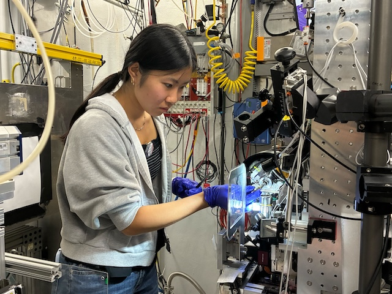

# 2025-09-24 @ CHESS 7b2

The Diffuse Project's first beam time at CHESS.

## Goals

- Training of new members
- Commissioning new slits to better define a rectangular top-hat beam
- Collect ambient T data from lysozyme, Mac1 and NrdE crystals

## Participants

Steve M, Xiaokun P, Sarah H, Marcus G (Ando lab), John I (CHESS). Steve arrived in the morning to work with John on beamline setup. Marcus joined at 2 pm. Sarah and Xiaokun arrived around 4 pm.

- 
Xiaokun, Steve, Marcus & Sarah at 7b2 (left-to-right) 

- 
Sarah H mounting a crystal in the 7b2 hutch

- 
Sarah H collecting lysozyme data

## Data

Root directory at CHESS: `/nfs/chess/raw/2025-3/id7b2/meisburger/20250924/`

Root directory on OSN: `s3://diffuse-chess-public/20250924/`

## Beamline setup

parameter | value | notes
--- | --- | --- 
X-ray energy | 14 keV @ 0.01% bandwidth | Si 111 channel cut mono inserted
Beam size | 100 µm x 100 µm, top-hat profile | Defined using slits (newly installed), CRL bypassed (toroidal mirror focusing only)
Flux | 3 x 1010 ph/s unattenuated | See station notebook: *Steve Meisburger CHESS notebook #3*, pg 35 
Background reduction | 300 µm cleanup aperture moved close to the sample | The in-line camera mirror was removed to make room, so the top-view (90-degree) camera was used for centering
Beamstop | 700 µm diameter Mo disk suspended on mylar sheet, semi-transparent | At this energy, the bleedthrough was more intense than usual, and there were some faint diffraction rings visible in the image (mask out?)
Data collection software | "MX Collect" (python) & SPEC | Modified to enable centering with the top view camera. A `<prefix>_scan.json` file was created for each data collection. Counter values and motor positions were recorded in a `<prefix>.spec` file. Images in h5 format were generated using Eiger filewriter.
Temperature control | none | The cold stream was removed (ambient T)

- 
Si 111 channel cut mono

- 
John installed this new set of JJXray slits downstream of the CRL enclosure

- 
Top-down view of the sample area (beamstop, goniometer, cleanup aperture, on-axis camera lens)

- 
Side view of the sample area

- 
Station computer showing data collection software (MX Collect)

## Samples

Name | Sample | Well composition | Drop composition | Notes
--- | --- | --- | --- | --- 
Lysozyme | Chicken egg white lysozyme. | NaCl and NaOAc <!-- well -->  | <!-- drop --> | Practice tray, for calibration and testing purposes only
Mac1 | SARS CoV2 NSP3 macrodomain and seed stock from UCSF. 40 mg/mL Mac1 in 150 mM NaCl, 20 mM Tris pH 8, 5% glycerol | 34% (w/vol) PEG 3000 + 100 mM CHES (pH 9.5) | 2 µl protein solution + 1 ul well solution + 1 ul seeds | Mac1 tray #1. Set up by Katie Lu, 9/19/2025 (see Katie Lu lab notebook pgs. 4-4)
NrdE | Bacillus subtilis class Ib ribonucleotide reductase alpha subunit. 4.5 mg/mL Holo-NrdE protein in 50 mM HEPES pH=7.6, 50 mM NaCl, 5 mM MgCl2, 2 mM TCEP, 1% glycerol, 5 mM ATP, 1 mM ADP, 0.5 mM dGTP | 50 mM HEPES (pH=7), 4.5%-6% (w/vol) PEG 3350, 1% tryptone | 1:1 protein:well solution (4-5 µL total volume) | Tray set up by Marcus Gamboa on 9/12/2025 (see Marcus Gamboa lab notebook p. 44-50)

- 
Well A4 of Mac1 tray #1.
Well solution: 34% (w/vol) PEG 3000 + 100 mM CHES (pH 9.5).
Drop: 2 µl protein solution + 1 ul well solution + 1 ul seeds.

- 
Well A3 of Bs NrdE Tray #1.
Well solultion: 50 mM HEPES (pH=7), 6% (w/vol) PEG 3350, 1% tryptone (total volume of 250 uL)
Drop: 2 µl protein solution + 2 ul well solution.

- 
Well A6 of Bs NrdE Tray #1. Well solution: 50 mM HEPES (pH=7), 4.5% (w/vol) PEG 3350, 1% tryptone (total volume of 250 uL).
Drop: 2 µl protein solution + 2 ul well solution.

- 
Well B4 of Bs NrdE Tray #1. 
Well solution: 50 mM HEPES (pH=7), 5.5% (w/vol) PEG 3350, 1% tryptone (total volume of 250 uL).
Drop: 2 µl protein solution + 2 ul well solution.

- 
Well C4 of Bs NrdE Tray #1. Well solution: 50 mM HEPES (pH=7), 5.5% (w/vol) PEG 3350, 1% tryptone (total volume of 500 uL). Drop: 2.5 µl protein solution + 2.5 ul well solution.

## Data collection

All samples are harvested in a chamber at ~100% relative humidity. Reusable MiTeGen bases are used with MicroRT capillaries cut to length, with 10 µL of well solution in the tip.

### Lysozyme

#### Crystal #1

Steve looped a large lysozyme crystal in a ~400 µm loop.

Subdirectory: `lysozyme/calibration_sample`

| prefix         |   φ0 (deg.) |   φ1 (deg.) |   ∆φ (deg.) |   images |   ∆t (s) |   d (mm) |   E (keV) |
|----------------|-------------|-------------|-------------|----------|----------|----------|-----------|
| lys_cal1_30    |           0 |         360 |         0.1 |     3600 |     0.1  |    880.5 |        14 |

Bad dataset. I accidentally left the detector back. Also, 0.1 seconds looks like too much dose, try reducing.

Move to new (undamaged) position. Collect 720 degrees to test for radiation damage in processing:

| prefix         |   φ0 (deg.) |   φ1 (deg.) |   ∆φ (deg.) |   images |   ∆t (s) |   d (mm) |   E (keV) |
|----------------|-------------|-------------|-------------|----------|----------|----------|-----------|
| lys_cal1_31    |           0 |         720 |         0.1 |     7200 |     0.01 |    185   |        14 |

Should have changed this prefix to lys_cal2, to indicate a new position was used. 

Move off the end of the loop for background data collection (translated horizontally along spindle axis)

| prefix         |   φ0 (deg.) |   φ1 (deg.) |   ∆φ (deg.) |   images |   ∆t (s) |   d (mm) |   E (keV) |
|----------------|-------------|-------------|-------------|----------|----------|----------|-----------|
| lys_cal_bg_32  |           0 |         720 |         1   |      720 |     0.1  |    185   |        14 |

Saved crystal images at two φ angles:

- `lys_cal_postcollect_235deg_topview_zoom4_1.png`
- `lys_cal_postcollect_325deg_topview_zoom4_1.png`

#### Crystal #2

Sarah looped another ~400 µm lysozyme crystal

Subdirectory: `lysozyme/calibration_sample`

| prefix         |   φ0 (deg.) |   φ1 (deg.) |   ∆φ (deg.) |   images |   ∆t (s) |   d (mm) |   E (keV) |
|----------------|-------------|-------------|-------------|----------|----------|----------|-----------|
| lys_cal3_33    |           0 |         720 |         0.1 |     7200 |     0.03 |    185   |        14 |
| lys_cal3_bg_34 |           0 |         720 |         1   |      720 |     0.3  |    185   |        14 |

Saved images:

- `lys_cal3_225deg_topview_zoom4_1.png`

There has been significant beam drift. Steve tuned `mond` and `mith` angles, `ICol` count rate increased from 8,000 to 16,000 per 0.1 s. 

#### Crystal #3

Third sample: Sarah looped another ~400 µm lysozyme crystal

Subdirectory: `lysozyme/calibration_sample`

| prefix         |   φ0 (deg.) |   φ1 (deg.) |   ∆φ (deg.) |   images |   ∆t (s) |   d (mm) |   E (keV) |
|----------------|-------------|-------------|-------------|----------|----------|----------|-----------|
| lys_cal4_35    |           0 |         720 |         0.1 |     7200 |     0.03 |    185   |        14 |
| lys_cal4_bg_36 |           0 |         720 |         1   |      720 |     0.3  |    185   |        14 |

The background here might not be a good match: although it was positioned off the end of the loop, may not be aligned with the rotation axis (clicked in centering window accidentally)

Saved image:

- `lys_cal4_35deg_topview_zoom4_1.png`

### NrdE

#### Crystal #4

Xiaokun looped a ~450 µm long BsNrdE crystal from well B4 of Marcus' Bs NrdE Tray #1.

Subdirectory: `lysozyme/calibration_sample` (forgot to change)

Used vector mode to scan along the length of the crystal (total distance along spindle axis: ∆x).

| prefix         |   φ0 (deg.) |   φ1 (deg.) |   ∆φ (deg.) |   images |   ∆t (s) |   d (mm) |   ∆x (µm) |   E (keV) |
|----------------|-------------|-------------|-------------|----------|----------|----------|-----------|-----------|
| lys_cal4_bg_37 |           0 |         360 |         0.1 |     3600 |     0.02 |    225   |    453.92 |        14 |
| nrdE_bg_38     |           0 |         360 |         1   |      360 |     0.2  |    225   |           |        14 |

`ICol` counts ~12,000 per 0.1 s.

Forgot to change prefix (`lys_cal4_bg_37` is actually NrdE crystal).

Saved crystal image (same directory):

- `nrdE_305deg_postcollection_topview_zoom4_1.png`

#### Crystal #5

Xiaokun looped a ~500 µm BsNrdE crystal from Marcus' same tray, well A3.

Vector scan along the length of the crystal.

Subdirectory: `BsNrdE/`

| prefix      |   φ0 (deg.) |   φ1 (deg.) |   ∆φ (deg.) |   images |   ∆t (s) |   d (mm) |   ∆x (µm) |   E (keV) |
|-------------|-------------|-------------|-------------|----------|----------|----------|-----------|-----------|
| MG_A3_39    |         115 |         475 |         0.1 |     3600 |     0.03 |      250 |    428.23 |        14 |
| MG_A3_bg_40 |         115 |         475 |         1   |      360 |     0.3  |      250 |           |        14 |

`ICol` counts ~14,000 per 0.1 s.

Saved crystal image:

- `MG_A3_220deg_postcollection_topview_zoom4_1.png`

#### Crystal #6

Xiaokun looped a ~500 µm BsNrdE crystal from Marcus' tray, well A6

Vector scan along the length of the crystal.

Subdirectory: `BsNrdE/`

| prefix      |   φ0 (deg.) |   φ1 (deg.) |   ∆φ (deg.) |   images |   ∆t (s) |   d (mm) |   ∆x (µm) |   E (keV) |
|-------------|-------------|-------------|-------------|----------|----------|----------|-----------|-----------|
| MG_A6_41    |          40 |         475 |         0.1 |     4350 |     0.02 |      225 |    340.97 |        14 |
| MG_A6_bg_42 |          40 |         475 |         1   |      435 |     0.2  |      225 |           |        14 |

`ICol` counts ~14,000 per 0.1 s.

Saved crystal image:

- `MG_A6_75deg_postcollection_topview_zoom4_1.png`

#### Crystal #7

Xiaokun looped a ~400 µm BsNrdE crystal from Macrus' tray, well C4

Vector scan along the length of the crystal.

Subdirectory: `BsNrdE/`

| prefix      |   φ0 (deg.) |   φ1 (deg.) |   ∆φ (deg.) |   images |   ∆t (s) |   d (mm) |   ∆x (µm) |   E (keV) |
|-------------|-------------|-------------|-------------|----------|----------|----------|-----------|-----------|
| MG_C4_43    |        -285 |         435 |         0.1 |     7200 |     0.02 |      225 |    284.31 |        14 |
| MG_C4_bg_44 |        -285 |         435 |         1   |      720 |     0.2  |      225 |           |        14 |

`ICol` counts ~13,000 per 0.1 s.

Saved crystal image:

- `MG_C4_220deg_postcollection_topview_zoom4_1.png`

### Mac1

#### Crystal #8

10:20 pm. Steve opened well A4 from Katie's macrodomain tray. Looped a ~200 µm Mac1 crystal (200 µm loop, 10 µL of well solution in MicroRT sleeve).

Subdirectory: `mac1/mac1_1`

| prefix       |   φ0 (deg.) |   φ1 (deg.) |   ∆φ (deg.) |   images |   ∆t (s) |   d (mm) |   E (keV) |
|--------------|-------------|-------------|-------------|----------|----------|----------|-----------|
| mac1_1_45    |           0 |         720 |         0.1 |     7200 |     0.03 |      900 |        14 |

Oops, forgot to move the detector back. Closed the shutter after a few seconds to avoid damaging the crystal. Repeat the data collection with correct distance:

| prefix       |   φ0 (deg.) |   φ1 (deg.) |   ∆φ (deg.) |   images |   ∆t (s) |   d (mm) |   E (keV) |
|--------------|-------------|-------------|-------------|----------|----------|----------|-----------|
| mac1_1_46    |           0 |         720 |         0.1 |     7200 |     0.03 |      185 |        14 |
| mac1_1_bg_47 |           0 |         720 |         1   |      720 |     0.3  |      185 |        14 |

`ICol` dropped to 3,200 per 0.1 s -- woah, really needs a tuneup.

Saved images at 15, 105, 195 degrees:

- `mac1/mac1_1/mac1_1_15deg_postcollection_topview_zoom4_1.png`
- `mac1/mac1_1/mac1_1_105deg_postcollection_topview_zoom4_1.png`
- `mac1/mac1_1/mac1_1_195deg_postcollection_topview_zoom4_1.png`

Tuned up: `ICol` 3200 --> 16,000 counts per 0.1 s

For visualization purposes, the second, small oscillation (5 degree) dataset was taken face-on in the same location as the first dataset.

| prefix       |   φ0 (deg.) |   φ1 (deg.) |   ∆φ (deg.) |   images |   ∆t (s) |   d (mm) |   E (keV) |
|--------------|-------------|-------------|-------------|----------|----------|----------|-----------|
| mac1_1_48    |         105 |         110 |         0.1 |       50 |     1    |      185 |        14 |
| mac1_1_bg_49 |         105 |         110 |         0.1 |       50 |     1    |      185 |        14 |

#### Crystal #9

10:51 pm. Steve looped another macrodomain crystal from Well A4 of Katie's tray

Subdirectory: `mac1/mac1_2`

| prefix       |   φ0 (deg.) |   φ1 (deg.) |   ∆φ (deg.) |   images |   ∆t (s) |   d (mm) |   E (keV) |
|--------------|-------------|-------------|-------------|----------|----------|----------|-----------|
| mac1_3_50    |           0 |         720 |         0.1 |     7200 |     0.03 |      185 |        14 |
| mac1_2_bg_51 |           0 |         720 |         1   |      720 |     0.3  |      185 |        14 |
| mac1_2_52    |         110 |         115 |         0.1 |       50 |     1    |      185 |        14 |
| mac1_2_bg_53 |         110 |         115 |         0.1 |       50 |     1    |      185 |        14 |

Note, the first prefix contains a typo, it should have been `mac1_2` to indicate the second crystal.

`ICol` counts ~16,000 per 0.1 s.

Forgot to save crystal images (oops)

#### Crystal #10

11:10 pm. Steve looped another macrodomain crystal from the same well.

Subdirectory: `mac1/mac1_3`

| prefix       |   φ0 (deg.) |   φ1 (deg.) |   ∆φ (deg.) |   images |   ∆t (s) |   d (mm) |   E (keV) |
|--------------|-------------|-------------|-------------|----------|----------|----------|-----------|
| mac1_3_54    |           0 |         720 |         0.1 |     7200 |     0.03 |      185 |        14 |
| mac1_3_bg_55 |           0 |         720 |         1   |      720 |     0.3  |      185 |        14 |
| mac1_3_56    |          20 |          25 |         0.1 |       50 |     1    |      185 |        14 |
| mac1_3_bg_57 |          20 |          25 |         0.1 |       50 |     1    |      185 |        14 |

Note: `mac1_3_56` went right down a symmetry axis, the diffraction images are really pretty.

`ICol` ~15,000 counts per 0.1 s.

Saved images:

- `mac1/mac1_3/mac1_3_110deg_postcollection_topview_zoom4_1.png`
- `mac1/mac1_3/mac1_3_20deg_postcollection_topview_zoom4_1.png`

#### Crystal #11

The Mac1 crystals tend to sit flat on the loop in the same way. To obtain more unique views, Steve purposefully bent the loop with tweezers.

11:30 pm. Steve used the bent loop to harvest another macrodomain crystal from the same well in Katie's tray. Note that the coverslip has now been open in the humid chamber for over an hour. There might be some changes to the drop composition (nominally higher water content?). The PEG is also starting to form a sticky skin on the drop.

Subdirectory: `mac1/mac1_4`

| prefix       |   φ0 (deg.) |   φ1 (deg.) |   ∆φ (deg.) |   images |   ∆t (s) |   d (mm) |   E (keV) |
|--------------|-------------|-------------|-------------|----------|----------|----------|-----------|
| mac1_4_58    |           0 |         720 |         0.1 |     7200 |     0.03 |      185 |        14 |
| mac1_4_bg_59 |           0 |         720 |         1   |      720 |     0.3  |      185 |        14 |
| mac1_4_60    |         100 |         105 |         0.1 |       50 |     1    |      185 |        14 |

Note: there appear to be multiple lattices visible in the `mac1_4_60` dataset -- further investigation is needed.

`ICol` counts: ~13,000 per 0.1 s.

Saved images:

- `mac1/mac1_4/mac1_4_10deg_postcollect_topview_zoom4_1.png`
- `mac1/mac1_4/mac1_4_100deg_postcollect_topview_zoom4_1.png`
- `mac1/mac1_4/mac1_4_280deg_postcollect_topview_zoom4_1.png`

#### Crystal #12

12:06 am. Steve looped another macrodomain crystal from the same well, again using the bent loop.

Subdirectory: `mac1/mac1_5`

| prefix       |   φ0 (deg.) |   φ1 (deg.) |   ∆φ (deg.) |   images |   ∆t (s) |   d (mm) |   E (keV) |
|--------------|-------------|-------------|-------------|----------|----------|----------|-----------|
| mac1_5_61    |           0 |         720 |         0.1 |     7200 |     0.03 |      185 |        14 |
| mac1_5_bg_62 |           0 |         720 |         1   |      720 |     0.3  |      185 |        14 |
| mac1_5_63    |         100 |         105 |         0.1 |       50 |     1    |      185 |        14 |
| mac1_5_bg_64 |         100 |         105 |         0.1 |       50 |     1    |      185 |        14 |

`ICol` counts: ~12,500 per 0.1 s.

Saved images:

- `mac1/mac1_5/mac1_5_195deg_postcollect_topview_zoom4_1.png`
- `mac1/mac1_5/mac1_5_105deg_postcollect_topview_zoom4_1.png`