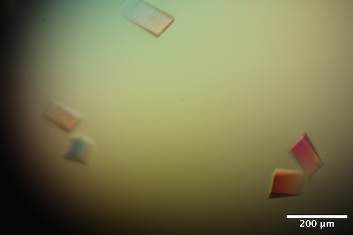

# 2025-10-08 @ CHESS 7b2

Our second CHESS beam time of the 2025-3 run cycle.

## Goals

- Training new members
- Repeat radiation damage study on lysozyme
- Characterize DNA crystals
- Mac1 diffuse scattering vs. temperature
- Test prototype guard aperture for on-axis camera setup
- Test harvesting in a humidified gas stream

## Participants

Ando group: Steve M, Katie L, & Neti B

CHESS: John I, Mike C

-  
Steve, Neti & Katie at 7b2 (left-to-right) 

-  
Katie inspecting a tray under the microscope

-  
Mike installing the prototype guard aperture

## Data

Root directory at CHESS: `/nfs/chess/raw/2025-3/id7b2/meisburger/20251008`

## Beamline setup

Similar to the previous visit. Key differences: ~3x flux increase due to better optics alignment, cryostream for temperature control.  Also, the beam position monitor and feedback was working this time, so the flux was more consistent.

parameter | value | notes
--- | --- | --- 
X-ray energy | 14 keV @ 0.01% bandwidth | Si 111 channel cut mono inserted
Beam size | 100 µm x 100 µm, top-hat profile | Defined using slits, CRL bypassed (toroidal mirror focusing only)
Flux | 8 x 1010 ph/s unattenuated | See station notebook: *Steve Meisburger CHESS notebook #3* p. 43 
Background reduction | 300 µm cleanup aperture moved close to the sample | The in-line camera mirror was removed to make room, so the top-view (90-degree) camera was used for centering. We also evaluated a prototype cleanup aperture integrated into the in-line camera mirror, however it needed more engineering work and was not used for data collection.
Centering camera | top-view camera | 1.713 µm / pixel at 4x zoom ratio
Beamstop | 700 µm diameter Mo disk suspended on mylar sheet, semi-transparent | At this energy, the bleedthrough was more intense than usual, and there were some faint diffraction rings visible in the image (mask out?)
Data collection software | "MX Collect" (python) & SPEC | Modified to enable centering with the top view camera. A `<prefix>_scan.json` file was created for each data collection. Counter values and motor positions were recorded in a `<prefix>.spec` file. Images in h5 format were generated using Eiger filewriter. 
Temperature control | Cryostream oriented end-on | Distance adjusted depending on mounting style: close for free-mounting at 250 K, further away for capillary mounting at 300 K

-  
Capillary-mounted sample on the goniometer with the gas stream end-on. The view is from the top, with the X-rays coming from the left.

-  
Free-mounted sample on the goniometer. The view is looking toward the X-ray source, the cold stream is on the right.

## Samples

Name | Sample | Well composition | Drop composition | Notes
--- | --- | --- | --- | --- 
Lysozyme | Chicken egg white lysozyme. | NaCl and NaOAc   |  | Practice tray, for calibration and testing purposes only
Mac1 | SARS CoV2 NSP3 macrodomain and seed stock from UCSF. 40 mg/mL Mac1 in 150 mM NaCl, 20 mM Tris pH 8, 5% glycerol | 28-38% (w/vol) PEG 3000 + 100 mM CHES (pH 9.5) | Row B: 2 µl protein solution + 1 ul well solution + 1 ul seeds   Row C: 2 µl protein solution + 1 ul well solution + 1 ul seeds (diluted 10x) | Mac1 tray #1 (Katie Lu). Drops were set up on 9/30/2025 (row B) and 10/2/2025 (row C). See Katie Lu lab notebook p. 10-13
DNA | S2T7-1, S2T7-2, and S2T7-3 single strands at 50 µM in 40 mM tris acetate, 2 mM EDTA | 125 mM tris acetate, 37.5 mM Mg acetate, 1.75 M ammonium sulfate | 6 µL DNA + 6 µL of 40 mM tris acetate, 25 mM Mg acetate, 1.17 M ammonium sulfate | DNA tray #1, "condition 2". See Steve Meisburger Ando Lab notebook #3, pg 48-49.

-  
Well B2 of Mac1 tray #1.
Well solution: 30% (w/vol) PEG 3000 + 100 mM CHES (pH 9.5).
Drop: 2 µl protein solution + 1 ul well solution + 0.25 ul seeds.

-  
Well A5 of DNA tray #1. 
Well solution: 125 mM tris acetate, 37.5 mM Mg acetate, 1.75 M ammonium sulfate.
Drop: 6 µl DNA solution + 6 µl of 40 mM tris acetate, 25 mM Mg acetate, 1.17 M ammonium sulfate.

## Data collection

Samples for room temperature data collection were harvested in the humidity chamber (100 % RH). Reusable MiTeGen bases are used with MicroRT capillaries cut to length, with 10 µL of well solution in the tip.

Samples for low-temperature data collection were free-mounted (i.e. with oil rather than capillaries). These were harvested under a microscope in the hutch. Steve improvised a humid gas stream setup to prevent dehydration while harvesting (see photos). To test it, Steve directed the stream toward a glass slide. Fog appeared on the slide in the path of the stream, indicating that humid air was covering a region large enough to protect a crystallization drop during harvesting. To evaluate the rate of evaporation, Steve placed 10 µL of water on a cover slide. The drop size appeared to be constant for about 1h. Then, Steve turned off the humid stream, and the drop evaporated within about 5 minutes.

-  
Katie looping a crystal in the humidity chamber

- 
Humidified air was generated by bubbling gas through water at a flow rate of ~8 lpm, and directed to the microscope using a long tube.

- 
Microscope in the hutch with gas stream setup.

- 
Test of the humid gas stream. The humid gas creates fog on the glass slide. A drop of water was maintained for ~1h.

- 
Mac1 crystallization drop in the humid gas stream. A drop of NVH oil was placed next to the crystal drop. Crystals were looped and transferred to oil. Excess oil was dabbed away, and then crystals were free-mounted on the goniometer (no capillary).

<!--

Subdirectory: `mac1/mac_1`

| prefix     |   φ0 (deg.) |   φ1 (deg.) |   ∆φ (deg.) |   images |   ∆t (s) |   tf (%) |   d (mm) |   E (keV) |
|------------|-------------|-------------|-------------|----------|----------|----------|----------|-----------|
| mac_1_1597 |           0 |         360 |         0.1 |     3600 |    0.008 |      100 |      999 |        14 |

Subdirectory: `mac1/mac_2`

| prefix        |   φ0 (deg.) |   φ1 (deg.) |   ∆φ (deg.) |   images |   ∆t (s) |   tf (%) |   d (mm) |   E (keV) |
|---------------|-------------|-------------|-------------|----------|----------|----------|----------|-----------|
| mac_2_1601    |           0 |         360 |         0.1 |     3600 |    0.008 |      100 |      185 |        14 |
| mac_2_bg_1602 |           0 |         360 |         1   |      360 |    0.08  |      100 |      185 |        14 |

-->

### Lysozyme

#### Crystal #1

Steve looped a ~600 µm diameter lysozyme crystal from the test tray (calibration purposes). 

Cold stream set to 300 K. Collecting from several different positions on the crystal.

Subdirectory: `lysozyme/calibration_sample/lys_cal1`

Saved crystal images every 45 degrees:

- `lys_cal1_120deg_topview_zoom4_1.png`
- `lys_cal1_165deg_topview_zoom4_1.png`
- `lys_cal1_210deg_topview_zoom4_1.png`
- `lys_cal1_235deg_topview_zoom4_1.png`
- `lys_cal1_300deg_topview_zoom4_1.png`
- `lys_cal1_345deg_topview_zoom4_1.png`
- `lys_cal1_30deg_topview_zoom4_1.png`
- `lys_cal1_75deg_topview_zoom4_1.png`

Moved to position 1, on the left-hand side of the crystal. Try 47.1% transmission and 8 ms per 0.1 degree.

| prefix           |   φ0 (deg.) |   φ1 (deg.) |   ∆φ (deg.) |   images |   ∆t (s) |   tf (%) |   d (mm) |   E (keV) |
|------------------|-------------|-------------|-------------|----------|----------|----------|----------|-----------|
| lys_cal1_1554    |           0 |         360 |        0.1  |     3600 |    0.008 |     47.1 |      185 |        14 |

Moved to position 2, toward the right, for a dose titration. Repeat the same 60 degree rotation 20 times.

| prefix           |   φ0 (deg.) |   φ1 (deg.) |   ∆φ (deg.) |   images |   ∆t (s) |   tf (%) |   d (mm) |   E (keV) |
|------------------|-------------|-------------|-------------|----------|----------|----------|----------|-----------|
| lys_cal1_1555    |           0 |          60 |        0.1  |      600 |    0.008 |      100 |      185 |        14 |
| lys_cal1_1556    |           0 |          60 |        0.1  |      600 |    0.008 |      100 |      185 |        14 |
| lys_cal1_1557    |           0 |          60 |        0.1  |      600 |    0.008 |      100 |      185 |        14 |
| lys_cal1_1558    |           0 |          60 |        0.1  |      600 |    0.008 |      100 |      185 |        14 |
| lys_cal1_1559    |           0 |          60 |        0.1  |      600 |    0.008 |      100 |      185 |        14 |
| lys_cal1_1560    |           0 |          60 |        0.1  |      600 |    0.008 |      100 |      185 |        14 |
| lys_cal1_1561    |           0 |          60 |        0.1  |      600 |    0.008 |      100 |      185 |        14 |
| lys_cal1_1562    |           0 |          60 |        0.1  |      600 |    0.008 |      100 |      185 |        14 |
| lys_cal1_1563    |           0 |          60 |        0.1  |      600 |    0.008 |      100 |      185 |        14 |
| lys_cal1_1564    |           0 |          60 |        0.1  |      600 |    0.008 |      100 |      185 |        14 |
| lys_cal1_1565    |           0 |          60 |        0.1  |      600 |    0.008 |      100 |      185 |        14 |
| lys_cal1_1566    |           0 |          60 |        0.1  |      600 |    0.008 |      100 |      185 |        14 |
| lys_cal1_1567    |           0 |          60 |        0.1  |      600 |    0.008 |      100 |      185 |        14 |
| lys_cal1_1568    |           0 |          60 |        0.1  |      600 |    0.008 |      100 |      185 |        14 |
| lys_cal1_1569    |           0 |          60 |        0.1  |      600 |    0.008 |      100 |      185 |        14 |
| lys_cal1_1570    |           0 |          60 |        0.1  |      600 |    0.008 |      100 |      185 |        14 |
| lys_cal1_1571    |           0 |          60 |        0.1  |      600 |    0.008 |      100 |      185 |        14 |
| lys_cal1_1572    |           0 |          60 |        0.1  |      600 |    0.008 |      100 |      185 |        14 |
| lys_cal1_1573    |           0 |          60 |        0.1  |      600 |    0.008 |      100 |      185 |        14 |
| lys_cal1_1574    |           0 |          60 |        0.1  |      600 |    0.008 |      100 |      185 |        14 |

Saved an image showing the "burn" mark from repeated data collection:

- `lys_cal1_postcollect_120deg_topview_zoom4_1.png`

The dose distribution is not very uniform in a 60 degree data collection, from the burn mark it appears more concentrated in then center. 

Move to position 3, repeat the dose titration but rotate 10 degrees only. Adjusted ∆φ and ∆t to give the same total exposure per wedge (4.8 seconds).

| prefix           |   φ0 (deg.) |   φ1 (deg.) |   ∆φ (deg.) |   images |   ∆t (s) |   tf (%) |   d (mm) |   E (keV) |
|------------------|-------------|-------------|-------------|----------|----------|----------|----------|-----------|
| lys_cal1_1575    |          25 |          35 |        0.05 |      200 |    0.024 |      100 |      185 |        14 |
| lys_cal1_1576    |          25 |          35 |        0.05 |      200 |    0.024 |      100 |      185 |        14 |
| lys_cal1_1577    |          25 |          35 |        0.05 |      200 |    0.024 |      100 |      185 |        14 |
| lys_cal1_1578    |          25 |          35 |        0.05 |      200 |    0.024 |      100 |      185 |        14 |
| lys_cal1_1579    |          25 |          35 |        0.05 |      200 |    0.024 |      100 |      185 |        14 |
| lys_cal1_1580    |          25 |          35 |        0.05 |      200 |    0.024 |      100 |      185 |        14 |
| lys_cal1_1581    |          25 |          35 |        0.05 |      200 |    0.024 |      100 |      185 |        14 |
| lys_cal1_1582    |          25 |          35 |        0.05 |      200 |    0.024 |      100 |      185 |        14 |
| lys_cal1_1583    |          25 |          35 |        0.05 |      200 |    0.024 |      100 |      185 |        14 |
| lys_cal1_1584    |          25 |          35 |        0.05 |      200 |    0.024 |      100 |      185 |        14 |
| lys_cal1_1585    |          25 |          35 |        0.05 |      200 |    0.024 |      100 |      185 |        14 |
| lys_cal1_1586    |          25 |          35 |        0.05 |      200 |    0.024 |      100 |      185 |        14 |
| lys_cal1_1587    |          25 |          35 |        0.05 |      200 |    0.024 |      100 |      185 |        14 |
| lys_cal1_1588    |          25 |          35 |        0.05 |      200 |    0.024 |      100 |      185 |        14 |
| lys_cal1_1589    |          25 |          35 |        0.05 |      200 |    0.024 |      100 |      185 |        14 |
| lys_cal1_1590    |          25 |          35 |        0.05 |      200 |    0.024 |      100 |      185 |        14 |
| lys_cal1_1591    |          25 |          35 |        0.05 |      200 |    0.024 |      100 |      185 |        14 |
| lys_cal1_1592    |          25 |          35 |        0.05 |      200 |    0.024 |      100 |      185 |        14 |
| lys_cal1_1593    |          25 |          35 |        0.05 |      200 |    0.024 |      100 |      185 |        14 |
| lys_cal1_1594    |          25 |          35 |        0.05 |      200 |    0.024 |      100 |      185 |        14 |

Saved image showing the new burn spot, which is more sharply defined.

- `lys_cal1_postcollect2_120deg_topview_zoom4_1.png`
- `lys_cal1_postcollect2_120deg_topview_zoom1_1.png`

Collect a background dataset to pair with the 10 degree oscillation.

| prefix           |   φ0 (deg.) |   φ1 (deg.) |   ∆φ (deg.) |   images |   ∆t (s) |   tf (%) |   d (mm) |   E (keV) |
|------------------|-------------|-------------|-------------|----------|----------|----------|----------|-----------|
| lys_cal1_bg_1595 |          25 |          35 |        0.5  |       20 |    0.24  |      100 |      185 |        14 |

### Samples for practice

#### Crystal #2 -- mac1

Neti mounted a macrodomain crystal for practice. 

Subdirectory: `mac1/mac_1`

| prefix     |   φ0 (deg.) |   φ1 (deg.) |   ∆φ (deg.) |   images |   ∆t (s) |   tf (%) |   d (mm) |   E (keV) |
|------------|-------------|-------------|-------------|----------|----------|----------|----------|-----------|
| mac_1_1597 |           0 |         360 |         0.1 |     3600 |    0.008 |      100 |      999 |        14 |

Data not useable (detector distance, beamstop issue)

#### Crystal #3 -- lysozyme

Neti and Katie collected on another lysozyme crystal for practice. 

Subdirectory: `lysozyme/calibration_sample/lys_cal3`

| prefix          |   φ0 (deg.) |   φ1 (deg.) |   ∆φ (deg.) |   images |   ∆t (s) |   tf (%) |   d (mm) |   E (keV) |
|-----------------|-------------|-------------|-------------|----------|----------|----------|----------|-----------|
| lys_cal3_1598   |           0 |         360 |         0.1 |     3600 |    0.008 |      100 |      185 |        14 |
| lys_cal3_2_1599 |           0 |         360 |         0.1 |     3600 |    0.008 |      100 |      185 |        14 |
| lys_cal3_2_1600 |           0 |           1 |         0.1 |       10 |    0.008 |      100 |      185 |        14 |

Data not usable (beamstop issue)

#### Crystal #4 -- mac1

Neti and Katie mounted a macrodomain crystal from well B2.

Subdirectory: `mac1/mac_2`

| prefix        |   φ0 (deg.) |   φ1 (deg.) |   ∆φ (deg.) |   images |   ∆t (s) |   tf (%) |   d (mm) |   E (keV) |
|---------------|-------------|-------------|-------------|----------|----------|----------|----------|-----------|
| mac_2_1601    |           0 |         360 |         0.1 |     3600 |    0.008 |      100 |      185 |        14 |
| mac_2_bg_1602 |           0 |         360 |         1   |      360 |    0.08  |      100 |      185 |        14 |

The diffraction looks nice. Processed in xia2 to 1.1 Å, mosaic spread = 0.004˚. 

#### Crystal #5 -- DNA screening

Steve tried scooping up some small crystals from well A1 of the DNA tray using a micromesh loop with 25 µm openings. The mesh was placed in a microRT with 10 µL of well solution in the tip. 

The mesh was very hydrophobic, and it was difficult to get the crystals in the right place. They ended up at the edge of the loop, on the thick kapton part close to where the loop contacts the pin. The crystals are very thin. Just take some snapshots to see if there's any diffraction.

Subdirectory: `dna/screening/A1`

Collect a snapshot from each "crystal" (?) on the loop.

| prefix     |   φ0 (deg.) |   φ1 (deg.) |   ∆φ (deg.) |   images |   ∆t (s) |   tf (%) |   d (mm) |   E (keV) |
|------------|-------------|-------------|-------------|----------|----------|----------|----------|-----------|
| dna_1_1603 |          70 |             |         0.5 |        1 |        1 |      100 |      300 |        14 |
| dna_1_1604 |          70 |             |         0.5 |        1 |        1 |      100 |      300 |        14 |
| dna_1_1605 |          70 |             |         0.5 |        1 |        1 |      100 |      300 |        14 |
| dna_1_1606 |          70 |             |         0.5 |        1 |        1 |      100 |      300 |        14 |

Three out of four had some weak, low resolution diffraction spots. Yay!

### DNA

#### Crystal #6

Steve looped a ~150 x 50 x 25 µm DNA crystal from well A5 in a 150 µm loop.

Subdirectory: `dna/dna_A6_1`

Snapped photos from several angles.

- `dna_A6_1_115deg_topview_zoom4_1.png`
- `dna_A6_1_205deg_topview_zoom4_1.png`
- `dna_A6_1_25deg_topview_zoom4_1.png`

| prefix        |   φ0 (deg.) |   φ1 (deg.) |   ∆φ (deg.) |   images |   ∆t (s) |   tf (%) |   d (mm) |   E (keV) |
|---------------|-------------|-------------|-------------|----------|----------|----------|----------|-----------|
| dna_A6_1_1607 |           0 |         360 |         0.1 |     3600 |    0.008 |     47.1 |      450 |        14 |
| dna_A6_1_1608 |           0 |         180 |         0.1 |     1800 |    0.03  |      100 |      450 |        14 |
| dna_A6_1_1609 |           0 |         360 |         1   |      360 |    0.08  |     47.1 |      450 |        14 |

Note: the prefix and subdirectory say "A6" -- this was a typo, it should have been A5.

The second dataset (1608) completely fried the crystal. But 1607 looked OK.

Processed 1607 using xia2. Interestingly (!!!) the mosaic spread is 0.072˚, much better than the deposited cryo structure despite having lower resolution. There did not seem to be any radiation damage according to B-factor variation in scaling.

#### Crystal #7

Steve looped a crystal of similar size from well A5

Subdirectory: `dna/dna_A5_2`

Snapped two photos 90 deg. apart:

- `dna_A5_2_135deg_topview_zoom4_1.png`
- `dna_A5_2_225deg_topview_zoom4_1.png`

| prefix           |   φ0 (deg.) |   φ1 (deg.) |   ∆φ (deg.) |   images |   ∆t (s) |   tf (%) |   d (mm) |   E (keV) |
|------------------|-------------|-------------|-------------|----------|----------|----------|----------|-----------|
| dna_A5_2_1610    |           0 |         360 |         0.1 |     3600 |    0.008 |      100 |      450 |        14 |
| dna_A5_2_bg_1611 |           0 |         360 |         1   |      360 |    0.08  |      100 |      450 |        14 |

Although Steve collected 360 degrees, the crystal apparently died after the first ~90 degrees of data.

Processed first 90 degrees using xia2. Resolution: ~ 6 Å, mosaic spread ~0.1˚

End day 1 of beamtime.

### Beamline development work

Begin day 2 of beamtime (Thursday, 10/9/2025).

In the morning, Steve & Mike C worked on aligning the new on-axis mirror / guard aperture assembly. If successful, the plan was to continue running with the aperture in place. However, after some troubleshooting, they realized that the aperture tube had an obstruction of some kind. Mike will work on it, with the goal of properly aligning it next week.

The original guard aperture was replaced and re-aligned. Resuming data collection.

### Mac1

The goal is to obtain a low-temperature (but not frozen) dataset from Mac1, either at 275 K or 250 K. Capillaries cannot be used here, so the plan is to free-mount the crystal in the cold stream with NVH oil to prevent dehydration. 

Since we saw a lot of crystal-to-crystal variation at ALS 8.3.1, presumably from handling without humidity control, we rigged up a humid gas stream on the microscope cart in the hutch.

#### Crystal #8

Set the cold stream temperature to 275 K.

Steve looped at ~200 µm macrodomain crystal from well C4 of Katie's tray, and covered in NVH oil, then dabbed away the excess before placing it in the cold stream.

Subdirectory: `mac1/mac1_3_nvh_275K`

Snapped two photos 90 degrees apart:

- `mac1_3_nvh_275K_95deg_topview_zoom4_1.png`
- `mac1_3_nvh_275K_185deg_topview_zoom4_1.png`

| prefix               |   φ0 (deg.) |   φ1 (deg.) |   ∆φ (deg.) |   images |   ∆t (s) |   tf (%) |   d (mm) |   E (keV) |
|----------------------|-------------|-------------|-------------|----------|----------|----------|----------|-----------|
| mac1_3_nvh_275K_1612 |           0 |         360 |         0.1 |     3600 |     0.01 |      100 |      185 |        14 |

This crystal was very sad, it was very mosaic and diffracted only to ~3 Å resolution. Did it dry out, or was it the oil that killed it?

What to do next: Warm the cold stream up, and try using oil with a capillary? Or cool it down and try 250 K and repeat free mounting in oil? Let's try low temperature first.

#### Crystal #9

Cooled cold stream to 250 K.

Subdirectory: `mac1/mac1_4_nvh_250K`

Forgot to snap photos.

| prefix                  |   φ0 (deg.) |   φ1 (deg.) |   ∆φ (deg.) |   images |   ∆t (s) |   tf (%) |   d (mm) |   E (keV) |
|-------------------------|-------------|-------------|-------------|----------|----------|----------|----------|-----------|
| mac1_4_nvh_250K_1613    |           0 |         360 |         0.1 |     3600 |     0.01 |      100 |     1000 |        14 |
| mac1_4_nvh_250K_1614    |           0 |         360 |         0.1 |     3600 |     0.01 |      100 |      185 |        14 |
| mac1_4_nvh_250K_bg_1615 |           0 |         360 |         1   |      360 |     0.1  |      100 |      185 |        14 |

The first data collection (1613) was a mistake. Steve left the detector back (1000 mm) and the beamstop was out. The second data collection (1614) was from the same spot on the crystal, so it got pre-dosed by scan 1613.

#### Crystal #10

Steve mounted another crystal from well C4 using NVH and 250 K (free mounting). The crystal had been in the oil drop for 5-10 minutes (during the previous data collection).

Subdirectory: `mac1/mac1_5_nvh_250K`

| prefix                  |   φ0 (deg.) |   φ1 (deg.) |   ∆φ (deg.) |   images |   ∆t (s) |   tf (%) |   d (mm) |   E (keV) |
|-------------------------|-------------|-------------|-------------|----------|----------|----------|----------|-----------|
| mac1_5_nvh_250K_1616    |           0 |         360 |         0.1 |     3600 |     0.01 |      100 |      999 |        14 |
| mac1_5_nvh_250K_1617    |           0 |         360 |         0.1 |     3600 |     0.01 |      100 |      185 |        14 |
| mac1_5_nvh_250K_bg_1618 |           0 |         360 |         1   |      360 |     0.1  |      100 |      185 |        14 |

Again, the first scan (1616) was a mistake -- Steve left the detector back. However, this time he reacted and closed the shutter after a few degrees, so the crystal didn't get a full dose. The second scan (1617) should be OK.

Snapped two photos 90 degrees apart:

- `mac1_5_nvh_250K_90deg_topview_zoom4_1.png`
- `mac1_5_nvh_250K_180deg_topview_zoom4_1.png`

Processed scan 1617 using xia2: resolution: 1.3 Å, mosaic spread: 0.142˚, unit cell: a = 87.37 Å, c = 39.18 Å

#### Crystal #11

Steve looped another mac1 crystal from well C4 using NVH, 250 K (free mounting). Steve didn't dab this one as much, maybe more oil is needed to prevent dehydration? Also, let's put in more attenuation.

Subdirectory: `mac1/mac1_6_nvh_250K`

| prefix                  |   φ0 (deg.) |   φ1 (deg.) |   ∆φ (deg.) |   images |   ∆t (s) |   tf (%) |   d (mm) |   E (keV) |
|-------------------------|-------------|-------------|-------------|----------|----------|----------|----------|-----------|
| mac1_6_nvh_250K_1619    |           0 |         360 |         0.1 |     3600 |     0.01 |     47.1 |      185 |        14 |
| mac1_6_nvh_250K_bg_1620 |           0 |         360 |         1   |      360 |     0.1  |     47.1 |      185 |        14 |

Snapped two photos 90 degrees apart:

- `mac1_6_nvh_250K_135deg_topview_zoom4_1.png`
- `mac1_6_nvh_250K_225deg_topview_zoom4_1.png`

Processed scan 1619 using xia2: resolution: 1 Å, mosaic spread: 0.066˚, unit cell: a = 88.09 Å, c = 39.18 Å

#### Crystal #12

Steve looped another mac1 crystal from well C4 using NVH, 250 K (free mounting). The NVH drop is getting pretty messy, and there's a peg skin developing on the drop that makes it tricky to harvest.

Subdirectory: `mac1/mac1_7_nvh_250K`

| prefix                  |   φ0 (deg.) |   φ1 (deg.) |   ∆φ (deg.) |   images |   ∆t (s) |   tf (%) |   d (mm) |   E (keV) |
|-------------------------|-------------|-------------|-------------|----------|----------|----------|----------|-----------|
| mac1_7_nvh_250K_1621    |           0 |         360 |         0.1 |     3600 |     0.01 |     47.1 |      185 |        14 |
| mac1_7_nvh_250K_bg_1622 |           0 |         360 |         1   |      360 |     0.1  |     47.1 |      185 |        14 |

Snapped photos:

- `mac1_7_nvh_250K_135deg_topview_zoom4_1.png`
- `mac1_7_nvh_250K_225deg_topview_zoom4_1.png`

Processed scan 1621 using xia2: resolution: 1.21 Å, mosaic spread: 0.2˚, unit cell: a = 87.8 Å, c = 38.56 Å

#### Crystal #13

Steve looped another, same well etc. Used fresh NVH, and added well solution to the drop to help with the PEG skin. Tried to move quickly from oil drop to cold stream.

Subdirectory: `mac1/mac1_8_nvh_250K`

| prefix                  |   φ0 (deg.) |   φ1 (deg.) |   ∆φ (deg.) |   images |   ∆t (s) |   tf (%) |   d (mm) |   E (keV) |
|-------------------------|-------------|-------------|-------------|----------|----------|----------|----------|-----------|
| mac1_8_nvh_250K_1623    |           0 |         360 |         0.1 |     3600 |     0.01 |     47.1 |      185 |        14 |
| mac1_8_nvh_250K_bg_1624 |           0 |         360 |         1   |      360 |     0.1  |     47.1 |      185 |        14 |

Snapped two photos 90 degrees apart:

- `mac1_8_nvh_250K_225deg_topview_zoom4_1.png`
- `mac1_8_nvh_250K_315deg_topview_zoom4_1.png`

Processed scan 1623 using xia2: resolution: 1.03 Å, mosaic spread: 0.037˚, unit cell: a = 87.97 Å, c = 38.85 Å

#### Crystal #14

Steve looped another mac1 crystal from well C4, dipped in NVH oil, mounted at 250 K

Subdirectory: `mac1/mac1_9_nvh_250K`

| prefix                  |   φ0 (deg.) |   φ1 (deg.) |   ∆φ (deg.) |   images |   ∆t (s) |   tf (%) |   d (mm) |   E (keV) |
|-------------------------|-------------|-------------|-------------|----------|----------|----------|----------|-----------|
| mac1_9_nvh_250K_1625    |           0 |         360 |         0.1 |     3600 |     0.01 |     47.1 |      185 |        14 |
| mac1_9_nvh_250K_bg_1626 |           0 |         360 |         1   |      360 |     0.1  |     47.1 |      185 |        14 |

Snapped two photos 90 degrees apart:

- `mac1_9_nvh_250K_135deg_topview_zoom4_1.png`
- `mac1_9_nvh_250K_225deg_topview_zoom4_1.png`

Processed scan 1625 using xia2: resolution: 1.1 Å, mosaic spread: 0.172˚, unit cell: a = 87.94 Å, c = 38.73 Å

## Final thoughts

At 3:30 pm, the beam dumped for sync capacitor repair. Beam time ended early.

Steve's notes:

>If I had time, this is what I would have done:
>
>- Mac1 at high temperature (325 K?) using sleeves
>- NrdE crystals using mesh --> can we do high throughput data collection?
>- DNA crystals at 250 K using oil
>
>Perhaps revisit next week.