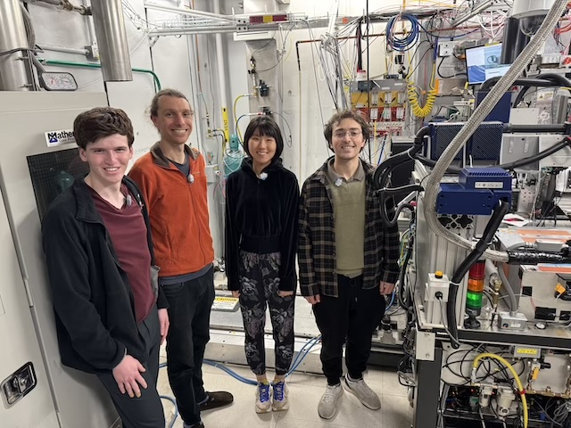
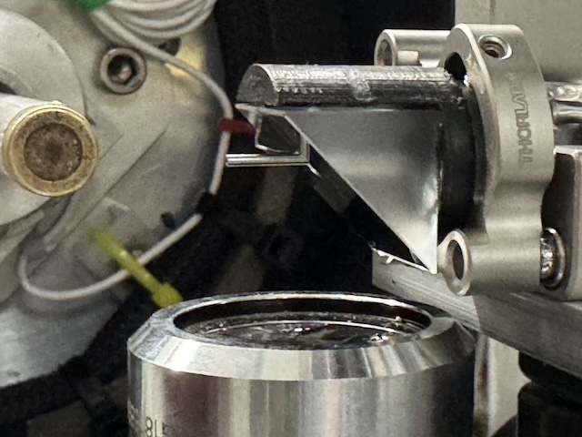
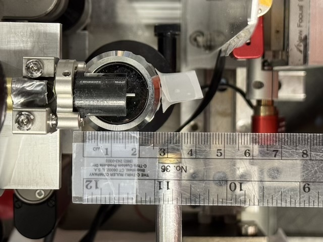
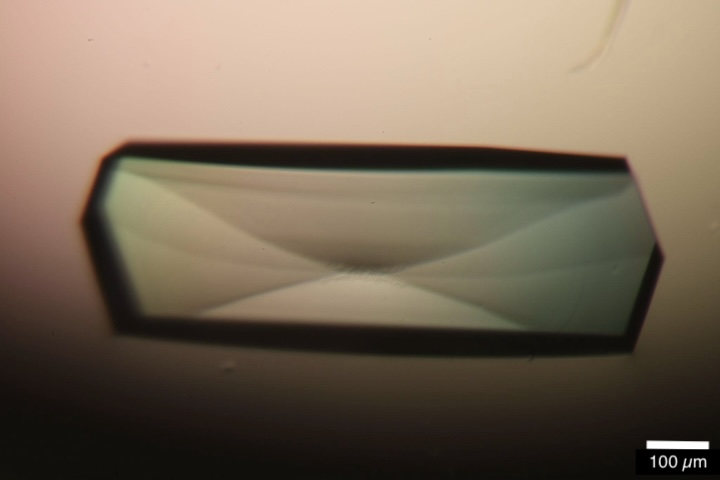
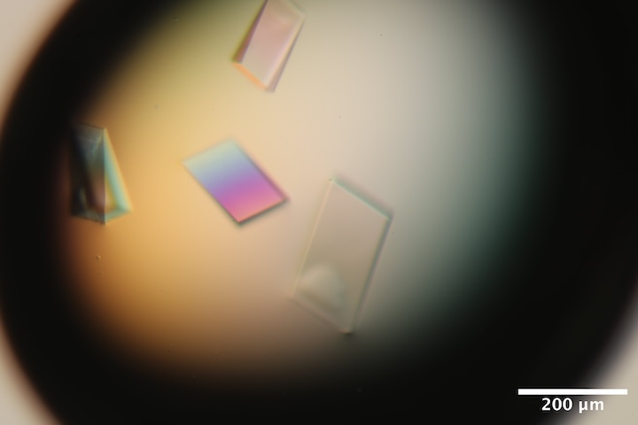
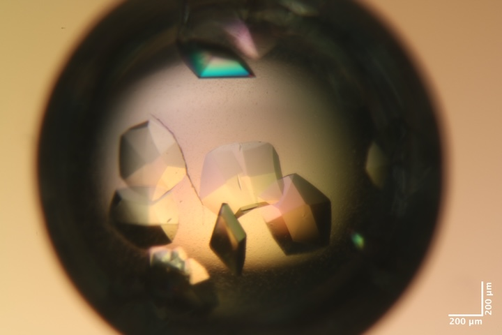
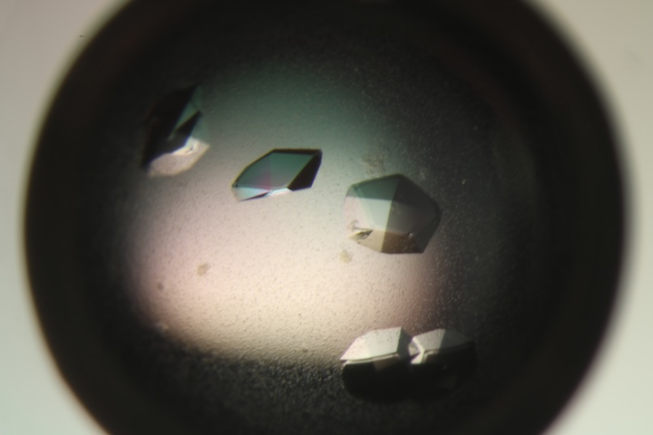
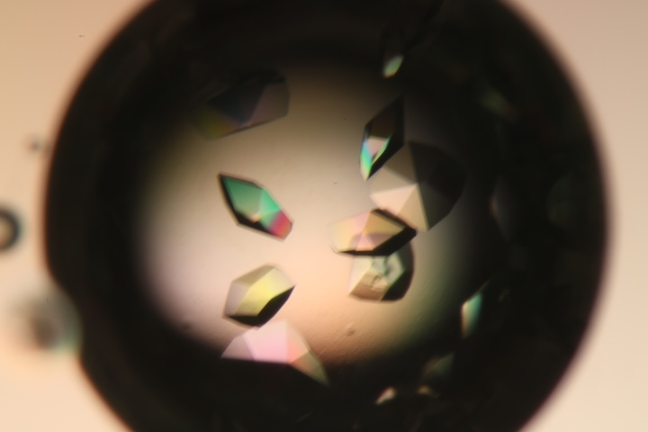

# 2025-10-15 @ CHESS 7b2

Our third CHESS beam time of the 2025-3 run cycle.

## Goals

- Training new members
- DNA diffuse
- Mac1 diffuse vs. temperature
- Test prototype guard aperture for on-axis camera setup

## Participants

Steve M, Katie L, Sarah H, Min P, Gio K, Jon C (from Ando lab) and John I (from CHESS)

-  
Jon, Steve, Min & Gio (left-to-right) in the 7b2 hutch. Katie and Sarah arrived later (not shown).

## Data

Root directory at CHESS: `/nfs/chess/raw/2025-3/id7b2/meisburger/20251015`

## Beamline setup

Similar to last week. Key differences: using on-axis camera with prototype aperture (Mo tube).

parameter | value | notes
--- | --- | --- 
X-ray energy | 14 keV @ 0.01% bandwidth | Si 111 channel cut mono inserted
Beam size | 100 µm x 100 µm, top-hat profile | Defined using slits, CRL bypassed (toroidal mirror focusing only)
Flux | 7.9 x 1010 ph/s unattenuated | See station notebook: *Steve Meisburger CHESS notebook #3* p. 46
Background reduction | ~600 µm ID Mo tube integrated into the in-line camera mirror | Our first test of the prototype. Worked well, but some extra scattering around the beamstop that could be cleaned up with a smaller ID tube or aperture in future.
Centering camera | top-view and on-axis cameras | Top view: 1.713 µm / pixel at 4x zoom ratio; On axis: 0.740 µm / pixel at 4x zoom ratio
Beamstop | 700 µm diameter Mo disk suspended on mylar sheet, semi-transparent | At this energy, the bleedthrough was more intense than usual, and there were some faint diffraction rings visible in the image (mask out?)
Data collection software | "MX Collect" (python) & SPEC | Same version as last time. A `<prefix>_scan.json` file was created for each data collection. Counter values and motor positions were recorded in a `<prefix>.spec` file. Images in h5 format were generated using Eiger filewriter. 
Temperature control | Cryostream oriented end-on | Was not present for some initial lysozyme datasets at ambient temperature.

-  
Mo tube integrated into the on-axis camera mirror. This prototype aperture allows the on-axis camera to be used in diffuse data collection.

-  
The distance between the final aperture and the sample is ~12 mm.

Snapped an image of the beam on fluorescent screen: `setup/beam_image_onaxis_zoom4.png_1.png`

## Samples

Name | Sample | Well composition | Drop composition | Notes
--- | --- | --- | --- | --- 
Lysozyme | Hen egg lysozyme, 50 mg/mL in NaOAc | 0.6 - 1.1 M NaCl, 100 mM NaOAc pH 4.3 - 4.8 | 2 μL protein solution + 2 μL well solution | Practice lysozyme tray (Jon C, 10/9/2025). See Jon C Ando Lab Notebook pp. 6-9
Mac1 | SARS CoV2 NSP3 macrodomain and seed stock from UCSF. 40 mg/mL Mac1 in 150 mM NaCl, 20 mM Tris pH 8, 5% glycerol | 28-38% (w/vol) PEG 3000 + 100 mM CHES (pH 9.5) | Row B: 2 µl protein solution + 1 ul well solution + 0.25 ul seeds   Row C: 2 µl protein solution + 1 ul well solution + 1 ul seeds (diluted 10x) | Mac1 tray #1 (Katie L). Drops were set up on 9/30/2025 (row B) and 10/2/2025 (row C). See Katie L lab notebook p. 10-13
DNA | S2T7-1, S2T7-2, and S2T7-3 single strands at 50 µM in 40 mM tris acetate, 2 mM EDTA | 125 mM tris acetate, 37.5 mM Mg acetate, 1.75 M ammonium sulfate | 6 µL DNA + 6 µL of 40 mM tris acetate, 25 mM Mg acetate, 1.17 M ammonium sulfate | DNA tray #1, "condition 2". See Steve Meisburger Ando Lab notebook #3, pg 48-49.

-  
Well B4 of practice lysozyme tray (Jon C, 10/9/2025). 
Well solution: 0.9 M NaCl, 100 mM NaOAc pH 4.4. 
Drop: 2 µl protein solution + 2 µl well solution. 

-  
Well A6 of DNA tray #1. 
Well solution: 125 mM tris acetate, 37.5 mM Mg acetate, 1.75 M ammonium sulfate.
Drop: 8 µl DNA solution + 4 µl of 40 mM tris acetate, 25 mM Mg acetate, 1.17 M ammonium sulfate.

-  
Well B4 of Mac1 tray #1.
Well solution: 34% (w/vol) PEG 3000 + 100 mM CHES (pH 9.5).
Drop: 2 µl protein solution + 1 ul well solution + 0.25 ul seeds.

-  
Well C1 of Mac1 tray #1.
Well solution: 28% (w/vol) PEG 3000 + 100 mM CHES (pH 9.5).
Drop: 2 µl protein solution + 1 ul well solution + 1 ul seeds (diluted 10x).

-  
Well C3 of Mac1 tray #1.
Well solution: 32% (w/vol) PEG 3000 + 100 mM CHES (pH 9.5).
Drop: 2 µl protein solution + 1 ul well solution + 1 ul seeds (diluted 10x).

## Data collection

Samples for room temperature data collection were harvested in the humidity chamber (100 % RH). Reusable MiTeGen bases are used with micro RT capillaries cut to length, with 10 µL of well solution in the tip.

### Lysozyme

These samples are for training and calibration purposes

#### Crystal #1

Steve looped a large lysozyme crystal from well B4 of Jon's tray using a 400 µm loop in the humid chamber. He placed the loop in a plastic sleeve with 10 µL of well solution, and mounted on the goniometer (no temperature control).

Subdirectory: `lysozyme/calibration_sample/lys_cal1`

Saved a crystal image using the on-axis camera at 45 degrees (forgot to include the angle in the filename):

- `lys_cal1_onaxis_zoom2.png_1.png` (note, the weird file extension was a typo, it's just a png...)

| prefix           |   φ0 (deg.) |   φ1 (deg.) |   ∆φ (deg.) |   images |   ∆t (s) |   tf (%) |   d (mm) |   E (keV) |
|------------------|-------------|-------------|-------------|----------|----------|----------|----------|-----------|
| lys_cal1_2067    |           0 |         360 |         0.1 |     3600 |     0.01 |      100 |      185 |        14 |
| lys_cal1_bg_2068 |           0 |         360 |         1   |      360 |     0.1  |      100 |      185 |        14 |

Saved another crystal image showing the radiation damage (vertical stripe).

- `lys_cal1_postcollect_onaxis_zoom2.png_1.png`

#### Crystal #2

Jon looped another one from the same well.

Subdirectory: `lysozyme/calibration_sample/lys_cal2`

Saved a crystal image

- `lys_cal2_105deg_onaxis_zoom1.png_1.png`

| prefix        |   φ0 (deg.) |   φ1 (deg.) |   ∆φ (deg.) |   images |   ∆t (s) |   tf (%) |   d (mm) |   E (keV) |
|---------------|-------------|-------------|-------------|----------|----------|----------|----------|-----------|
| lys_cal2_2069 |           0 |         360 |         0.1 |     3600 |     0.01 |      100 |      185 |        14 |

### Mac1

The goal here is to understand why the diffraction quality degraded in the non-ambient mac1 datasets collected last week. Was it from harvesting in the humid gas stream? Was it NVH oil? Was it the temperature change? Try to be systematic by eliminating one possibility at a time.

#### Crystal #3

First, test whether dehydration in diffraction quality is caused by interactions with the NVH oil.

Steve looped a ~200 µm mac1 crystal from well C3 in the humid chamber, then moved to a drop of NVH oil for ~10s, and looped and dabbed away excess on the cover slip. He then placed the loop inside a micro RT with 10 µL of well solution in the tip. The crystal was mounted on the goniometer (no temperature control), and the sleeve was left in place during data collection.

Subdirectory: `mac1/mac1_1_nvh_rt_300K`

| prefix                     |   φ0 (deg.) |   φ1 (deg.) |   ∆φ (deg.) |   images |   ∆t (s) |   tf (%) |   d (mm) |   E (keV) |
|----------------------------|-------------|-------------|-------------|----------|----------|----------|----------|-----------|
| mac1_1_nvh_rt_300K_2070    |           0 |         360 |         0.1 |     3600 |     0.01 |     47.1 |      185 |        14 |
| mac1_1_nvh_rt_300K_bg_2071 |           0 |         360 |         1   |      360 |     0.1  |     47.1 |      185 |        14 |

Saved crystal images every 90˚ using the on-axis camera, zoom 2

- `mac1_1_nvh_rt_300K_0deg_onaxis_zoom2.png_1.png`
- `mac1_1_nvh_rt_300K_90deg_onaxis_zoom2.png_1.png`
- `mac1_1_nvh_rt_300K_180deg_onaxis_zoom2.png_1.png`
- `mac1_1_nvh_rt_300K_270deg_onaxis_zoom2.png_1.png`

Processed scan 2070 with xia2: resolution: 1.07 Å, mosaic spread: 0.003˚, unit cell: a = 88.38 Å, c = 39.83 Å

Conclusion: NVH oil is not a problem.

#### Crystal #4

Cold stream end-on, ramped to 250 K.

Steve looped another mac1 crystal from well C3 in the humid chamber, then coated with NVH as before, placed inside a micro RT and transferred to the hutch. The RT tubing was removed just before mounting in the cold stream to minimize the chances of dehydration.

Subdirectory: `mac1/mac1_2_nvh_250K`

| prefix                  |   φ0 (deg.) |   φ1 (deg.) |   ∆φ (deg.) |   images |   ∆t (s) |   tf (%) |   d (mm) |   E (keV) | T (K) |
|-------------------------|-------------|-------------|-------------|----------|----------|----------|----------|-----------|-------|
| mac1_2_nvh_250K_2072    |           0 |         360 |         0.1 |     3600 |     0.01 |     47.1 |      185 |        14 | 250   |
| mac1_2_nvh_250K_bg_2073 |           0 |         360 |         1   |      360 |     0.1  |     47.1 |      185 |        14 | 250   |

Snapped images every 90˚ using the on-axis camera, zoom 2

- `mac1_2_nvh_250K_0deg_onaxis_zoom2.png_1.png`
- `mac1_2_nvh_250K_90deg_onaxis_zoom2.png_1.png`
- `mac1_2_nvh_250K_180deg_onaxis_zoom2.png_1.png`
- `mac1_2_nvh_250K_270deg_onaxis_zoom2.png_1.png`

Processed scan 2072 with xia2: resolution: 1.2 Å, mosaic spread: 0.138˚, unit cell: a = 87.7 Å, c = 38.38 Å

Conclusion: the most likely cause of increased mosaicity is the temperature change, not crystal handling.

Warming the cold stream to 315 K. I left the sample on the goniometer, just curious whether it still diffracts after the temperature ramp.

| prefix                  |   φ0 (deg.) |   φ1 (deg.) |   ∆φ (deg.) |   images |   ∆t (s) |   tf (%) |   d (mm) |   E (keV) | T (K) |
|-------------------------|-------------|-------------|-------------|----------|----------|----------|----------|-----------|-------|
| mac1_2_nvh_315K_2074    |           0 |         360 |         0.1 |     3600 |     0.01 |     47.1 |      185 |        14 | 315   |

The crystal is dead. Did it dry out? Or melt? There was no change in the appearance of the crystal.

#### Crystal #5

Steve looped another mac1 crystal form well C3 in the humid chamber, and placed it in a micro RT with no oil. The tubing was placed within the tip of the cold stream at 315 K.

Subdirectory: `mac1/mac1_3_315K`

Saved images every 90˚

- `mac1_3_315K_165deg_onaxis_zoom2.png_1.png`
- `mac1_3_315K_235deg_onaxis_zoom2.png_1.png`
- `mac1_3_315K_345deg_onaxis_zoom2.png_1.png`
- `mac1_3_315K_75deg_onaxis_zoom2.png_1.png`

| prefix              |   φ0 (deg.) |   φ1 (deg.) |   ∆φ (deg.) |   images |   ∆t (s) |   tf (%) |   d (mm) |   E (keV) | T (K) |
|---------------------|-------------|-------------|-------------|----------|----------|----------|----------|-----------|-------|
| mac1_3_315K_2075    |           0 |         360 |         0.1 |     3600 |     0.01 |     47.1 |      185 |        14 | 315   |
| mac1_3_315K_2076    |           0 |         360 |         0.1 |     3600 |     0.01 |     47.1 |      185 |        14 | 315   |
| mac1_3_315K_bg_2077 |           0 |         360 |         1   |      360 |     0.1  |     47.1 |      185 |        14 | 315   |

Scan 2076 was a repeat of 2075 after waiting several minutes, to test whether the diffraction pattern continued to evolve. It did not (visually).

Processed scan 2075 with xia2: resolution: 1.7 Å, mosaic spread: 0.285˚, unit cell: a = 87.76 Å, c = 38.6 Å

### Lysozyme

#### Crystal #6

Gio looped a lysozyme crystal from his practice tray (documentation needed), and placed within a micro RT tube with well solution in the tip. The sample was mounted in the cold stream set to 315 K.

Subdirectory: `lysozyme/calibration_sample/lys_cal3`

| prefix                |   φ0 (deg.) |   φ1 (deg.) |   ∆φ (deg.) |   images |   ∆t (s) |   tf (%) |   d (mm) |   E (keV) | T (K) |
|-----------------------|-------------|-------------|-------------|----------|----------|----------|----------|-----------|-------|
| lys_cal3_315K_2078    |           0 |         360 |         0.1 |     3600 |     0.01 |      100 |      185 |        14 | 315   |
| lys_cal3_315K_bg_2079 |           0 |         360 |         1   |      360 |     0.1  |      100 |      185 |        14 | 315   |

Processed scan 2078 with xia2: resolution: 1.1 Å, mosaic spread: 0.01˚, unit cell: a = 78.61 Å, c = 37.46 Å

### DNA

The goal here is to get a nice diffuse map for the DNA crystals, and especially to visualize smooth anisotropic features expected at the base-pair separation distance of ~3.4 Å. I'll focus on collecting data from each crystal in well A6, which has the largest / best-looking DNA crystals so far.

Returned the cold stream to 300 K.

#### Crystal #7

Steve looped a large-ish DNA crystal from well A6 using a 100 µm loop, within humidity chamber, and placed in micro RT sleeve w/ 10 µL well solution in the tip.

Subdirectory: `dna/dna_1` (note, I accidentally saved the data in `dna`, and then moved it to `dna_1` subdirectory, so some metadata files may have the wrong path)

Snapped a bunch of photos, every ~45˚

- `dna_1_45deg_onaxis_zoom4.png_1.png`
- `dna_1_90deg_onaxis_zoom4.png_1.png`
- `dna_1_135deg_onaxis_zoom4.png_1.png`
- `dna_1_180deg_onaxis_zoom4.png_1.png`
- `dna_1_225deg_onaxis_zoom4.png_1.png`

| prefix        |   φ0 (deg.) |   φ1 (deg.) |   ∆φ (deg.) |   images |   ∆t (s) |   tf (%) |   d (mm) |   E (keV) |
|---------------|-------------|-------------|-------------|----------|----------|----------|----------|-----------|
| dna_1_2080    |           0 |         360 |         0.1 |     3600 |     0.01 |     22.2 |      450 |        14 |
| dna_1_2081    |         180 |         185 |         0.1 |       50 |     0.1  |      100 |      450 |        14 |
| dna_1_bg_2082 |         180 |         185 |         1   |        5 |     1    |      100 |      450 |        14 |
| dna_1_bg_2083 |           0 |         360 |         1   |      360 |     0.1  |     22.2 |      450 |        14 |
| dna_1_2084    |         270 |         275 |         0.1 |       50 |     0.1  |      100 |      450 |        14 |
| dna_1_bg_2085 |         270 |         275 |         1   |        5 |     1    |      100 |      450 |        14 |
| dna_1_2086    |         180 |         185 |         0.1 |       50 |     0.1  |      100 |      185 |        14 |
| dna_1_bg_2087 |         180 |         185 |         1   |        5 |     1    |      100 |      185 |        14 |

Processed scan 2080 with xia2: resolution: ~6 Å, mosaic spread: 0.039˚, a = 107.51 Å, c = 89.53 Å

#### Crystal #8

Steve looped another from the same well, similar size and orientation on the loop.

Subdirectory: `dna/dna_2`

Saved photos from 0-180˚ every 45˚

- `dna_2_0deg_onaxis_zoom4.png_1.png`
- `dna_2_45deg_onaxis_zoom4.png_1.png`
- `dna_2_90deg_onaxis_zoom4.png_1.png`
- `dna_2_135deg_onaxis_zoom4.png_1.png`
- `dna_2_180deg_onaxis_zoom4.png_1.png`

| prefix        |   φ0 (deg.) |   φ1 (deg.) |   ∆φ (deg.) |   images |   ∆t (s) |   tf (%) |   d (mm) |   E (keV) |
|---------------|-------------|-------------|-------------|----------|----------|----------|----------|-----------|
| dna_2_2088    |           0 |         360 |         0.1 |     3600 |     0.01 |     47.1 |      450 |        14 |
| dna_2_2089    |           0 |           5 |         0.1 |       50 |     0.1  |      100 |      450 |        14 |
| dna_2_2090    |          90 |          95 |         0.1 |       50 |     0.1  |      100 |      450 |        14 |
| dna_2_bg_2091 |           0 |         360 |         1   |      360 |     0.1  |     47.1 |      450 |        14 |
| dna_2_bg_2092 |           0 |           5 |         1   |        5 |     1    |      100 |      450 |        14 |
| dna_2_bg_2093 |          90 |          95 |         1   |        5 |     1    |      100 |      450 |        14 |

Processed scan 2088 with xia2: resolution: ~6.3 Å, mosaic spread: 0.129˚, a = 107.23 Å, c = 89.73 Å

#### Crystal #9

Steve looped the third (and last) crystal from well A6. This one sat differently on the loop.

Subdirectory: `dna/dna_3`

| prefix        |   φ0 (deg.) |   φ1 (deg.) |   ∆φ (deg.) |   images |   ∆t (s) |   tf (%) |   d (mm) |   E (keV) |
|---------------|-------------|-------------|-------------|----------|----------|----------|----------|-----------|
| dna_3_2094    |           0 |         360 |         0.1 |     3600 |     0.01 |     22.2 |      450 |        14 |
| dna_3_2095    |           0 |           5 |         0.1 |       50 |     0.1  |      100 |      450 |        14 |
| dna_3_2096    |          90 |          95 |         0.1 |       50 |     0.1  |      100 |      450 |        14 |
| dna_3_bg_2097 |           0 |         360 |         1   |      360 |     0.1  |     22.2 |      450 |        14 |
| dna_3_bg_2098 |           0 |           5 |         1   |        5 |     1    |      100 |      450 |        14 |
| dna_3_bg_2099 |          90 |          95 |         1   |        5 |     1    |      100 |      450 |        14 |

Processed scan 2094 with xia2: resolution: ~6.3 Å, mosaic spread: 0.1˚, a = 107.4 Å, c = 90.02 Å

### Serial test

Tuned up the beam, and gained quite a bit of flux (ICol increased 30,000 --> 42,000 per 0.1 s).

Adjusted beamstop to better block the slit scatter.

Beam size reduced to 50 µm x 50 µm (nominal -- did not confirm using fluorescent screen).

#### Crystal #10

Steve pipetted well C5 from Marcus' NrdE tray onto a spare MiTeGen serial crystallography chip, and used a vacuum to gently draw the excess solution through. Before bringing it out of the humid chamber, he stuck a micro RT sleeve over it with well solution in the tip. This is not the correct way of using these chips: there is supposed to be a double-sided adhesive tape on the chips that will adhere mylar windows on each side. However, the goal here is just to try something quickly / cheaply. He doesn't expect to get usable data, particularly because the NrdE crystals are several weeks old, and are known to degrade according to Xiaokun.

Subdirectory: `BsNrdE/NrdE_chip1_C5`

Saved images from the top view and on-axis cameras. The image quality is not great because of the micro RT tubing (mylar is much better).

- `NrdE_chip1_C5_90deg_topview_zoom1_1.png`
- `NrdE_chip1_C5_0deg_onaxis_zoom1.png_1.png`

Shoot each crystal for 30˚ at 1˚/s, 100% transmission

| prefix      |   φ0 (deg.) |   φ1 (deg.) |   ∆φ (deg.) |   images |   ∆t (s) |   tf (%) |   d (mm) |   E (keV) |
|-------------|-------------|-------------|-------------|----------|----------|----------|----------|-----------|
| NrdE_1_2106 |         -15 |          15 |         0.1 |      300 |      0.1 |      100 |      200 |        14 |
| NrdE_2_2107 |         -15 |          15 |         0.1 |      300 |      0.1 |      100 |      200 |        14 |
| NrdE_3_2108 |         -15 |          15 |         0.1 |      300 |      0.1 |      100 |      200 |        14 |
| NrdE_3_2109 |         -15 |          15 |         0.1 |      300 |      0.1 |      100 |      200 |        14 |
| NrdE_4_2110 |         -15 |          15 |         0.1 |      300 |      0.1 |      100 |      200 |        14 |
| NrdE_4_2111 |         -15 |          15 |         0.1 |      300 |      0.1 |      100 |      200 |        14 |
| NrdE_4_2112 |         -15 |          15 |         0.1 |      300 |      0.1 |      100 |      200 |        14 |
| NrdE_5_2113 |         -15 |          15 |         0.1 |      300 |      0.1 |      100 |      200 |        14 |
| NrdE_6_2114 |         -15 |          15 |         0.1 |      300 |      0.1 |      100 |      200 |        14 |

A few of these showed diffraction (such as 2106, 2107), but most did not. Probably the crystals were either too old, or dried out due to poor sealing of the capillary.

End day 1 of beamtime.

### Mac1 

Begin day 2 of beamtime (9:30 am on Thursday, 10/16/2025). The scheduled time ends in 2 hours.

Katie L and Steve plan to try a few macrodomain crystals at 275 K, with the goal of completing the temperature series: 250 K, 275 K, 300 K, 315 K. The 275 K experiments will be replicated in order to better understand the crystal-to-crystal variation, and potentially to provide diffuse maps with better coverage by merging multiple crystals.

Tuned up the beam, set cold stream to 275 K. Set slits back to 100 µm x 100 µm.

#### Crystal #11

Steve mounted a crystal from well C1 in the humid box, coated in oil, and placed in a sleeve. The sleeve was removed just before mounting, to minimize chances of drying out. There was a lot of PEG skin on the drop and it stuck to the crystal and was carried over onto the loop. The crystal itself is difficult to visualize, and is hanging off the side of the loop. Probably there will be extra background scattering from all this gunk.

Snapped several photos of the loop (ew...)

- `mac1_4_nvh_275K_0deg_onaxis_zoom2.png_1.png`
- `mac1_4_nvh_275K_45deg_onaxis_zoom2.png_1.png`
- `mac1_4_nvh_275K_135deg_onaxis_zoom2.png_1.png`
- `mac1_4_nvh_275K_180deg_onaxis_zoom2.png_1.png`

Subdirectory: `mac1/mac1_4_nvh_275K`

| prefix                  |   φ0 (deg.) |   φ1 (deg.) |   ∆φ (deg.) |   images |   ∆t (s) |   tf (%) |   d (mm) |   E (keV) |
|-------------------------|-------------|-------------|-------------|----------|----------|----------|----------|-----------|
| mac1_4_nvh_275K_2115    |           0 |         360 |         0.1 |     3600 |     0.01 |     47.1 |      185 |        14 |
| mac1_4_nvh_275K_bg_2116 |           0 |         360 |         1   |      360 |     0.1  |     47.1 |      185 |        14 |

Processed scan 2115 with xia2: resolution: 1.07 Å, mosaic spread: 0.039˚, unit cell: a = 88.39 Å, c = 39.85 Å. Note: something must have happened at the end of data collection (crack? slip?) because the R-factor went crazy, I truncated the dataset at 3000 frames.

#### Crystal #12

Katie looped a crystal from well B4, dipped in oil, and placed in a capillary sleeve with 10 µL of well solution in the tip. The sleeve was removed before mounting in the cryostream at 275 K.

Again, it was difficult to image with extra oil and PEG gunk, and the crystal did not sit in the loop, but instead was hanging off the side of the "neck".

Subdirectory: `mac1/mac1_5_nvh_275K`

Snapped photos:

- `mac1_5_nvh_275K_0deg_onaxis_zoom2.png_1.png`
- `mac1_5_nvh_275K_45deg_onaxis_zoom2.png_1.png`
- `mac1_5_nvh_275K_90deg_onaxis_zoom2.png_1.png`
- `mac1_5_nvh_275K_135deg_onaxis_zoom2.png_1.png`

| prefix                  |   φ0 (deg.) |   φ1 (deg.) |   ∆φ (deg.) |   images |   ∆t (s) |   tf (%) |   d (mm) |   E (keV) |
|-------------------------|-------------|-------------|-------------|----------|----------|----------|----------|-----------|
| mac1_5_nvh_275K_2117    |           0 |         360 |         0.1 |     3600 |     0.01 |      100 |      185 |        14 |
| mac1_5_nvh_275K_bg_2118 |           0 |         360 |         1   |      360 |     0.1  |      100 |      185 |        14 |

Processed scan 2117 with xia2: resolution: 1.09 Å, mosaic spread: 0.024˚, unit cell: a = 88.28 Å, c = 39.65 Å.

