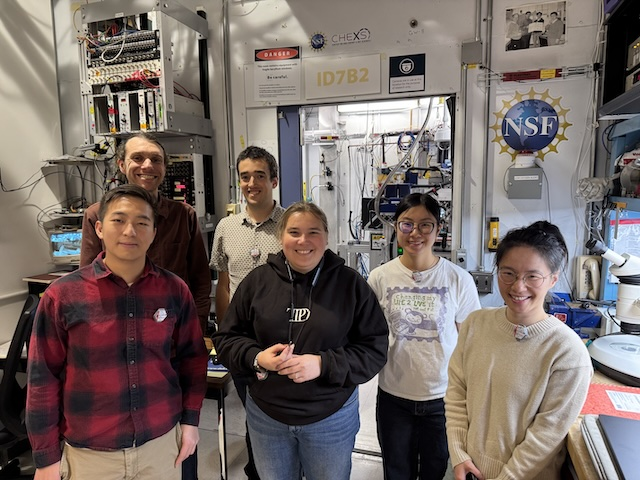
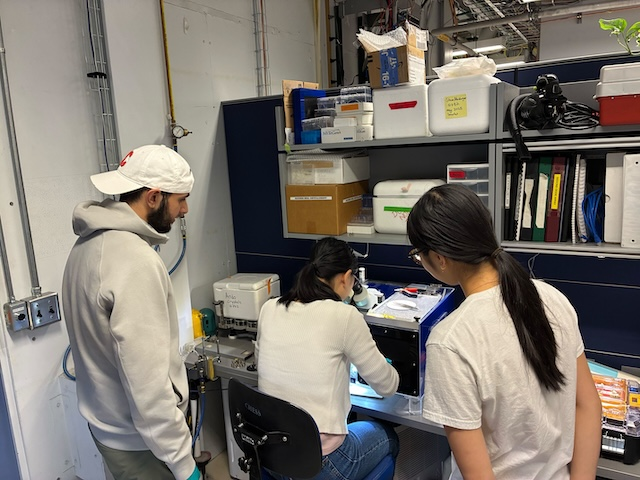
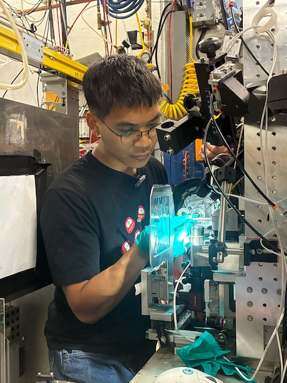
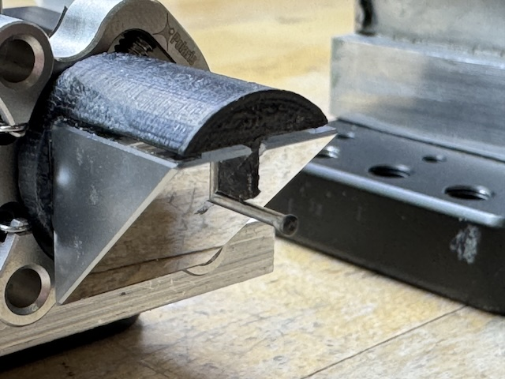
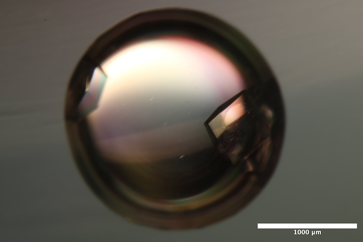
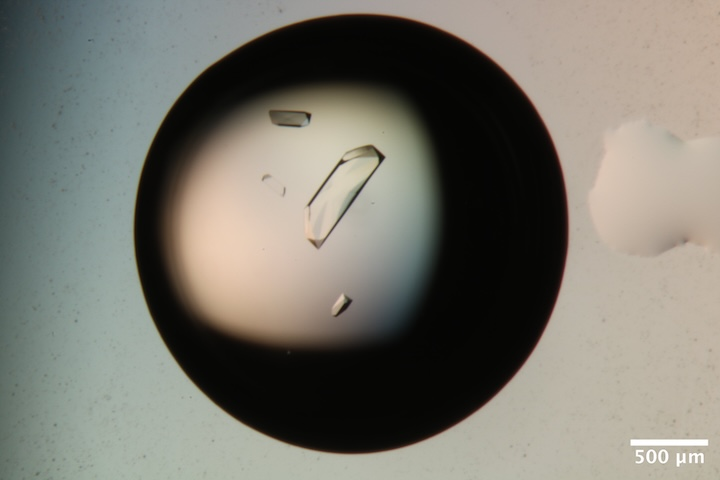
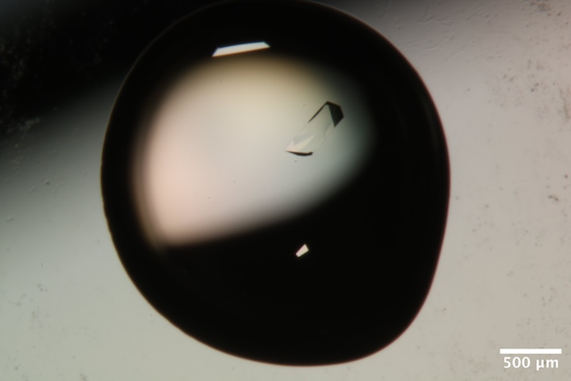
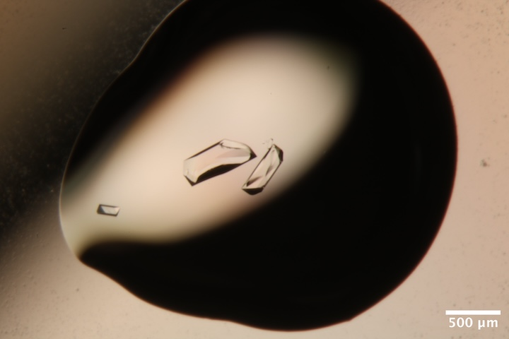
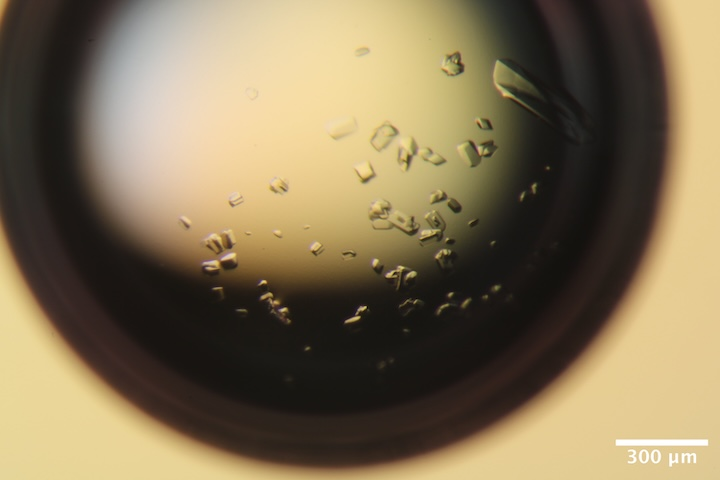
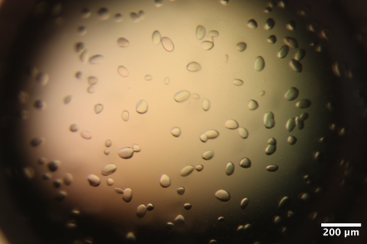

# 2025-11-05 @ CHESS 7b2

Our fourth CHESS beam time of the 2025-3 run cycle.

## Goals

- Training new members
- Standardize methods across beamlines (Kara visiting)
- Data processing on voltage park (Joseph, Justin visiting)
- Mac1 +/- ADP-ribose
- Continue data collection on NrdE, DNA crystals
- Screen ATCase R-state crystals (PALA, +/- ATP and GTP)
- Test next prototype guard aperture for on-axis camera setup

## Participants

Steve M, Xiaokun P, Katie L, Sarah H, Marcus G, Shaheer K (from Ando lab), Kara Z (from Fraser lab), Joseph L and Justin B (from Astera).

-  
Participants during the afternoon of day 1 (left to right): Joseph, Steve, Justin, Kara, Sarah, and Xiaokun. Marcus, Shaheer, and Katie arrived later (not shown).

-  
Justin and Joseph running mdx2 on a Voltage Park node during data collection.

-  
Kara obtained difference density showing ADP-ribose bound to Mac1 after soaking.

-  
Katie and Sarah collecting a dataset.

-  
Shaheer operating the beamline.

-  
Shaheer, Katie, and Sarah at 7b2. Katie is looping a crystal in the humid chamber.

-  
Shaheer inspecting the mounted crystal under a stereo microscope.

-  
Marcus in the 7b2 hutch, placing a sample on the goniometer.

-  
Xiaokun teaching Shaheer crystal looping technique.

## Data

Root directory at CHESS: `/nfs/chess/raw/2025-3/id7b2/meisburger/20251105`

Root directory on OSN: `s3://diffuse-chess-public/20251105`

## Beamline setup

The beamline setup was similar to 9/24/2025 (no in-line camera, no temperature control).  A new SPEC macro was developed to automatically take crystal images every 30 degrees.

parameter | value | notes
--- | --- | --- 
X-ray energy | 14 keV @ 0.01% bandwidth | Si 111 channel cut mono inserted
Beam size | 100 µm x 100 µm, top-hat profile | Defined using slits, CRL bypassed (toroidal mirror focusing only)
Flux | 5.6 x 1010 ph/s unattenuated | See station notebook: *Steve Meisburger CHESS notebook #3* p. 52
Background reduction | 300 µm aperture placed close to the sample | The prototype aperture tests were not successful, so we reverted to the default setup.
Centering camera | top-view camera | 1.713 µm / pixel at 4x zoom ratio. A new spec macro was used to automatically save crystal images every 30 degrees.
Beamstop | 700 µm diameter Mo disk suspended on mylar sheet, semi-transparent | At this energy, the bleedthrough was more intense than usual, and there were some faint diffraction rings visible in the image
Data collection software | "MX Collect" (python) & SPEC | The main GUI was the same as last time. A `<prefix>_scan.json` file was created for each data collection. Counter values and motor positions were recorded in a `<prefix>.spec` file. Images in h5 format were generated using Eiger filewriter. 
Temperature control | none | All datasets collected at ambient temperature

-  
Mike C and Zhongwu W created this new version of the on-axis centering mirror with integrated cleanup aperture. Zhongwu drilled a 250 µm hole in tantalum to create an X-ray aperture, and this was epoxied to the end of the Mo tube. During commisioning time, we were able to align the aperture, and it worked as expected (no slit scatter around the beamstop). However, it was apparent from the diffraction images that epoxy had gotten into the aperture hole. Mike C will work on gluing jig and create a new version for our next visit.

-  
Goniometer setup that was used for data collection, showing the beamstop and guard aperture close to the sample.

## Samples

All protein crystals were grown by vapor diffusion using 24-well hanging drop trays.

Name | Sample | Well composition | Drop composition | Notes
--- | --- | --- | --- | --- 
Lysozyme | 50 mg/mL lysozyme in 20 mM NaOAc pH 4.6 | 0.7-1.0 M NaCl, 0.1 M NaOAc pH 4.4 | 2 µL protein + 2 µL well solution | Shaheer's lysozyme tray (9/16/25).
Mac1 | SARS CoV2 NSP3 macrodomain and seed stock from UCSF. 40 mg/mL Mac1 in 150 mM NaCl, 20 mM Tris pH 8, 5% glycerol | 28-38% (w/vol) PEG 3000 + 100 mM CHES (pH 9.5) | 2 µl protein solution + 1 ul well solution + 1 ul seeds (diluted 10x) | Mac1 tray #1 row C (10/2/2025) and tray #2 (10/30/2025). See Katie L Ando Lab notebook pp. 12, 15, 18, 19.
ADPr | 200 mM ADP-ribose in water | | | from UCSF (source: Sigma A0752)
BsNrdE | _Bacillus subtilis_ class Ib ribonucleotide reductase alpha subunit. 4.5 mg/mL Holo-NrdE protein in 50 mM HEPES pH 7.6, 50 mM NaCl, 5 mM MgCl2, 2 mM TCEP, 1% glycerol, 5 mM ATP, 1 mM ADP, 0.5 mM dGTP | 50 mM HEPES pH 7, 5-6% (w/vol) PEG 3350, 1% tryptone | 1:1 protein:well solution (4-5 µL total volume) | Marcus' BsNrdE tray #2, set up on 10/25/2025. See Marcus' Ando Lab notebook pp. 55-59.
DNA | S2T7-1, S2T7-2, and S2T7-3 single strands at 83 µM in 40 mM tris acetate, 2 mM EDTA | 40 mM tris acetate, 37.5 mM Mg acetate, 1.75 M ammonium sulfate | 3:1 ratio of DNA + well solution, total volume 3 µL (row A) or 5 µL (row B) | DNA tray #2. See Steve Meisburger Ando Lab notebook #3, pp. 50, 51.
ATCase | _Escherichia coli_ Aspartate Transcarbamoylase and seed stock. 16 µM holoenzyme in 40 mM Tris pH 7.5, 15 mM MgCl2, 1 mM TCEP, 2 mM PALA, +/- nucleotides (10 mM ATP and 2 mM GTP) | 8% v/v Tacsimate pH 7.0, 5-15% PEG-3350 | 2 µL protein + 1 µL well solution + 1 µL seed stock | RAG-ATCase tray #2 (10/7/2025) and R-ATCase tray #1 (10/29/2025). See Sarah H Ando Lab notebook pp. 95, 103.

<!--
-  
Well B4 of Jon's practice lysozyme tray (10/9/2025). 
Well solution: 0.9 M NaCl, 100 mM NaOAc pH 4.4. 
Drop: 2 µl protein solution + 2 µl well solution. 
-->

-  
Well B2 of Shaheer's lysozyme tray (9/16/2025)
Well solution: 0.7 M NaCl, 0.1 M NaOAc pH = 4.4.
Drop: 2 uL of lysozyme + 2 uL well solution

-  
Well B5 of Shaheer's lysozyme tray (9/16/2025). 
Well solution: 1.0 M NaCl, 0.1 M NaOAc pH = 4.4.
Drop: 2 uL of lysozyme + 2 uL well solution

-  
Well A3 of Mac1 tray #2 (10/30/2025).
Well solution: 30% (w/vol) PEG 3000 + 100 mM CHES (pH 9.5).
Drop: 2 µl protein solution + 1 ul well solution + 1 ul seeds (diluted 10x in water).

-  
Well B1 of Mac1 tray #2 (10/30/2025).
Well solution: 30% (w/vol) PEG 3000 + 100 mM CHES (pH 9.5).
Drop: 2 µl protein solution + 1 ul well solution + 1 ul seeds  (diluted 10x in water).

-  
Well B4 of Mac1 tray #2 (10/30/2025).
Well solution: 30% (w/vol) PEG 3000 + 100 mM CHES (pH 9.5).
Drop: 2 µl protein solution + 1 ul well solution + 1 ul seeds  (diluted 10x in water).

-  
Well C1 of Mac1 tray #1 (10/2/2025).
Well solution: 28% (w/vol) PEG 3000 + 100 mM CHES (pH 9.5).
Drop: 2 µl protein solution + 1 ul well solution + 1 ul seeds (diluted 10x in well solution).

-  
Well C2 of Mac1 tray #1 (10/2/2025).
Well solution: 30% (w/vol) PEG 3000 + 100 mM CHES (pH 9.5).
Drop: 2 µl protein solution + 1 ul well solution + 1 ul seeds (diluted 10x in well solution).

-  
Well C3 of Mac1 tray #1 (10/2/2025).
Well solution: 32% (w/vol) PEG 3000 + 100 mM CHES (pH 9.5).
Drop: 2 µl protein solution + 1 ul well solution + 1 ul seeds (diluted 10x in well solution).

-  
Well A4 (right drop) of BsNrdE tray #2 (10/25/2025). 
Well solution: 50 mM HEPES (pH 7), 5.5% (w/vol) PEG 3350, 1% tryptone (total volume of 250 uL).
Drop: 2 µl protein solution + 2 ul well solution.

-  
Well A5 (right drop) of BsNrdE tray #2 (10/25/2025). 
Well solution: 50 mM HEPES (pH 7), 5% (w/vol) PEG 3350, 1% tryptone (total volume of 250 uL).
Drop: 2 µl protein solution + 2 ul well solution.

-  
Well B5 (right drop) of BsNrdE tray #2 (10/25/2025). 
Well solution: 50 mM HEPES (pH 7), 5% (w/vol) PEG 3350, 1% tryptone (total volume of 250 uL).
Drop: 2 µl protein solution + 2 ul well solution.

-  
Well C3 (right drop) of BsNrdE tray #2 (10/25/2025). 
Well solution: 50 mM HEPES (pH 7), 6% (w/vol) PEG 3350, 1% tryptone (total volume of 250 uL).
Drop: 2.5 µl protein solution + 2.5 ul well solution.

-  
Well C1 of RAG-ATCase tray #2 (10/7/2025).
Well solution: 8% v/v Tacsimate pH 7.0, 12% PEG-3350.
Drop: 2 µL protein + 1 µL well solution + 1 µL seed stock.

-  
Well C2 of RAG-ATCase tray #2 (10/7/2025).
Well solution: 8% v/v Tacsimate pH 7.0, 12.5% PEG-3350.
Drop: 2 µL protein + 1 µL well solution + 1 µL seed stock.

<!--
- Well C3 of RAG-ATCase tray #2 (10/7/2025).
Well solution: 8% v/v Tacsimate pH 7.0, 13% PEG-3350.
Drop: 2 µL protein + 1 µL well solution + 1 µL seed stock.
-->

-  
Well B6 of RAG-ATCase tray #2 (10/7/2025).
Well solution: 8% v/v Tacsimate pH 7.0, 15% PEG-3350.
Drop: 2 µL protein + 1 µL well solution + 1 µL seed stock.

-  
Well B6 of R-ATCase tray (10/29/25). 
Well solution: 8% v/v Tacsimate pH 7.0, 15% PEG-3350.
Drop: 2 µL protein + 1 µL well solution + 1 µL seed stock.

-  
Well A6 of DNA tray #2. 
Well solution: 40 mM tris acetate, 37.5 mM Mg acetate, 1.75 M ammonium sulfate.
Drop: 2.25 µl DNA solution + 0.75 µl of well solution

-  
Well B6 of DNA tray #2.
Well solution: 40 mM tris acetate, 37.5 mM Mg acetate, 1.75 M ammonium sulfate.
Drop: 3.75 µl DNA solution + 1.25 µl of well solution

<!--
List of all the samples:

- Lysozyme, Shaheer's tray, well B5, B2 (right drop)
- Mac1, Katie's tray #2, well A3, B1, B4
- NrdE, Marcus' tray #2, well A4 (right drop), C3 (right drop), B5 (right drop), well A5 (right drop)
- ATCase, Sarah's RAG tray #2 (10/7/2025), well C1, B6, C1, C2, C3
- ATCase, Sarah's R tray (10/29/25), well B6
- DNA, Steve's tray #2, B6, A6

Mac1 samples (according to Kara)

- mac1_1, 2 were big crystal tray
- mac1_3 was older tray
- mac1_4,5 were katie, big tray
- mac1_6--10 were older tray
-->

## Data collection, day 1

Samples for room temperature data collection were harvested in the humidity chamber (100 % RH). Reusable MiTeGen bases are used with micro RT capillaries cut to length, with 10 µL of well solution in the tip.

With the large number of participants, we sometimes had multiple projects going at once. Note that the following is organized chronologically rather than by project.
<!-- 
### 1. Lysozyme

Steve looped at ~600 µm lysozyme crystal from well B5 of Shaheer's trya using a 500 µm loop, micro RT with 10 µL well solution in the tip. Harvested in humid chamber at ~100% RH.

New directory: `lysozyme/calibration_sample/lys_cal1`

Saved 12 images (full rotation, every 30 degrees), top view, zoom 2.

3616 and 3617 were collected from different locations.

###  -->

### 1. Lysozyme

Steve looped at ~600 µm lysozyme crystal from well B5 of Shaheer's tray using a 500 µm loop, micro RT with 10 µL well solution in the tip. Harvested in humid chamber at ~100% RH.

Subdirectory: `lysozyme/calibration_sample/lys_cal1`

Saved 12 images (full rotation, every 30 degrees), top view, zoom 2: `lys_cal1_160_50_tvc_zoom2_{01..12}.png`

| prefix           |   φ0 (deg.) |   φ1 (deg.) |   ∆φ (deg.) |   images |   ∆t (s) |   tf (%) |   d (mm) |   E (keV) |
|------------------|-------------|-------------|-------------|----------|----------|----------|----------|-----------|
| lys_cal1_3616    |           0 |         360 |         0.1 |     3600 |     0.01 |      100 |      185 |        14 |
| lys_cal1_3617    |           0 |         360 |         0.1 |     3600 |     0.01 |     47.1 |      185 |        14 |
| lys_cal1_bg_3618 |           0 |         360 |         1   |      360 |     0.1  |      100 |      185 |        14 |
| lys_cal1_bg_3619 |           0 |         360 |         1   |      360 |     0.1  |     47.1 |      185 |        14 |

!!! note

    3616 and 3617 were collected from different locations.

??? info "xia2 processing"

    |                 | lys_cal1_3616                           | lys_cal1_3617                           |
    |-----------------|-----------------------------------------|-----------------------------------------|
    | Mosaic spread   | 0.014                                   | 0.012                                   |
    | Resolution      | 1.08                                    | 1.09                                    |
    | Unit Cell       | [78.44, 78.44, 37.61, 90.0, 90.0, 90.0] | [78.43, 78.43, 37.61, 90.0, 90.0, 90.0] |
    | Image range     | [1, 3600]                               | [1, 3600]                               |
    | Completeness    | 97.0                                    | 97.6                                    |
    | Multiplicity    | 21.4                                    | 21.8                                    |
    | I/sigma         | 16.6                                    | 13.5                                    |
    | Rpim            | 0.022                                   | 0.024                                   |
    | Wilson B factor | 16.38                                   | 16.1                                    |
    | Space group     | P 43 21 2                               | P 43 21 2                               |

### 2. Mac1 + ADPr

Kara opened well A3 from Katie's Mac1 tray #2. She pipetted 1 µL of 40 mM ADP-ribose (in water). We don't exactly know the drop volume, our target concentration is 20 mM. Kara set a timer for 10 minutes. She loaded 10 µL of well solution in the capillary.

Subdirectory: `mac1/mac1_1_adpr`

Saved images every 30 degrees: `mac1_1_adpr_10_60_tvc_zoom2_{01..12}.png`

| prefix              |   φ0 (deg.) |   φ1 (deg.) |   ∆φ (deg.) |   images |   ∆t (s) |   tf (%) |   d (mm) |   E (keV) |
|---------------------|-------------|-------------|-------------|----------|----------|----------|----------|-----------|
| mac1_1_adpr_3620    |           0 |         720 |         0.1 |     7200 |     0.01 |      100 |      185 |        14 |
| mac1_1_adpr_bg_3621 |           0 |         720 |         1   |      720 |     0.1  |      100 |      185 |        14 |

??? info "xia2 processing (first 180 degrees)"

    |                 | mac1_1_adpr_3620                        |
    |-----------------|-----------------------------------------|
    | Mosaic spread   | 0.009                                   |
    | Resolution      | 1.02                                    |
    | Unit Cell       | [88.47, 88.47, 40.07, 90.0, 90.0, 90.0] |
    | Image range     | [1, 1800]                               |
    | Completeness    | 81.3                                    |
    | Multiplicity    | 5.7                                     |
    | I/sigma         | 9.7                                     |
    | Rpim            | 0.052                                   |
    | Wilson B factor | 11.97                                   |
    | Space group     | P 43                                    |

!!! note

    Ran a quick molecular replacement using dimple. No ADPr density observed.

### 3. BsNrdE

Marcus looped a NrdE crystal from well A4 (right drop) in NrdE tray #2. 400 µm loop, sleeve with 8 µL well solution.

Subdirectory: `BsNrdE/MG_A4r`

Saved 12 images (every 30˚): `MG_A4r_10_60_tvc_zoom4_{01..12}.png`

| prefix         |   φ0 (deg.) |   φ1 (deg.) |   ∆φ (deg.) |   images |   ∆t (s) |   tf (%) |   d (mm) |   E (keV) |
|----------------|-------------|-------------|-------------|----------|----------|----------|----------|-----------|
| MG_A4r_3622    |           0 |         720 |         0.1 |     7200 |     0.01 |      100 |      225 |        14 |
| MG_A4r_bg_3623 |           0 |         720 |         1   |      720 |     0.1  |      100 |      225 |        14 |

!!! warning 

    Noticed lots of radiation damage. Next sample, try a vector scan or attenuation.

Saved a photo of the cracked crystal: `MG_A4r_cracked_tvc_zoom4_1.png`

??? info "xia2 processing (first 180 degrees)"

    |                 | MG_A4r_3622                              |
    |-----------------|------------------------------------------|
    | Mosaic spread   | 0.032                                    |
    | Resolution      | 1.97                                     |
    | Unit Cell       | [120.0, 126.67, 127.1, 90.0, 90.0, 90.0] |
    | Image range     | [1, 1800]                                |
    | Completeness    | 100.0                                    |
    | Multiplicity    | 6.9                                      |
    | I/sigma         | 11.6                                     |
    | Rpim            | 0.043                                    |
    | Wilson B factor | 39.04                                    |
    | Space group     | P 21 21 21                               |

### 4. Mac1 + ADPr

Kara added 1 µL of 200 mM ADP-ribose to the crystal drop, pipetted up and down, and waited for ~10 minutes before looping. 10 µL of well solution was added to a new sleeve (re-used loop).

Subdirectory: `mac1/mac1_2_adpr`

Saved images every 30˚: `mac1_2_adpr_tvc_zoom4_{01..12}.png`

| prefix              |   φ0 (deg.) |   φ1 (deg.) |   ∆φ (deg.) |   images |   ∆t (s) |   tf (%) |   d (mm) |   E (keV) |
|---------------------|-------------|-------------|-------------|----------|----------|----------|----------|-----------|
| mac1_2_adpr_3624    |           0 |         720 |         0.1 |     7200 |     0.01 |      100 |      185 |        14 |
| mac1_2_adpr_bg_3625 |           0 |         720 |         1   |      720 |     0.1  |      100 |      185 |        14 |

!!! warning

    For scan 3624, the shutter was closed at the start of data collection. Frames 1-660 are blank.

??? info "xia2 processing (first 360 degrees)"

    |                 | mac1_2_adpr_3624                        |
    |-----------------|-----------------------------------------|
    | Mosaic spread   | 0.021                                   |
    | Resolution      | 1.02                                    |
    | Unit Cell       | [88.47, 88.47, 40.06, 90.0, 90.0, 90.0] |
    | Image range     | [671, 3600]                               |
    | Completeness    | 78.9                                    |
    | Multiplicity    | 9.5                                     |
    | I/sigma         | 19.4                                    |
    | Rpim            | 0.018                                   |
    | Wilson B factor | 12.86                                   |
    | Space group     | P 43                                    |

### 5. BsNrdE

Marcus looped a NrdE crystal from well C3 (right drop) from NrdE tray #2 using a 400 µm loop with 8 µL well solution in sleeve.

Subdirectory: `BsNrdE/MG_C3r`

Saved 12 images per 30˚: `MG_C3r_adpr_tvc_zoom4_{01..12}.png`

| prefix         |   φ0 (deg.) |   φ1 (deg.) |   ∆φ (deg.) |   images |   ∆t (s) |   tf (%) |   d (mm) |   ∆x (µm) |   E (keV) |
|----------------|-------------|-------------|-------------|----------|----------|----------|----------|-----------|-----------|
| MG_C3r_3626    |           0 |         360 |         0.1 |     3600 |     0.01 |      100 |      225 |    347.76 |        14 |
| MG_C3r_bg_3627 |           0 |         360 |         1   |      360 |     0.1  |      100 |      225 |    nan    |        14 |

3626 was a vector scan. 

!!! tip "How to estimate dose for vector scans"

    ∆x is the component of translation along the spindle axis. The maximum residence time of a part of the crystal in the beam can be estimated as `(w/∆x)*images*∆t`, where `w` is the beam width (100 µm). Here, 10.35 s.

??? info "xia2 processing"

    |                 | MG_C3r_3626                                |
    |-----------------|--------------------------------------------|
    | Mosaic spread   | 0.023                                      |
    | Resolution      | 1.92                                       |
    | Unit Cell       | [120.01, 126.72, 127.14, 90.0, 90.0, 90.0] |
    | Image range     | [1, 3600]                                  |
    | Completeness    | 99.8                                       |
    | Multiplicity    | 13.9                                       |
    | I/sigma         | 11.5                                       |
    | Rpim            | 0.033                                      |
    | Wilson B factor | 38.71                                      |
    | Space group     | P 21 21 21                                 |

### 6. Mac1 + ADPr

Kara made a drop of 9 µL reservoir solution and added 1 µL of 200 mM ADPr. She looped a few crystals into the drop, and let soak for ~10 minutes.

Subdirectory: `mac1/mac1_3_adpr`

Saved 12 images per 30˚: `mac1_3_adpr_190_30_tvc_zoom4_{01..12}.png`

| prefix              |   φ0 (deg.) |   φ1 (deg.) |   ∆φ (deg.) |   images |   ∆t (s) |   tf (%) |   d (mm) |   E (keV) |
|---------------------|-------------|-------------|-------------|----------|----------|----------|----------|-----------|
| mac1_3_adpr_3628    |           0 |         720 |         0.1 |     7200 |     0.01 |      100 |      185 |        14 |
| mac1_3_adpr_bg_3629 |           0 |         720 |         1   |      720 |     0.1  |      100 |      185 |        14 |

??? info "xia2 processing (first 360 degrees)"

    |                 | mac1_3_adpr_3628                        |
    |-----------------|-----------------------------------------|
    | Mosaic spread   | 0.017                                   |
    | Resolution      | 1.04                                    |
    | Unit Cell       | [88.41, 88.41, 39.86, 90.0, 90.0, 90.0] |
    | Image range     | [1, 3600]                               |
    | Completeness    | 82.4                                    |
    | Multiplicity    | 11.8                                    |
    | I/sigma         | 14.9                                    |
    | Rpim            | 0.022                                   |
    | Wilson B factor | 12.69                                   |
    | Space group     | P 43                                    |

!!! note

    Did a quick MR using dimple: density shows ~50% occupancy of ADPr!

### 7. ATCase (RAG)

Sarah looped an ATCase crystal from well C1 of RAG tray #2 using a 300 µm loop with 8 µL well solution in sleeve.

Subdirectory: `RAG_ATCase`

| prefix        |   φ0 (deg.) |   φ1 (deg.) |   ∆φ (deg.) |   images |   ∆t (s) |   tf (%) |   d (mm) |   E (keV) |
|---------------|-------------|-------------|-------------|----------|----------|----------|----------|-----------|
| rag_1_3630    |           0 |         360 |         0.1 |     3600 |     0.01 |      100 |      300 |        14 |
| rag_1_bg_3631 |           0 |         360 |         1   |      360 |     0.1  |      100 |      300 |        14 |

Evident radiation damage from spot fading. Next time use attenuation and/or vector scan.

??? info "xia2 processing (first 90 degrees)"

    |                 | rag_1_3630                                 |
    |-----------------|--------------------------------------------|
    | Mosaic spread   | 0.016                                      |
    | Resolution      | 3.02                                       |
    | Unit Cell       | [126.54, 152.72, 206.18, 90.0, 90.0, 90.0] |
    | Image range     | [1, 900]                                   |
    | Completeness    | 89.5                                       |
    | Multiplicity    | 3.9                                        |
    | I/sigma         | 7.2                                        |
    | Rpim            | 0.081                                      |
    | Wilson B factor | 80.68                                      |
    | Space group     | P 21 21 21                                 |

### 8. ATCase (RAG)

Sarah looped another ATCase crystal from the same well (C1, RAG tray #2) using a 300 µm loop with 8 µL well solution in sleeve.

Subdirectory: `RAG_ATCase`

| sample   | prefix        |   φ0 (deg.) |   φ1 (deg.) |   ∆φ (deg.) |   images |   ∆t (s) |   tf (%) |   d (mm) |   ∆x (µm) |   E (keV) |
|----------|---------------|-------------|-------------|-------------|----------|----------|----------|----------|-----------|-----------|
| rag_2    | rag_2_3632    |           0 |         360 |         0.1 |     3600 |     0.01 |     47.1 |      300 |    167.93 |        14 |
| rag_2    | rag_2_bg_3633 |           0 |         360 |         1   |      360 |     0.1  |     47.1 |      300 |    nan    |        14 |

Vector data collection was used to distribute the dose along the crystal.

??? info "xia2 processing (first 180 degrees)"

    |                 | rag_2_3632                                 |
    |-----------------|--------------------------------------------|
    | Mosaic spread   | 0.039                                      |
    | Resolution      | 3.02                                       |
    | Unit Cell       | [126.23, 152.53, 206.32, 90.0, 90.0, 90.0] |
    | Image range     | [1, 1800]                                  |
    | Completeness    | 100.0                                      |
    | Multiplicity    | 6.9                                        |
    | I/sigma         | 6.5                                        |
    | Rpim            | 0.096                                      |
    | Wilson B factor | 79.1                                       |
    | Space group     | P 21 21 21                                 |

### 9. Mac1

Katie looped a Mac1 crystal from well B1 of Mac1 tray #2. 500 µm loop with 10 µL well solution in the sleeve.

Subdirectory: `mac1/mac1_4`

Saved images every 30˚: `mac1_4_190_30_tvc_zoom4_{01..12}.png`

| prefix         |   φ0 (deg.) |   φ1 (deg.) |   ∆φ (deg.) |   images |   ∆t (s) |   tf (%) |   d (mm) |   E (keV) |
|----------------|-------------|-------------|-------------|----------|----------|----------|----------|-----------|
| mac1_4_3634    |           0 |         720 |         0.1 |     7200 |     0.01 |      100 |      185 |        14 |
| mac1_4_bg_3635 |           0 |         720 |         1   |      720 |     0.1  |      100 |      185 |        14 |

??? info "xia2 processing"

    |                 | mac1_4_3634                             |
    |-----------------|-----------------------------------------|
    | Mosaic spread   | 0.009                                   |
    | Resolution      | 1.02                                    |
    | Unit Cell       | [88.42, 88.42, 39.94, 90.0, 90.0, 90.0] |
    | Image range     | [1, 7200]                               |
    | Completeness    | 80.7                                    |
    | Multiplicity    | 22.8                                    |
    | I/sigma         | 26.1                                    |
    | Rpim            | 0.015                                   |
    | Wilson B factor | 13.03                                   |
    | Space group     | P 43                                    |

### 10. Lysozyme

Shaheer looped a lysozyme crystal from well B2 (right drop) of 9/16/25 lysozyme tray. 500 µm loop with 10 µL well solution in sleeve.

Subdirectory: `lysozyme/sk_B2r`

| prefix         |   φ0 (deg.) |   φ1 (deg.) |   ∆φ (deg.) |   images |   ∆t (s) |   tf (%) |   d (mm) |   E (keV) |
|----------------|-------------|-------------|-------------|----------|----------|----------|----------|-----------|
| sk_B2r_3636    |           0 |         360 |         0.1 |     3600 |     0.01 |      100 |      200 |        14 |
| sk_B2r_bg_3637 |           0 |         360 |         1   |      360 |     0.1  |      100 |      200 |        14 |

??? info "xia2 processing"

    |                 | sk_B2r_3636                             |
    |-----------------|-----------------------------------------|
    | Mosaic spread   | 0.013                                   |
    | Resolution      | 1.08                                    |
    | Unit Cell       | [78.42, 78.42, 37.61, 90.0, 90.0, 90.0] |
    | Image range     | [1, 3600]                               |
    | Completeness    | 88.4                                    |
    | Multiplicity    | 20.5                                    |
    | I/sigma         | 24.9                                    |
    | Rpim            | 0.012                                   |
    | Wilson B factor | 16.04                                   |
    | Space group     | P 43 21 2                               |

### 11. Mac1

Katie looped a Mac1 crystal from well B4 of Mac1 Tray #2. 500 µm loop with 10 µL well solution in sleeve.

Subdirectory: `mac1/mac1_5`

| prefix         |   φ0 (deg.) |   φ1 (deg.) |   ∆φ (deg.) |   images |   ∆t (s) |   tf (%) |   d (mm) |   E (keV) |
|----------------|-------------|-------------|-------------|----------|----------|----------|----------|-----------|
| mac1_5_3638    |           0 |         720 |         0.1 |     7200 |     0.01 |      100 |      185 |        14 |
| mac1_5_bg_3639 |           0 |         720 |         1   |      720 |     0.1  |      100 |      185 |        14 |

??? info "xia2 processing"

    |                 | mac1_5_3638                             |
    |-----------------|-----------------------------------------|
    | Mosaic spread   | 0.008                                   |
    | Resolution      | 1.02                                    |
    | Unit Cell       | [88.44, 88.44, 39.97, 90.0, 90.0, 90.0] |
    | Image range     | [1, 7200]                               |
    | Completeness    | 81.9                                    |
    | Multiplicity    | 22.5                                    |
    | I/sigma         | 19.7                                    |
    | Rpim            | 0.02                                    |
    | Wilson B factor | 12.93                                   |
    | Space group     | P 43                                    |

### 12. BsNrdE

Xiaokun looped a BsNrdE crystal from Macrus' crystal tray, well B5 (right drop). The rod-shaped crystal was oriented diagonally ~45˚ on the loop, in order to improve reciprocal space coverage after symmetry averaging.

Subdirectory: `BsNrdE/MG_B5r`

Saved images every 30˚: `MG_B5r_190_30_tvc_zoom4_{01..12}.png`

| prefix         |   φ0 (deg.) |   φ1 (deg.) |   ∆φ (deg.) |   images |   ∆t (s) |   tf (%) |   d (mm) |   ∆x (µm) |   E (keV) |
|----------------|-------------|-------------|-------------|----------|----------|----------|----------|-----------|-----------|
| MG_B5r_3640    |         190 |         550 |         0.1 |     3600 |     0.01 |      100 |      225 |    210.79 |        14 |
| MG_B5r_bg_3641 |         190 |         550 |         1   |      360 |     0.1  |      100 |      225 |    nan    |        14 |

Vector scan along the length of the crystal was used to distribute the dose.

??? info "xia2 processing"

    |                 | MG_B5r_3640                                |
    |-----------------|--------------------------------------------|
    | Mosaic spread   | 0.026                                      |
    | Resolution      | 1.94                                       |
    | Unit Cell       | [120.04, 126.79, 127.16, 90.0, 90.0, 90.0] |
    | Image range     | [1, 3600]                                  |
    | Completeness    | 99.9                                       |
    | Multiplicity    | 13.9                                       |
    | I/sigma         | 11.2                                       |
    | Rpim            | 0.035                                      |
    | Wilson B factor | 40.29                                      |
    | Space group     | P 21 21 21                                 |

### 13. Mac1 + ADPr

Kara made a new drop with 9 µL reservoir solution + 1 µL 200 mM ADPr, looped mac1 crystal (which well? which tray?) and put it into the new drop. Allowed to soak for 30 minutes before harvesting.

Subdirectory: `mac1/mac1_6_adpr`

Saved images every 30˚: `mac1_adpr_6_190_30_tvc_zoom4_{01..12}.png`

| prefix              |   φ0 (deg.) |   φ1 (deg.) |   ∆φ (deg.) |   images |   ∆t (s) |   tf (%) |   d (mm) |   E (keV) |
|---------------------|-------------|-------------|-------------|----------|----------|----------|----------|-----------|
| mac1_6_adpr_3642    |           0 |         720 |         0.1 |     7200 |     0.01 |      100 |      185 |        14 |
| mac1_6_adpr_bg_3643 |           0 |         720 |         1   |      720 |     0.1  |      100 |      185 |        14 |

??? info "xia2 processing"

    |                 | mac1_6_adpr_3642                        |
    |-----------------|-----------------------------------------|
    | Mosaic spread   | 0.026                                   |
    | Resolution      | 1.04                                    |
    | Unit Cell       | [88.37, 88.37, 39.84, 90.0, 90.0, 90.0] |
    | Image range     | [1, 3600]                               |
    | Completeness    | 84.3                                    |
    | Multiplicity    | 11.5                                    |
    | I/sigma         | 14.6                                    |
    | Rpim            | 0.021                                   |
    | Wilson B factor | 12.44                                   |
    | Space group     | P 43                                    |

### 14. BsNrdE

Xiaokun looped another crystal from Marcus' NrdE tray #2, well A5 (right drop). The rod-shaped crystal was oriented diagonally on the loop, to improve coverage of reciprocal space after symmetry averaging.

Subdirectory: `BsNrdE/MG_A5r`

Saved images every 30˚: `MG_A5r_6_190_30_tvc_zoom4_{01..12}.png`

| prefix         |   φ0 (deg.) |   φ1 (deg.) |   ∆φ (deg.) |   images |   ∆t (s) |   tf (%) |   d (mm) |   ∆x (µm) |   E (keV) |
|----------------|-------------|-------------|-------------|----------|----------|----------|----------|-----------|-----------|
| MG_A5r_3644    |          10 |         550 |         0.1 |     5400 |     0.01 |      100 |      225 |     308.3 |        14 |
| MG_A5r_bg_3645 |          10 |         550 |         1   |      540 |     0.1  |      100 |      225 |     nan   |        14 |

Vector scan along the length of the crystal to distribute dose.

??? info "xia2 processing"

    |                 | MG_A5r_3644                                |
    |-----------------|--------------------------------------------|
    | Mosaic spread   | 0.027                                      |
    | Resolution      | 1.94                                       |
    | Unit Cell       | [120.05, 126.81, 127.17, 90.0, 90.0, 90.0] |
    | Image range     | [1, 5400]                                  |
    | Completeness    | 100.0                                      |
    | Multiplicity    | 20.8                                       |
    | I/sigma         | 10.3                                       |
    | Rpim            | 0.04                                       |
    | Wilson B factor | 39.41                                      |
    | Space group     | P 21 21 21                                 |

### 15. Mac1 + ADPr

Kara looped mac1 crystal (which well? which tray?) and put it into a drop with 9 µL reservoir solution + 1 µL 200 mM ADPr. Allowed to soak for 30 minutes before harvesting.

Subdirectory: `mac1/mac1_7_adpr`

Saved images very 30˚: `mac1_7_adpr_190_30_tvc_zoom4_{01..12}.png`

| prefix              |   φ0 (deg.) |   φ1 (deg.) |   ∆φ (deg.) |   images |   ∆t (s) |   tf (%) |   d (mm) |   E (keV) |
|---------------------|-------------|-------------|-------------|----------|----------|----------|----------|-----------|
| mac1_7_adpr_3646    |           0 |         720 |         0.1 |     7200 |     0.01 |      100 |      185 |        14 |
| mac1_7_adpr_bg_3647 |           0 |         720 |         1   |      720 |     0.1  |      100 |      185 |        14 |

??? info "xia2 processing (first 360 degrees)"

    |                 | mac1_7_adpr_3646                        |
    |-----------------|-----------------------------------------|
    | Mosaic spread   | 0.022                                   |
    | Resolution      | 1.04                                    |
    | Unit Cell       | [88.37, 88.37, 39.86, 90.0, 90.0, 90.0] |
    | Image range     | [1, 3600]                               |
    | Completeness    | 84.5                                    |
    | Multiplicity    | 11.4                                    |
    | I/sigma         | 13.3                                    |
    | Rpim            | 0.023                                   |
    | Wilson B factor | 12.24                                   |
    | Space group     | P 43                                    |

### 16. Mac1 + ADPr

Kara looped mac1 crystal (which well? which tray?) and put it into a drop with 9 µL reservoir solution + 1 µL 200 mM ADPr. Allowed to soak for 45 minutes before harvesting.

Subdirectory: `mac1/mac1_8_adpr`

Saved images every 30˚: `mac1_8_adpr_190_30_tvc_zoom4_{01..12}.png`

| prefix              |   φ0 (deg.) |   φ1 (deg.) |   ∆φ (deg.) |   images |   ∆t (s) |   tf (%) |   d (mm) |   E (keV) |
|---------------------|-------------|-------------|-------------|----------|----------|----------|----------|-----------|
| mac1_8_adpr_3648    |           0 |         720 |         0.1 |     7200 |     0.01 |      100 |      185 |        14 |
| mac1_8_adpr_bg_3649 |           0 |         720 |         1   |      720 |     0.1  |      100 |      185 |        14 |

??? info "xia2 processing (first 360 degrees)"

    |                 | mac1_8_adpr_3648                        |
    |-----------------|-----------------------------------------|
    | Mosaic spread   | 0.028                                   |
    | Resolution      | 1.04                                    |
    | Unit Cell       | [88.37, 88.37, 39.92, 90.0, 90.0, 90.0] |
    | Image range     | [1, 3600]                               |
    | Completeness    | 82.7                                    |
    | Multiplicity    | 11.7                                    |
    | I/sigma         | 13.9                                    |
    | Rpim            | 0.023                                   |
    | Wilson B factor | 12.08                                   |
    | Space group     | P 43                                    |

### 17. Mac1 + ADPr

Kara looped mac1 crystal (which well? which tray?) and put it into a drop with 9 µL reservoir solution + 1 µL 200 mM ADPr. Allowed to soak for 45 minutes before harvesting.

Subdirectory: `mac1/mac1_9_adpr`

Saved images every 30˚: `mac1_9_adpr_175_30_tvc_zoom4_{01..12}.png`

| prefix              |   φ0 (deg.) |   φ1 (deg.) |   ∆φ (deg.) |   images |   ∆t (s) |   tf (%) |   d (mm) |   E (keV) |
|---------------------|-------------|-------------|-------------|----------|----------|----------|----------|-----------|
| mac1_9_adpr_3650    |           0 |         720 |         0.1 |     7200 |     0.01 |      100 |      185 |        14 |
| mac1_9_adpr_bg_3651 |           0 |         720 |         1   |      720 |     0.1  |      100 |      185 |        14 |
| mac1_9_adpr_3652    |           0 |         720 |         0.1 |     7200 |     0.01 |      100 |      185 |        14 |
| mac1_9_adpr_bg_3653 |           0 |         720 |         1   |      720 |     0.1  |      100 |      185 |        14 |

!!! warning 

    Beamstop not in place for scans 3650, 3651. After replacing beamstop, the data collection was repeated (scans 3652, 3653) at a different (nominally undamaged) spot on the crystal.

??? info "xia2 processing (first 360 degrees)"

    |                 | mac1_9_adpr_3652                        |
    |-----------------|-----------------------------------------|
    | Mosaic spread   | 0.021                                   |
    | Resolution      | 1.15                                    |
    | Unit Cell       | [88.33, 88.33, 39.83, 90.0, 90.0, 90.0] |
    | Image range     | [1, 3600]                               |
    | Completeness    | 98.3                                    |
    | Multiplicity    | 12.5                                    |
    | I/sigma         | 10.3                                    |
    | Rpim            | 0.034                                   |
    | Wilson B factor | 12.66                                   |
    | Space group     | P 43                                    |

### 18. ATCase (R)

Steve looped several R-state crystals from well B6 of Sarah's new tray (R-state with PALA, no nucleotides) in a 50 µm loop. The goal here is just to check for diffraction.

Subdirectory: `R_ATCase/ratc_1`

| prefix      |   φ0 (deg.) |   ∆φ (deg.) |   images |   ∆t (s) |   tf (%) |   d (mm) |   E (keV) |
|-------------|-------------|-------------|----------|----------|----------|----------|-----------|
| ratc_1_3658 |           0 |         0.1 |        1 |        1 |      100 |      300 |        14 |
| ratc_1_3659 |           0 |         0.1 |        1 |        1 |      100 |      300 |        14 |

Crystals were not visible in the centering camera. Took snapshots at two locations on the loop. 

There were powder-like rings at 3.03 Å and 1.9 Å. Are these salt crystals? Or is the loop dirty?

### 19. ATCase (R)

Steve scooped up a whole mess of crystals from the same drop using a micromesh and blotted from the back with a kimwipe. 

Subdirectory: `R_ATCase/ratc_2`

Took snapshots to check for diffraction. Each snap is a different crystal.

| prefix      |   φ0 (deg.) |   ∆φ (deg.) |   images |   ∆t (s) |   tf (%) |   d (mm) |   E (keV) |
|-------------|-------------|-------------|----------|----------|----------|----------|-----------|
| ratc_2_3660 |           0 |         0.1 |        1 |        1 |      100 |      300 |        14 |
| ratc_2_3661 |         335 |         0.1 |        1 |        1 |      100 |      300 |        14 |
| ratc_2_3662 |         335 |         0.1 |        1 |        1 |      100 |      300 |        14 |
| ratc_2_3663 |         335 |         0.1 |        1 |        1 |      100 |      300 |        14 |

!!! warning

    Realized that the φ0 angle was set incorrectly: given the vertical orientation of the centering camera, I should subtract 90 degrees.

More snapshots:

| prefix      |   φ0 (deg.) |   ∆φ (deg.) |   images |   ∆t (s) |   tf (%) |   d (mm) |   E (keV) |
|-------------|-------------|-------------|----------|----------|----------|----------|-----------|
| ratc_2_3664 |         245 |         0.1 |        1 |        1 |      100 |      300 |        14 |

Decided to set up a grid scan: 6 x 8 steps, 1s per point, 0.5 degree rotation. Step pitch is 157 x 149 µm

| prefix      |   φ0 (deg.) |   ∆φ (deg.) |   images |   ∆t (s) |   tf (%) |   d (mm) |   E (keV) |
|-------------|-------------|-------------|----------|----------|----------|----------|-----------|
| ratc_2_3665 |         245 |         0.5 |        1 |        1 |      100 |      300 |        14 |

Observed some hits, mostly at ~8 Å resolution. 

!!! question

    Did something go wrong with the grid scan program? Several of the shots contained diffraction from the metal pin. Needs investigation / testing

Taking a few more manual snapshots

| prefix      |   φ0 (deg.) |   ∆φ (deg.) |   images |   ∆t (s) |   tf (%) |   d (mm) |   E (keV) |
|-------------|-------------|-------------|----------|----------|----------|----------|-----------|
| ratc_2_3666 |         245 |         0.5 |        1 |        1 |      100 |      300 |        14 |
| ratc_2_3667 |         245 |         0.5 |        1 |        1 |      100 |      300 |        14 |
| ratc_2_3668 |         245 |         0.5 |        1 |        1 |      100 |      300 |        14 |
| ratc_2_3669 |         245 |         0.5 |        1 |        1 |      100 |      300 |        14 |
| ratc_2_3670 |         245 |         0.5 |        1 |        1 |      100 |      300 |        14 |
| ratc_2_3671 |         245 |         0.5 |        1 |        1 |      100 |      300 |        14 |
| ratc_2_3672 |         245 |         0.5 |        1 |        1 |      100 |      300 |        14 |

Some spots visible to ~4 Å resolution.

Saved an image of the loop: `ratc_2_335_tvc_zoom2_1.png`

!!! success "Done for the night."

    Tomorrow continue with Mac1 + ADPr, ATCase, and DNA

## Data collection, day 2

November 6, 2025.

Kara, Steve, Joseph, & Justin arrived in the morning.

Here's the plan:

- First, collect another Mac1+ADPr dataset at 45 minutes soak time to repeat the earlier ~100% occupancy dataset.
- Next, collect some DNA data from the new tray. Goal is to improve S/N and background subtraction by using larger crystals.
- Collect more crystals of ATCase (RAG) to get a complete (hopefully undamaged) map with good enough S/N for processing.

### 20. Mac1 + ADPr

Kara looped another mac1, and soaked for 45 minutes in a drop containing 9 µL of reservoir solution + 1 µL of ADPr (200 mM).

Subdirectory: `mac1/mac1_10_adpr`

Saved images every 30˚: `mac1_10_adpr_tvc_zoom4_{01..12}.png`

| prefix               |   φ0 (deg.) |   φ1 (deg.) |   ∆φ (deg.) |   images |   ∆t (s) |   tf (%) |   d (mm) |   E (keV) |
|----------------------|-------------|-------------|-------------|----------|----------|----------|----------|-----------|
| mac1_10_adpr_3673    |           0 |         720 |         0.1 |     7200 |     0.01 |      100 |      185 |        14 |
| mac1_10_adpr_bg_3674 |           0 |         720 |         1   |      720 |     0.1  |      100 |      185 |        14 |

??? info "xia2 processing"

    |                 | mac1_10_adpr_3673                       |
    |-----------------|-----------------------------------------|
    | Mosaic spread   | 0.026                                   |
    | Resolution      | 0.0                                     |
    | Unit Cell       | [88.38, 88.38, 39.83, 90.0, 90.0, 90.0] |
    | Image range     | [1, 7200]                               |
    | Completeness    | 82.9                                    |
    | Multiplicity    | 22.2                                    |
    | I/sigma         | 23.2                                    |
    | Rpim            | 0.012                                   |
    | Wilson B factor | 12.91                                   |
    | Space group     | P 43                                    |

### 21. DNA

Steve harvested a large DNA crystal from well B6 of tray #2 using a 200 µm loop.

Subdirectory: `dna/dna_1`

Saved images every 30˚: `dna_1_75_30_tvc_zoom4_{01..12}.png`

| prefix        |   φ0 (deg.) |   φ1 (deg.) |   ∆φ (deg.) |   images |   ∆t (s) |   tf (%) |   d (mm) |   E (keV) |
|---------------|-------------|-------------|-------------|----------|----------|----------|----------|-----------|
| dna_1_3675    |           0 |         360 |         0.1 |     3600 |     0.01 |     28.6 |      450 |        14 |
| dna_1_3676    |         220 |         230 |         0.1 |      100 |     0.1  |    100   |      450 |        14 |
| dna_1_bg_3677 |         220 |         230 |         0.1 |      100 |     0.1  |    100   |      450 |        14 |
| dna_1_bg_3678 |           0 |         360 |         1   |      360 |     0.1  |     28.6 |      450 |        14 |

Datasets 3675 and 3676 are collected from different spots on the crystal.

!!! warning

    The first time I processed this using xia2, the moasicity blew up and it got stuck in integration. Possibly the crystal slipped or cracked during data collection? I repeated processing just on the first 15 degrees. Need to revisit this more carefully.

??? info "xia2 processing (first 15 degrees)"

    |                 | dna_1_3675                                 |
    |-----------------|--------------------------------------------|
    | Mosaic spread   | 0.022                                      |
    | Resolution      | 4.33                                       |
    | Unit Cell       | [107.34, 107.34, 92.78, 90.0, 90.0, 120.0] |
    | Image range     | [1, 150]                                   |
    | Completeness    | 42.6                                       |
    | Multiplicity    | 1.9                                        |
    | I/sigma         | 2.6                                        |
    | Rpim            | 0.105                                      |
    | Wilson B factor | 248.0                                      |
    | Space group     | R 3 2                                      |

### 22. DNA

Steve looped another, smaller crystal from the same drop.

Subdirectory: `dna/dna_2`

Saved images every 30˚: `dna_2_75_30_tvc_zoom4_{01..12}.png`

| prefix        |   φ0 (deg.) |   φ1 (deg.) |   ∆φ (deg.) |   images |   ∆t (s) |   tf (%) |   d (mm) |   E (keV) |
|---------------|-------------|-------------|-------------|----------|----------|----------|----------|-----------|
| dna_2_3679    |           0 |         360 |         0.1 |     3600 |     0.01 |     28.6 |      450 |        14 |
| dna_2_3680    |          70 |          80 |         0.1 |      100 |     0.1  |    100   |      450 |        14 |
| dna_2_bg_3681 |          70 |          80 |         0.1 |      100 |     0.1  |    100   |      450 |        14 |
| dna_2_bg_3682 |           0 |         360 |         1   |      360 |     0.1  |     28.6 |      450 |        14 |

Datasets 3679 and 3680 are collected from the same spot

??? info "xia2 processing"

    |                 | dna_2_3679                               |
    |-----------------|------------------------------------------|
    | Mosaic spread   | 0.034                                    |
    | Resolution      | 4.0                                      |
    | Unit Cell       | [107.2, 107.2, 93.44, 90.0, 90.0, 120.0] |
    | Image range     | [1, 3600]                                |
    | Completeness    | 100.0                                    |
    | Multiplicity    | 19.7                                     |
    | I/sigma         | 2.2                                      |
    | Rpim            | 0.047                                    |
    | Wilson B factor | 182.9                                    |
    | Space group     | R 3 2                                    |

### 23. DNA

Looped another from the same drop.

Subdirectory: `dna/dna_3`

Saved images every 30˚: `dna_3_25_30_tvc_zoom4_{01..12}.png`

| prefix        |   φ0 (deg.) |   φ1 (deg.) |   ∆φ (deg.) |   images |   ∆t (s) |   tf (%) |   d (mm) |   E (keV) |
|---------------|-------------|-------------|-------------|----------|----------|----------|----------|-----------|
| dna_3_3683    |           0 |         360 |         0.1 |     3600 |     0.01 |     28.6 |      450 |        14 |
| dna_3_3684    |         200 |         210 |         0.1 |      100 |     0.1  |    100   |      450 |        14 |
| dna_3_bg_3685 |         200 |         210 |         0.1 |      100 |     0.1  |    100   |      450 |        14 |
| dna_3_bg_3686 |           0 |         360 |         1   |      360 |     0.1  |     28.6 |      450 |        14 |

Datasets 3683 and 3684 are collected from the same spot

??? info "xia2 processing"

    |                 | dna_3_3683                                |
    |-----------------|-------------------------------------------|
    | Mosaic spread   | 0.031                                     |
    | Resolution      | 4.66                                      |
    | Unit Cell       | [107.23, 107.23, 93.1, 90.0, 90.0, 120.0] |
    | Image range     | [1, 3600]                                 |
    | Completeness    | 100.0                                     |
    | Multiplicity    | 19.4                                      |
    | I/sigma         | 5.9                                       |
    | Rpim            | 0.035                                     |
    | Wilson B factor | 307.34                                    |
    | Space group     | R 3 2                                     |

### 24. DNA

Looped the last crystal present in the drop. Used a smaller, 150 µm loop.

Subdirectory: `dna/dna_4`

Saved images every 30˚: `dna_4_55_30_tvc_zoom4_{01..12}.png`

| prefix        |   φ0 (deg.) |   φ1 (deg.) |   ∆φ (deg.) |   images |   ∆t (s) |   tf (%) |   d (mm) |   E (keV) |
|---------------|-------------|-------------|-------------|----------|----------|----------|----------|-----------|
| dna_4_3687    |           0 |         360 |         0.1 |     3600 |     0.01 |     28.6 |      450 |        14 |
| dna_4_3688    |          50 |          60 |         0.1 |      100 |     0.1  |    100   |      450 |        14 |
| dna_4_bg_3689 |          50 |          60 |         0.1 |      100 |     0.1  |    100   |      450 |        14 |
| dna_4_bg_3690 |           0 |         360 |         1   |      360 |     0.1  |     28.6 |      450 |        14 |

Datasets 3687 and 3688 are collected from the same spot

??? info "xia2 processing"

    |                 | dna_4_3687                               |
    |-----------------|------------------------------------------|
    | Mosaic spread   | 0.036                                    |
    | Resolution      | 4.03                                     |
    | Unit Cell       | [107.2, 107.2, 93.48, 90.0, 90.0, 120.0] |
    | Image range     | [1, 3600]                                |
    | Completeness    | 100.0                                    |
    | Multiplicity    | 19.7                                     |
    | I/sigma         | 2.9                                      |
    | Rpim            | 0.05                                     |
    | Wilson B factor | 180.65                                   |
    | Space group     | R 3 2                                    |

### 25. DNA

Steve harvested a large crystal from well A6 of DNA tray #2, 200 µm loop.

Subdirectory: `dna/dna_5`

Saved images every 30˚: `dna_5_0_30_tvc_zoom4_{01..12}.png`

| prefix        |   φ0 (deg.) |   φ1 (deg.) |   ∆φ (deg.) |   images |   ∆t (s) |   tf (%) |   d (mm) |   E (keV) |
|---------------|-------------|-------------|-------------|----------|----------|----------|----------|-----------|
| dna_5_3691    |           0 |         360 |         0.1 |     3600 |     0.01 |     28.6 |      450 |        14 |
| dna_5_3692    |           0 |          10 |         0.1 |      100 |     0.1  |    100   |      450 |        14 |
| dna_5_bg_3693 |           0 |          10 |         0.1 |      100 |     0.1  |    100   |      450 |        14 |
| dna_5_bg_3694 |           0 |         360 |         1   |      360 |     0.1  |     28.6 |      450 |        14 |

??? info "xia2 processing"

    |                 | dna_5_3691                                 |
    |-----------------|--------------------------------------------|
    | Mosaic spread   | 0.045                                      |
    | Resolution      | 4.02                                       |
    | Unit Cell       | [107.28, 107.28, 93.04, 90.0, 90.0, 120.0] |
    | Image range     | [1, 3600]                                  |
    | Completeness    | 100.0                                      |
    | Multiplicity    | 19.8                                       |
    | I/sigma         | 2.1                                        |
    | Rpim            | 0.044                                      |
    | Wilson B factor | 179.84                                     |
    | Space group     | R 3 2                                      |

### 26. DNA

Harvested the large crystal from well A6, 200 µm loop.

Subdirectory: `dna/dna_6`

Saved images every 30˚: `dna_6_160_30_tvc_zoom4_{01..12}.png`

| prefix        |   φ0 (deg.) |   φ1 (deg.) |   ∆φ (deg.) |   images |   ∆t (s) |   tf (%) |   d (mm) |   E (keV) |
|---------------|-------------|-------------|-------------|----------|----------|----------|----------|-----------|
| dna_6_3695    |           0 |         360 |         0.1 |     3600 |     0.01 |     28.6 |      450 |        14 |
| dna_6_3696    |         160 |         170 |         0.1 |      100 |     0.1  |    100   |      450 |        14 |
| dna_6_bg_3697 |         160 |         170 |         0.1 |      100 |     0.1  |    100   |      450 |        14 |
| dna_6_bg_3698 |           0 |         360 |         1   |      360 |     0.1  |     28.6 |      450 |        14 |

??? info "xia2 processing"

    |                 | dna_6_3695                                 |
    |-----------------|--------------------------------------------|
    | Mosaic spread   | 0.038                                      |
    | Resolution      | 4.02                                       |
    | Unit Cell       | [107.21, 107.21, 93.01, 90.0, 90.0, 120.0] |
    | Image range     | [1, 3600]                                  |
    | Completeness    | 100.0                                      |
    | Multiplicity    | 19.5                                       |
    | I/sigma         | 4.0                                        |
    | Rpim            | 0.036                                      |
    | Wilson B factor | 216.61                                     |
    | Space group     | R 3 2                                      |

### 27. ATCase (RAG)

Steve looped a long ATCase (RAG) crystal from Sarah's tray RAG #2 (dated 10/7/2025) well B6. A 200 µm loop was used, but the crystal is *long*, and hit hangs off the end. Strategy is to use a vector scan, and then filter frame ranges by diffraction quality if needed.

Subdirectory: `RAG_ATCase`

Saved images every 30˚: `rag_3_40_30_tvc_zoom4_{01..12}.png`

| sample   | prefix        |   φ0 (deg.) |   φ1 (deg.) |   ∆φ (deg.) |   images |   ∆t (s) |   tf (%) |   d (mm) |   ∆x (µm) |   E (keV) |
|----------|---------------|-------------|-------------|-------------|----------|----------|----------|----------|-----------|-----------|
| rag_3    | rag_3_3699    |           0 |         720 |         0.1 |     7200 |     0.01 |      100 |      300 |    630.15 |        14 |
| rag_3    | rag_3_bg_3700 |           0 |         720 |         1   |      720 |     0.1  |      100 |      300 |    nan    |        14 |

!!! warning

    After initial processing with xia2, observed that the R-factor explodes after frame ~4500. Should be reprocessed using a truncated frame range.

??? info "xia2 processing"

    |                 | rag_3_3699                                 |
    |-----------------|--------------------------------------------|
    | Mosaic spread   | 0.073                                      |
    | Resolution      | 3.01                                       |
    | Unit Cell       | [126.72, 151.88, 206.09, 90.0, 90.0, 90.0] |
    | Image range     | [1, 7200]                                  |
    | Completeness    | 100.0                                      |
    | Multiplicity    | 27.1                                       |
    | I/sigma         | 7.5                                        |
    | Rpim            | 0.443                                      |
    | Wilson B factor | 82.22                                      |
    | Space group     | P 21 21 21                                 |

### 28. ATCase (RAG)

Steve looped another long RAG crystal from well C1 (same tray). This one is oriented vertically on the loop, so vector scan is not effective. Lets try low dose instead (use attenuation).

Subdirectory: `RAG_ATCase`

Saved images every 30˚: `rag_4_220_30_tvc_zoom4_{01..12}.png`

| sample   | prefix        |   φ0 (deg.) |   φ1 (deg.) |   ∆φ (deg.) |   images |   ∆t (s) |   tf (%) |   d (mm) |   E (keV) |
|----------|---------------|-------------|-------------|-------------|----------|----------|----------|----------|-----------|
| rag_4    | rag_4_3701    |         150 |         510 |         0.1 |     3600 |     0.01 |     28.6 |      300 |        14 |
| rag_4    | rag_4_bg_3702 |         150 |         510 |         1   |      360 |     0.1  |     28.6 |      300 |        14 |

??? info "xia2 processing"

    |                 | rag_4_3701                                 |
    |-----------------|--------------------------------------------|
    | Mosaic spread   | 0.032                                      |
    | Resolution      | 3.19                                       |
    | Unit Cell       | [126.64, 152.24, 206.22, 90.0, 90.0, 90.0] |
    | Image range     | [1, 3600]                                  |
    | Completeness    | 100.0                                      |
    | Multiplicity    | 14.0                                       |
    | I/sigma         | 4.0                                        |
    | Rpim            | 0.116                                      |
    | Wilson B factor | 84.67                                      |
    | Space group     | P 21 21 21                                 |

### 29. ATCase (RAG)

Steve opened well C2 of Sarah's RAG tray #2. The right-hand drop has ~5 large single-looking crystals. Katie is attempting to fish them.

Katie looped a crystal from well C2 using a 200 µm loop.

Subdirectory: `RAG_ATCase`

| sample   | prefix     |   φ0 (deg.) |   φ1 (deg.) |   ∆φ (deg.) |   images |   ∆t (s) |   tf (%) |   d (mm) |   E (keV) |
|----------|------------|-------------|-------------|-------------|----------|----------|----------|----------|-----------|
| rag_5    | rag_5_3703 |           0 |         360 |         0.1 |     3600 |     0.01 |     28.6 |      300 |        14 |

!!! warning

    no diffraction

### 30. ATCase (RAG)

Katie looped another from well C2

Subdirectory: `RAG_ATCase`

Saved images every 30˚: `rag_6_55_30_tvc_zoom4_{01..12}.png`

| sample   | prefix        |   φ0 (deg.) |   φ1 (deg.) |   ∆φ (deg.) |   images |   ∆t (s) |   tf (%) |   d (mm) |   E (keV) |
|----------|---------------|-------------|-------------|-------------|----------|----------|----------|----------|-----------|
| rag_6    | rag_6_3704    |           0 |         360 |         0.1 |     3600 |     0.01 |     28.6 |      300 |        14 |
| rag_6    | rag_6_bg_3705 |           0 |         360 |         1   |      360 |     0.1  |     28.6 |      300 |        14 |

!!! warning

    poor diffraction (see warning below)

### 31. ATCase (RAG)

Katie looped another from well C2

Subdirectory: `RAG_ATCase`

Saved images every 30˚: `rag_7_225_30_tvc_zoom4_{01..12}.png`

| prefix        |   φ0 (deg.) |   φ1 (deg.) |   ∆φ (deg.) |   images |   ∆t (s) |   tf (%) |   d (mm) |   E (keV) |
|---------------|-------------|-------------|-------------|----------|----------|----------|----------|-----------|
| rag_7_3706    |           0 |         360 |         1   |      360 |     0.1  |      100 |      300 |        14 |

!!! warning

    Katie noticed that the drop is staring to dry out. It turned out that the humid box had dropped to 60 % RH --> needed a refresh. This could explain why the last several datasets had poor diffraction. 

### 32. ATCase (RAG)

Refreshed the humid chamber, waited until it reached 100%, then opened well C3. Katie looped a crystal and used a fresh sleeve with 10 µL of well solution.

Subdirectory: `RAG_ATCase`

| sample   | prefix        |   φ0 (deg.) |   φ1 (deg.) |   ∆φ (deg.) |   images |   ∆t (s) |   tf (%) |   d (mm) |   E (keV) |
|----------|---------------|-------------|-------------|-------------|----------|----------|----------|----------|-----------|
| rag_8    | rag_8_3707    |           0 |         360 |         0.1 |     3600 |     0.01 |     28.6 |      300 |        14 |
| rag_8    | rag_8_3708    |         120 |         130 |         0.1 |      100 |     0.1  |    100   |      300 |        14 |
| rag_8    | rag_8_bg_3709 |         120 |         130 |         0.1 |      100 |     0.1  |    100   |      300 |        14 |
| rag_8    | rag_8_bg_3710 |           0 |         360 |         1   |      360 |     0.1  |     28.6 |      300 |        14 |

??? info "xia2 processing"

    WIP

!!! success "Done"