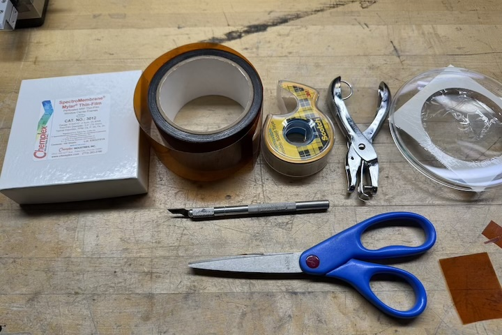
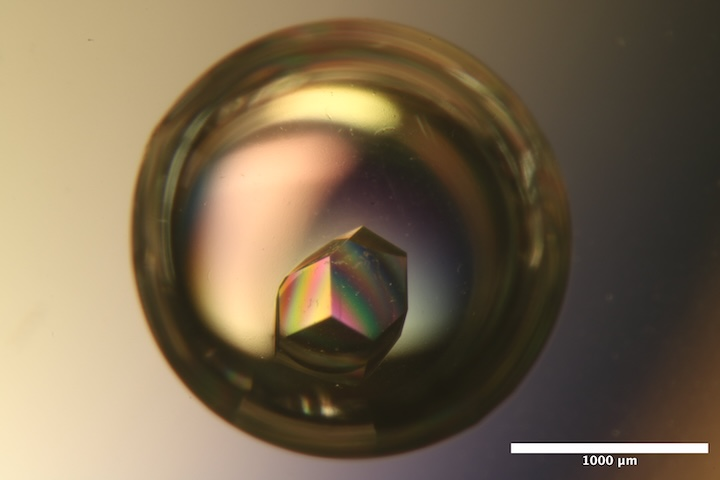
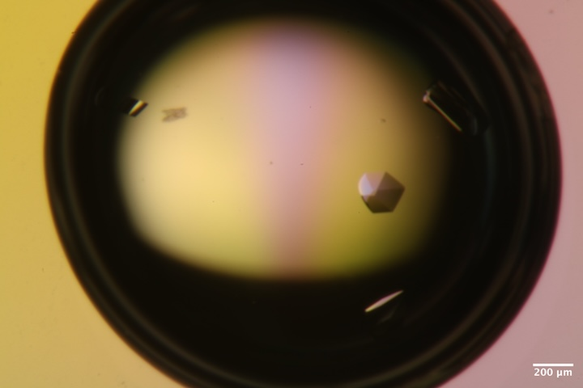
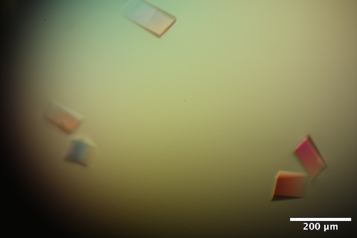

<!-- TO DO: 

- Add references to snapshots for all samples
- Verify sample info

 -->

# 2025-11-19 @ CHESS 7b2

Final CHESS beam time of the 2025-3 run cycle.

## Goals

- Ambient temperature data collection on new samples: R-state ATCase (Sarah), Insulin (Shaheer)
- Cryo data collection on Mac1, DNA
- Test T-jump data collection on Mac1, lysozyme
- Test serial data collection using prototype chip

## Participants

Steve, Marcus, Sarah, Katie, Shaheer & Xiaokun.

Neglected to take our usual group photo, but Xiaokun snapped these of Katie & Sarah:

<div class="grid cards" markdown>

- <br>
Katie and Sarah looping R-state ATCase crystals in the humid chamber

- <br>
Katie and Sarah processing data at id7b2.

</div>

## Data

Root directory at CHESS: `/nfs/chess/raw/2025-3/id7b2/meisburger/20251119`

Root directory on OSN: `s3://diffuse-chess-public/20251119`

## Beamline setup

parameter | value | notes
--- | --- | --- 
X-ray energy | 14 keV @ 0.01% bandwidth | Si 111 channel cut mono inserted
Beam size | 100 µm x 100 µm | slit-defined, no CRL
Flux | 6.86 x 10^10 ph/s | see CHESS nb #3 p. 61, ICol counts ~38,000 / 0.1 s
Background reduction | On-axis mirror with Mo tube, 600 µm ID | same prototype as 10/15 beamtime (no aperture glued on)
Centering camera | top-view and on-axis cameras | Top view: 1.713 µm / pixel at 4x zoom ratio; On axis: 0.740 µm / pixel at 4x zoom ratio 
Beamstop | 700 µm diameter Mo disk suspended on mylar sheet, semi-transparent | At this energy, the bleedthrough was more intense than usual, and there were some faint diffraction rings visible in the image
Data collection software | "MX Collect" (python) & SPEC | The main GUI was the same as last time, except that I added `jump` scan type for T-jump experiments, and `transmission_factor` key to the `<prefix>_scan.json`.
Temperature control |  (various) | Collected at ambient temperature unless noted below

Steve arrived at ~10 am. John I and Tricia C set up the beamline. The flux is comparable to previous visits. Mike C was unable to glue the aperture on the Mo tube successfully, so we're using the on-axis system with an open tube again, similar to 10/15 beamtime. Interestingly, there is not scattering around the beamstop this time. I think the tube is somewhat misaligned with the beam, based on apparent ID according to X-ray scan, and this decreases the effective aperture of the tube.

<div class="grid cards" markdown>

- <br>
Steve constructed a "sheet on sheet" (SOS) style serial chip using some double-sided tape, thick Kapton, a hole punch, and some 2.5 µm this mylar film. 

- <br>
The SOS chip has two halves. A drop containing crystals is added to one mylar surface, and the other half is placed on top (no spacer). The static cling of the mylar is enough to hold the pieces in place.

- <br>
The SOS chip mounted on the goniometer. The prototype scatter guard tube / on-axis viewing mirror is visible on the right.

</div>

## Samples

Name | Sample | Well composition | Drop composition | Notes
--- | --- | --- | --- | --- 
Lysozyme | 50 mg/mL lysozyme in 20 mM NaOAc pH 4.6 | 0.7-1.0 M NaCl, 0.1 M NaOAc pH 4.4 | 2 µL protein + 2 µL well solution | Shaheer's lysozyme tray (9/16/25).
Mac1 | SARS CoV2 NSP3 macrodomain and seed stock from UCSF. 40 mg/mL Mac1 in 150 mM NaCl, 20 mM Tris pH 8, 5% glycerol | 28-38% (w/vol) PEG 3000 + 100 mM CHES (pH 9.5) |     |    |
ATCase | _Escherichia coli_ Aspartate Transcarbamoylase and seed stock. 16 µM holoenzyme in 40 mM Tris pH 7.5, 15 mM MgCl2, 1 mM TCEP, 2 mM PALA | 8% v/v Tacsimate pH 7.0, 5-15% PEG-3350 | 2 µL protein + 1 µL well solution + 1 µL seed stock | R-ATCase tray #1 (10/29/2025). See Sarah H Ando Lab notebook p. 103.
DNA | S2T7-1, S2T7-2, and S2T7-3 single strands at 50 µM in 40 mM tris acetate, 2 mM EDTA | 125 mM tris acetate, 37.5 mM Mg acetate, 1.75 M ammonium sulfate | 6 µL DNA + 6 µL of 40 mM tris acetate, 25 mM Mg acetate, 1.17 M ammonium sulfate | DNA tray #1, "condition 2". See Steve Meisburger Ando Lab notebook #3, pp. 48, 49.
Insulin | | | 

<!-- TO DO: get sample information 

Search for ??

-->


<div class="grid cards" markdown>

- <br>
Well D3 of Shaheer's lysozyme tray (9/16/2025)
Well solution: ?? M NaCl, 0.1 M NaOAc pH = ??.
Drop: 2 uL of lysozyme + 2 uL well solution

- <br>
Well A1 of Shaheer's insulin tray

- <br>
Well A2 of Shaheer's insulin tray

- <br>
Well B1 of Mac1 tray #3 (11/13/25).
Well solution: ??% (w/vol) PEG 3000 + 100 mM CHES (pH 9.5).
Drop: 2 µl protein solution + 1 ul well solution + 1 ul seeds (??)

- <br>
Well B2 of Mac1 tray #3 (11/13/25).
Well solution: ??% (w/vol) PEG 3000 + 100 mM CHES (pH 9.5).
Drop: 2 µl protein solution + 1 ul well solution + 1 ul seeds (??)

- <br>
Well A1 of R-ATCase tray (10/29/25). 
Well solution: 8% v/v Tacsimate pH 7.0, ??% PEG-3350.
Drop: 2 µL protein + 1 µL well solution + 1 µL seed stock.

- <br>
Well A2 of R-ATCase tray (10/29/25). 
Well solution: 8% v/v Tacsimate pH 7.0, ??% PEG-3350.
Drop: 2 µL protein + 1 µL well solution + 1 µL seed stock.

- <br>
Well B1 of R-ATCase tray (10/29/25). 
Well solution: 8% v/v Tacsimate pH 7.0, ??% PEG-3350.
Drop: 2 µL protein + 1 µL well solution + 1 µL seed stock.

- <br>
Well B3 of R-ATCase tray (10/29/25). 
Well solution: 8% v/v Tacsimate pH 7.0, ??% PEG-3350.
Drop: 2 µL protein + 1 µL well solution + 1 µL seed stock.

- <br>
Well A5 of DNA tray #1 (9/19/25).
Well solution: 125 mM tris acetate, 37.5 mM Mg acetate, 1.75 M ammonium sulfate.
Drop: 6 µl DNA solution + 6 µl of 40 mM tris acetate, 25 mM Mg acetate, 1.17 M ammonium sulfate.

</div>

## Data collection, day 1

### 1. Lysozyme

Marcus looped a lysozyme crystal in the humid chamber from well D3 of Shaheer's tray. He used a 400 µm loop and micro RT sleeve with 10 µL well solution in the tip. 

Subdirectory: `lysozyme/calibration_sample`

Snapped images every 30˚: `lys_1_30_30_oac_zoom1.png_{01..12}.png`

| prefix        |   φ0 (deg.) |   φ1 (deg.) |   ∆φ (deg.) |   images |   ∆t (s) |   tf (%) |   d (mm) |   E (keV) |
|---------------|-------------|-------------|-------------|----------|----------|----------|----------|-----------|
| lys_1_5374    |           0 |         360 |         0.1 |     3600 |     0.01 |      100 |      185 |        14 |
| lys_1_bg_5375 |           0 |         360 |         1   |      360 |     0.1  |      100 |      185 |        14 |

!!! note

    Because the meniscus was rather close to the sample, the background was taken through an empty part of the loop, rather than off the tip. There's some water scattering present.

??? info "xia2 processing"

    |                 | lys_1_5374                              |
    |-----------------|-----------------------------------------|
    | Mosaic spread   | 0.014                                   |
    | Resolution      | 1.07                                    |
    | Unit Cell       | [78.43, 78.43, 37.64, 90.0, 90.0, 90.0] |
    | Image range     | [1, 3600]                               |
    | Completeness    | 96.7                                    |
    | Multiplicity    | 20.6                                    |
    | I/sigma         | 25.7                                    |
    | Rpim            | 0.013                                   |
    | Wilson B factor | 16.26                                   |
    | Space group     | P 43 21 2                               |


### 2. Mac1, serial chip

Steve transferred a whole drop of Mac1 crystals (Katie's Mac1 Tray #3, well B1) to the SOS chip. First he pipetted some well solution onto the mylar film, and the scooped up the crystals with a micromesh. The crystals tend to clump together and move when the chip rotates, making it somewhat difficult to ensure that each crystal is exposed only once.

Subdirectory: `mac1/serial/mac1_1`

Took an image using the top-view camera: `mac1_1_chip_tvc_zoom1.png`

And another using the on-axis camera: `mac1_1_oac_zoom1.png_1.png`

Shot several well-isolated crystals (each line is a different crystal).

| prefix         |   φ0 (deg.) |   φ1 (deg.) |   ∆φ (deg.) |   images |   ∆t (s) |   tf (%) |   d (mm) |   E (keV) |
|----------------|-------------|-------------|-------------|----------|----------|----------|----------|-----------|
| mac1_1_5376    |         160 |         180 |         0.1 |      200 |      0.1 |      100 |      185 |        14 |
| mac1_1_5377    |         160 |         180 |         0.1 |      200 |      0.1 |      100 |      185 |        14 |
| mac1_1_5378    |         160 |         180 |         0.1 |      200 |      0.1 |      100 |      185 |        14 |
| mac1_1_5379    |         160 |         180 |         0.1 |      200 |      0.1 |      100 |      185 |        14 |

The chip got caught on the guard aperture when rotating -- should make a smaller chip, or keep it vertical. Because crystals moved a lot, I'm not totally sure that I haven't hit the same crystal twice.

| prefix         |   φ0 (deg.) |   φ1 (deg.) |   ∆φ (deg.) |   images |   ∆t (s) |   tf (%) |   d (mm) |   E (keV) |
|----------------|-------------|-------------|-------------|----------|----------|----------|----------|-----------|
| mac1_1_5380    |         205 |         225 |         0.1 |      200 |      0.1 |      100 |      185 |        14 |
| mac1_1_5381    |         205 |         225 |         0.1 |      200 |      0.1 |      100 |      185 |        14 |
| mac1_1_5382    |         205 |         225 |         0.1 |      200 |      0.1 |      100 |      185 |        14 |
| mac1_1_5383    |         205 |         225 |         0.1 |      200 |      0.1 |      100 |      185 |        14 |
| mac1_1_5384    |         205 |         225 |         0.1 |      200 |      0.1 |      100 |      185 |        14 |
| mac1_1_5385    |         205 |         225 |         0.1 |      200 |      0.1 |      100 |      185 |        14 |
| mac1_1_5386    |         205 |         225 |         0.1 |      200 |      0.1 |      100 |      185 |        14 |
| mac1_1_5387    |         205 |         225 |         0.1 |      200 |      0.1 |      100 |      185 |        14 |
| mac1_1_5388    |         205 |         225 |         0.1 |      200 |      0.1 |      100 |      185 |        14 |
| mac1_1_5389    |         205 |         225 |         0.1 |      200 |      0.1 |      100 |      185 |        14 |

!!! note

    5384 was close to its neighbors -- check for unindexed reflections. 5385 and 5388 were very close to the edge of the chip, is this an issue for background subtraction?

For background measurements, collect from a variety of locations near the crystals, including those with thick water layers, and locations with no liquid present.

| prefix         |   φ0 (deg.) |   φ1 (deg.) |   ∆φ (deg.) |   images |   ∆t (s) |   tf (%) |   d (mm) |   E (keV) |
|----------------|-------------|-------------|-------------|----------|----------|----------|----------|-----------|
| mac1_1_bg_5390 |         205 |         225 |         1   |       20 |      1   |      100 |      185 |        14 |
| mac1_1_bg_5391 |         205 |         225 |         1   |       20 |      1   |      100 |      185 |        14 |
| mac1_1_bg_5392 |         205 |         225 |         1   |       20 |      1   |      100 |      185 |        14 |
| mac1_1_bg_5393 |         205 |         225 |         1   |       20 |      1   |      100 |      185 |        14 |
| mac1_1_bg_5394 |         205 |         225 |         1   |       20 |      1   |      100 |      185 |        14 |
| mac1_1_bg_5395 |         205 |         225 |         1   |       20 |      1   |      100 |      185 |        14 |
| mac1_1_bg_5396 |         205 |         225 |         1   |       20 |      1   |      100 |      185 |        14 |
| mac1_1_bg_5397 |         205 |         225 |         1   |       20 |      1   |      100 |      185 |        14 |
| mac1_1_bg_5398 |         205 |         225 |         1   |       20 |      1   |      100 |      185 |        14 |

!!! note

    5391 is an air bubble? 5392 is through liquid near the chip edge.

Created an atlas image using the on-axis camera at zoom 1. The following SPEC command was used to translate the sample (6 x 6 grid):

```
ctrigger_auto; dmesh spinx -2.5 2.5 5 px -2.5 2.5 5 0.1
```

Saved images: `/mac1/serial/mac1_1/atlas/mac1_1_atlas_oac_zoom1.png_{01..36}.png`

??? info "xia2 processing"

    |                 | mac1_1_5376                             | mac1_1_5377                             | mac1_1_5379                             | mac1_1_5380                             | mac1_1_5381                             | mac1_1_5382                             | mac1_1_5383                             | mac1_1_5384                             | mac1_1_5385                             | mac1_1_5386                             | mac1_1_5387                             | mac1_1_5388                             | mac1_1_5389                            | mac1_1_5378                             |
    |-----------------|-----------------------------------------|-----------------------------------------|-----------------------------------------|-----------------------------------------|-----------------------------------------|-----------------------------------------|-----------------------------------------|-----------------------------------------|-----------------------------------------|-----------------------------------------|-----------------------------------------|-----------------------------------------|----------------------------------------|-----------------------------------------|
    | Mosaic spread   | 0.013                                   | 0.02                                    | 0.024                                   | 0.017                                   | 0.02                                    | 0.033                                   | 0.023                                   | 0.025                                   | 0.028                                   | 0.021                                   | 0.024                                   | 0.023                                   | 0.084                                  | 1.043                                   |
    | Resolution      | 1.04                                    | 1.04                                    | 1.06                                    | 1.05                                    | 1.07                                    | 1.06                                    | 0.0                                     | 0.0                                     | 1.09                                    | 1.07                                    | 1.06                                    | 1.0                                     | 0.0                                    | 0.0                                     |
    | Unit Cell       | [88.44, 88.44, 39.82, 90.0, 90.0, 90.0] | [88.44, 88.44, 39.84, 90.0, 90.0, 90.0] | [88.45, 88.45, 39.84, 90.0, 90.0, 90.0] | [88.43, 88.43, 39.79, 90.0, 90.0, 90.0] | [88.41, 88.41, 39.76, 90.0, 90.0, 90.0] | [88.38, 88.38, 39.67, 90.0, 90.0, 90.0] | [88.41, 88.41, 39.73, 90.0, 90.0, 90.0] | [88.41, 88.41, 39.74, 90.0, 90.0, 90.0] | [88.38, 88.38, 39.65, 90.0, 90.0, 90.0] | [88.44, 88.44, 39.81, 90.0, 90.0, 90.0] | [88.43, 88.43, 39.79, 90.0, 90.0, 90.0] | [88.41, 88.41, 39.72, 90.0, 90.0, 90.0] | [88.35, 88.35, 39.6, 90.0, 90.0, 90.0] | [91.57, 91.57, 44.97, 90.0, 90.0, 90.0] |
    | Image range     | [1, 200]                                | [1, 200]                                | [1, 200]                                | [1, 200]                                | [1, 200]                                | [1, 200]                                | [1, 200]                                | [1, 200]                                | [1, 200]                                | [1, 200]                                | [1, 200]                                | [1, 200]                                | [1, 200]                               | [1, 200]                                |
    | Completeness    | 41.0                                    | 39.6                                    | 39.2                                    | 41.1                                    | 43.1                                    | 40.3                                    | 32.9                                    | 37.0                                    | 49.0                                    | 41.0                                    | 44.1                                    | 37.1                                    | 37.2                                   | 27.7                                    |
    | Multiplicity    | 1.3                                     | 1.3                                     | 1.4                                     | 1.3                                     | 1.3                                     | 1.4                                     | 1.4                                     | 1.3                                     | 1.2                                     | 1.4                                     | 1.3                                     | 1.3                                     | 1.3                                    | 1.7                                     |
    | I/sigma         | 8.0                                     | 6.7                                     | 5.8                                     | 8.8                                     | 7.2                                     | 10.8                                    | 6.6                                     | 5.9                                     | 12.4                                    | 7.0                                     | 5.7                                     | 10.8                                    | 7.0                                    | 0.2                                     |
    | Rpim            | 0.092                                   | 0.138                                   | 0.114                                   | 0.097                                   | 0.097                                   | 0.063                                   | 0.101                                   | 0.119                                   | 0.05                                    | 0.123                                   | 0.14                                    | 0.065                                   | 0.031                                  | 0.94                                    |
    | Wilson B factor | 11.74                                   | 11.7                                    | 11.57                                   | 11.67                                   | 12.72                                   | 13.02                                   | 11.76                                   | 11.19                                   | 12.51                                   | 11.59                                   | 11.62                                   | 11.89                                   | 14.24                                  | 2.97                                    |
    | Space group     | P 43                                    | P 43                                    | P 43                                    | P 43                                    | P 43                                    | P 43                                    | P 43                                    | P 43                                    | P 43                                    | P 43                                    | P 43                                    | P 43                                    | P 43                                   | P 43                                    |


### 3. Insulin 

Shaheer looped crystal from Insulin tray well A1 with 600 µm loop. Crystal size: 670 µm. Used sleeve with 8-9 µL well solution.

Subdirectory: `Insulin/sk_A1`

Saved a crystal image: `sk_A1__1.png`

| prefix        |   φ0 (deg.) |   φ1 (deg.) |   ∆φ (deg.) |   images |   ∆t (s) |   tf (%) |   d (mm) |   E (keV) |
|---------------|-------------|-------------|-------------|----------|----------|----------|----------|-----------|
| sk_A1_5399    |           0 |         360 |         0.1 |     3600 |     0.01 |      100 |      190 |        14 |
| sk_A1_bg_5400 |           0 |         360 |         1   |      360 |     0.1  |      100 |      190 |        14 |

### 4. ATCase

Sarah looped a crystal from the R-state ATCase tray #1, well B3 with a 200 µm loop. Used sleeve with 8 µL well solution.

Subdirectory: `rstate_atcase`

Saved a crystal image: ` b3_1_1.png`

| prefix              |   φ0 (deg.) |   φ1 (deg.) |   ∆φ (deg.) |   images |   ∆t (s) |   tf (%) |   d (mm) |   E (keV) |
|---------------------|-------------|-------------|-------------|----------|----------|----------|----------|-----------|
| rstate_b3_1_5401    |           0 |         360 |         0.1 |     3600 |     0.01 |     47.1 |      300 |        14 |
| rstate_b3_1_bg_5402 |           0 |         360 |         1   |      360 |     0.1  |     47.1 |      300 |        14 |

### 5. Insulin

Shaheer looped a crystal from Insulin Tray well A2. Loop size: 300 µm. Crystal size ~300 µm. Sleeve with 9 µL well solution.

Subdirectory: `Insulin/sk_A2`

Saved a crystal image: `sk_A2__1.png`

| prefix        |   φ0 (deg.) |   φ1 (deg.) |   ∆φ (deg.) |   images |   ∆t (s) |   tf (%) |   d (mm) |   E (keV) |
|---------------|-------------|-------------|-------------|----------|----------|----------|----------|-----------|
| sk_A2_5403    |           0 |         360 |         0.1 |     3600 |     0.01 |     47.1 |      185 |        14 |
| sk_A2_bg_5404 |           0 |         360 |         1   |      360 |     0.1  |     47.1 |      185 |        14 |

??? info "xia2 processing (all Insulin datasets)"

    |                 | sk_A1_5399                              | sk_A2_5403                              |
    |-----------------|-----------------------------------------|-----------------------------------------|
    | Mosaic spread   | 0.005                                   | 0.003                                   |
    | Resolution      | 1.15                                    | 1.18                                    |
    | Unit Cell       | [78.25, 78.25, 78.25, 90.0, 90.0, 90.0] | [78.27, 78.27, 78.27, 90.0, 90.0, 90.0] |
    | Image range     | [1, 3600]                               | [1, 3600]                               |
    | Completeness    | 98.6                                    | 100.0                                   |
    | Multiplicity    | 35.3                                    | 37.3                                    |
    | I/sigma         | 20.0                                    | 12.7                                    |
    | Rpim            | 0.014                                   | 0.02                                    |
    | Wilson B factor | 18.04                                   | 18.72                                   |
    | Space group     | I 2 3                                   | I 2 3                                   |

### 6. ATCase

Katie looped a crystal from R-state Tray #1, well A1. Loop size: 200 µm; crystal size ~100 x 200 µm. Use sleeve with 9 µL well solution.

Subdirectory: `rstate_atcase/a1_1`

Saved a crystal image: `a1_1__1.png`

| prefix       |   φ0 (deg.) |   φ1 (deg.) |   ∆φ (deg.) |   images |   ∆t (s) |   tf (%) |   d (mm) |   E (keV) |
|--------------|-------------|-------------|-------------|----------|----------|----------|----------|-----------|
| a1_1_5405    |           0 |         540 |         0.1 |     5400 |     0.01 |     28.6 |      300 |        14 |
| a1_1_bg_5406 |           0 |         540 |         1   |      540 |     0.1  |     28.6 |      300 |        14 |

### 7. ATCase

Sarah looped a crystal from R-state tray #1, well A2. Loop size: 200 µm. Crystal size: 200 x 300 µm. Use sleeve with ~9 µL well solution.

Subdirectory: `rstate_atcase/a2`

Saved a crystal image: `a2_1_1.png`

| prefix     |   φ0 (deg.) |   φ1 (deg.) |   ∆φ (deg.) |   images |   ∆t (s) |   tf (%) |   d (mm) |   E (keV) |
|------------|-------------|-------------|-------------|----------|----------|----------|----------|-----------|
| a2_5407    |           0 |         540 |         0.1 |     5400 |     0.01 |     47.1 |      300 |        14 |
| a2_bg_5408 |           0 |         540 |         1   |      540 |     0.1  |     47.1 |      300 |        14 |

### 8. ATCase

Sarah looped a hexagon-shaped crystal from R-state tray #1, well B1. Loop size: 150 µm. Crystal size: 150 µm. Use sleeve with 9 µL well solution.

Subdirectory: `rstate_atcase/b1_1`

Saved images every 30˚: `b1_1__{01..12}.png`

| prefix       |   φ0 (deg.) |   φ1 (deg.) |   ∆φ (deg.) |   images |   ∆t (s) |   tf (%) |   d (mm) |   E (keV) |
|--------------|-------------|-------------|-------------|----------|----------|----------|----------|-----------|
| b1_1_5409    |           0 |         360 |         0.1 |     3600 |     0.01 |     36.7 |      300 |        14 |
| b1_1_bg_5410 |           0 |         360 |         1   |      360 |     0.1  |     36.7 |      300 |        14 |

??? info "xia2 processing (all ATCase datasets above)"

    |                 | rstate_b3_1_5401                           | a1_1_5405                                  | b1_1_5409                                  | a2_5407                                  |
    |-----------------|--------------------------------------------|--------------------------------------------|--------------------------------------------|------------------------------------------|
    | Mosaic spread   | 0.037                                      | 0.025                                      | 0.021                                      | 0.078                                    |
    | Resolution      | 3.13                                       | 3.09                                       | 3.02                                       | 3.26                                     |
    | Unit Cell       | [126.55, 152.08, 206.39, 90.0, 90.0, 90.0] | [126.54, 152.11, 206.54, 90.0, 90.0, 90.0] | [126.34, 152.58, 206.39, 90.0, 90.0, 90.0] | [126.46, 152.7, 206.5, 90.0, 90.0, 90.0] |
    | Image range     | [1, 3600]                                  | [1, 5400]                                  | [1, 3600]                                  | [1, 5400]                                |
    | Completeness    | 100.0                                      | 100.0                                      | 100.0                                      | 100.0                                    |
    | Multiplicity    | 13.9                                       | 20.8                                       | 13.9                                       | 20.6                                     |
    | I/sigma         | 4.3                                        | 3.1                                        | 4.3                                        | 5.7                                      |
    | Rpim            | 0.12                                       | 0.121                                      | 0.097                                      | 0.099                                    |
    | Wilson B factor | 83.91                                      | 83.51                                      | 86.1                                       | 98.47                                    |
    | Space group     | P 21 21 21                                 | P 21 21 21                                 | P 21 21 21                                 | P 21 21 21                               |


### 9. ATCase

Sarah looped another hexagon-looking crystal from well B1. Loop and crystal size: 150 µm. Same sleeve.

Subdirectory: `rstate_atcase/b1_2`

| prefix       |   φ0 (deg.) |   φ1 (deg.) |   ∆φ (deg.) |   images |   ∆t (s) |   tf (%) |   d (mm) |   E (keV) |
|--------------|-------------|-------------|-------------|----------|----------|----------|----------|-----------|
| b1_2_5411    |           0 |         360 |         0.1 |     3600 |     0.01 |     47.1 |      300 |        14 |
| b1_2_bg_5412 |           0 |         360 |         1   |      360 |     0.1  |     47.1 |      300 |        14 |

!!! warning 

    The beamstop was not in place during the b1_2_5411 and b1_2_bg_5412 data collections. It was quite far off, Steve had to re-align it using the periscope. Something must be loose in the mounting hardware.

### 10. Mac1 T-jump

Steve returned at 9:45 pm. The plan this evening is to attempt T-jump using Mac1 with paratone N.

The cold stream was placed end-on and chilled to 250 K. We'll jump down from ambient by unblocking the cold stream during data collection.

Steve looped a mac1 crystal from Katie's Mac1 Tray #3, well B2, in the humidity chamber. The crystal was then dipped in paratone N. The cold stream was blocked before mounting, and set to unblock at 5s into data collection (`jump` scan type).

Subdirectory: `mac1/tjump/mac1_2`

Saved 12 images: `mac1_1_atlas_oac_zoom1.pngmac1_2_oac_zoom4_{01..12}.png` (note: this is the actual file name, I made a mistake typing the prefix into the GUI text box)

| prefix                  |   φ0 (deg.) |   φ1 (deg.) |   ∆φ (deg.) |   images |   ∆t (s) |   tf (%) |   d (mm) |   E (keV) | delay (s) | Tf (K)
|-------------------------|-------------|-------------|-------------|----------|----------|----------|----------|-----------|-----------|-----------|
| mac1_2_jump250K_5422    |           0 |         360 |         0.1 |     3600 |     0.01 |      100 |      185 |        14 |         5 |       250 |
| mac1_2_jump250K_bg_5423 |           0 |         360 |         1   |      360 |     0.1  |      100 |      185 |        14 |         5 |       250 |

The initial resolution is only ~1.7 Å. The oil is quite stressful for mac1 apparently.

??? info "xia2 processing"

    Processed 0-50 degree subset (before the T-jump) and 180-230 degrees (after the T-jump)

    |                 | mac1_2_jump250K_5422                    | mac1_2_jump250K_5422                    |
    |-----------------|-----------------------------------------|-----------------------------------------|
    | Mosaic spread   | 0.141                                   | 0.215                                   |
    | Resolution      | 1.44                                    | 1.54                                    |
    | Unit Cell       | [88.22, 88.22, 39.14, 90.0, 90.0, 90.0] | [88.95, 88.95, 39.13, 90.0, 90.0, 90.0] |
    | Image range     | [1, 500]                                | [1800, 2300]                            |
    | Completeness    | 91.6                                    | 91.0                                    |
    | Multiplicity    | 2.1                                     | 2.1                                     |
    | I/sigma         | 9.5                                     | 6.7                                     |
    | Rpim            | 0.066                                   | 0.095                                   |
    | Wilson B factor | 14.59                                   | 13.41                                   |
    | Space group     | P 43                                    | P 43                                    |

    It's interesting that the Wilson B-factor seemed to decrease a bit even though the resolution and mosaicity are worse.

For fun, lets try blocking the cryostream (warm up to ambient) then jump down to 220 K. The cold steam cools at 360 K / hour, so it took a while to pre-cool the cold stream. This is not going to be a useful dataset -- mainly just to check whether ice forms or not.

| prefix                  |   φ0 (deg.) |   φ1 (deg.) |   ∆φ (deg.) |   images |   ∆t (s) |   tf (%) |   d (mm) |   E (keV) | delay (s) | Tf (K)    |
|-------------------------|-------------|-------------|-------------|----------|----------|----------|----------|-----------|-----------|-----------|
| mac1_2_jump220K_5424    |           0 |         360 |         0.1 |     3600 |     0.01 |      100 |      185 |        14 |         5 |       220 |
| mac1_2_jump220K_bg_5425 |           0 |         360 |         1   |      360 |     0.1  |      100 |      185 |        14 |         5 |       220 |

No ice.

Since mac1 doesn't tolerate oil very well, lets try lysozyme instead.

### 11. Lysozyme T-jump

Steve looped a lysozyme crystal from well C5 of Shaheer's tray, and dipped in paratone N. The cold stream is still at 220 K.


Subdirectory: `lysozyme/tjump/lys_2`

| prefix              |   φ0 (deg.) |   φ1 (deg.) |   ∆φ (deg.) |   images |   ∆t (s) |   tf (%) |   d (mm) |   E (keV) | delay (s) | Tf (K)    |
|---------------------|-------------|-------------|-------------|----------|----------|----------|----------|-----------|-----------|-----------|
| lys_2_jump220K_5426 |           0 |         360 |         0.1 |     3600 |     0.01 |      100 |      185 |        14 |         5 |       220 |

The diffraction resolution, again, was very bad. Ice rings showed up after cooling, but were only present in some frames, suggesting that it was surface ice, and not internal ice. Didn't bother with background on this one.

One of the piezo stages stopped moving, so we had to end data collection until it could be repaired.

## Data collection, day 2

Keith and John were able to repair the piezo stage. The problem had something to do with the amplifier card. Thankfully, beamline 4B was not using theirs, and we were able to borrow it for the remainder of the run. Raley collected data during the day (for non-Diffuse Ando Lab beamtime) and Steve returned in the evening after she had finished. 

The setup is similar to day 1, except Steve inserted the CRL, which defocused the beam somewhat and increased the flux. Saved a beam picture using the on-axis camera and centering tool (YAG crystal): `setup/beam_crl_oac_zoom4_1.png`. These are the parameters that have changed since Day 1:

parameter | value | notes
--- | --- | --- 
Beam size | ~40 µm x ~40 µm | CRL
Flux | 1.37 x 10^11 ph/s | see CHESS nb #3 p. 63
Temperature control | cold stream from above, 100 K | standard cryo-MX config.

!!! tip "Back of the envelope dose calculation"

    The flux density is ~12x higher than with no CRL. The flux overall is ~30x lower than with the multilayer mono (i.e. standard cryo-MX). For low dose cryo, we usually operate with 20% transmission and collect for ~30 s. This suggests I should be using about 6x longer exposure times than usual, collecting 3-5 minutes per sample.

The plan is to collect cryo datasets from Mac1 and DNA. 

### 12. Mac1 100K

Steve looped a mac1 crystal from well B1 of Katie's Mac1 Tray #3, to test whether it vitrifies without adding cryoprotectants. Worked in the humidity chamber, and used a sleeve with well solution to transport the sample into the hutch. The sleeve was removed before placing the sample on the goniometer (cold stream blocked using a credit card). The stream was unblocked quickly to freeze the sample.

Subdirectory: `mac1/cryo/mac1_3`

Snapped images every 30˚: `mac1_3_100K_oac_zoom4_{01..12}.png`

| prefix              |   φ0 (deg.) |   φ1 (deg.) |   ∆φ (deg.) |   images |   ∆t (s) |   tf (%) |   d (mm) |   E (keV) |
|---------------------|-------------|-------------|-------------|----------|----------|----------|----------|-----------|
| mac1_3_100K_5478    |           0 |         360 |         0.1 |     3600 |     0.06 |      100 |      185 |        14 |
| mac1_3_100K_bg_5479 |           0 |         360 |         1   |      360 |     0.6  |      100 |      185 |        14 |

The diffraction resolution looks good, except that it appears anisotropic. The end-on view (~90 degrees) is streaky and lower resolution. The spots are fuzzy looking too.

### 13. Mac1 100K

Looped another from the same well.

Subdirectory: `mac1/cryo/mac1_4`

Snapped images every 30˚: `mac1_4_100K_oac_zoom4_{01..12}.png`

| prefix           |   φ0 (deg.) |   φ1 (deg.) |   ∆φ (deg.) |   images |   ∆t (s) |   tf (%) |   d (mm) |   E (keV) |
|------------------|-------------|-------------|-------------|----------|----------|----------|----------|-----------|
| snap_5480        |         335 |             |         0.1 |        1 |     0.1  |      100 |      185 |        14 |
| mac1_4_100K_5481 |           0 |         360 |         0.1 |     3600 |     0.06 |      100 |      185 |        14 |

This appears to be a bit lower resolution than the last one.

??? info "xia2 processing (both mac1 cryo datasets)"

    |                 | mac1_3_100K_5478                        | mac1_4_100K_5481                        |
    |-----------------|-----------------------------------------|-----------------------------------------|
    | Mosaic spread   | 0.16                                    | 0.255                                   |
    | Resolution      | 1.0                                     | 1.07                                    |
    | Unit Cell       | [87.83, 87.83, 38.95, 90.0, 90.0, 90.0] | [87.39, 87.39, 38.39, 90.0, 90.0, 90.0] |
    | Image range     | [1, 3600]                               | [1, 3600]                               |
    | Completeness    | 80.3                                    | 94.1                                    |
    | Multiplicity    | 10.5                                    | 10.6                                    |
    | I/sigma         | 10.4                                    | 4.3                                     |
    | Rpim            | 0.021                                   | 0.042                                   |
    | Wilson B factor | 11.18                                   | 10.86                                   |
    | Space group     | P 43                                    | P 43                                    |

### 14. DNA 100K

Steve looped several DNA crystals from DNA tray #1, well A5. Freezing the DNA crystals directly in mother liquor did not work -- there was too much ice.

Steve mixed up a solution of ethylene glycol and well solution in a 1:1 ratio, and made a drop on the coverslip. After looping a crystal, he quickly dipped it in the cryo solution, then placed the loop within a sleeve for transport to the hutch.

Subdirectory: `dna/cryo/dna_1`

Snapped images every 30˚: `dna_1_100K_oac_zoom4_{01..12}.png`

| prefix             |   φ0 (deg.) |   φ1 (deg.) |   ∆φ (deg.) |   images |   ∆t (s) |   tf (%) |   d (mm) |   E (keV) |
|--------------------|-------------|-------------|-------------|----------|----------|----------|----------|-----------|
| dna_1_100K_5486    |           0 |         360 |         0.1 |     3600 |     0.06 |      100 |      185 |        14 |
| dna_1_100K_bg_5487 |           0 |         360 |         1   |      360 |     0.6  |      100 |      185 |        14 |
| dna_1_100K_5488    |          20 |             |         0   |        1 |    10    |      100 |      185 |        14 |
| dna_1_100K_bg_5489 |          20 |             |         0   |        1 |    10    |      100 |      185 |        14 |

!!! note

    5488 and 5489 are long exposures (no rotation). I was curious what features are visible at high resolution, if any. This may require background subtraction to properly visualize.

### 15. DNA 100K

Looped another. This is quite a large crystal, but it's sitting on a loop with a big gob of cryo hanging off the bottom. Background subtraction will be tricky.

Subdirectory: `dna/cryo/dna_2`

Snapped images every 30˚: `dna_2_100K_oac_zoom4_{01..12}.png`

| prefix             |   φ0 (deg.) |   φ1 (deg.) |   ∆φ (deg.) |   images |   ∆t (s) |   tf (%) |   d (mm) |   E (keV) |
|--------------------|-------------|-------------|-------------|----------|----------|----------|----------|-----------|
| collect_5498       |           0 |         360 |         0.1 |     3600 |     0.06 |      100 |      185 |        14 |
| dna_2_100K_bg_5499 |           0 |         360 |         1   |      360 |     0.6  |      100 |      185 |        14 |

!!! note

    The first sample should be named `dna_2_100K_5498`. I forgot to change the prefix after restarting the software.

Next, take a shot through the gob of ethylene glycol (EG) cryo solution hanging off the bottom of the loop, and again off the tip of the loop. This might be useful for background corrections.

| prefix             |   φ0 (deg.) |   φ1 (deg.) |   ∆φ (deg.) |   images |   ∆t (s) |   tf (%) |   d (mm) |   E (keV) |
|--------------------|-------------|-------------|-------------|----------|----------|----------|----------|-----------|
| eg_100K_5500       |         210 |             |         0   |        1 |     0.6  |      100 |      185 |        14 |
| eg_100K_bg_5501    |         210 |             |         0   |        1 |     0.6  |      100 |      185 |        14 |

??? info "xia2 processing (both DNA datasets)"

    |                 | dna_1_100K_5486                            | collect_5498                            |
    |-----------------|--------------------------------------------|-----------------------------------------|
    | Mosaic spread   | 0.208                                      | 0.168                                   |
    | Resolution      | 4.21                                       | 4.0                                     |
    | Unit Cell       | [104.91, 104.91, 91.02, 90.0, 90.0, 120.0] | [104.6, 104.6, 93.6, 90.0, 90.0, 120.0] |
    | Image range     | [1, 3600]                                  | [1, 3600]                               |
    | Completeness    | 100.0                                      | 100.0                                   |
    | Multiplicity    | 10.5                                       | 10.6                                    |
    | I/sigma         | 14.3                                       | 23.5                                    |
    | Rpim            | 0.015                                      | 0.01                                    |
    | Wilson B factor | 251.25                                     | 233.38                                  |
    | Space group     | R 3                                        | R 3                                     |

<!-- TO DO: REPEAT WITH INTEGRATION CUT OF AT 3 ANGSTROM INSTEAD OF 4 -->

!!! success "Declaring victory. Done for 2025."