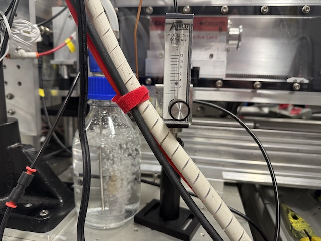
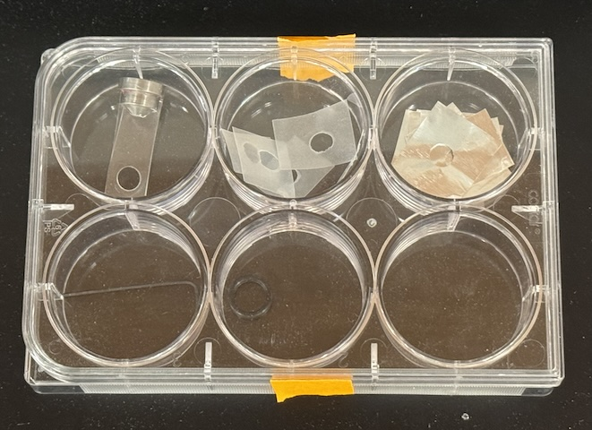
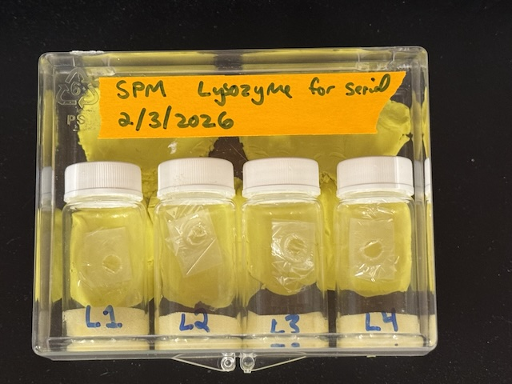
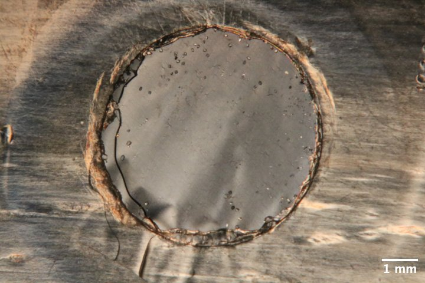

# 2026-02-04 @ CHESS 7b2

First CHESS beam time of the 2026-1 run cycle.

## Goals

- Flux measurement using diode from ALS
- Evaluate in-situ chip prototype for serial data collection (lysozyme in agarose sandwiched between mylar sheets)

## Participants

Steve (Ando lab), with support from John I, Tricia C, and Mike C (CHESS)

-  
Steve mounting a sample on the goniometer at beamline id7b2.

## Data

Root directory at CHESS: `/nfs/chess/raw/2026-1/id7b2/meisburger/20260204`

Root directory on OSN: `s3://diffuse-chess-public/20260204`

## Beamline setup

parameter | value | notes
--- | --- | ---
X-ray energy | 14 keV @ 0.01% bandwidth | Si 111 channel cut mono inserted
Beam size | 100 µm x 100 µm | Slit-defined, no CRL. Adjusted later to match crystal size (20 x 20, 50 x 50, etc.)
Flux | 6.4 x 10^10 ph/s | see CHESS nb #3 p. 71
Background reduction | On-axis mirror with Mo tube, with SS tube inserted (300 µm ID) | This is a new prototype guard aperture from Mike C.
Centering camera | top-view and on-axis cameras | Top view: 1.713 µm / pixel at 4x zoom ratio; On axis: 0.740 µm / pixel at 4x zoom ratio
Beamstop | 700 µm diameter Mo disk suspended on mylar sheet, semi-transparent | At this energy, the bleedthrough produces faint diffraction rings
Data collection software | "MX Collect" (python) & SPEC | No changes since last time
Temperature control |  none |

Steve arrived around 11 am with samples. John and Tricia completed most of the alignment beforehand. Steve did final tune up.

The beam was more unstable than usual, with a hot spot that vibrated up and down within the 100 µm aperture. Steve defocused the mirror slightly, which created a somewhat more uniform beam. However, the intensity variations continued to be a problem. When comparing images with one another, the ICol counts (recorded in SPEC) should be compared. Beamstop bleedthrough might also be used for a crude normalization.

The new guard aperture was not perfect -- there are still some scattering features around the main beam (mostly slit scattering), however they are at low enough angles to be mostly within the beamstop shadow, and can be masked out without affecting data quality.

-  
Diode for flux measurement. This consists of a PIN diode mounted on a MiTeGen serial chip goniometer base. The whole assembly is covered with black heatshrink tubing to hold the diode in place and block light.

-  
Chip mounted on the goniometer. The clear tube on the right directs a flow of humid air.

-  
A gas bubbler provided a humid air stream for the samples.

## Samples

Crystals were grown on chip (batch mode).

Name | Sample | Crystallization reagent | Batch recipe | Notes
--- | --- | --- | --- | ---
Lysozyme | 50 mg/mL lysozyme in 100 mM NaOAc pH 4.6 | 30% w/v PEG mme 5000, 1 M NaCl, 50 mM NaOAc pH 4.6 | 40 µL reagent + 40 µL protein + 10 µL 2% agarose | Chips L1, L2, L3, and L4 (2/3/2026). See Steve's notebook p. 52

The chips consisted of a parafilm gasket (~6 mm hole) and two pieces of 2.5 µm mylar film. The first film was placed on a glass microscope slide, the gasket was placed on top, and then 2 µL of batch solution was pipetted into the gasket hole. The second film was placed on top using tweezers. To seal the chip, an o-ring with diameter somewhat larger than the gasket hole (type 2-011) was placed on top, and another glass slide was pressed down on the o-ring, indenting the parafilm and making a tight seal against the film. The o-ring was removed, and then the chip was placed in a glass vial with a moistened piece of foam. Crystals appeared soon after, and continued to grow overnight.

-  
Materials for chip contstruction. First row (left to right): goniometer base chip holder, parafilm gaskets, aluminum gaskets (not used). Second row: allen key for goniometer base, o-ring for indenting gasket/window assembly.

  
Four chips were brought to CHESS in glass vials with moistened foam to maintain humidity. They were prepared identically (lysozyme in agarose gel), and labeled L1, L2, L3, and L4. No crystals appeared in chip L3, so no data were collected from that sample.

 
Microscope image of lysozyme chip L1, with crossed polarizers to enhance contrast of the lysozyme crystals.

 
Microscope image of lysozyme chip L2.

 
Zoomed in view of the crystals in chip L2 (upper-right region of the chip). The crystals are fairly large (20-50 µm) and the orientations appear to be random.

 
Microscope image of lysozyme chip L4.

## Flux measurement

!!! info "Background"

    Normally, at 7b2 we use a standard N2-filled ion chamber for flux measurements. During the Astera Retreat in January, James H gave me a selection of silicon PIN diodes to try. The PIN diode method for flux determination is described in this paper: <https://pmc.ncbi.nlm.nih.gov/articles/PMC2651761/>

    Basically, you measure the X-ray induced photocurrent and convert this into flux using a formula taking into account the diode thickness, absorption by other stuff in the beam, energy to create an electron-hole pair, and X-ray photon energy. The paper describes an interesting method to get the effective diode thickness by tilting it in the beam (i.e. varying the path length).

I attached the diode to a goniometer base in order to record the photocurrent while varying the angle relative to the beam. I also placed the standard ion chamber ("I2") downstream of the diode, to record the transmitted intensity. Another ion chamber upstream ("ICol") recorded the incident intensity. In order to account for incident intensity fluctuations, I set "ICol" to the monitor, and count up to the monitor in SPEC.

The ion chambers and diodes were connected to SRS current amplifiers with gain settings of 50 nA/V (I2) and 10 µA/V (Diode). The SPEC counter-timer board has a conversion of 10 V = 1 MHz (in other words, 100,000 counts per second = 1 V).

I fiddled around with this for a while, and eventually got some good measurements. The not-so-good measurements are described in the hand-written log book, here I'm recording the final result.

### Normal incidence

By rotating the diode, I found that a phi angle of 10˚ gave maximum transmission. I took measurements at three locations:

1. At the center of the diode (spinx: 32.2 mm)
2. Off the tip of the diode -- through the heat-shrink tubing, but not the silicon  (spinx: 34.0 mm)
3. Off the tip of the assembly -- nothing in the beam (spinx: 46.2 mm)

Recorded counts, from SPEC file `diode/diode_7.spec`:

location name | I2 | Diode | TF\*
---|---|---|---
1 | 15835 | 255665 | 20.52%
2 | 56060 | 424    | 72.64%
3 | 77177 | 64     | 100%

\*The transmission factor (TF) column was calculated from the I2 counts relative to position 3.

!!! tip "Flux calculations"

    First, according to the ion chamber I2 reading at position 3, the flux is 6.56 x 10^10 ph/s (calculated using <https://www.chess.cornell.edu/userstechnical-resourcescalculators/ion-chamber-flux-calculator>).

    For the diode, we need to correct for absorption by the heatshrink, and estimate the diode thickness.

    Since total transmission is the product of transmission factors from the diode and the heatshrink, we can divide by the heatshrink transmission factor to get the diode alone: 28.25% (1.264 attenuation lengths).

    At 14 keV, the attenuation length of silicon is 360.816 µm (from <https://henke.lbl.gov/optical_constants/atten2.html>). Based on absorption, then, the nominal thickness is 456 µm.

    The number of charge carriers generated per photon absorbed is 14,000 eV / 3.66 eV = 3825. The fraction of incident photons absorbed by the silicon is sqrt(0.7264)\*(1 - 0.2825) = 0.6115. So there are 2339 e-h pairs generated on average per incident photon. A Coulomb is 6.24e18 carriers. So a photon per second would generate 2339/6.24e18 = 3.748e-16 A = 3.748e-10 µA of current.

    The observed diode current is (255665 s^-1) \* (1 V / 100000 s^-1) \* 10 µA/V = 25.56 µA

    The flux according to the diode is 25.56/3.748e-10 = 6.82 x 10^10 ph/s.

Calculated flux:

- **Diode:** 6.82 x 10^10 ph/s
- **Ion chamber:** 6.56 x 10^10 ph/s

These methods agree fairly well (the difference is <5%).

### Tilt series

I measured the same thing with the diode tilted by + 25˚ (phi = 10 + 25 = 35˚)

From SPEC file `diode/diode_3.spec`:

location name | I2 | Diode | transmission factor
---|---|---|---
1 | 14027 | 260473 | 18.18%
2 | 55385 | 427    | 71.51%
3 | 77455 | 64     | 100%

Transmission of diode alone: 25.42%  (1.370 path lengths)

I measured the same thing with the diode tilted by - 25˚ (phi = 10 - 25 = -15˚)

From SPEC file `diode/diode_4.spec`:

location name | I2 | Diode | transmission factor
---|---|---|---
1 | 12952 | 263954 | 16.72%
2 | 54241 | 436    | 70.03%
3 | 77451 | 64     | 100%

Transmission of diode alone: 23.88%  (1.432 path lengths)

!!! warning

    In theory, the tilt series can be used to independently obtain the thickness, however I don't think I tilted the diode far enough to get a robust value. However, since I measured the transmission directly using an ion chamber in this case, it's not necessary.

## Data collection

For a quick reference, I took a detector image with no sample in the beam (just air).

Subdirectory: `setup/`

| prefix   |   φ0 (deg.) |   ∆φ (deg.) |   images |   ∆t (s) |   tf (%) |   d (mm) |   E (keV) |
|----------|-------------|-------------|----------|----------|----------|----------|-----------|
| air_582  |           0 |           0 |        1 |        1 |      100 |      185 |        14 |

### #1 Lysozyme chip L1

Placed chip L1 (lysozyme in agarose gel) in the holder, and mounted on the goniometer (in air).

Subdirectory: `lysozyme/chip_L1`

Saved a couple of on-axis camera images at 1x and 4x zoom: `chip_L1_1x.png` and `chip_L1_4x.png`

The crystals are 10-20 µm in size. Let's set the beam size to match.

!!! info "Set beam-defining slits (s3) to 20 µm x 20 µm"

First, I need to determine a reasonable dose. Let's choose a sacrifical crystal and collect data for 40 seconds.

Subdirectory: `lysozyme/chip_L1/test_crystal`

Crystal image: `chip_L1_test_crystal_4x.png`

| prefix     |   φ0 (deg.) |   φ1 (deg.) |   ∆φ (deg.) |   images |   ∆t (s) |   tf (%) |   d (mm) |   E (keV) |
|------------|-------------|-------------|-------------|----------|----------|----------|----------|-----------|
| lys_L1_583 |          -5 |           5 |        0.1  |      100 |      0.4 |      100 |      185 |        14 |

This looks good, but the mosaicity is definitely less than 0.1˚, and I see some spot fading in later frames (radiation damage). Let's try smaller oscillation width, and cut the dose in half (20 seconds total exposure time).

| prefix     |   φ0 (deg.) |   φ1 (deg.) |   ∆φ (deg.) |   images |   ∆t (s) |   tf (%) |   d (mm) |   E (keV) |
|------------|-------------|-------------|-------------|----------|----------|----------|----------|-----------|
| lys_L1_584 |          -5 |           5 |        0.05 |      200 |      0.1 |      100 |      185 |        14 |

These parameters look acceptable. Proceed with data collection.

Subdirectory: `lysozyme/chip_L1/collect`

Proceed around the chip in a counter-clockwise direction, collect a 10˚ wedge from each reasonably-sized crystal that is well-separated from its neighbors.

| prefix     |   φ0 (deg.) |   φ1 (deg.) |   ∆φ (deg.) |   images |   ∆t (s) |   tf (%) |   d (mm) |   E (keV) |
|------------|-------------|-------------|-------------|----------|----------|----------|----------|-----------|
| \*lys_L1_585 -- lys_L1_700 |          -5 |           5 |        0.05 |      200 |      0.1 |      100 |      185 |        14 |

\*116 datasets were collected in total from this chip, all with the same parameters.

Some notes: dataset 591 was near the chip edge, 630 had a weird solvent ring (perhaps protein precipitation?)

I created atlas images of the chip at 1x zoom and 4x zoom. The images are:

| subdirectory | image prefix | number of images  | SPEC command |
|--------------|--------|-------------------|-----|
| lysozyme/chip_L1/atlas_1x          | chip_L1        |             36 | `mesh spinx -2.50004 2.49996 5 py -2.5 2.5 5  0.1` |
| lysozyme/chip_L1/altas_1x_defocus1 | chip_L1        |             36 | `mesh spinx -2.49999 2.50001 5 py -2.4998 2.5002 5  0.1` |
| lysozyme/chip_L1/atlas_4x_defocus1 | chip_L1        |           441  | `mesh spinx -2.49998 2.50002 20 py -2.4996 2.5004 20  0.1` |

!!! warning

    I forgot to create a new SPEC file before running the atlas commands, so the motor positions are saved in scans 2, 3, and 4 in `lysozyme/chip_L1/collect/lys_L1_700.spec`

5:40 pm -- Steve departed for dinner. He left the chip on the goniometer to see how much it dries out.

9:42 pm -- Steve returned to CHESS. Chip L1 is completely dried out after 4 hours in air.

!!! warning

    It's likely some dehydration occured during data collection on chip L1. It would be a good idea to check whether the lattice parameters vary systematically during data collection.

### #2 Lysozyme chip L4

To mitigate the possible dehydration during data collection, Steve assembled a humid gas stream consisting of a ~1 cm tube directed end-on at the goniometer. The humid air was generated by bubbling dry compressed air into water at a rate of ~3 SCFM.

Steve placed chip L4 on the holder and mounted it on the goniometer. The chip has a relatively small number of large crystals near the edge of the gasket.

!!! info "Set beam-defining slits (s3) to 50 µm x 50 µm"

Collected data as before.

Subdirectory: `lysozyme/chip_L4/collect`

| prefix        |   φ0 (deg.) |   φ1 (deg.) |   ∆φ (deg.) |   images |   ∆t (s) |   tf (%) |   d (mm) |   E (keV) |
|---------------|-------------|-------------|-------------|----------|----------|----------|----------|-----------|
| \*lys_L4_702 -- lys_L4_717    |          -5 |           5 |        0.05 |      200 |      0.1 |      100 |      185 |        14 |

\*16 crystal datasets were collected in total from this chip, all with the same parameters.

Notes: some of the crystals appeared to be moving around during data collection, for instance dataset 705.

Next, collect a series of backgrounds from various locations

| prefix        |   φ0 (deg.) |   φ1 (deg.) |   ∆φ (deg.) |   images |   ∆t (s) |   tf (%) |   d (mm) |   E (keV) |
|---------------|-------------|-------------|-------------|----------|----------|----------|----------|-----------|
| \*lys_L4_bg_718 -- lys_L4_bg_727 |          -5 |           5 |        1    |       10 |      2   |      100 |      185 |        14 |

\*10 background datasets were collected in total from this chip, all with the same parameters.

!!! note "Matching crystal and background datasets?"

    The motor positions (spinx, py) are stored in the SPEC file corresponding to each image prefix, and these could be used to match a crystal dataset with its nearest background dataset(s).

Rather than choose backgrounds manually, perhaps we could collect backgrounds on a grid, and do some kind of interpolation to find backgrounds at each crystal position?

To test this idea, I set up a rectangular grid scan with 0.5 mm steps covering the gasket hole.

!!! warning
    In the corners of this scan, the beam passes through the parafilm and plastic holder material. These points should be excluded from analysis.

Subdirectory: `lysozyme/chip_L4/grid_scan`

| prefix          |   φ0 (deg.) |   φ1 (deg.) |   ∆φ (deg.) |   images |   ∆t (s) |   tf (%) |   d (mm) |   E (keV) |
|-----------------|-------------|-------------|-------------|----------|----------|----------|----------|-----------|
| \*lys_L4_grid_728 |           0 |           0 |           0 |        1 |        1 |      100 |      185 |        14 |

\*These are the collection parameters for each point in the scan. There were 126 points total (see SPEC file for motor positions).

For each point in the scan, a camera image was recorded (synchronized with the X-ray detector trigger), named `chip_L4_grid*.png` in the same directory.

!!! warning "Oops, I made a mistake setting the scan parameters, the grid is skewed in a strange way"

### #3 Lysozyme chip L2

I saved chip L2 for last, because it has a large number of relatively large crystals in it. Let's try collecting a lot of data.

Placed chip L2 in the sample holder and mounted it on the goniometer, within the humid stream.

Subdirectory: `lysozyme/chip_L2/collect`

| prefix     |   φ0 (deg.) |   φ1 (deg.) |   ∆φ (deg.) |   images |   ∆t (s) |   tf (%) |   d (mm) |   E (keV) |
|------------|-------------|-------------|-------------|----------|----------|----------|----------|-----------|
| \*lys_L2_729 -- lys_L2_798 |          -5 |           5 |        0.05 |      200 |      0.1 |      100 |      185 |        14 |

\*70 crystal datasets were collected in total from this chip, all with the same parameters.

Notes: the crystal appeared to move slightly during some data collections, for instance dataset 734.

Let's set up a fine grid scan for the backgrounds / visual atlas.

!!! note "Poor sample lighting during data collection"

    During data collection, the detector shield drops down and we lose the reflective backlight. I set up a front light to at least highlight the crystals on the chip. Images from this setup are pretty gnarly -- lots of haze caused by light reflecting from the plastic holder. Could use some work.

Subdirectory: `lysozyme/chip_L2/grid_scan`

Grid scan covering a 5 mm x 5 mm area with ~200 µm steps.

| prefix     |   φ0 (deg.) |   φ1 (deg.) |   ∆φ (deg.) |   images |   ∆t (s) |   tf (%) |   d (mm) |   E (keV) |
|------------|-------------|-------------|-------------|----------|----------|----------|----------|-----------|
| \*lys_L2_799 |           0 |           0 |           0 |        1 |        1 |      100 |      185 |        14 |

\*These are the collection parameters for each point in the scan. There were 676 points total (see SPEC file for motor positions).

Camera images at 4x zoom were saved at each point in the scan, `chip_L2_4x*.png`, in the same directory.

!!! success "Done!"
