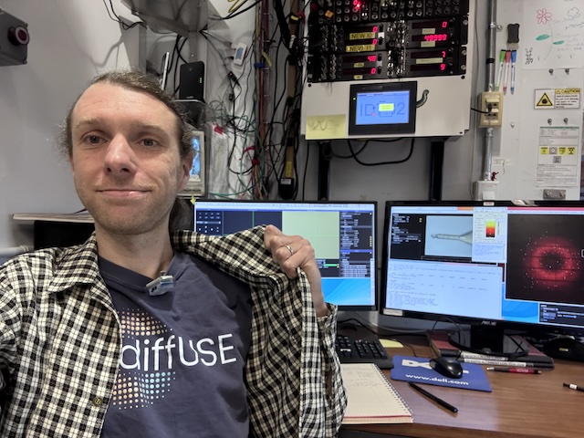
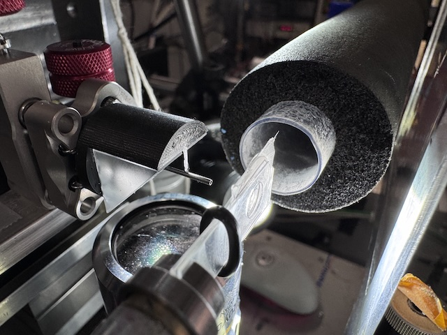
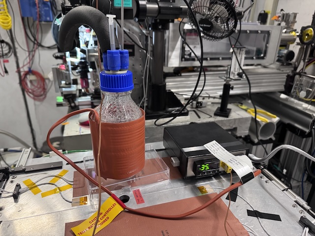
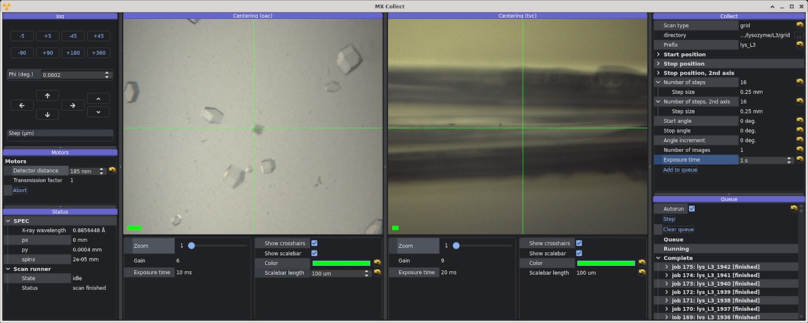
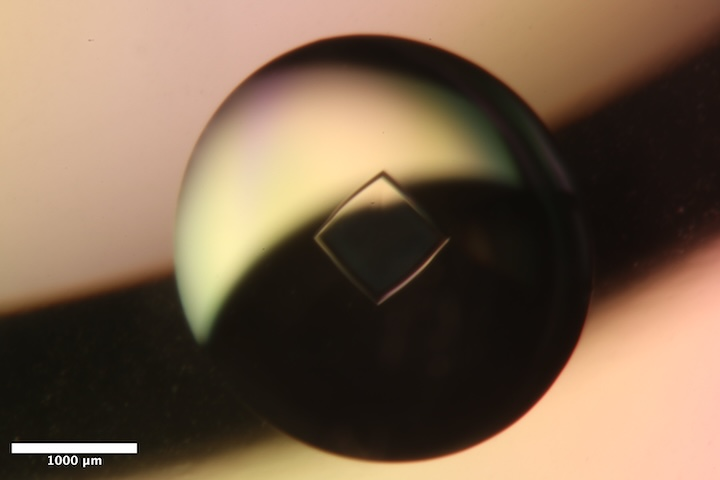
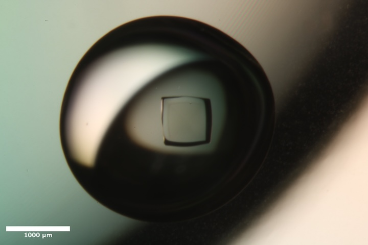
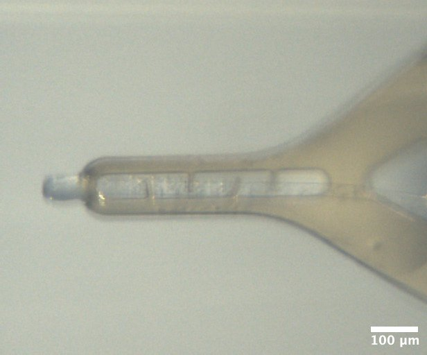
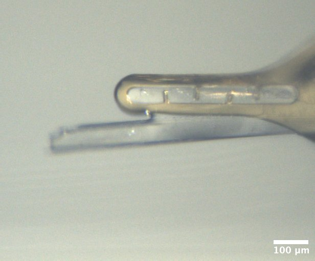
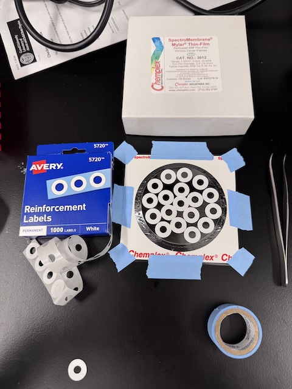
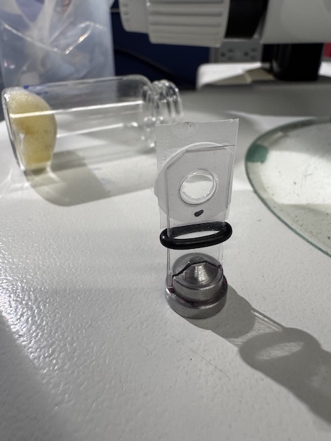

# 2026-02-18 @ CHESS 7b2

Second CHESS beam time of the 2026-1 run cycle.

## Goals

- Screening mac1 C2 crystals
- Further data collection on large insulin crystals
- Evaluate latest iteration of serial sheet-on-sheet "chip" with lysozyme grown in-situ in 0.2% and 2% agarose gel

## Participants

Steve (Ando lab), with support from John I & Tricia C (CHESS)

-  
Nice shirt, Steve!

## Data

Root directory at CHESS: `/nfs/chess/raw/2026-1/id7b2/meisburger/20260218`

Root directory on OSN: `s3://diffuse-chess-public/20260218`

## Beamline setup

parameter | value | notes
--- | --- | ---
X-ray energy | 14 keV @ 0.01% bandwidth | Si 111 channel cut mono inserted
Beam size | 100 µm x 100 µm | Slit-defined, no CRL.
Flux | 7.86 x 10^10 ph/s | see CHESS nb #3 p. 76
Background reduction | On-axis mirror with Mo tube only (no aperture) | There is a new prototype aperture from Mike C, but we didn't have time to try it.
Centering camera | top-view and on-axis cameras | Top view: 1.713 µm / pixel at 4x zoom ratio; On axis: 0.740 µm / pixel at 4x zoom ratio
Beamstop | 700 µm diameter Mo disk suspended on mylar sheet, semi-transparent | At this energy, the bleedthrough produces faint diffraction rings
Data collection software | "MX Collect" (python) & SPEC | No changes since last time
Temperature control |  none | A humid gas stream was inserted for the chip-based data collection, which may have eleveted the sample temperature (see below).

Steve arrived around 10 am with samples and set up a workspace. John and Tricia finished alignment around 11 am. Steve aligned the on-axis mirror / aperture assembly, beamstop, and cameras. The beamline was ready by 3 pm.

Last time, we observed some beam instability that resulted in fluctuating intensities. This time the stability was better (normal?), possibly due to improved alignment. The flux remained constant during data collection.

-  
Chip mounted on the goniometer. The X-ray beam comes from the left. The nozzle on the right directs a flow of humid air across the chip.

-  
A gas bubbler provided a humid air stream for the samples. The reservoir was heated using a beaker heater (orange thing wrapped around the bottle). The temperature was measured using a thermocouple probe inserted into the bottle, and regulated digitally (black box on the right with green alphanumeric display). The gas flow was controlled using a needle valve and floating ball meter reading in SCFM (mounted on an optical post, in the background on the right-hand side of the image). A stream of small bubbles was maintained in the bottle using a sintered diffuser (not shown).

-  
Screenshot of beamline control software MX Collect during data collection from serial chips. The image on the left is a live view from the on-axis camera. The image on the right is the top-view camera, which sees the chip edge-on.

## Samples

Samples for single-crystal data collection were grown in 24-well hanging-drop vapor diffusion trays:

Name | Sample | Well composition | Drop composition | Notes
--- | --- | --- | --- | ---
Insulin | 16.4 mg/mL bovine insulin in 20 mM Na~2~HPO~4~ (pH 10.2), 10 mM EDTA | 225-275 mM Na~2~HPO~4~/Na~3~PO~4~ (pH 10.2), 10 mM EDTA | 4 µL protein solution + 4 µL well solution | Insulin tray #1 (11/6/2025). See Shaheer K Ando Lab notebook p. 17
Mac1 | SARS CoV2 NSP3 macrodomain "C2" construct expressed and purified at Cornell. 15 mg/mL Mac1 in 150 mM NaCl, 20 mM Tris pH 8, 5% glycerol, 2 mM DTT | 22-32% (w/vol) PEG 4000, 100 mM Tris (pH 8.3-8.6), 100 mM Na acetate | 2 µL protein + 1 µL well solution + 1 µL seeds | Mac1 C2 #2 (1/29/2026) and Mac1 C2 #4 (2/12/2026). See Katie L Ando Lab notebook pgs. 27, 34 |

-  
Well B1 of Insulin tray #1 (11/6/2025).
Well solution: 225 mM Na~2~HPO~4~/Na~3~PO~4~ pH 10.2, 10 mM EDTA.
Drop: 4 µL protein solution + 4 µL well solution.

-  
Well B3 of Insulin tray #1 (11/6/2025).
Well solution: 275 mM Na~2~HPO~4~/Na~3~PO~4~ pH 10.2, 10 mM EDTA.
Drop: 4 µL protein solution + 4 µL well solution.

-  
Mac1 crystal from well A5 of Katie's C2 tray #2 (1/27/2026).
Well solution: 22% (w/vol) PEG 4000, 100 mM Tris (pH 8.3), 100 mM Na acetate
Drop: 2 µL protein + 1 µL well solution + 1 µL seeds

-  
Mac1 crystal from well B5 of Katie's C2 tray #4 (2/12/2026).
Well solution: 32% (w/vol) PEG 4000, 100 mM Tris (pH 8.6), 100 mM Na acetate
Drop: 2 µL protein + 2 µL well solution

Samples mounted on chips were grown in-situ (batch mode):

Name | Sample | Crystallization reagent | Batch recipe | Notes
--- | --- | --- | --- | ---
Lysozyme in 0.2% agarose | 50 mg/mL lysozyme in 100 mM NaOAc pH 4.6 | 30% w/v PEG mme 5000, 1 M NaCl, 50 mM NaOAc pH 4.6 | 40 µL reagent + 40 µL protein + 10 µL 2% agarose | Chips L1, L2, L3, and L4 (2/16/2026). See Steve's notebook #3 p. 55
Lysozyme in 2% agarose | 100 mg/mL lysozyme in 100 mM NaOAc pH 4.6 | 30% w/v PEG mme 5000, 1 M NaCl, 50 mM NaOAc pH 4.6 | 40 µL reagent + 20 µL protein + 30 µL 6% agarose | Chips L5, L6, L7, L8 (2/17/2026). See Steve's notebook #3 p. 57

The chips consisted of a parafilm gasket (~6 mm hole) and two pieces of 2.5 µm mylar film. The assembly procedure was the same as last time ([2026-02-04 @ CHESS 7b2](20260204-chess.md)), except that the mylar windows were pre-tensioned and supported by a thin adhesive-backed frame, described below.

-  
The 2.5 µm thick mylar film was pre-tensioned by taping the frame over the top of round glass disk. Adhesive-backed window frames (aka "Reinforcement Labels") were arranged in a non-overlapping pattern on the mylar, and then individual windows were cut out using scissors.

-  
Prior to data collection, the chips were stored in glass vials with damp foam to prevent dehydration (visible in background of image). The chip is transferred to a magnetic goniometer base, held between two thin plastic sheets. The o-ring slides upward to increase clamping force.

## Data collection

For test samples, I'm going to use Shaheer's Insulin tray. There are a couple of wells containing ~800 µm diameter crystals that look great, despite the age of the tray (3 months). I'm curious if I can get better signal-to-noise and data quality by distributing the dose with a vector scan and combining datasets from two crystals.

### 1. Insulin

Looped a chunky crystal from well B1 of Shaheer's 2025/11/6 Insulin tray with a 600 µm DT loop, and placed in a sleeve with 10 µL of well solution.

Subdirectory: `insulin/insulin_1`

Saved snapshots using the TVC and OAC every 30˚ (12 snaps, `ascan phi 0 330 11 .1`): `insulin_1_oac_1x_{01..12}.png`, `insulin_1_tvc_2x_{01..12}.png`.

First let's do a radiation damage test on one part of the crystal (narrow rotation, and repeat on the same spot).

| prefix            |   φ0 (deg.) |   φ1 (deg.) |   ∆φ (deg.) |   images |   ∆t (s) |   tf (%) |   d (mm) |   E (keV) |
|-------------------|-------------|-------------|-------------|----------|----------|----------|----------|-----------|
| insulin_1_1795    |         245 |         295 |        0.1  |      500 |     0.01 |      100 |      185 |        14 |
| insulin_1_1796    |         245 |         295 |        0.1  |      500 |     0.01 |      100 |      185 |        14 |

Xia2 says the mosaic spread is 0.004˚ (sweep 1), 0.004˚ (sweep 2). This gave a complete dataset at 1.2 Å resolution, and no sign of damage from B-decay (~ 1 Å^2^ total)

Now, lets try a vector scan, avoiding the region that we just dosed.

| prefix            |   φ0 (deg.) |   φ1 (deg.) |   ∆φ (deg.) |   images |   ∆t (s) |   tf (%) |   d (mm) |   E (keV) |
|-------------------|-------------|-------------|-------------|----------|----------|----------|----------|-----------|
| insulin_1_1797    |           0 |         720 |        0.05 |    14400 |     0.01 |      100 |      185 |        14 |
| insulin_1_bg_1798 |           0 |         720 |        0.5  |     1440 |     0.1  |      100 |      185 |        14 |

??? info "xia2 processing"

    Ran xia2 with two different image ranges: first 90˚ and all 720˚.

    |                 | insulin_1_1797                       | insulin_1_1797                          |
    |-----------------|--------------------------------------|-----------------------------------------|
    | Mosaic spread   | 0.007                                | 0.012                                   |
    | Resolution      | 1.14                                 | 1.09                                    |
    | Unit Cell       | [78.3, 78.3, 78.3, 90.0, 90.0, 90.0] | [78.31, 78.31, 78.31, 90.0, 90.0, 90.0] |
    | Image range     | [1, 1800]                            | [1, 14400]                              |
    | Completeness    | 97.6                                 | 95.7                                    |
    | Multiplicity    | 9.0                                  | 65.9                                    |
    | I/sigma         | 13.0                                 | 28.8                                    |
    | Rpim            | 0.024                                | 0.009                                   |
    | Wilson B factor | 18.35                                | 18.87                                   |
    | Space group     | I 21 3                               | I 21 3                                  |

### 2. Insulin

Steve looped another insulin crystal from the same tray, well B3.

Subdirectory: `insulin/insulin_2`

Set up a vector scan with length of ~650 µm.

| prefix            |   φ0 (deg.) |   φ1 (deg.) |   ∆φ (deg.) |   images |   ∆t (s) |   tf (%) |   d (mm) |   E (keV) |
|-------------------|-------------|-------------|-------------|----------|----------|----------|----------|-----------|
| insulin_2_1799    |           0 |         180 |        0.05 |     3600 |     0.02 |      100 |      185 |        14 |
| insulin_2_1800    |         180 |         360 |        0.05 |     3600 |     0.02 |      100 |      185 |        14 |
| insulin_2_1801    |          90 |         100 |        0.01 |     1000 |     0.01 |      100 |      185 |        14 |
| insulin_2_bg_1802 |           0 |         360 |        0.5  |      720 |     0.2  |      100 |      185 |        14 |
| insulin_2_bg_1803 |          80 |         110 |        1    |       30 |     1    |      100 |      185 |        14 |
| insulin_2_bg_1804 |          80 |         110 |        1    |       30 |     1    |      100 |      185 |        14 |

!!! note

    - Scans 1799 and 1800 are the same region of the crystal, but with 'inverse beam'. Joint data processing in xia2 shows that the second dataset (1800) is significantly worse than the first, from radiation damage, so it should be excluded from analysis.
    - Scan 1801 is an attempt at ultra-fine slicing over a narrow wedge (fresh crystal region). Does the halo decay according to phonon theory?
    - The backgrounds 1802 are a match for 1799, 1800. The background 1803 had some peaks in it, so it was repeated further away from the crystal (1804).

??? info "xia2 processing"

    |                 | insulin_2_1799                          |
    |-----------------|-----------------------------------------|
    | Mosaic spread   | 0.013                                   |
    | Resolution      | 1.1                                     |
    | Unit Cell       | [78.31, 78.31, 78.31, 90.0, 90.0, 90.0] |
    | Image range     | [1, 3600]                               |
    | Completeness    | 100.0                                   |
    | Multiplicity    | 16.3                                    |
    | I/sigma         | 15.2                                    |
    | Rpim            | 0.017                                   |
    | Wilson B factor | 18.21                                   |
    | Space group     | I 21 3                                  |

### 3. Mac1

Steve attempted to loop a long, thin Mac1 crystal from well A5 of Katie's Mac1 C2 tray #2 (1/27/2026). This tray was very crowded with thin needles, and they had to be separated by adding well solution to the drop and poking around. Used an EV-style loop (70 x 700 µm) to support the crystal along its length. Although the crystal is quite a bit smaller than the beam (perhaps 20-30 µm diameter), I decided to not adjust the beam size. This dataset is mainly for screening, and the crystal is probably to small anyway for a good diffuse dataset?

Subdirectory: `mac1_c2/mac1_c2_1`

Saved images every 30˚ with the on-axis camera, 2x zoom: `mac1_c2_1_oac_2x_{01..12}.png`

Take a snapshot from the RHS of crystal. Are there any spots?

| prefix         |   φ0 (deg.) |   φ1 (deg.) |   ∆φ (deg.) |   images |   ∆t (s) |   tf (%) |   d (mm) |   E (keV) |
|----------------|-------------|-------------|-------------|----------|----------|----------|----------|-----------|
| mac1_c2_1_1805 |           0 |         nan |         0.1 |        1 |     1    |      100 |      185 |        14 |

Yes! Set up a vector scan (avoiding the spot we just exposed)

| prefix         |   φ0 (deg.) |   φ1 (deg.) |   ∆φ (deg.) |   images |   ∆t (s) |   tf (%) |   d (mm) |   E (keV) |
|----------------|-------------|-------------|-------------|----------|----------|----------|----------|-----------|
| mac1_c2_1_1806 |           0 |         360 |         0.1 |     3600 |     0.02 |      100 |      185 |        14 |

!!! warning

    Bad frames at the beginning and end of the dataset. Had to reprocess using frame range 400 - 3000.

??? info "xia2 processing"

    |                 | mac1_c2_1_1806                             |
    |-----------------|--------------------------------------------|
    | Mosaic spread   | 0.069                                      |
    | Resolution      | 1.5                                        |
    | Unit Cell       | [138.92, 30.06, 38.01, 90.0, 103.12, 90.0] |
    | Image range     | [400, 3000]                                |
    | Completeness    | 99.2                                       |
    | Multiplicity    | 4.9                                        |
    | I/sigma         | 6.0                                        |
    | Rpim            | 0.081                                      |
    | Wilson B factor | 14.9                                       |
    | Space group     | C 1 2 1                                    |

5 pm - Steve left for dinner

---

8 pm - Steve returned

### 4. Mac1

Steve looped a chunkier-looking mac1 crystal from well B5 of Katie's tray dated 2/12/2026 using an EV 70x700 loop, placed in a sleeve with 10 µL well solution. The well was pretty messy. The crystal is hanging off the loop at a weird angle, held in place by a glop of PEG skin.

Subdirectory: `mac1_c2/mac1_c2_2`

Saved images every 30˚ with the on-axis (2x zoom) and top-view (4x zoom): `mac1_c2_2_oac_2x_{01..12}.png`, `mac1_c2_2_tvc_4x_{01..12}.png`

Set up a vector scan along the length of the crystal.

| prefix            |   φ0 (deg.) |   φ1 (deg.) |   ∆φ (deg.) |   images |   ∆t (s) |   tf (%) |   d (mm) |   E (keV) |
|-------------------|-------------|-------------|-------------|----------|----------|----------|----------|-----------|
| mac1_c2_2_1807    |           0 |         360 |         0.1 |     3600 |     0.02 |      100 |      185 |        14 |
| mac1_c2_2_bg_1808 |           0 |         360 |         1   |      360 |     0.2  |      100 |      185 |        14 |

??? info "xia2 processing"

    |                 | mac1_c2_2_1807                             |
    |-----------------|--------------------------------------------|
    | Mosaic spread   | 0.165                                      |
    | Resolution      | 1.25                                       |
    | Unit Cell       | [138.55, 29.98, 37.95, 90.0, 102.91, 90.0] |
    | Image range     | [1, 3600]                                  |
    | Completeness    | 98.5                                       |
    | Multiplicity    | 6.6                                        |
    | I/sigma         | 11.4                                       |
    | Rpim            | 0.039                                      |
    | Wilson B factor | 14.68                                      |
    | Space group     | C 1 2 1                                    |

!!! note

    Processing stats look great, but there is a missing cone along k (b\*), which must be the long dimension of the crystal. Perhaps by tilting in future we can achieve better completeness.

### 5. Mac1

Looped another Mac1 crystal from the same well. It looks like it's actually two crystals that grew together from the same nucleation point, in roughly opposite directions. I'll try collecting from them individually.

Subdirectory: `mac1_c2/mac1_c2_3`

Saved images every 30˚ with the on-axis (4x zoom) and top-view (4x zoom): `mac1_c2_3_oac_4x_{01..12}.png`, `mac1_c2_4_tvc_4x_{01..12}.png`

Set up a regular (non-vector) data collection from the first crystal.

| prefix            |   φ0 (deg.) |   φ1 (deg.) |   ∆φ (deg.) |   images |   ∆t (s) |   tf (%) |   d (mm) |   E (keV) |
|-------------------|-------------|-------------|-------------|----------|----------|----------|----------|-----------|
| mac1_c2_3_1809    |           0 |         360 |         0.1 |     3600 |     0.01 |      100 |      185 |        14 |
| mac1_c2_3_bg_1810 |           0 |         360 |         1   |      360 |     0.1  |      100 |      185 |        14 |

??? info "xia2 processing"

    |                 | mac1_c2_3_1809                             |
    |-----------------|--------------------------------------------|
    | Mosaic spread   | 0.163                                      |
    | Resolution      | 1.28                                       |
    | Unit Cell       | [138.39, 29.97, 37.91, 90.0, 102.83, 90.0] |
    | Image range     | [1, 3600]                                  |
    | Completeness    | 99.6                                       |
    | Multiplicity    | 6.6                                        |
    | I/sigma         | 13.6                                       |
    | Rpim            | 0.027                                      |
    | Wilson B factor | 15.69                                      |
    | Space group     | C 1 2 1                                    |

### 6. Mac1

This is the same loop, second crystal (right hand side).

Subdirectory: `mac1_c2/mac1_c2_4`

Saved images every 30˚ with the on-axis (4x zoom) and top-view (4x zoom): `mac1_c2_4_oac_4x_{01..12}.png`, `mac1_c2_4_tvc_4x_{01..12}.png`

| prefix            |   φ0 (deg.) |   φ1 (deg.) |   ∆φ (deg.) |   images |   ∆t (s) |   tf (%) |   d (mm) |   E (keV) |
|-------------------|-------------|-------------|-------------|----------|----------|----------|----------|-----------|
| mac1_c2_4_1811    |           0 |         720 |         0.1 |     7200 |     0.01 |      100 |      185 |        14 |
| mac1_c2_4_bg_1812 |           0 |         720 |         1   |      720 |     0.1  |      100 |      185 |        14 |
| mac1_c2_4_bg_1813 |           0 |         720 |         1   |      720 |     0.1  |      100 |      185 |        14 |

!!! warning

    - Prefix `mac1_c2_4_bg_1812` is not a background! I accidentally re-used the vector scan from before, so it exposed the crystal again. 1813 is the background dataset.
    - Intensity goes to zero after frame ~4800. Truncate frames in processing.

??? info "xia2 processing"

    Processed a truncated image range (first 4800 images).

    |                 | mac1_c2_4_1811                             |
    |-----------------|--------------------------------------------|
    | Mosaic spread   | 0.072                                      |
    | Resolution      | 1.2                                        |
    | Unit Cell       | [138.52, 29.99, 37.95, 90.0, 102.87, 90.0] |
    | Image range     | [1, 4800]                                  |
    | Completeness    | 100.0                                      |
    | Multiplicity    | 8.4                                        |
    | I/sigma         | 10.4                                       |
    | Rpim            | 0.036                                      |
    | Wilson B factor | 15.59                                      |
    | Space group     | C 1 2 1                                    |

---

9 pm - switch to serial chips.

Hooked up the humidity controller gadget from last time. I've added a temperature controller to the reservoir, and insulation around the tubing. I wish I had a tiny thermocouple to measure the temperature at the sample position. For now, I plan to set the T setpoint at 35 ˚C and assume that the gas around the chip will be slightly above ambient and 100% humidity. This setup needs to be refined & characterized a bit further in the lab.

At 9pm, I set the gas flow at 4 SCFH air, temperature setpoint at 35 ˚C. By 9:35 the temperature was reading 42 ˚C (it overshot). I'll wait a bit for the temperature to stabilize before mounting the first chip.

In the mean time, lets document the atlas procedure

!!! tip "How to collect images for the chip atlas"

    1. Create a new SPEC file for the atlas (`cd <data_directory>/atlas`) and `newfile <sample_name>_atlas.spec`
    2. Set up the scan range and step sizes. Find the center of the chip (`spinx` and `py`) and focus image by moving `px` (along beam direction). Zero the positions in SPEC. If we're using 2x zoom on the on-axis camera, the FOV is around 800 µm. Steps of approximately 600 µm would be good. To cover a 5 x 5 mm region, the SPEC command would be `dmesh spinx -2.5 2.5 8 py -2.5 2.5 8 0.1` (9 x 9 grid, 81 scan points).
    3. In the camera recorder app, set it to record 81 images with multiple triggers, and hit start.
    4. Move to the center of the chip (`umv spinx 0 py 0 px 0`) and fire off the atlas command `ctrigger_auto; dmesh spinx -2.5 2.5 8 py -2.5 2.5 8 0.1`. Then, save the images in the atlas directory.

### 7. Lysozyme chip L1

Steve mounted chip L1 (lysozyme, 0.2% agarose). The temperature of the reservoir is still elevated, ~40˚C, so might be hot at the sample position.

Atlas subdirectory `lysozyme/L1/atlas`, SPEC file `L1_atlas.spec`

- Scan 1: `dmesh spinx -2.5 2.5 8 py -2.5 2.5 8 0.1`. Oops, forgot the issue the ctrigger.
- Scan 2: `ctrigger_auto; dmesh spinx -2.5 2.5 8 py -2.5 2.5 8 0.1`. I forgot to save the images. Shoot. Let's try again, and this time step through the focal plane.
- Scan 3: `umv px .05`, ran the `dmesh` again and saved images with prefix: `L1_atlas_oac_2x_plus50`
- Scan 4: `umv px 0`, ran the `dmesh` again and saved images with prefix: `L1_atlas_oac_2x`
- Scan 5: `umv px -.05`, ran the `dmesh` again and saved images with prefix: `L1_atlas_oac_2x_minus50`

Collect a 10˚ wedge from each well-separated crystal. Note: all of the crystals on this chip are around 100 µm in size.

| prefix      |   φ0 (deg.) |   φ1 (deg.) |   ∆φ (deg.) |   images |   ∆t (s) |   tf (%) |   d (mm) |   E (keV) |
|-------------|-------------|-------------|-------------|----------|----------|----------|----------|-----------|
| lys_L1_1814 - lys_L1_1822 |          -5 |           5 |        0.05 |      200 |     0.05 |      100 |      185 |        14 |

\*9 datasets were collected in total from this chip, all with the same parameters.

Notes: 1816 was at the edge of the gel. 1822 was also at the gel edge, and clearly moving around.

Forgot to do background images. Oops!

??? info "Processing with xia2.multiplex"

    I first removed any datasets with RMSZ > 1 after dials.refine, then ran xia2.multiples, which may further filter datasets based on whether doing so improves statistics.

    Number of datasets remaining:  7

    Overall merging statistics:

    |                    | Overall      | Low resolution   | High resolution   |
    |--------------------|--------------|------------------|-------------------|
    | Resolution (Å)     | 78.42 - 1.23 | 78.58 - 3.34     | 1.25 - 1.23       |
    | Observations       | 167710       | 8943             | 6028              |
    | Unique reflections | 34266        | 1913             | 1613              |
    | Multiplicity       | 4.9          | 4.7              | 3.7               |
    | Completeness       | 98.06%       | 99.17%           | 96.36%            |
    | Mean I/σ(I)        | 13.0         | 35.3             | 1.3               |
    | Rmerge             | 0.102        | 0.087            | 1.157             |
    | Rmeas              | 0.116        | 0.100            | 1.350             |
    | Rpim               | 0.053        | 0.047            | 0.671             |
    | CC½                | 0.815        | 0.707            | 0.071             |

10:20 pm -- water temperature has stabilized at 35˚C.

### 8. Lysozyme chip L5

Loaded chip L5 (lysozyme, 2% agarose).

Atlas subdirectory `lysozyme/L5/atlas`, SPEC file `L5_atlas.spec`

- Scan 1: `ctrigger_auto; dmesh spinx -2.5 2.5 8 py -2.5 2.5 8 0.1` --> `L5_atlas_oac_2x`
- Scan 2: `umv px 0.05` [...] --> `L5_atlas_oac_2x_plus50`
- Scan 3: `umv px -0.05` [...] --> `L5_atlas_oac_2x_minus50`

Collect a 10˚ wedge from each well-separated crystal.

Subdirectory: `lysozyme/L5`

| prefix      |   φ0 (deg.) |   φ1 (deg.) |   ∆φ (deg.) |   images |   ∆t (s) |   tf (%) |   d (mm) |   E (keV) |
|-------------|-------------|-------------|-------------|----------|----------|----------|----------|-----------|
| \*lys_L5_1823 - lys_L5_1854 |          -5 |           5 |        0.05 |      200 |     0.05 |      100 |      185 |        14 |

\*32 datasets were collected in total from this chip, all with the same parameters.

Let's do another atlas to see if anything has changed.

Atlas subdirectory `lysozyme/L5/atlas2`, SPEC file `L5_atlas2.spec`

- Scan 1: `ctrigger_auto; dmesh spinx -2.5 2.5 8 py -2.5 2.5 8 0.1` --> `L5_atlas2_oac_2x`
- Scan 2: `umv px 0.05` [...] --> `L5_atlas2_oac_2x_plus50`
- Scan 3: `umv px -0.05` [...] --> `L5_atlas2_oac_2x_minus50`

Now, let's collect a grid of still shots for background references / mapping the gel thickness.

Subdirectory: `lysozyme/L5/grid`

| prefix      |   φ0 (deg.) |   φ1 (deg.) |   ∆φ (deg.) |   images |   ∆t (s) |   tf (%) |   d (mm) |   E (keV) |
|-------------|-------------|-------------|-------------|----------|----------|----------|----------|-----------|
| \*lys_L5_1855 |           0 |           0 |           0 |        1 |        1 |      100 |      185 |        14 |

\*These are the collection parameters for each point in the scan. The collection grid had 16 x 0.25 µm horizontal steps and 20 x 0.25 µm vertical steps. There were 357 points total (see SPEC file for motor positions).

??? info "Processing with xia2.multiplex"

    I first removed any datasets with RMSZ > 1 after dials.refine, then ran xia2.multiples, which may further filter datasets based on whether doing so improves statistics.

    Number of datasets after filtering: 24

    Overall merging statistics:

    |                    | Overall      | Low resolution   | High resolution   |
    |--------------------|--------------|------------------|-------------------|
    | Resolution (Å)     | 78.42 - 1.11 | 78.61 - 3.01     | 1.13 - 1.11       |
    | Observations       | 677426       | 42796            | 10163             |
    | Unique reflections | 47120        | 2602             | 2205              |
    | Multiplicity       | 14.4         | 16.4             | 4.6               |
    | Completeness       | 99.62%       | 100.00%          | 95.13%            |
    | Mean I/σ(I)        | 14.2         | 47.9             | 0.5               |
    | Rmerge             | 0.077        | 0.066            | 1.592             |
    | Rmeas              | 0.079        | 0.068            | 1.793             |
    | Rpim               | 0.019        | 0.017            | 0.804             |
    | CC½                | 0.998        | 0.997            | 0.396             |

### 9. Lysozyme chip L6

Loaded chip L6 (lysozyme, 2% agarose)

Atlas subdirectory `lysozyme/L6/atlas`, SPEC file `L6_atlas.spec`

- Scan 1: `ctrigger_auto; dmesh spinx -2.5 2.5 8 py -2.5 2.5 8 0.1` --> `L6_atlas_oac_2x`
- Scan 2: `umv px 0.05` [...] --> `L6_atlas_oac_2x_plus50`
- Scan 3: `umv px -0.05` [...] --> `L6_atlas_oac_2x_minus50`

!!! warning

    Some fraction of the crystals are mobile -- this is weird! I took a movie of this at the full frame rate (~50 frames per second), see `movie/L5_movie_oac_2x_{001..200}.png`.
    
Here I'll try to collect only on stationary crystals, 10˚ wedge from each.

Subdirectory: `lysozyme/L6`

| prefix      |   φ0 (deg.) |   φ1 (deg.) |   ∆φ (deg.) |   images |   ∆t (s) |   tf (%) |   d (mm) |   E (keV) |
|-------------|-------------|-------------|-------------|----------|----------|----------|----------|-----------|
| \*lys_L6_1856 - lys_L6_1886 |          -5 |           5 |        0.05 |      200 |     0.05 |      100 |      185 |        14 |

\*31 datasets were collected in total from this chip, all with the same parameters.

!!! warning

    I'm not totally sure if I hit each crystal exactly once... need to inspect the SPEC file for duplicates, and exclude from processing.

Subdirectory: `lysozyme/L6/grid`

| prefix      |   φ0 (deg.) |   φ1 (deg.) |   ∆φ (deg.) |   images |   ∆t (s) |   tf (%) |   d (mm) |   E (keV) |
|-------------|-------------|-------------|-------------|----------|----------|----------|----------|-----------|
| \*lys_L6_1887 |           0 |           0 |           0 |        1 |        1 |      100 |      185 |        14 |

\*These are the collection parameters for each point in the scan. The collection grid had 20 x 0.25 µm horizontal steps and 16 x 0.25 µm vertical steps. There were 357 points total (see SPEC file for motor positions).

For fun, tried reducing the gas flow from 4 SCFH to 1 SCFH, to see if it makes any difference. At least visually, the "mobile" crystals seem to have settled down. Perhaps turbulent air was buffeting the windows? Lets try shooting a few of the crystals that were "mobile" before, to see if they're truly stationary.

Subdirectory: `lysozyme/L6`

| prefix      |   φ0 (deg.) |   φ1 (deg.) |   ∆φ (deg.) |   images |   ∆t (s) |   tf (%) |   d (mm) |   E (keV) |
|-------------|-------------|-------------|-------------|----------|----------|----------|----------|-----------|
| lys_L6_1888 |          -5 |           5 |        0.05 |      200 |     0.05 |      100 |      185 |        14 |
| lys_L6_1889 |          -5 |           5 |        0.05 |      200 |     0.05 |      100 |      185 |        14 |
| lys_L6_1890 |          -5 |           5 |        0.05 |      200 |     0.05 |      100 |      185 |        14 |

??? info "Processing with xia2.multiplex"

    I first removed any datasets with RMSZ > 1 after dials.refine, then ran xia2.multiples, which may further filter datasets based on whether doing so improves statistics.

    Number of datasets after filtering:  24

    Overall merging statistics:

    |                    | Overall      | Low resolution   | High resolution   |
    |--------------------|--------------|------------------|-------------------|
    | Resolution (Å)     | 78.39 - 1.14 | 78.58 - 3.09     | 1.16 - 1.14       |
    | Observations       | 661702       | 39854            | 13736             |
    | Unique reflections | 43734        | 2407             | 2163              |
    | Multiplicity       | 15.1         | 16.6             | 6.4               |
    | Completeness       | 100.00%      | 100.00%          | 99.77%            |
    | Mean I/σ(I)        | 12.6         | 43.9             | 0.5               |
    | Rmerge             | 0.094        | 0.076            | 2.714             |
    | Rmeas              | 0.097        | 0.078            | 2.951             |
    | Rpim               | 0.023        | 0.019            | 1.127             |
    | CC½                | 0.997        | 0.996            | 0.287             |

### 10. Lysozyme chip L7

Loaded chip L7 (lysozyme, 2% agarose). Keep the flow rate at 1 SCFH (reminder: need to check that the unit cell volume does not change over time -- i.e. that humidity is actually being maintained).

Atlas subdirectory `lysozyme/L7/atlas`, SPEC file `L7_atlas.spec`

- Scan 1: `ctrigger_auto; dmesh spinx -2.5 2.5 8 py -2.5 2.5 8 0.1` --> `L7_atlas_oac_2x`
- Scan 2: `umv px 0.05` [...] --> `L7_atlas_oac_2x_plus50`
- Scan 3: `umv px -0.05` [...] --> `L7_atlas_oac_2x_minus50`

!!! warning

    I accidentally had the zoom at 1x during the above scans. Repeat with correct zoom ratio.

Atlas subdirectory `lysozyme/L7/atlas2`, SPEC file `L7_atlas2.spec`

- Scan 1: `ctrigger_auto; dmesh spinx -2.5 2.5 8 py -2.5 2.5 8 0.1` --> `L7_atlas_oac_2x`
- Scan 2: `umv px 0.05` [...] --> `L7_atlas_oac_2x_plus50`
- Scan 3: `umv px -0.05` [...] --> `L7_atlas_oac_2x_minus50`

Collect a 10˚ wedge from each well-separated crystal.

Subdirectory: `lysozyme/L7`

| prefix      |   φ0 (deg.) |   φ1 (deg.) |   ∆φ (deg.) |   images |   ∆t (s) |   tf (%) |   d (mm) |   E (keV) |
|-------------|-------------|-------------|-------------|----------|----------|----------|----------|-----------|
| \*lys_L7_1891 - lys_L7_1910 |          -5 |           5 |        0.05 |      200 |     0.05 |      100 |      185 |        14 |

\*20 datasets were collected in total from this chip, all with the same parameters.

!!! warning

    I'm not totally sure if I hit each crystal exactly once... need to inspect the SPEC file for duplicates, and exclude from processing.

Now collect a grid of still shots for background and gel thickness characterization.

Subdirectory: `lysozyme/L7/grid`

| prefix      |   φ0 (deg.) |   φ1 (deg.) |   ∆φ (deg.) |   images |   ∆t (s) |   tf (%) |   d (mm) |   E (keV) |
|-------------|-------------|-------------|-------------|----------|----------|----------|----------|-----------|
| \*lys_L7_1911 |           0 |           0 |           0 |        1 |        1 |      100 |      185 |        14 |

\*These are the collection parameters for each point in the scan. The collection grid had 16 x 0.25 µm horizontal steps and 16 x 0.25 µm vertical steps. There were 289 points total (see SPEC file for motor positions).

### 11. Lysozyme chip L3

Loaded chip L3 (lysozyme, 0.2% agarose). Flow is still at 1 SCFH, reservoir temperature is 35˚C.

Atlas subdirectory `lysozyme/L3/atlas`, SPEC file `L3_atlas.spec`

- Scan 1: `ctrigger_auto; dmesh spinx -2.5 2.5 8 py -2.5 2.5 8 0.1` --> `L3_atlas_oac_2x`
- Scan 2: `umv px 0.05` [...] --> `L3_atlas_oac_2x_plus50`
- Scan 3: `umv px -0.05` [...] --> `L3_atlas_oac_2x_minus50`

Collect a 10˚ wedge from each well-separated crystal.

Subdirectory: `lysozyme/L3`

| prefix      |   φ0 (deg.) |   φ1 (deg.) |   ∆φ (deg.) |   images |   ∆t (s) |   tf (%) |   d (mm) |   E (keV) |
|-------------|-------------|-------------|-------------|----------|----------|----------|----------|-----------|
| \*lys_L3_1912 - lys_L3_1941 |          -5 |           5 |        0.05 |      200 |     0.05 |      100 |      185 |        14 |

\*30 datasets were collected in total from this chip, all with the same parameters.

Now collect a grid of still shots for background and gel thickness characterization.

Subdirectory: `lysozyme/L3/grid`

| prefix      |   φ0 (deg.) |   φ1 (deg.) |   ∆φ (deg.) |   images |   ∆t (s) |   tf (%) |   d (mm) |   E (keV) |
|-------------|-------------|-------------|-------------|----------|----------|----------|----------|-----------|
| \*lys_L3_1942 |           0 |           0 |           0 |        1 |        1 |      100 |      185 |        14 |

\*These are the collection parameters for each point in the scan. The collection grid had 16 x 0.25 µm horizontal steps and 16 x 0.25 µm vertical steps. There were 289 points total (see SPEC file for motor positions).

??? info "Processing with xia2.multiplex"

    I first removed any datasets with RMSZ > 1 after dials.refine, then ran xia2.multiples, which may further filter datasets based on whether doing so improves statistics.

    Number of datasets after filtering: 26

    Overall merging statistics:

    |                    | Overall      | Low resolution   | High resolution   |
    |--------------------|--------------|------------------|-------------------|
    | Resolution (Å)     | 78.40 - 1.13 | 78.59 - 3.07     | 1.15 - 1.13       |
    | Observations       | 721400       | 43968            | 13504             |
    | Unique reflections | 44897        | 2482             | 2195              |
    | Multiplicity       | 16.1         | 17.7             | 6.2               |
    | Completeness       | 100.00%      | 100.00%          | 98.61%            |
    | Mean I/σ(I)        | 15.2         | 52.1             | 0.5               |
    | Rmerge             | 0.085        | 0.068            | 2.386             |
    | Rmeas              | 0.088        | 0.070            | 2.594             |
    | Rpim               | 0.020        | 0.016            | 0.992             |
    | CC½                | 0.998        | 0.997            | 0.422             |

---

2 am - Finished with data collection.

Took a screenshot of the MX collect app with crystal chip mounted.

We collected 325 Gb of data, 148 X-ray "datasets" (according to the number of `*_master.h5` files).

How many crystals per chip? L1: 9, L3: 30, L5: 32, L6: 34, L7: 20. Total: 125

!!! success "Done!"
