# 2026-03-11 @ CHESS 7b2

Third CHESS beam time of the 2026-1 run cycle.

## Goals

- Continue screening mac1 C2 crystals
- Characterize new diode for flux measurement
- Collect data from DNA crystals with 3' phosphate, +/- chemical ligation

## Participants

Steve, Katie, & Xiaokun (Ando lab), with support from John I & Tricia C (CHESS)

<div class="grid cards" markdown>

- 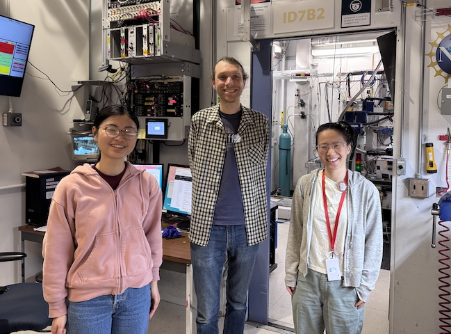<br>
The DiffUSE team at CHESS beamline id7b2. From left to right: Katie, Steve, & Xiaokun.

- 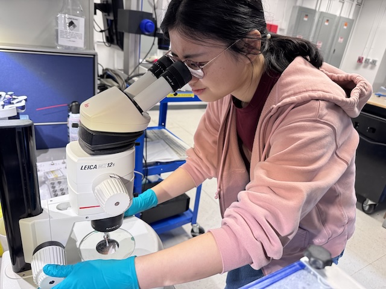<br>
Katie inspecting a mac1 crystal at CHESS.

</div>

## Data

Root directory at CHESS: `/nfs/chess/raw/2026-1/id7b2/meisburger/20260311`

Root directory on OSN: `s3://diffuse-chess-public/20260311`

## Beamline setup

parameter | value | notes
--- | --- | ---
X-ray energy | 14 keV @ 0.01% bandwidth | Si 111 channel cut mono inserted
Beam size | 100 µm x 100 µm | Slit-defined, no CRL.
Flux | 3.96 x 10^10 ph/s | see CHESS nb #3 p. 84
Background reduction | On-axis mirror with Mo tube only (no aperture) |
Centering camera | top-view and on-axis cameras | Top view: 1.713 µm / pixel at 4x zoom ratio; On axis: 0.740 µm / pixel at 4x zoom ratio
Beamstop | 700 µm diameter Mo disk suspended on mylar sheet, semi-transparent | At this energy, the bleedthrough produces faint diffraction rings.
Data collection software | "MX Collect" (python) & SPEC | No changes since last time
Temperature control |  none |

<div class="grid cards" markdown>

- 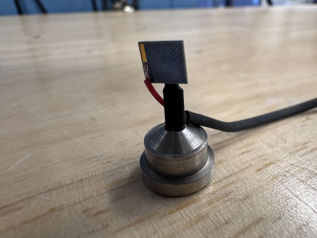<br>
Si PIN diode (from James Holton, ALS) mounted on a magnetic base. The image is taken from the "front" side of the diode (X-ray beam was incident on this side).

- 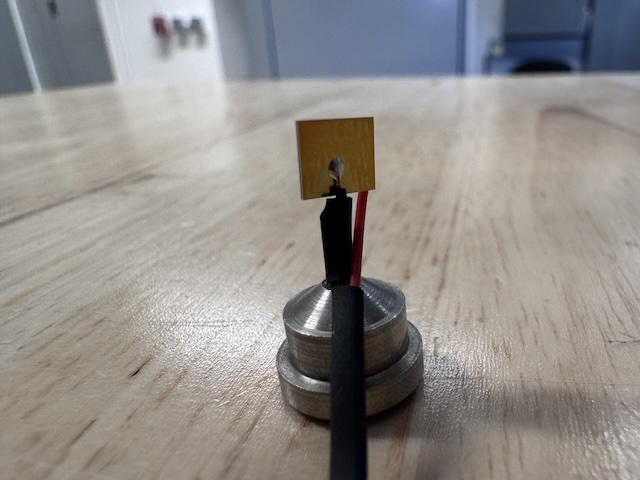<br>
The image is taken from the back side of the diode, which has a gold-colored contact.

</div>

## Samples

Samples for single-crystal data collection were grown in 24-well hanging-drop vapor diffusion trays:

Name | Sample | Well composition | Drop composition | Notes
--- | --- | --- | --- | ---
Mac1 (P43 space group) | SARS CoV2 NSP3 macrodomain and seed stock from UCSF. 40 mg/mL Mac1 in 150 mM NaCl, 20 mM Tris pH 8, 5% glycerol | 30% (w/vol) PEG 3000 + 100 mM CHES (pH 9.5) |  2 µL protein + 1 µL well solution + 1 µL seeds (undiluted)   | Mac1 tray #3 (11/13/2025). See Katie L Ando Lab notebook p. 20 |
Mac1 (C2 space group) | SARS CoV2 NSP3 macrodomain "C2" construct expressed and purified at Cornell. 15 mg/mL Mac1 in 150 mM NaCl, 20 mM Tris pH 8, 5% glycerol, 2 mM DTT | 26-28% (w/vol) PEG 4000, 100 mM Tris (pH 8.3-8.8), 100 mM Na acetate | 2 µL protein + 2 µL well solution (tray dated 3/5/26) or 2 µL protein + 1 µL well solution + 1 µL seeds (tray dated 1/27/26) | Mac1 C2 trays dated 1/27/2026 and 3/5/2025. See Katie L Ando Lab notebook pp. 25, 26, 39 |
DNA | S2T7-1, S2T7-2, and S2T7-3 single stranded oligos with 3'-phosphates at 50 µM in 40 mM tris acetate, 2 mM EDTA | 125 mM tris acetate, 1.75 M ammonium sulfate, and 375 mM Mg acetate ("condition 1") or 37.5 mM Mg acetate (condition "2") | 2.25 µL DNA + 0.75 µL well solution (3:1 ratio) | DNA tray #3: S2T7-3'p (3/4/2026). See Steve's Ando Lab notebook #3, pp. 58, 59, 61-63, 65.

<div class="grid cards" markdown>

- 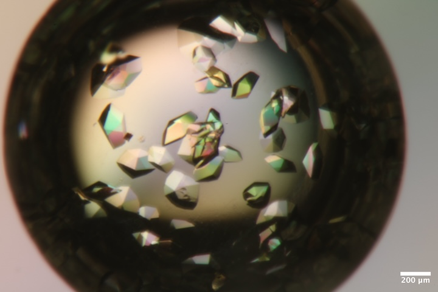<br>
Mac1 crystals from well A4 of Katie's tray dated 11/13/2025.
Well solution: 30% PEG 3000, 100 mM CHES pH 9.5.
Drop:  2 µL protein + 1 µL well solution + 1 µL seeds

- 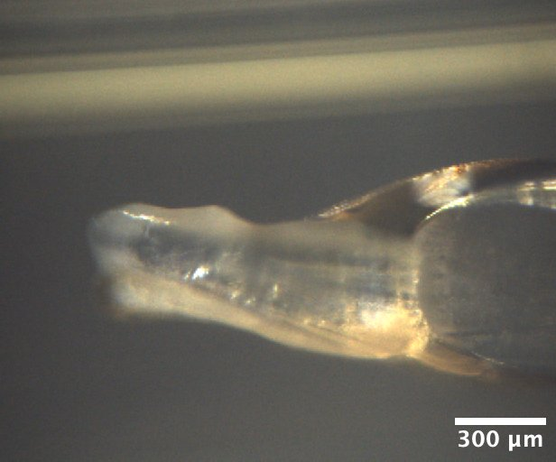<br>
Mac1 crystals from well A5 of Katie's C2 tray dated 1/27/2026.
Well solution: 28% (w/vol) PEG 4000, 100 mM Tris (pH 8.3), 100 mM Na acetate.
Drop: 2 µL protein + 1 µL well solution + 1 µL seeds

- 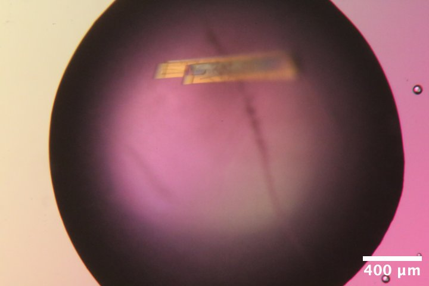<br>
Mac1 crystals from well C6 of Katie's C2 tray dated 1/27/2026.
Well solution: 28% (w/vol) PEG 4000, 100 mM Tris (pH 8.3), 100 mM Na acetate.
Drop: 2 µL protein + 1 µL well solution + 1 µL seeds (diluted 100-fold)

- 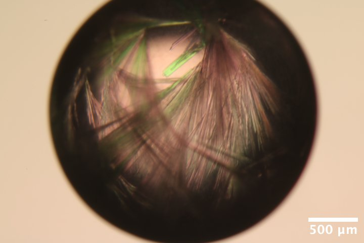<br>
Mac1 crystals from well B2 of Katie's C2 tray dated 3/5/2026.
Well solution: 26% (w/vol) PEG 4000, 100 mM Tris (pH 8.8), 100 mM Na acetate.
Drop: 2 µL protein + 2 µL well solution

- 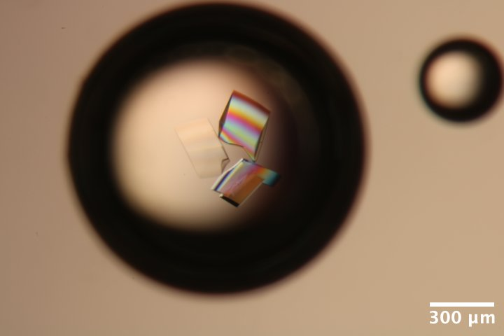<br>
DNA S2T7 (3' phosphate) crystals from well A3 of Steve's DNA tray #3 (3/4/2026).
Well solution: 40 mM tris acetate, 375 mM Mg acetate, 1.75 M ammonium sulfate.
Drop: 2.25 µL DNA + 0.75 µL well solution (3:1 ratio).

- 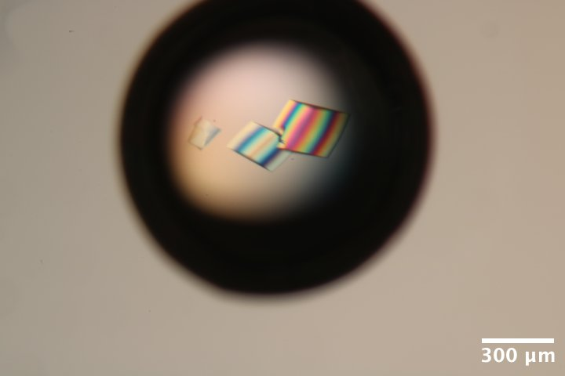<br>
DNA S2T7 (3' phosphate) crystals from well A6 of Steve's DNA tray #3 (3/4/2026).
Well solution: 40 mM tris acetate, 37.5 mM Mg acetate, 1.75 M ammonium sulfate.
Drop: 2.25 µL DNA + 0.75 µL well solution (3:1 ratio).

- 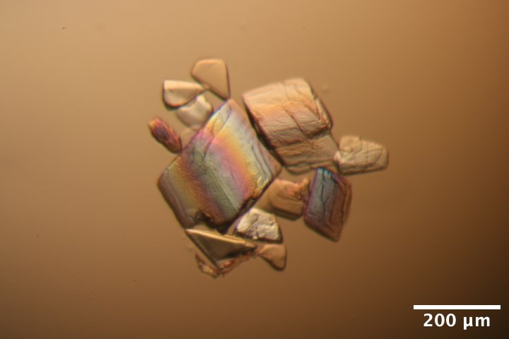<br>
DNA S2T7 (3' phosphate) crystals from well A6 of Steve's DNA tray #3 (3/4/2026) after washing and reacting with EDC for 12 h (3/9/2026).
Wash solution: 40 mM MES pH 6.1, 37.5 mM MgCl2.
Crosslinking solution: wash solution with 35 mg/mL EDC

</div>

## Data collection

Steve arrived at 9:30 am with samples. Steve attached the diode to a magnetic base, and soldered on a BNC connector. John and Tricia aligned the optics, handed off to Steve at noon.

All crystal handling was done in the humidity-controlled chamber (100% RH) unless noted. Crystals were mounted using reusable magnetic bases and micro-RT sleeves, cut to length (~18 mm), with 10 µL reservoir solution in the tip.

Note that the flux is down a factor of ~2 since last time. This is probably down to changes in the focus of the toroidal mirror. Will increase exposure times to compensate.

### 1. Mac1 (P43)

!!! quote inline end ""

    <video width="308" autoplay muted loop playsinlin controls>
    <source src="mac1_1_oac_zoom2.mp4" type="video/mp4">
    Your browser does not support the video tag.
    </video>

Katie looped a ~300 µm mac1 crystal (P43 space group) from well A4 of the tray dated 11/13/2025.

Subdirectory: `mac1/mac1_1`

Recorded 12 images: `mac1_1_oac_zoom2_*.png`

<div style="clear: both;"></div>

| prefix         |   φ0 (deg.) |   φ1 (deg.) |   ∆φ (deg.) |   images |   ∆t (s) |   tf (%) |   d (mm) |   E (keV) |
|----------------|-------------|-------------|-------------|----------|----------|----------|----------|-----------|
| mac1_1_3012    |           0 |         360 |         0.1 |     3600 |     0.02 |      100 |      185 |        14 |
| mac1_1_bg_3013 |           0 |         360 |         1   |      360 |     0.2  |      100 |      185 |        14 |

Note: dials failed to index beyond frame ~1800. The loop is slightly oversized, and it's likely the crystal slipped during data collection.

??? info "xia2 processing"

    Re-ran xia2 on the first 1800 frames only.

    |                 | mac1_1_3012                           |
    |-----------------|---------------------------------------|
    | Mosaic spread   | 0.012                                 |
    | Resolution      | 1.04                                  |
    | Unit Cell       | [89.0, 89.0, 40.14, 90.0, 90.0, 90.0] |
    | Image range     | [1, 1800]                             |
    | Completeness    | 87.7                                  |
    | Multiplicity    | 5.6                                   |
    | I/sigma         | 6.6                                   |
    | Rpim            | 0.062                                 |
    | Wilson B factor | 12.4                                  |
    | Space group     | P 43                                  |

### 2. Mac1 (C2)

!!! quote inline end ""

    <video width="308" autoplay muted loop playsinlin controls>
    <source src="mac1_c2_1_oac_zoom1.mp4" type="video/mp4">
    Your browser does not support the video tag.
    </video>

Xiaokun looped a chunky mac1 crystal (C2 space group) from well A5 of tray dated 1/27/2026 using an EV loop (70 x 700 µm). There is a large amount of PEG skin / precipitate coating the crystal.

Subdirectory: `mac1_c2/mac1_c2_1`

Recorded 12 images: `mac1_c2_1_oac_zoom1_*.png`

Vector scan.

<div style="clear: both;"></div>

| prefix         |   φ0 (deg.) |   φ1 (deg.) |   ∆φ (deg.) |   images |   ∆t (s) |   tf (%) |   d (mm) |   E (keV) |
|----------------|-------------|-------------|-------------|----------|----------|----------|----------|-----------|
| ~~mac1_c2_1_3014~~ |           0 |         720 |         0.1 |     7200 |     0.02 |      100 |      500 |        14 |
| ~~mac1_c2_1_3015~~ |           0 |         720 |         0.1 |     7200 |     0.02 |      100 |      185 |        14 |
| mac1_c2_1_3016 |           0 |         720 |         0.1 |     7200 |     0.02 |      100 |      185 |        14 |

!!! warning

    - scan `3014` (first dataset) -- I accidentally started collection with the detector at 500 mm. I quickly closed the shutter to prevent damage.
    - scan `3015` (second dataset) -- I forgot to open the shutter again (duh!).
    - The start of data collection looks OK, but bad spots / multiple lattice appear quickly after.
    - Didn't bother with a background.

I ran xia2 on the first 1800 images. The unit cell is really interesting, we're getting a beta angle of 98˚, while before it was 103˚. The PDB has examples of both for this space group (for example, [7KR0](https://www.rcsb.org/structure/7KR0) vs. [7KR1](https://www.rcsb.org/structure/7KR1)). Since this is an old tray, it's possible this crystal nucleated much later, and represents a dehydrated form.

!!! note "About C2 isoforms"

    The [Science Advances paper](https://doi.org/10.1126/sciadv.abf8711) describes three C2 isoforms that appeared during fragment screening (Figure S2 in the [Supplementary Material](https://www.science.org/doi/suppl/10.1126/sciadv.abf8711/suppl_file/abf8711_sm.pdf)). They are distinguished by the a and c axis lengths:

    | isoform label | a | c | example PDB entry | beta angle (from PDB entry)
    | --- | --- | --- | --- | ---
    | A   | 130 | 39.5 | [7KQW](https://www.rcsb.org/structure/7KQW) | 96.69
    | B   | 133 | 37.5 | [7KR1](https://www.rcsb.org/structure/7KR1) | 98.95
    | C   | 138 | 38.0 | [7KR0](https://www.rcsb.org/structure/7KR0) | 103.56

??? info "xia2 processing"

    Processed first and second halves of the dataset separately.

    |                 | mac1_c2_1_3016                           | mac1_c2_1_3016                           |
    |-----------------|------------------------------------------|------------------------------------------|
    | Mosaic spread   | 0.237                                    | 0.294                                    |
    | Resolution      | 1.63                                     | 1.32                                     |
    | Unit Cell       | [134.57, 30.39, 37.8, 90.0, 98.85, 90.0] | [134.65, 30.39, 37.8, 90.0, 98.67, 90.0] |
    | Image range     | [1800, 3600]                             | [1, 1800]                                |
    | Completeness    | 99.9                                     | 99.0                                     |
    | Multiplicity    | 3.3                                      | 3.3                                      |
    | I/sigma         | 21.6                                     | 9.4                                      |
    | Rpim            | 0.057                                    | 0.05                                     |
    | Wilson B factor | 19.55                                    | 15.78                                    |
    | Space group     | C 1 2 1                                  | C 1 2 1                                  |

### 3. Mac1 (C2)

!!! quote inline end ""

    <video width="308" autoplay muted loop playsinlin controls>
    <source src="mac1_c2_2_oac_zoom4.mp4" type="video/mp4">
    Your browser does not support the video tag.
    </video>

Xiaokun looped a small needle from well B2 of the tray dated 3/5/2026.

Subdirectory: `mac1_c2/mac1_c2_2`

Recorded 12 images: `mac1_c2_2_oac_zoom4_*.png`

<div style="clear: both;"></div>

| prefix            |   φ0 (deg.) |   φ1 (deg.) |   ∆φ (deg.) |   images |   ∆t (s) |   tf (%) |   d (mm) |   E (keV) |
|-------------------|-------------|-------------|-------------|----------|----------|----------|----------|-----------|
| mac1_c2_2_3017    |           0 |         360 |         0.1 |     3600 |     0.01 |      100 |      185 |        14 |
| mac1_c2_2_bg_3018 |           0 |         360 |         1   |      360 |     0.1  |      100 |      185 |        14 |

??? info "xia2 processing"

    Noticed that the first 90 degrees has a very high Rmerge, so I removed these frames and re-ran xia2.

    |                 | mac1_c2_2_3017                            | mac1_c2_2_3017                             |
    |-----------------|-------------------------------------------|--------------------------------------------|
    | Mosaic spread   | 0.164                                     | 0.037                                      |
    | Resolution      | 1.37                                      | 1.27                                       |
    | Unit Cell       | [139.7, 30.19, 38.22, 90.0, 103.07, 90.0] | [139.71, 30.19, 38.22, 90.0, 103.07, 90.0] |
    | Image range     | [1, 3600]                                 | [901, 3600]                                |
    | Completeness    | 98.3                                      | 97.8                                       |
    | Multiplicity    | 6.9                                       | 5.1                                        |
    | I/sigma         | 10.5                                      | 10.1                                       |
    | Rpim            | 0.061                                     | 0.047                                      |
    | Wilson B factor | 16.41                                     | 14.3                                       |
    | Space group     | C 1 2 1                                   | C 1 2 1                                    |

### 4. Mac1 (C2)

!!! quote inline end ""

    <video width="308" autoplay muted loop playsinlin controls>
    <source src="mac1_c2_3_oac_zoom4.mp4" type="video/mp4">
    Your browser does not support the video tag.
    </video>

Xiaokun looped another thin crystal from well B2 of the tray dated 3/5/2026. This one is really really thin!

Beam size reduced to 30 x 30 µm.

Vector scan.

Subdirectory: `mac1_c2/mac1_c2_3`

Recorded 12 crystal images: `mac1_c2_3_oac_zoom4_*.png`

<div style="clear: both;"></div>

| prefix            |   φ0 (deg.) |   φ1 (deg.) |   ∆φ (deg.) |   images |   ∆t (s) |   tf (%) |   d (mm) |   E (keV) |
|-------------------|-------------|-------------|-------------|----------|----------|----------|----------|-----------|
| ../mac1_c2_2/mac1_c2_2_bg_3019 |           0 |         360 |         0.1 |     3600 |     0.04 |      100 |      185 |        14 |
| mac1_c2_3_bg_3020 |           0 |         360 |           1 |      360 |      0.4 |      100 |      185 |        14 |

!!! warning "file naming error"

    I accidentally collected the dataset in the `mac1_c2_2` subdirectory with prefix `mac1_c2_2_bg`. It should have been `mac1_c2_3/mac1_c2_3`.

??? info "xia2 processing"

    |                 | mac1_c2_2_bg_3019                          |
    |-----------------|--------------------------------------------|
    | Mosaic spread   | 0.121                                      |
    | Resolution      | 1.73                                       |
    | Unit Cell       | [139.49, 30.15, 38.17, 90.0, 102.98, 90.0] |
    | Image range     | [1001, 3600]                               |
    | Completeness    | 98.9                                       |
    | Multiplicity    | 5.0                                        |
    | I/sigma         | 3.5                                        |
    | Rpim            | 0.137                                      |
    | Wilson B factor | 17.81                                      |
    | Space group     | C 1 2 1                                    |

### 5. Mac1 (C2)

!!! quote inline end ""

    <video width="308" autoplay muted loop playsinlin controls>
    <source src="mac1_c2_4_oac_zoom4.mp4" type="video/mp4">
    Your browser does not support the video tag.
    </video>

Xiaokun looped another mac1 crystal from well B2 of the tray dated 3/5/2026. This one is much chunkier, and hangs off the end of the loop.

Beam size increased to 50 x 50 µm.

Subdirectory: `mac1_c2/mac1_c2_4`

Recorded 12 crystal images: `mac1_c2_4_oac_zoom4_*.png`

Vector scan.

<div style="clear: both;"></div>

| prefix            |   φ0 (deg.) |   φ1 (deg.) |   ∆φ (deg.) |   images |   ∆t (s) |   tf (%) |   d (mm) |   E (keV) |
|-------------------|-------------|-------------|-------------|----------|----------|----------|----------|-----------|
| mac1_c2_4_3021    |           0 |         360 |         0.1 |     3600 |     0.04 |      100 |      185 |        14 |
| mac1_c2_4_bg_3022 |           0 |         360 |         1   |      360 |     0.4  |      100 |      185 |        14 |

??? info "xia2 processing"

    Reprocessed with frame range 1001:2000, because the ends did not index well.

    |                 | mac1_c2_4_3021                            |
    |-----------------|-------------------------------------------|
    | Mosaic spread   | 0.408                                     |
    | Resolution      | 1.62                                      |
    | Unit Cell       | [139.34, 30.1, 38.14, 90.0, 102.96, 90.0] |
    | Image range     | [1001, 2000]                              |
    | Completeness    | 79.1                                      |
    | Multiplicity    | 2.4                                       |
    | I/sigma         | 8.9                                       |
    | Rpim            | 0.068                                     |
    | Wilson B factor | 17.41                                     |
    | Space group     | C 1 2 1                                   |

### Flux measurement

Steve placed the diode on the goniometer so that it was 'vertical' when phi = 0. The beamstop was removed, and a 6 cm N2 gas ion chamber (`I2`) was placed downstream. A small ion chamber (`ICol`) was upstream of the sample.

The ion chambers and diodes were connected to SRS current amplifiers with gain settings of 50 nA/V (I2) and 10 µA/V (Diode). The SPEC counter-timer board has a conversion of 10 V = 1 MHz (in other words, 100,000 counts per second = 1 V).

Subdirectory: `diode/`, SPEC file: `diode_1.spec`

In SPEC, `ICol` ion chamber was set monitor, and the diode current (`Diode`) was set to 'detector'. The `ICol` counter rate was ~150,000 per second.

First scan, with the beam going through the diode:

```
dscan phi -60 60 12 -150000
```

Second scan, the beam is off the tip of the diode:

```
dscan phi -60 60 12 -150000
```

Here's the result:

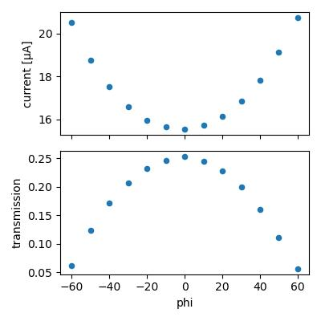

Lets calculate flux assuming all absorbed photons are converted into charge carriers. The max transmission is 0.253, so fraction absorbed is 0.747. At 14 keV, the number of charge carriers generated per photon absorbed is 14,000 eV / 3.66 eV = 3825. Accounting for the absorbed fraction, the conversion would be 1 photon/sec ~ 4.578e-16 A (4.578e-10 µA). The observed current is 15.5 µA, so flux = 15.5/4.578e-10 = 3.38e10 ph/s.

The I2 counts recorded during the second scan (bypassing the diode) were 39756. According to the [CHESS ion chamber flux calculator](https://www.chess.cornell.edu/userstechnical-resourcescalculators/ion-chamber-flux-calculator) this is 3.38e10 ph/s. So both methods agree. The fact that they agree to 2 decimal praces is accidental; according to James H the diode response varies across the surface, setting an empirical error bar of something like 5%.

### 6. Mac1 (C2)

!!! quote inline end ""

    <video width="308" autoplay muted loop playsinlin controls>
    <source src="mac1_c2_5_oac_zoom1.mp4" type="video/mp4">
    Your browser does not support the video tag.
    </video>

Katie looped a big crystal from well C6 of mac1 C2 tray dated 1/27/2026 using a 700 µm EV loop.

Subdirectory: `mac1_c2/mac1_c2_5`

Recorded 12 crystal images: `mac1_c2_5_oac_zoom1_*.png`

Vector scan.

<div style="clear: both;"></div>

| prefix            |   φ0 (deg.) |   φ1 (deg.) |   ∆φ (deg.) |   images |   ∆t (s) |   tf (%) |   d (mm) |   E (keV) |
|-------------------|-------------|-------------|-------------|----------|----------|----------|----------|-----------|
| mac1_c2_5_3023    |           0 |         720 |         0.1 |     7200 |     0.02 |      100 |      185 |        14 |
| mac1_c2_5_bg_3024 |           0 |         720 |         1   |      720 |     0.2  |      100 |      185 |        14 |

!!! warning "poor diffraction"

    Looks like multiple lattices. There are also diffraction rings from beamstop visible, probably some misalignment that needs to be corrected.

Steve left for dinner.

---

Steve and Xiaokun returned at 10:40 pm.

### 7. DNA

!!! quote inline end ""

    <video width="308" autoplay muted loop playsinlin controls>
    <source src="dna_1_oac_zoom4.mp4" type="video/mp4">
    Your browser does not support the video tag.
    </video>

Steve looped the first DNA crystal from well A3, of tray labeled "DNA 3' phos" using a 150 µm loop. This crystal is from "condition 1", which has high magnesium concentration.

Subdirectory: `dna/dna_1`

Recorded 12 crystal images: `dna_1_oac_zoom4_*.png`

<div style="clear: both;"></div>

| prefix        |   φ0 (deg.) |   φ1 (deg.) |   ∆φ (deg.) |   images |   ∆t (s) |   tf (%) |   d (mm) |   E (keV) |
|---------------|-------------|-------------|-------------|----------|----------|----------|----------|-----------|
| dna_1_3031    |           0 |         360 |         0.1 |     3600 |     0.01 |     47.2 |      185 |        14 |
| dna_1_bg_3032 |           0 |         360 |         1   |      360 |     0.1  |     47.2 |      185 |        14 |
| dna_1_3033    |         330 |         340 |         0.1 |      100 |     0.2  |    100   |      185 |        14 |

??? info "xia2 processing"

    |                 | dna_1_3031                                 |
    |-----------------|--------------------------------------------|
    | Mosaic spread   | 0.043                                      |
    | Resolution      | 4.9                                        |
    | Unit Cell       | [107.98, 107.98, 92.01, 90.0, 90.0, 120.0] |
    | Image range     | [1, 3600]                                  |
    | Completeness    | 100.0                                      |
    | Multiplicity    | 10.3                                       |
    | I/sigma         | 9.2                                        |
    | Rpim            | 0.02                                       |
    | Wilson B factor | 322.68                                     |
    | Space group     | R 3                                        |

### 8. DNA

!!! quote inline end ""

    <video width="308" autoplay muted loop playsinlin controls>
    <source src="dna_2_oac_zoom4.mp4" type="video/mp4">
    Your browser does not support the video tag.
    </video>

Steve looped a second DNA crystal from well A3 of the same tray.

Subdirectory: `dna/dna_2`

Recorded 12 images: `dna_2_oac_zoom4_*.png`

<div style="clear: both;"></div>

| prefix        |   φ0 (deg.) |   φ1 (deg.) |   ∆φ (deg.) |   images |   ∆t (s) |   tf (%) |   d (mm) |   E (keV) |
|---------------|-------------|-------------|-------------|----------|----------|----------|----------|-----------|
| dna_2_3034    |           0 |         360 |         0.1 |     3600 |     0.01 |     47.2 |      185 |        14 |
| dna_2_bg_3035 |           0 |         360 |         1   |      360 |     0.1  |     47.2 |      185 |        14 |
| dna_2_3036    |          60 |          70 |         0.1 |      100 |     0.2  |    100   |      185 |        14 |

??? info "xia2 processing"

    |                 | dna_2_3034                                 |
    |-----------------|--------------------------------------------|
    | Mosaic spread   | 0.028                                      |
    | Resolution      | 5.53                                       |
    | Unit Cell       | [107.81, 107.81, 94.62, 90.0, 90.0, 120.0] |
    | Image range     | [1, 3600]                                  |
    | Completeness    | 100.0                                      |
    | Multiplicity    | 10.2                                       |
    | I/sigma         | 12.2                                       |
    | Rpim            | 0.019                                      |
    | Wilson B factor | 391.19                                     |
    | Space group     | R 3                                        |

### 9. DNA + EDC

!!! quote inline end ""

    <video width="308" autoplay muted loop playsinlin controls>
    <source src="dna_3_oac_zoom4.mp4" type="video/mp4">
    Your browser does not support the video tag.
    </video>

Steve looped a cross-linked crystal, originally from well A6 of the "DNA 3' phos" tray. It was grown in "condition 2" (low magnesium concentration), washed with MgCl2 and MES buffer at pH 6.1, then cross-linked with 35 mg/mL EDC overnight.

Subdirectory: `dna/dna_3`

Recorded 12 images: `dna_3_oac_zoom4_*.png`

<div style="clear: both;"></div>

| prefix        |   φ0 (deg.) |   φ1 (deg.) |   ∆φ (deg.) |   images |   ∆t (s) |   tf (%) |   d (mm) |   E (keV) |
|---------------|-------------|-------------|-------------|----------|----------|----------|----------|-----------|
| dna_3_3037    |           0 |         360 |         0.1 |     3600 |     0.01 |     47.2 |      185 |        14 |
| dna_3_bg_3038 |           0 |         360 |         1   |      360 |     0.1  |     47.2 |      185 |        14 |

This diffracts better than expected, given the appearance!

??? info "xia2 processing"

    |                 | dna_3_3037                                 |
    |-----------------|--------------------------------------------|
    | Mosaic spread   | 0.101                                      |
    | Resolution      | 4.9                                        |
    | Unit Cell       | [108.99, 108.99, 94.55, 90.0, 90.0, 120.0] |
    | Image range     | [1, 3600]                                  |
    | Completeness    | 100.0                                      |
    | Multiplicity    | 10.4                                       |
    | I/sigma         | 11.4                                       |
    | Rpim            | 0.014                                      |
    | Wilson B factor | 299.43                                     |
    | Space group     | R 3                                        |

There is no apparent radiation damage during this data collection, so repeat with 4x the dose.

| prefix        |   φ0 (deg.) |   φ1 (deg.) |   ∆φ (deg.) |   images |   ∆t (s) |   tf (%) |   d (mm) |   E (keV) |
|---------------|-------------|-------------|-------------|----------|----------|----------|----------|-----------|
| dna_3_3039    |           0 |         360 |         0.1 |     3600 |     0.02 |    100   |      185 |        14 |

??? info "xia2 processing"

    |                 | dna_3_3039                                 |
    |-----------------|--------------------------------------------|
    | Mosaic spread   | 0.107                                      |
    | Resolution      | 4.63                                       |
    | Unit Cell       | [108.99, 108.99, 94.61, 90.0, 90.0, 120.0] |
    | Image range     | [1, 3600]                                  |
    | Completeness    | 100.0                                      |
    | Multiplicity    | 10.5                                       |
    | I/sigma         | 15.3                                       |
    | Rpim            | 0.012                                      |
    | Wilson B factor | 325.56                                     |
    | Space group     | R 3                                        |

!!! quote inline end ""

    <video width="432" autoplay muted loop playsinlin controls>
    <source src="dna_clip.mp4" type="video/mp4">
    Your browser does not support the video tag.
    </video>

The crystal was removed from the goniometer, and then placed in a drop of water under the microscope. Recorded a 3 minute video. Wow, it didn't dissolve!

Looped the crystal out of the drop (in air, not in the humidity chamber), and put the sleeve back on.

Oops, it looks dried out / opaque. Let's just take a snapshot.

Subdirectory: `dna/dna_3_wat`

(unfortunately, neglected to take a picture)

<div style="clear: both;"></div>

| prefix         |   φ0 (deg.) |   ∆φ (deg.) |   images |   ∆t (s) |   tf (%) |   d (mm) |   E (keV) |
|----------------|-------------|-------------|----------|----------|----------|----------|-----------|
| dna_3_wat_3040 |         330 |         0.5 |        1 |        1 |      100 |      185 |        14 |

Wow, what a weird diffraction pattern. Crystal is definitely not happy.

!!! quote inline end ""

    <video width="308" autoplay muted loop playsinlin controls>
    <source src="dna_3_wat2_oac_zoom4.mp4" type="video/mp4">
    Your browser does not support the video tag.
    </video>

Can we rehydrate it? Removed the crystal from the goniometer, and placed back in water droplet. Looped in the humidity chamber this time, and placed the sleeve on.

Subdirectory: `dna/dna_3_wat2`

Saved 12 images: `dna_3_wat2_oac_zoom4_*.png`

Let's take a 1 second snapshot

<div style="clear: both;"></div>

| prefix             |   φ0 (deg.) |   φ1 (deg.) |   ∆φ (deg.) |   images |   ∆t (s) |   tf (%) |   d (mm) |   E (keV) |
|--------------------|-------------|-------------|-------------|----------|----------|----------|----------|-----------|
| dna_3_wat2_3041    |          15 |         nan |         0.5 |        1 |     1    |    100   |      185 |        14 |

Amazing, diffraction recovered! Collect another dataset

| prefix             |   φ0 (deg.) |   φ1 (deg.) |   ∆φ (deg.) |   images |   ∆t (s) |   tf (%) |   d (mm) |   E (keV) |
|--------------------|-------------|-------------|-------------|----------|----------|----------|----------|-----------|
| dna_3_wat2_3042    |           0 |         360 |         0.1 |     3600 |     0.01 |     47.2 |      185 |        14 |
| dna_3_wat2_bg_3043 |           0 |         360 |         1   |      360 |     0.1  |     47.2 |      185 |        14 |

??? info "xia2 processing"

    |                 | dna_3_wat2_3042                            |
    |-----------------|--------------------------------------------|
    | Mosaic spread   | 0.149                                      |
    | Resolution      | 5.47                                       |
    | Unit Cell       | [108.96, 108.96, 98.55, 90.0, 90.0, 120.0] |
    | Image range     | [1, 3600]                                  |
    | Completeness    | 100.0                                      |
    | Multiplicity    | 10.1                                       |
    | I/sigma         | 13.0                                       |
    | Rpim            | 0.015                                      |
    | Wilson B factor | 320.19                                     |
    | Space group     | R 3                                        |

Here's what the diffraction patterns look like (referred to above):

<div class="grid cards" markdown>

- 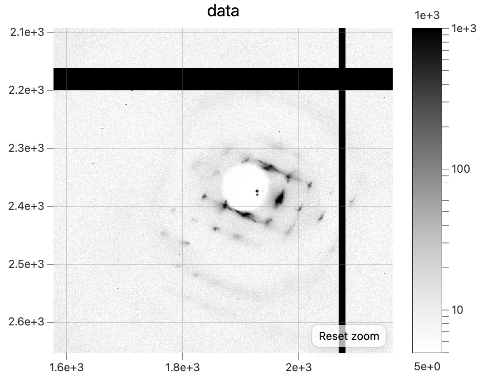<br>
Snapshot diffraction pattern from the dehydrated DNA + EDC crystal, `dna_3_wat_3040`.

- 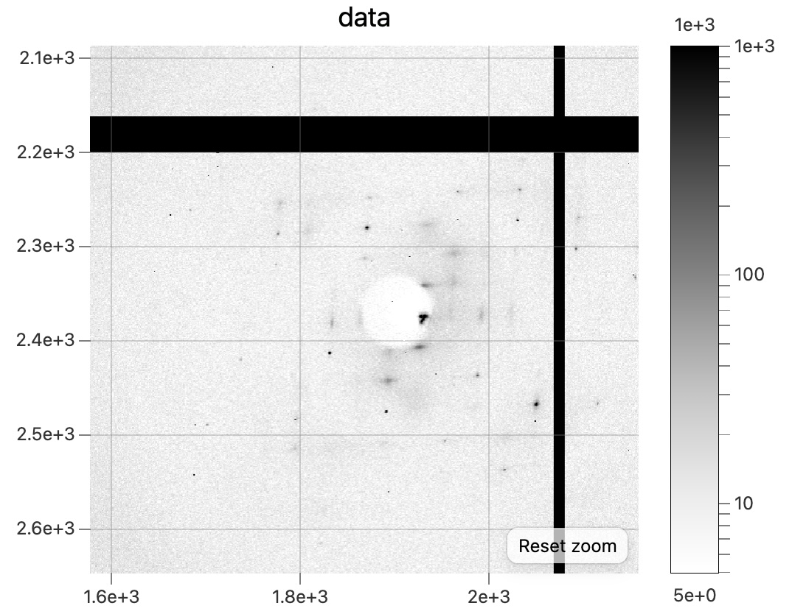<br>
Snapshot diffraction pattern after rehydrating, `dna_3_wat2_3041`.

</div>

!!! success "Done!"
