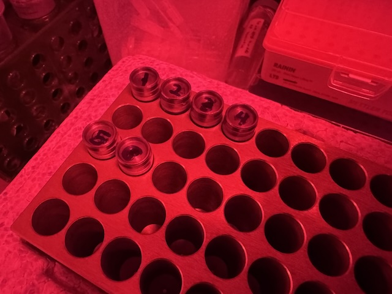
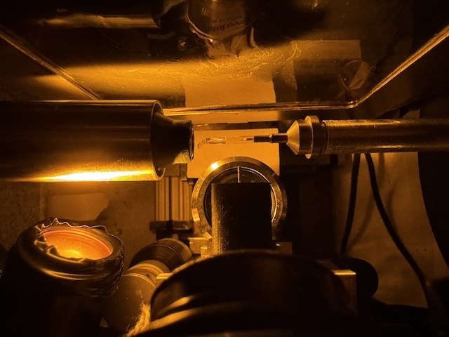
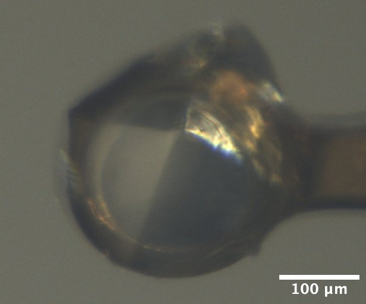
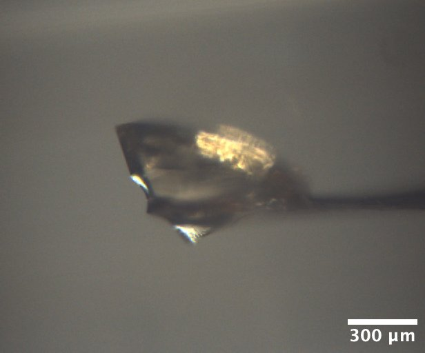
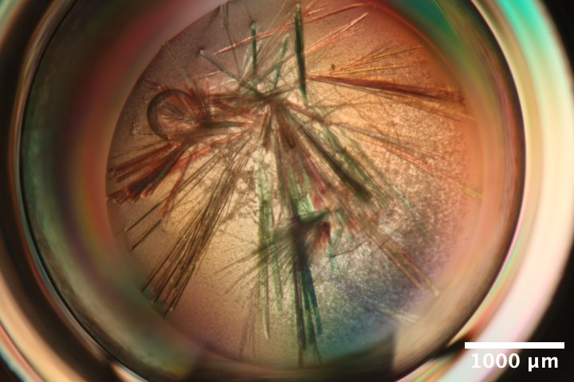
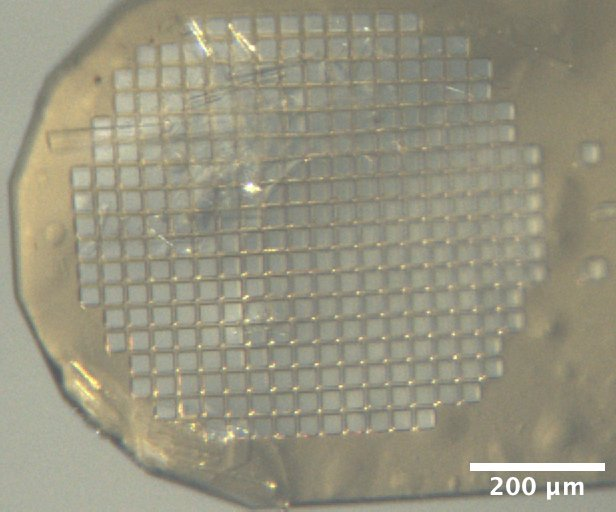
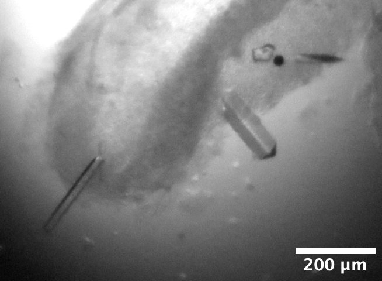
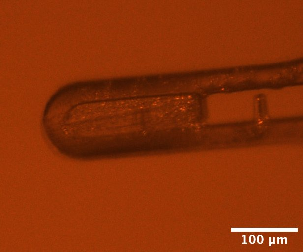
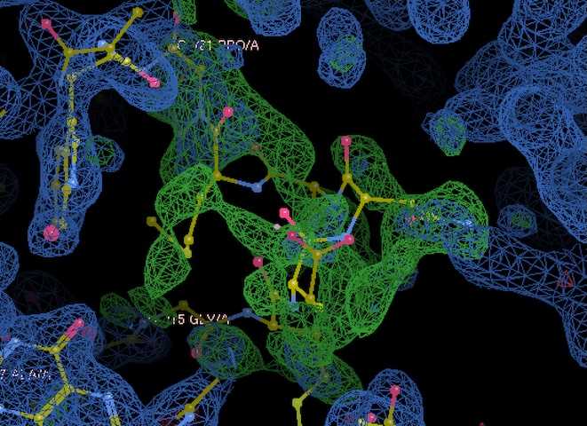
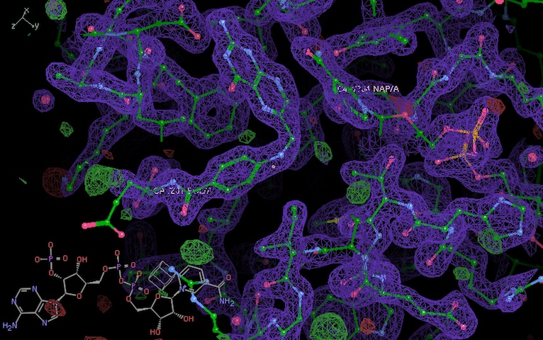

# 2026-03-25 @ CHESS 7b2

Final CHESS beam time of the 2026-1 run cycle.

## Goals

- Demonstrate data collection and processing procedures for Prophet Town
    - Will develop automations for data & metadata ingestion into the diffuse hub
- Screen initial DHFR hits
    - Develop a procedure to collect data in the dark, keeping samples at 4˚ C.
    - Did we successfully reproduce the P2~1~2~1~2~1~ crystal forms with folate +/- NADP?
- Screen Mac1 C2 crystals grown in microbatch
    - Are the unit cells more consistent, compared with vapor diffusion?

## Participants

Steve M, Katie L, & Xiaokun P from Ando lab; Joseph L from Radial; Michael A from Prophet Town; support from John I & Tricia C at CHESS

## Data

Root directory at CHESS: `/nfs/chess/raw/2026-1/id7b2/meisburger/20260325`

Root directory on OSN: `s3://diffuse-chess-public/20260325`

## Beamline setup

parameter | value | notes
--- | --- | ---
X-ray energy | 14 keV @ 0.01% bandwidth | Si 111 channel cut mono inserted
Beam size | 100 µm x 100 µm (initially) | Slit-defined, no CRL. Adjusted to match crystal size when noted, below.
Flux | 3.96 x 10^10^ ph/s | See CHESS 7b2 beamline notebook #3
Background reduction | On-axis mirror with Mo tube only (no aperture) |
Centering camera | top-view and on-axis cameras | Top view: 1.713 µm / pixel at 4x zoom ratio; On axis: 0.740 µm / pixel at 4x zoom ratio
Beamstop | 700 µm diameter Mo disk suspended on mylar sheet, semi-transparent | At this energy, the bleedthrough produces faint diffraction rings.
Data collection software | "MX Collect" (python) & SPEC | No changes since last time
Temperature control | none (initially) | For DHFR only, the Oxford cryostream was installed end-on and set to 277 K

-  
DHFR samples were looped in the Ando Lab cold room under red light and transported to CHESS in a cold block (diversified biotech).

-  
Setup for collecting data from DHFR at 277 K, with amber light source for centering.

Steve arrived at noon. The station alignment was delayed by an accelerator access, but was completed by 1:30. Steve added shielding to reduce background shadows in the image (lead tape upstream of the aperture, steel plate leaning against the back side of the tower). He also adjusted the camera lighting.

## Samples

The following samples were grown in 24-well hanging-drop vapor diffusion trays:

Name | Sample | Well composition | Drop composition | Notes
--- | --- | --- | --- | ---
Mac1 (P4~3~ space group) | SARS CoV2 NSP3 macrodomain and seed stock from UCSF. 40 mg/mL Mac1 in 150 mM NaCl, 20 mM Tris pH 8, 5% glycerol | 30% (w/vol) PEG 3000 + 100 mM CHES (pH 9.5) | 2 µL protein + 1 µL well solution + 1 µL seeds (undiluted) | Mac1 tray (2/10/2026). See Katie L Ando Lab notebook p. 32 |
Lysozyme | Hen egg lysozyme, 50 mg/mL in NaOAc | 0.6 M NaCl, 100 mM NaOAc pH 4.2 | 2 µL protein + 2 µL well solution | Min P's practice tray, dated 10/17/2025. |
DHFR-Folate | E. coli dihydrofolate reductase expressed and purified at Cornell. Dialyzed in 20 mM imidazole pH 7.0 with 1 mM folic acid and concentrated to 35 mg/mL | 15% PEG 6000, 300 mM MnCl~2~, 50 mM Cacodylate pH 7.0 | 1 µL protein + 1 µL well solution, streak seeded after equilibration | DHFR Tray #2 (3/6/2026). All procedures under red light at 4˚C. See Steve's Ando Lab Notebook #3, pp. 60, 64, 66, 69, 70 | 
DHFR-Folate-NADP | E. coli dihydrofolate reductase expressed and purified at Cornell. Dialyzed in 20 mM imidazole pH 7.0 with 1 mM folic acid and concentrated to 35 mg/mL. NADP+ added in 3:1 molar excess (final concentrations: 31.5 mg/mL DHFR, 6.3 mM NADP) | 20% PEG 400, 100 mM CaCl~2~, 40 mM MES pH 6.5 | 1 µL protein + 1 µL well solution, streak seeded after equilibration | DHFR Tray #1 row C (3/14/202). All procedures under red light at 4˚C. See Steve's Ando Lab Notebook #3, pp. 67, 68, 70 |

The Mac1 C2 crystals were grown in 24 sitting well trays under paraffin oil (microbatch method):

Name | Sample | Precipitant | Drop composition | Notes
--- | --- | --- | --- | ---
Mac1 (C2 space group) | SARS CoV2 NSP3 macrodomain "C2" construct expressed and purified at Cornell. In 150 mM NaCl, 20 mM Tris pH 8, 5% glycerol, 2 mM DTT, concentrated to 31 mg/mL | 16-18% PEG 4000, 20 mM NaOAc, 20 mM Tris pH 8.5 | Row B: 2 µL protein + 2 µL precipitant + 0.5 µL seed stock; Row C: 4 µL protein + 4 µL precipitant solutions + 0.5 µL seed stock | Mac1 C2 microbatch tray dated 3/3/2026 (row B) and 3/12/2025 (row C). See Katie L Ando Lab notebook pp. 37, 40, 41 |

-  
Mac1 crystal mounted on the beamline, from Katie L's tray dated 2/10/2026. 
Well solution: 30% PEG 3000, 100 mM CHES pH 9.5. 
Drop: 2 µL protein + 1 µL well solution + 1 µL seed stock.

-  
Lysozyme crystal mounted on the beamline, from well A1 of Min P's practice tray, dated 10/17/2025. 
Well solution: 0.6 M NaCl, 100 mM NaOAc pH 4.2.
Drop: 2 µL protein + 2 µL well solution

-  
Mac1 crystals (C2 form) from Katie L's microbatch under oil tray, third row (C) dated 3/12/2026.
Precipitant solution: 18% PEG 4000, 20 mM NaOAc, 20 mM Tris pH 8.5.
Drops contain 4 µL protein + 4 µL precipitant solutions + 0.5 µL seed stock (undiluted) under paraffin oil.

-  
Mac1 crystals (C2 form) mounted on the beamline, from Katie L's microbatch under oil tray, second row (B) dated 3/3/2026.
Precipitant solution: 16% PEG 4000, 20 mM NaOAc, 20 mM Tris pH 8.5.
Drops contain 2 µL protein + 2 µL precipitant solutions + 0.5 µL seed stock (undiluted) under paraffin oil.

-  
DHFR-Folate crystals from well D2 of Steve's DHFR Tray #2, dated 3/6/2026. 
Well solution: 15% PEG 6000, 300 mM MnCl2, 50 mM Cacodylate pH 7.0.
Drop: 1 µL protein + 1 µL well solution, streak seeded on 3/14/2026.

-  
DHFR-Folate-NADP crystals mounted on the beamline, from well C4 of Steve's DHFR Tray #1 dated 3/14/2026. 
Well solution: 20% PEG 400, 100 mM CaCl~2~, 40 mM MES pH 6.5. 
Drop: 1 µL protein + 1 µL well solution, streak seeded on 3/20/2026.

## Data collection

### 1. Mac1 (P4~3~)

!!! quote inline end ""

    <video width="308" autoplay muted loop playsinlin controls>
    <source src="mac1_1_oac_zoom4.mp4" type="video/mp4">
    Your browser does not support the video tag.
    </video>

Xiokun looped a mac1 crystal from Katie's tray dated 2/10/2026, well B2. Crystal is a bit larger than 200 µm.

Subdirectory: `mac1/mac1_1`

Snapped images every 30˚ using the on-axis camera, prefix: `mac1_1_oac_zoom4`.

| prefix         |   φ0 (deg.) |   φ1 (deg.) |   ∆φ (deg.) |   images |   ∆t (s) |   tf (%) |   d (mm) |   E (keV) |
|----------------|-------------|-------------|-------------|----------|----------|----------|----------|-----------|
| mac1_1_4796    |           0 |         360 |         0.1 |     3600 |     0.02 |      100 |      185 |     13.99 |
| mac1_1_bg_4797 |           0 |         360 |         1   |      360 |     0.2  |      100 |      185 |     13.99 |

??? info "xia2 processing"

    |                 | mac1_1_4796                           |
    |-----------------|---------------------------------------|
    | Mosaic spread   | 0.007                                 |
    | Resolution      | 1.05                                  |
    | Unit Cell       | [89.2, 89.2, 40.23, 90.0, 90.0, 90.0] |
    | Image range     | [1, 3600]                             |
    | Completeness    | 87.9                                  |
    | Multiplicity    | 11.3                                  |
    | I/sigma         | 19.7                                  |
    | Rpim            | 0.014                                 |
    | Wilson B factor | 13.28                                 |
    | Space group     | P 43                                  |

### 2. Lysozyme

!!! quote inline end ""

    <video width="308" autoplay muted loop playsinlin controls>
    <source src="lys_1_oac_zoom1.mp4" type="video/mp4">
    Your browser does not support the video tag.
    </video>

Xiaokun looped a lysozyme crystal from MJP tray dated 10/17/2025 well A1 using a 600 µm loop.

Subdirectory: `lysozyme/lys_1`

Snapped images every 30˚ using the on-axis camera, prefix: `lys_1_oac_zoom1`

Vector scan over ~600 µm distance.

| prefix        |   φ0 (deg.) |   φ1 (deg.) |   ∆φ (deg.) |   images |   ∆t (s) |   tf (%) |   d (mm) |   E (keV) |
|---------------|-------------|-------------|-------------|----------|----------|----------|----------|-----------|
| lys_1_4798    |           0 |         720 |         0.1 |     7200 |     0.05 |      100 |      185 |     13.99 |
| lys_1_bg_4799 |           0 |         360 |         1   |      360 |     0.5  |      100 |      185 |     13.99 |

??? info "xia2 processing"

    Ran xia2 on the first 360 degrees, and the entire 720 degrees.

    |                 | lys_1_4798                              | lys_1_4798                              |
    |-----------------|-----------------------------------------|-----------------------------------------|
    | Mosaic spread   | 0.027                                   | 0.031                                   |
    | Resolution      | 1.1                                     | 1.09                                    |
    | Unit Cell       | [79.11, 79.11, 38.03, 90.0, 90.0, 90.0] | [79.11, 79.11, 38.04, 90.0, 90.0, 90.0] |
    | Image range     | [1, 3600]                               | [1, 7200]                               |
    | Completeness    | 100.0                                   | 100.0                                   |
    | Multiplicity    | 21.4                                    | 42.0                                    |
    | I/sigma         | 31.5                                    | 40.5                                    |
    | Rpim            | 0.007                                   | 0.005                                   |
    | Wilson B factor | 17.88                                   | 18.18                                   |
    | Space group     | P 43 21 2                               | P 43 21 2                               |

### 3. Mac1 (P4~3~)

!!! quote inline end ""

    <video width="308" autoplay muted loop playsinlin controls>
    <source src="mac1_2_oac_zoom4.mp4" type="video/mp4">
    Your browser does not support the video tag.
    </video>

Steve bent a 200 µm loop to better orient mac1 relative to the rotation axis. Xiaokun looped another mac1 crystal from the same drop (Katie's tray dated 2026/2/10, well B2). The crystal is ~200 µm in diameter, and ~50 µm in the other dimension.

Subdirectory: `mac1/mac1_2`

Snapped images every 30˚ using the on-axis camera, prefix: `mac1_2_oac_zoom4`.

| prefix         |   φ0 (deg.) |   φ1 (deg.) |   ∆φ (deg.) |   images |   ∆t (s) |   tf (%) |   d (mm) |   E (keV) |
|----------------|-------------|-------------|-------------|----------|----------|----------|----------|-----------|
| mac1_2_4800    |           0 |         360 |         0.1 |     3600 |     0.02 |      100 |      185 |     13.99 |
| mac1_2_bg_4801 |           0 |         360 |         1   |      360 |     0.2  |      100 |      185 |     13.99 |

??? info "xia2 processing"

    |                 | mac1_2_4800                             |
    |-----------------|-----------------------------------------|
    | Mosaic spread   | 0.006                                   |
    | Resolution      | 1.09                                    |
    | Unit Cell       | [89.21, 89.21, 40.25, 90.0, 90.0, 90.0] |
    | Image range     | [1, 3600]                               |
    | Completeness    | 98.6                                    |
    | Multiplicity    | 11.1                                    |
    | I/sigma         | 14.7                                    |
    | Rpim            | 0.019                                   |
    | Wilson B factor | 13.41                                   |
    | Space group     | P 43                                    |

### 4. Mac1 (P4~3~)

!!! quote inline end ""

    <video width="308" autoplay muted loop playsinlin controls>
    <source src="mac1_3_oac_zoom4.mp4" type="video/mp4">
    Your browser does not support the video tag.
    </video>

Xiaokun looped another mac1 crystal from the same drop (Katie's tray dated 2026/2/10, well B2). A bit larger than the ~200 µm loop, and ~100 µm thick. The crystal is covered by a thick PEG skin, and not clearly visibile in the centering camera.

Subdirectory: `mac1/mac1_3`

Snapped images every 30˚ using the on-axis camera, prefix: `mac1_3_oac_zoom4`.

| prefix      |   φ0 (deg.) |   φ1 (deg.) |   ∆φ (deg.) |   images |   ∆t (s) |   tf (%) |   d (mm) |   E (keV) |
|-------------|-------------|-------------|-------------|----------|----------|----------|----------|-----------|
| mac1_3_4802 |           0 |         360 |         0.1 |     3600 |     0.02 |      100 |      185 |     13.99 |

??? info "xia2 processing"

    |                 | mac1_3_4802                             |
    |-----------------|-----------------------------------------|
    | Mosaic spread   | 0.005                                   |
    | Resolution      | 1.08                                    |
    | Unit Cell       | [89.26, 89.26, 40.35, 90.0, 90.0, 90.0] |
    | Image range     | [1, 3600]                               |
    | Completeness    | 93.5                                    |
    | Multiplicity    | 11.5                                    |
    | I/sigma         | 13.3                                    |
    | Rpim            | 0.022                                   |
    | Wilson B factor | 13.16                                   |
    | Space group     | P 43                                    |

!!! warning "multiple lattices"

    Unusable for diffuse (50% indexing rate). Evidently there are two crystals in the loop. Background skipped.

---

!!! tip "beam tuneup"

    Steve tuned up the beam again. The flux has dropped somewhat: 3 x 10^10^ ph/s in 100 x 100 µm beam.

### 5. Mac1 (C2)

!!! quote inline end ""

    <video width="308" autoplay muted loop playsinlin controls>
    <source src="mac1c2_1_oac_2_zoom4.mp4" type="video/mp4">
    Your browser does not support the video tag.
    </video>

Xiaokun looped a mac1 crystal (C2 form) from microbatch tray well C1. NVH oil was used to disperse the crystals before looping. A crystal of approx. 200 µm x 20 µm was mounted using a 50 x 500 µm inclined loop.

Subdirectory: `mac1_C2/mac1c2_1`

Snapped images every 30˚ using the on-axis camera. The first set of camera images were accidentally named `mac1c2_1_oac_zoom4`, the actual zoom ratio was 1x. Took another set using 4x zoom named `mac1c2_1_oac_2_zoom4`

Beam size changed to 50 x 50 µm.

Vector scan.

| prefix        |   φ0 (deg.) |   φ1 (deg.) |   ∆φ (deg.) |   images |   ∆t (s) |   tf (%) |   d (mm) |   E (keV) |
|---------------|-------------|-------------|-------------|----------|----------|----------|----------|-----------|
| mac1c2_1_4803 |         180 |         540 |         0.1 |     3600 |     0.02 |      100 |      185 |     13.99 |
| mac1c2_1_4804 |         180 |         540 |         1   |      360 |     0.2  |      100 |      185 |     13.99 |

!!! warning "multiple lattices"

    Possibly multiple crystals. Xia2 result: 30.7% indexed, unit cell 135.86, 30.74, 38.59 90, 100.64, 90. Mosaicity 0.0698. Difference between calculated & observed centroids is faily small & stable from phi=180˚-380˚, then got really bad at the end.

### 6. Mac1 (C2)

!!! quote inline end ""

    <video width="308" autoplay muted loop playsinlin controls>
    <source src="mac1c2_2_oac_zoom2.mp4" type="video/mp4">
    Your browser does not support the video tag.
    </video>

Katie looped mac1 crystal (C2 form) from the same tray, well B1 with a 30 x 300 µm EV loop. The crystal was chunky, ~100 x 600 µm. Collected data from the bottom, middle, and end.

Subdirectory: `mac1_C2/mac1c2_2`

Snapped images every 30˚ using the on-axis camera, prefix: `mac1c2_2_oac_zoom2`. 

Beam size changed to 100 x 100 µm.

| prefix               |   φ0 (deg.) |   φ1 (deg.) |   ∆φ (deg.) |   images |   ∆t (s) |   tf (%) |   d (mm) |   E (keV) |
|----------------------|-------------|-------------|-------------|----------|----------|----------|----------|-----------|
| mac1c2_2_bottom_4805 |           0 |         180 |         0.1 |     1800 |     0.01 |      100 |      185 |     13.99 |
| mac1c2_2_middle_4806 |           0 |         180 |         0.1 |     1800 |     0.01 |      100 |      185 |     13.99 |
| mac1c2_2_end_4807    |           0 |         180 |         0.1 |     1800 |     0.01 |      100 |      185 |     13.99 |

!!! warning "multiple lattices"

    By eye, the bottom dataset was less 'twinned', although all had low indexing percentages.

### 7. Mac1 (C2)

!!! quote inline end ""

    <video width="308" autoplay muted loop playsinlin controls>
    <source src="mac1c2_3_oac_zoom2.mp4" type="video/mp4">
    Your browser does not support the video tag.
    </video>

Katie picked up a smaller bundle (200 µm x 50 µm) from well B1 using a 50 x 500 µm included microloop E.

Subdirectory: `mac1_C2/mac1c2_3`

Snapped images every 30˚ using the on-axis camera, prefix: `mac1c2_3_oac_zoom2`. 

Beam size changed to 50 x 50 µm.

| prefix        |   φ0 (deg.) |   φ1 (deg.) |   ∆φ (deg.) |   images |   ∆t (s) |   tf (%) |   d (mm) |   E (keV) |
|---------------|-------------|-------------|-------------|----------|----------|----------|----------|-----------|
| mac1c2_3_4808 |         120 |         300 |         0.1 |     1800 |     0.02 |      100 |      185 |     13.99 |

??? info "xia2 processing"

    |                 | mac1c2_3_4808                             |
    |-----------------|-------------------------------------------|
    | Mosaic spread   | 0.393                                     |
    | Resolution      | 1.85                                      |
    | Unit Cell       | [135.52, 30.62, 38.09, 90.0, 98.71, 90.0] |
    | Image range     | [1, 1800]                                 |
    | Completeness    | 99.0                                      |
    | Multiplicity    | 3.4                                       |
    | I/sigma         | 4.6                                       |
    | Rpim            | 0.101                                     |
    | Wilson B factor | 20.23                                     |
    | Space group     | C 1 2 1                                   |

!!! warning "multiple lattices"

    Weak diffraction, but seems to be two lattices.

### 8. Mac1 (C2)

!!! quote inline end ""

    <video width="308" autoplay muted loop playsinlin controls>
    <source src="mac1c2_11_oac_zoom2.mp4" type="video/mp4">
    Your browser does not support the video tag.
    </video>

Steve scooped up a whole mess of mac1 crystals (C2 form) from well C1 using a micromesh.

Strategy: collect small wedges of data from isolated crystals using a small beam. 

Beam size changed to 30 x 30 µm.

Subdirectory: `mac1_C2/mac1c2_4`

| prefix        |   φ0 (deg.) |   φ1 (deg.) |   ∆φ (deg.) |   images |   ∆t (s) |   tf (%) |   d (mm) |   E (keV) |
|---------------|-------------|-------------|-------------|----------|----------|----------|----------|-----------|
| mac1c2_3_4809 |          50 |         140 |         0.1 |      900 |     0.08 |      100 |      185 |     13.99 |

!!! warning "file name error"

    The prefix should have been `mac1c2_4_4809` (sample 4 instead of 3).

Continue with other crystals on this mount.

!!! note

    I made the dubious decision to create new directory for each crystal. Previously, when collecting from serial chips, I put all the datasets in the same subdirectory named after the mount (chip_L1, etc).

Subdirectory: `mac1_C2/mac1c2_5`

| prefix        |   φ0 (deg.) |   φ1 (deg.) |   ∆φ (deg.) |   images |   ∆t (s) |   tf (%) |   d (mm) |   E (keV) |
|---------------|-------------|-------------|-------------|----------|----------|----------|----------|-----------|
| mac1c2_5_4810 |          50 |         140 |         0.1 |      900 |     0.08 |      100 |      185 |     13.99 |

Subdirectory: `mac1_C2/mac1c2_6`

| prefix        |   φ0 (deg.) |   φ1 (deg.) |   ∆φ (deg.) |   images |   ∆t (s) |   tf (%) |   d (mm) |   E (keV) |
|---------------|-------------|-------------|-------------|----------|----------|----------|----------|-----------|
| mac1c2_6_4811 |          50 |         140 |         0.1 |      900 |     0.08 |      100 |      185 |     13.99 |

Subdirectory: `mac1_C2/mac1c2_7`

| prefix        |   φ0 (deg.) |   φ1 (deg.) |   ∆φ (deg.) |   images |   ∆t (s) |   tf (%) |   d (mm) |   E (keV) |
|---------------|-------------|-------------|-------------|----------|----------|----------|----------|-----------|
| mac1c2_7_4812 |          50 |         140 |         0.1 |      900 |     0.08 |      100 |      185 |     13.99 |

Subdirectory: `mac1_C2/mac1c2_8`

| prefix        |   φ0 (deg.) |   φ1 (deg.) |   ∆φ (deg.) |   images |   ∆t (s) |   tf (%) |   d (mm) |   E (keV) |
|---------------|-------------|-------------|-------------|----------|----------|----------|----------|-----------|
| mac1c2_8_4813 |          50 |         140 |         0.1 |      900 |     0.08 |      100 |      185 |     13.99 |

Subdirectory: `mac1_C2/mac1c2_9`

| prefix        |   φ0 (deg.) |   φ1 (deg.) |   ∆φ (deg.) |   images |   ∆t (s) |   tf (%) |   d (mm) |   E (keV) |
|---------------|-------------|-------------|-------------|----------|----------|----------|----------|-----------|
| mac1c2_9_4814 |          50 |         140 |         0.1 |      900 |     0.08 |      100 |      185 |     13.99 |

Subdirectory: `mac1_C2/mac1c2_10`

| prefix         |   φ0 (deg.) |   φ1 (deg.) |   ∆φ (deg.) |   images |   ∆t (s) |   tf (%) |   d (mm) |   E (keV) |
|----------------|-------------|-------------|-------------|----------|----------|----------|----------|-----------|
| mac1c2_10_4815 |          50 |         140 |         0.1 |      900 |     0.08 |      100 |      185 |     13.99 |

Subdirectory: `mac1_C2/mac1c2_11`

| prefix            |   φ0 (deg.) |   φ1 (deg.) |   ∆φ (deg.) |   images |   ∆t (s) |   tf (%) |   d (mm) |   E (keV) |
|-------------------|-------------|-------------|-------------|----------|----------|----------|----------|-----------|
| mac1c2_11_4816    |          25 |         165 |         0.1 |     1400 |     0.08 |      100 |      185 |     13.99 |
| mac1c2_11_bg_4817 |          25 |         165 |         1   |      140 |     0.8  |      100 |      185 |     13.99 |

mac1c2_11 is the same as the first crystal (mac1c2_3) but vector along the unused portion, over a wider angle range.

Saved a focal stack: `dscan oacz -.02 .02 10 .1`, image prefix: `mac1c2_11_oac_zoom2`. 

??? info "xia2 processing"

    |                 | mac1c2_3_4809                             | mac1c2_5_4810                             | mac1c2_7_4812                             | mac1c2_8_4813                           | mac1c2_10_4815                          | mac1c2_11_4816                            |
    |-----------------|-------------------------------------------|-------------------------------------------|-------------------------------------------|-----------------------------------------|-----------------------------------------|-------------------------------------------|
    | Mosaic spread   | 0.049                                     | 0.062                                     | 0.261                                     | 0.335                                   | 0.108                                   | 0.338                                     |
    | Resolution      | 1.73                                      | 2.22                                      | 1.9                                       | 2.22                                    | 1.9                                     | 1.77                                      |
    | Unit Cell       | [134.97, 30.49, 37.87, 90.0, 98.76, 90.0] | [135.25, 30.53, 37.94, 90.0, 98.71, 90.0] | [135.63, 30.65, 38.05, 90.0, 98.76, 90.0] | [134.86, 30.45, 37.8, 90.0, 98.8, 90.0] | [132.8, 30.01, 37.27, 90.0, 98.9, 90.0] | [134.93, 30.49, 37.86, 90.0, 98.79, 90.0] |
    | Image range     | [1, 900]                                  | [1, 900]                                  | [1, 900]                                  | [1, 900]                                | [1, 900]                                | [1, 1400]                                 |
    | Completeness    | 71.6                                      | 68.5                                      | 73.0                                      | 63.2                                    | 63.0                                    | 92.9                                      |
    | Multiplicity    | 2.4                                       | 2.4                                       | 2.3                                       | 2.6                                     | 2.4                                     | 2.8                                       |
    | I/sigma         | 3.8                                       | 10.1                                      | 9.1                                       | 7.5                                     | 7.2                                     | 8.6                                       |
    | Rpim            | 0.107                                     | 0.147                                     | 0.078                                     | 0.172                                   | 0.101                                   | 0.084                                     |
    | Wilson B factor | 17.7                                      | 19.48                                     | 23.57                                     | 24.17                                   | 25.72                                   | 19.53                                     |
    | Space group     | C 1 2 1                                   | C 1 2 1                                   | C 1 2 1                                   | C 1 2 1                                 | C 1 2 1                                 | C 1 2 1                                   |

---

!!! tip "setup change"

    Installed cryostream end-on, and set temperature to 277 K. To avoid damaging folate, we turned off all lights in the hutch, and added a light source for centering with an amber filter.

### 9. DHFR-Folate

!!! quote inline end ""

    <video width="308" autoplay muted loop playsinlin controls>
    <source src="dhfr_fol_1_oac_zoom4.mp4" type="video/mp4">
    Your browser does not support the video tag.
    </video>

Steve mounted a DHFR-Folate crystal from well D2 of DHFR tray #2 (DHFR samples were looped in the Ando lab cold room on the previous day: this was labeled "sample #1", see Steve's Ando Lab notebook #3, p. 70).

Subdirectory: `dhfr_fol/dhfr_fol_1`

Took snapshots with the on-axis camera every 30˚, prefix: `dhfr_fol_1_oac_zoom4`

Changed beam size to 100 x 100 µm.

Vector scan.

| prefix             |   φ0 (deg.) |   φ1 (deg.) |   ∆φ (deg.) |   images |   ∆t (s) |   tf (%) |   d (mm) |   E (keV) |
|--------------------|-------------|-------------|-------------|----------|----------|----------|----------|-----------|
| dhfr_fol_1_4818    |           0 |         360 |         0.1 |     3600 |     0.01 |      100 |      185 |     13.99 |
| dhfr_fol_1_bg_4819 |           0 |         360 |         1   |      360 |     0.1  |      100 |      185 |     13.99 |
| dhfr_fol_1_4820    |           0 |         360 |         0.1 |     3600 |     0.01 |      100 |      185 |     13.99 |
| dhfr_fol_1_4821    |           0 |         360 |         0.1 |     3600 |     0.01 |      100 |      185 |     13.99 |
| dhfr_fol_1_4822    |           0 |         360 |         0.1 |     3600 |     0.01 |      100 |      185 |     13.99 |

Scans 4820 - 4822 were repeated on the right hand side of the crystal to estimate the dose tolerance.

??? info "xia2 processing"

    Poor diffraction from the beginning of the dataset. Reprocessed with frames 1800-3600 only

    |                 | dhfr_fol_1_4818                         | dhfr_fol_1_4820                          | dhfr_fol_1_4821                          | dhfr_fol_1_4822                          |
    |-----------------|-----------------------------------------|------------------------------------------|------------------------------------------|------------------------------------------|
    | Mosaic spread   | 0.092                                   | 0.098                                    | 0.103                                    | 0.109                                    |
    | Resolution      | 1.69                                    | 1.64                                     | 1.68                                     | 1.74                                     |
    | Unit Cell       | [34.6, 44.65, 101.07, 90.0, 90.0, 90.0] | [34.52, 44.65, 101.08, 90.0, 90.0, 90.0] | [34.49, 44.63, 101.06, 90.0, 90.0, 90.0] | [34.48, 44.63, 101.04, 90.0, 90.0, 90.0] |
    | Image range     | [1800, 3600]                            | [1, 3600]                                | [1, 3600]                                | [1, 3600]                                |
    | Completeness    | 99.3                                    | 99.4                                     | 99.4                                     | 99.6                                     |
    | Multiplicity    | 6.6                                     | 13.3                                     | 13.3                                     | 13.3                                     |
    | I/sigma         | 8.0                                     | 7.7                                      | 8.1                                      | 8.2                                      |
    | Rpim            | 0.064                                   | 0.045                                    | 0.045                                    | 0.047                                    |
    | Wilson B factor | 23.11                                   | 22.67                                    | 23.96                                    | 25.6                                     |
    | Space group     | P 21 21 21                              | P 21 21 21                               | P 21 21 21                               | P 21 21 21                   

??? info "molecular replacement (dimple)"

    Processed with dimple, using [1rx7](https://www.rcsb.org/structure/1RX7) as a model. Density looks great.

    

    -  
    Clear density for folate.

    -  
    We have good density for a region of the Met20 loop (residues 15-21) that differs from the pdb deposition, despite using identical crystallization conditions. Interesting!

    

### 10. DHFR-Folate

!!! quote inline end ""

    <video width="308" autoplay muted loop playsinlin controls>
    <source src="dhfr_fol_2_oac_zoom4.mp4" type="video/mp4">
    Your browser does not support the video tag.
    </video>

Steve mounted another DHFR-Folate crystal from the same well / tray (labeled "sample #2" in Steve's Ando Lab notebook #3, p. 70).

Subdirectory: `dhfr_fol/dhfr_fol_2`

Took snapshots with the on-axis camera every 30˚, prefix: `dhfr_fol_2_oac_zoom4`.

Changed beam size to 30 x 30 µm.

| prefix          |   φ0 (deg.) |   φ1 (deg.) |   ∆φ (deg.) |   images |   ∆t (s) |   tf (%) |   d (mm) |   E (keV) |
|-----------------|-------------|-------------|-------------|----------|----------|----------|----------|-----------|
| dhfr_fol_2_4823 |           0 |         360 |         0.1 |     3600 |     0.02 |      100 |      185 |     13.99 |

This crystal has very weak diffraction (too small?)

### 11. DHFR-Folate

!!! quote inline end ""

    <video width="308" autoplay muted loop playsinlin controls>
    <source src="dhfr_fol_3_oac_zoom4.mp4" type="video/mp4">
    Your browser does not support the video tag.
    </video>

Mounted another DHFR-Folate crystal from the same well / tray (labeled "sample #3" in Steve's Ando Lab notebook #3, p. 70). This one is thin and long.

Subdirectory: `dhfr_fol/dhfr_fol_3`

Took snapshots with the on-axis camera every 30˚, prefix: `dhfr_fol_3_oac_zoom4`.

Vector scan along the length of the crystal.

| prefix             |   φ0 (deg.) |   φ1 (deg.) |   ∆φ (deg.) |   images |   ∆t (s) |   tf (%) |   d (mm) |   E (keV) |
|--------------------|-------------|-------------|-------------|----------|----------|----------|----------|-----------|
| dhfr_fol_3_4824    |           0 |         360 |         0.1 |     3600 |     0.05 |      100 |      185 |     13.99 |
| dhfr_fol_3_bg_4825 |           0 |         360 |         1   |      360 |     0.5  |      100 |      185 |     13.99 |

??? info "xia2 processing"

    |                 | dhfr_fol_3_4824                         |
    |-----------------|-----------------------------------------|
    | Mosaic spread   | 0.418                                   |
    | Resolution      | 2.16                                    |
    | Unit Cell       | [34.45, 43.73, 98.59, 90.0, 90.0, 90.0] |
    | Image range     | [1, 3600]                               |
    | Completeness    | 100.0                                   |
    | Multiplicity    | 12.6                                    |
    | I/sigma         | 6.1                                     |
    | Rpim            | 0.347                                   |
    | Wilson B factor | 35.79                                   |
    | Space group     | P 21 21 21                              |

### 12. DHFR-Folate

!!! quote inline end ""

    <video width="308" autoplay muted loop playsinlin controls>
    <source src="dhfr_fol_4_oac_zoom4.mp4" type="video/mp4">
    Your browser does not support the video tag.
    </video>

Mounted another DHFR-Folate crystal from the same well / tray (labeled "sample #4" in Steve's Ando Lab notebook #3, p. 70). This is a small crystal, on the end of the loop (short and squat).

Subdirectory: `dhfr_fol/dhfr_fol_4`

Took snapshots with the on-axis camera every 30˚, prefix: `dhfr_fol_4_oac_zoom4`. 

Changed beam size to 100 x 100 µm.

| prefix             |   φ0 (deg.) |   φ1 (deg.) |   ∆φ (deg.) |   images |   ∆t (s) |   tf (%) |   d (mm) |   E (keV) |
|--------------------|-------------|-------------|-------------|----------|----------|----------|----------|-----------|
| dhfr_fol_4_4826    |           0 |         360 |         0.1 |     3600 |     0.02 |      100 |      185 |     13.99 |
| dhfr_fol_4_bg_4827 |           0 |         360 |         1   |      360 |     0.2  |      100 |      185 |     13.99 |
| dhfr_fol_4_bg_4828 |           0 |         360 |         1   |      360 |     0.2  |      100 |      185 |     13.99 |

The first background was taken through an empty part of the loop, the second was taken through the capillary only (the usual method). I'm curious if accounting for the Kapton scatter will be helpful or not.

By the end of data collection, I noticed quite a bit of condensation on the capillary -- probably the cooling was not working well.

??? info "xia2 processing"

    |                 | dhfr_fol_4_4826                          |
    |-----------------|------------------------------------------|
    | Mosaic spread   | 0.199                                    |
    | Resolution      | 1.84                                     |
    | Unit Cell       | [34.57, 44.71, 101.06, 90.0, 90.0, 90.0] |
    | Image range     | [1, 3600]                                |
    | Completeness    | 100.0                                    |
    | Multiplicity    | 13.2                                     |
    | I/sigma         | 6.5                                      |
    | Rpim            | 0.065                                    |
    | Wilson B factor | 25.17                                    |
    | Space group     | P 21 21 21                               |

### 13. DHFR-Folate-NADP

!!! quote inline end ""

    

Steve mounted a DHFR-Folate-NADP sample from DHFR tray #1, well C4 (sample #5 from Steve's notebook #3, p. 70). The crystal is small and thin.

Subdirectory: `dhfr_fol_nadp/dhfr_fol_nadp_1`

Snapped one image using the on-axis camera, prefix: `dhfr_fol_nadp_1_oac_zoom4`.

Since it's so tiny, I'll just take a small wedge of data using a beam matching the crystal shape.

Changed beam size to 20 µm (height) x 100 µm (width).

| prefix               |   φ0 (deg.) |   φ1 (deg.) |   ∆φ (deg.) |   images |   ∆t (s) |   tf (%) |   d (mm) |   E (keV) |
|----------------------|-------------|-------------|-------------|----------|----------|----------|----------|-----------|
| dhfr_fol_nadp_1_4829 |         215 |         220 |         0.1 |       50 |     1    |      100 |      185 |     13.99 |
| dhfr_fol_nadp_1_4830 |           0 |         180 |         0.1 |     1800 |     0.04 |      100 |      185 |     13.99 |

Wow, it diffracts pretty well, I'm shocked.

??? info "xia2 processing"

    |                 | dhfr_fol_nadp_1_4829                    | dhfr_fol_nadp_1_4830                    |
    |-----------------|-----------------------------------------|-----------------------------------------|
    | Mosaic spread   | 0.089                                   | 0.073                                   |
    | Resolution      | 1.17                                    | 1.95                                    |
    | Unit Cell       | [34.43, 45.68, 98.92, 90.0, 90.0, 90.0] | [34.42, 45.66, 98.97, 90.0, 90.0, 90.0] |
    | Image range     | [1, 50]                                 | [600, 1800]                             |
    | Completeness    | 14.3                                    | 98.8                                    |
    | Multiplicity    | 1.2                                     | 4.4                                     |
    | I/sigma         | 2.5                                     | 2.6                                     |
    | Rpim            | 0.116                                   | 0.263                                   |
    | Wilson B factor | 6.5                                     | 14.32                                   |
    | Space group     | P 21 21 21                              | P 21 21 21                              |

### 14. DHFR-Folate-NADP

!!! quote inline end ""

    <video width="308" autoplay muted loop playsinlin controls>
    <source src="dhfr_fol_nadp_2_oac_zoom4.mp4" type="video/mp4">
    Your browser does not support the video tag.
    </video>

Steve mounted a DHFR-Folate-NADP sample from the same tray / well (sample #6 from Steve's notebook #3, p. 70). Also quite small.

Subdirectory: `dhfr_fol_nadp/dhfr_fol_nadp_2`

Snapped images every 30˚, prefix: `dhfr_fol_nadp_2_oac_zoom4`.

Changed beam size to 30 µm (height) x 100 µm (width).

Let's go for a complete dataset.

| prefix                  |   φ0 (deg.) |   φ1 (deg.) |   ∆φ (deg.) |   images |   ∆t (s) |   tf (%) |   d (mm) |   E (keV) |
|-------------------------|-------------|-------------|-------------|----------|----------|----------|----------|-----------|
| dhfr_fol_nadp_2_4831    |           0 |         180 |         0.1 |     1800 |     0.04 |      100 |      185 |     13.99 |
| dhfr_fol_nadp_2_bg_4832 |           0 |         180 |         1   |      180 |     0.4  |      100 |      185 |     13.99 |
| dhfr_fol_nadp_2_bg_4833 |           0 |         180 |         1   |      180 |     0.4  |      100 |      185 |     13.99 |

The first background was taken off the tip of the loop, through the capillary only (conventional method), while the second was taken through an empty part of the loop.

??? info "xia2 processing"

    |                 | dhfr_fol_nadp_2_4831                    |
    |-----------------|-----------------------------------------|
    | Mosaic spread   | 0.059                                   |
    | Resolution      | 1.6                                     |
    | Unit Cell       | [34.44, 45.67, 98.91, 90.0, 90.0, 90.0] |
    | Image range     | [600, 1800]                             |
    | Completeness    | 99.1                                    |
    | Multiplicity    | 4.4                                     |
    | I/sigma         | 2.8                                     |
    | Rpim            | 0.136                                   |
    | Wilson B factor | 11.1                                    |
    | Space group     | P 21 21 21                              |

??? info "molecular replacement (dimple)"

    Ran dimple pipeline using pdb model [4p3q](https://www.rcsb.org/structure/4P3Q). It looks like a pretty good structure, density for folate and NADP is clear. Shocked!

    

    -  
    Clear density for folate and NADP.

    

!!! success "Done!"