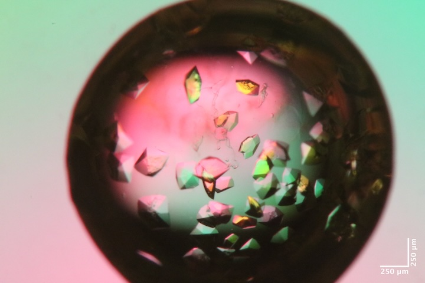
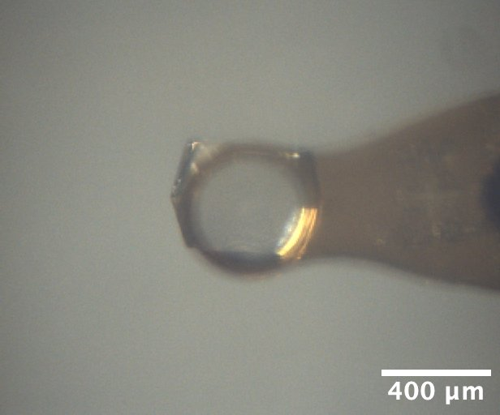
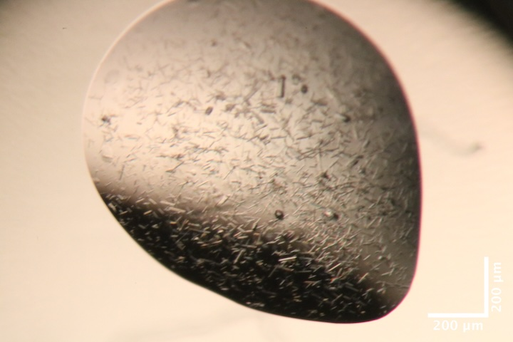
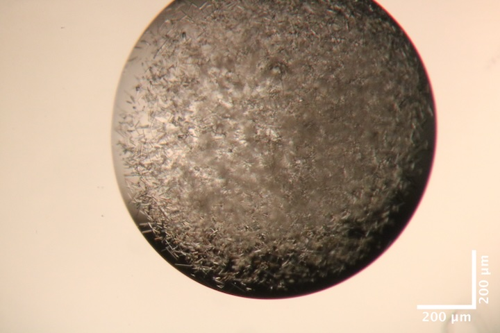
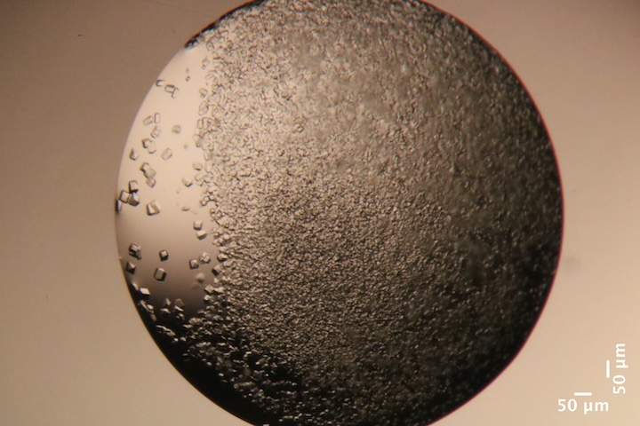
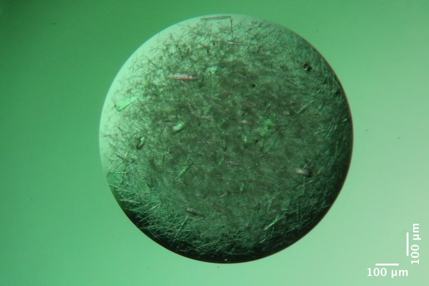
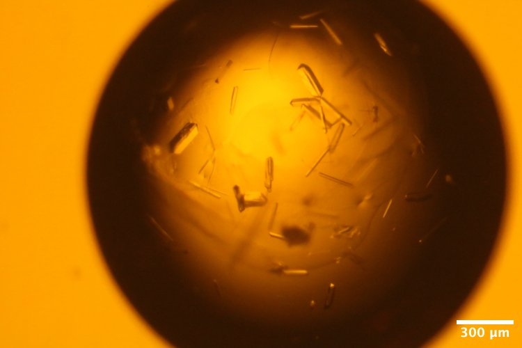
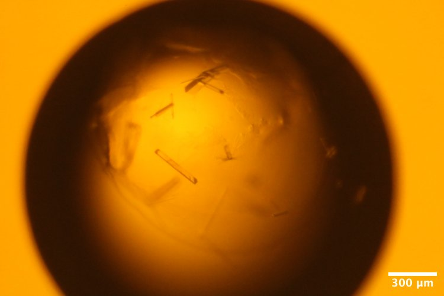
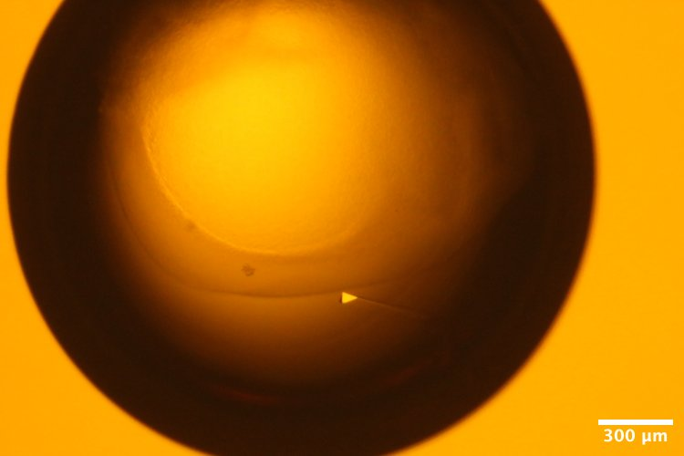
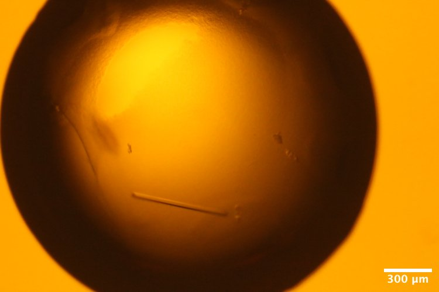

# 2026-06-10 @ CHESS 7b2

First CHESS beam time of the 2026-2 run cycle.

## Goals

- DHFR-Fol-NADP diffuse map at 277 K
- DHFR-Fol-NADP multi-temperature data collection (following [Hekstra lab's published protocol](https://doi.org/10.1073/pnas.2313192121)).
- Screening Mac1 hits obtained during Oryx training last week.

## Participants

Steve M, Katie L, & Xiaokun P from Ando lab; support from John I & Tricia C at CHESS

## Data

Root directory at CHESS: `/nfs/chess/raw/2026-2/id7b2/meisburger/20260610`

Root directory on OSN: `s3://diffuse-chess-public/20260610`

## Beamline setup

parameter | value | notes
--- | --- | ---
X-ray energy | 14 keV @ 0.01% bandwidth | Si 111 channel cut mono inserted
Beam size | 100 µm x 100 µm (initially) | Slit-defined, no CRL. Adjusted to match crystal size when noted, below.
Flux | 7.8 x 10^10^ ph/s | ICol ~36,000 / 0.1 s (see CHESS 7b2 beamline notebook #3)
Background reduction | On-axis mirror with Mo tube |
Centering camera | top-view and on-axis cameras | Top view: 1.713 µm / pixel at 4x zoom ratio; On axis: 0.740 µm / pixel at 4x zoom ratio
Beamstop | 700 µm diameter Mo disk suspended on mylar sheet | semi-transparent 
Data collection software | "MX Collect" (python) & SPEC | No changes since last time
Temperature control | none (initially) | For DHFR only, the Oxford cryostream was installed end-on

Steve arrived at 10 and set up the workspace. John and Tricia aligned the beam and optics and installed the cold stream. Steve re-measured the flux (noted above), optimized the beam profile, added steel shielding and Pb tape to clean up background scattering.

Took a 1s exposure with no pin (just air) to assess background.

Subdirectory: `setup`

| prefix   |   φ0 (deg.) |   ∆φ (deg.) |   images |   ∆t (s) |   tf (%) |   d (mm) |   E (keV) |
|----------|-------------|-------------|----------|----------|----------|----------|-----------|
| air_312  |           0 |           0 |        1 |        1 |      100 |      185 |        14 |

Looks pretty good.

## Samples

The following samples were grown in 24-well hanging-drop vapor diffusion trays:

Name | Sample | Well composition | Drop composition | Notes
--- | --- | --- | --- | ---
Mac1 (P4~3~ space group) | SARS CoV2 NSP3 macrodomain and seed stock from UCSF. 40 mg/mL Mac1 in 150 mM NaCl, 20 mM Tris pH 8, 5% glycerol | 30% (w/vol) PEG 3000 + 100 mM CHES (pH 9.5) | 2 µL protein + 1 µL well solution + 1 µL seeds (undiluted) | 24-well hanging-drop vapor diffusion tray (2/10/2026). See Katie L Ando Lab notebook p. 32 |
''  | ''  | Hampton Crystal Screen HT ([pdf]([https://hamptonresearch.com/uploads/support_materials/HR2-130_Binder.pdf)) | 1.5 µL protein + 1 µL well solution + 0.5 µL seed stock | 96 well sitting drop vapor diffuse tray set up during Oryx robot training (6/2/2026). See Katie L Ando Lab notebook p. ?? |
Lysozyme | Hen egg lysozyme, 50 mg/mL in NaOAc | 0.9 M NaCl, 100 mM NaOAc pH 4.2 | 2 µL protein + 2 µL well solution | 24-well hanging-drop vapor diffusion tray set up by Min P for practice (10/17/2025). |
DHFR-Folate-NADP | E. coli dihydrofolate reductase expressed and purified at Cornell. Dialyzed in 20 mM imidazole pH 7.0 with 1 mM folic acid and concentrated to 35 mg/mL. NADP+ added in 3:1 molar excess (final concentrations: 31.5 mg/mL DHFR, 6.3 mM NADP) | 15% PEG 400, 100 mM MnCl~2~, 20 mM imidazole pH 7.0 | 1.5 µL protein + 1.5 µL well solution + 1 µL seed stock | DHFR Tray #4 row A (5/8/2026). Sixteen crystals were looped in the cold room under red light and transported to CHESS at 4 deg C. See Steve's Ando Lab Notebook #3, pp. 73, 76, 77 |

-  
Mac1 crystal from well A6 of Katie L's tray dated 2/10/2026. Katie harvested from well B6, which was not photographed, but had the same conditions as A6 (except that A6 had agarose added to the drop).
Well solution: 38% PEG, 100 mM CHES pH 9.5. 
Drop: 2 µL protein + 1 µL well solution + 1 µL seed stock. 

-  
Lysozyme crystal mounted on the beamline, from well A4 of Min P's practice tray, dated 10/17/2025. 
Well solution: 0.9 M NaCl, 100 mM Na acetate pH 4.2.
Drop: 2 µL protein + 2 µL well solution

-  
Mac1 crystals from well B3 of Katie L's screening tray, dated 6/2/2026.
Precipitant solution: 0.2 M Ammonium sulfate, 0.1 M Na cacodylate trihydrate pH 6.5, 30% w/v PEG 8,000
Drops contain: .1, .08, .04 seed (top), .15, .08, .04 seed (bottom)

-  
Mac1 crystals from well B5 of Katie L's screening tray, dated 6/2/2026.
Precipitant solution: 0.2 M Li sulfate monohydrate, 0.1 M TRIS hydrochloride pH 8.5, 30% w/v PEG 4,000
Drops contain 1.5 µL protein + 1 µL precipitant solution + 0.5 µL seed stock.

-  
Mac1 crystals from well B10 of Katie L's screening tray, dated 6/2/2026.
Precipitant solution: 0.2 M Na acetate trihydrate, 0.1 M TRIS hydrochloride pH 8.5, 30% w/v PEG 4,000. 
Drops contain 1.5 µL protein + 1 µL precipitant solution + 0.5 µL seed stock.

-  
Mac1 crystals from well G5 of Katie L's screening tray, dated 6/2/2026.
Precipitant solution: 0.1 M NaCl, 0.1 M HEPES pH 7.5, 1.6 M Ammonium sulfate. 
Drops contain 1.5 µL protein + 1 µL precipitant solution + 0.5 µL seed stock.

-  
DHFR-Folate crystals from well A2 of Steve's DHFR Tray #4, dated 5/8/2026.
Well solution: 15% PEG 400, 100 mM MnCl~2~, 20 mM imidazole pH 7.0.
Drop: 1.5 µL protein + 1.5 µL well solution + 1 µL seed stock (10-fold dilution)

-  
DHFR-Folate crystals from well A3 of Steve's DHFR Tray #4, dated 5/8/2026.
Well solution: 15% PEG 400, 100 mM MnCl~2~, 20 mM imidazole pH 7.0.
Drop: 1.5 µL protein + 1.5 µL well solution + 1 µL seed stock (100-fold dilution)

-  
DHFR-Folate crystals from well A5 of Steve's DHFR Tray #4, dated 5/8/2026.
Well solution: 15% PEG 400, 100 mM MnCl~2~, 20 mM imidazole pH 7.0.
Drop: 1.5 µL protein + 1.5 µL well solution + 1 µL seed stock (10,000-fold dilution)

-  
DHFR-Folate crystals from well A6 of Steve's DHFR Tray #4, dated 5/8/2026.
Well solution: 15% PEG 400, 100 mM MnCl~2~, 20 mM imidazole pH 7.0.
Drop: 1.5 µL protein + 1.5 µL well solution + 1 µL seed stock (100,000-fold dilution)

## Data collection

First, use lysozyme and mac1 to test radiation damage. 

### 1. Lysozyme

!!! quote inline end ""

    <video width="308" autoplay muted loop playsinlin controls>
    <source src="lys1_oac_zoom1.mp4" type="video/mp4">
    Your browser does not support the video tag.
    </video>

Katie looped a ~400 µm lysozyme crystal from well A4 of tray dated 10/17/2025.

Subdirectory: `lysozyme`

Snapped images every 30˚ using the on-axis camera, prefix: `lys1_oac_zoom1`.

| prefix      |   φ0 (deg.) |   φ1 (deg.) |   ∆φ (deg.) |   images |   ∆t (s) |   tf (%) |   d (mm) |   E (keV) |
|-------------|-------------|-------------|-------------|----------|----------|----------|----------|-----------|
| lys1_313    |           0 |         720 |         0.1 |     7200 |     0.01 |      100 |      185 |        14 |
| lys1_bg_314 |           0 |         720 |         1   |      720 |     0.1  |      100 |      185 |        14 |

??? info "xia2 processing"

    |                 | lys1_313                               |
    |-----------------|----------------------------------------|
    | scan            | 313                                    |
    | Mosaic spread   | 0.008                                  |
    | Resolution      | 1.11                                   |
    | Unit Cell       | [79.03, 79.03, 38.0, 90.0, 90.0, 90.0] |
    | Image range     | [1, 7200]                              |
    | Completeness    | 94.3                                   |
    | Multiplicity    | 46.3                                   |
    | I/sigma         | 22.4                                   |
    | Rpim            | 0.012                                  |
    | Wilson B factor | 18.8                                   |
    | Space group     | P 43 21 2                              |

### 2. Mac1

Katie looped a Mac1 crystal from well B6 of tray dated 2/10/2026 using a 200 µm loop. The sleeve and loop have some droplets / PEG skin, might be a problem for diffuse map.

Subdirectory: `mac1`

| prefix        |   φ0 (deg.) |   φ1 (deg.) |   ∆φ (deg.) |   images |   ∆t (s) |   tf (%) |   d (mm) |   E (keV) |
|---------------|-------------|-------------|-------------|----------|----------|----------|----------|-----------|
| mac1_1_315    |           0 |         720 |         0.1 |     7200 |     0.01 |     47.1 |      185 |        14 |
| mac1_1_bg_316 |           0 |         720 |         1   |      720 |     0.1  |     47.1 |      185 |        14 |

??? info "xia2 processing"

    |                 | mac1_1_315                            |
    |-----------------|---------------------------------------|
    | scan            | 315                                   |
    | Mosaic spread   | 0.013                                 |
    | Resolution      | 1.07                                  |
    | Unit Cell       | [89.1, 89.1, 40.15, 90.0, 90.0, 90.0] |
    | Image range     | [1, 7200]                             |
    | Completeness    | 90.7                                  |
    | Multiplicity    | 22.8                                  |
    | I/sigma         | 15.6                                  |
    | Rpim            | 0.016                                 |
    | Wilson B factor | 13.87                                 |
    | Space group     | P 43                                  |

### 3. DHFR-Folate-NADP

!!! quote inline end ""

    <video width="308" autoplay muted loop playsinlin controls>
    <source src="dhfr_1_oac_zoom4.mp4" type="video/mp4">
    Your browser does not support the video tag.
    </video>

Steve placed the cold stream end-on and set the temperature to 277 K. The hutch was darkened and centering light was replaced with amber filtered LED source.

Steve mounted DHFR sample #1 (well A2) at 277 K. Slits were set to 100 x 100 µm.

Subdirectory: `dhfr/dhfr_1`

Snapped images every 30˚ using the on-axis camera, prefix: `dhfr_1_oac_zoom4`.

| prefix          |   φ0 (deg.) |   φ1 (deg.) |   ∆φ (deg.) |   images |   ∆t (s) |   tf (%) |   d (mm) |   E (keV) |
|-----------------|-------------|-------------|-------------|----------|----------|----------|----------|-----------|
| dhfr_1_277K_317 |           0 |         360 |         0.1 |     3600 |     0.01 |      100 |      185 |        14 |

!!! quote inline end ""

    <video width="308" autoplay muted loop playsinlin controls>
    <source src="dhfr_1_oac_zoom4.mp4" type="video/mp4">
    Your browser does not support the video tag.
    </video>

Next, ramp up to 310 K at 2 ˚C/min, collect another dataset.

| prefix          |   φ0 (deg.) |   φ1 (deg.) |   ∆φ (deg.) |   images |   ∆t (s) |   tf (%) |   d (mm) |   E (keV) |
|-----------------|-------------|-------------|-------------|----------|----------|----------|----------|-----------|
| dhfr_1_310K_318 |           0 |         360 |         0.1 |     3600 |     0.01 |      100 |      185 |        14 |

The protein looks pretty dried out.

Snapped images every 30˚ using the on-axis camera, prefix: `dhfr_1_310K_oac_zoom4`.

Ramp back down to 277 K at 2 ˚C/min. Was this reversible?

| prefix          |   φ0 (deg.) |   φ1 (deg.) |   ∆φ (deg.) |   images |   ∆t (s) |   tf (%) |   d (mm) |   E (keV) |
|-----------------|-------------|-------------|-------------|----------|----------|----------|----------|-----------|
| dhfr_1_277K_319 |           0 |         360 |         0.1 |     3600 |     0.01 |      100 |      185 |        14 |

After cooling, the capillary had a lot of condensation on it. Clearly there are some temperature differentials inside the capillary that need to be optimized. Will revisit multi-temperature systematically at the end.

??? info "xia2 processing"

    |                 | dhfr_1_277K_317                         |
    |-----------------|-----------------------------------------|
    | scan            | 317                                     |
    | Mosaic spread   | 0.064                                   |
    | Resolution      | 1.25                                    |
    | Unit Cell       | [34.19, 45.27, 98.85, 90.0, 90.0, 90.0] |
    | Image range     | [1, 3600]                               |
    | Completeness    | 99.6                                    |
    | Multiplicity    | 12.9                                    |
    | I/sigma         | 6.5                                     |
    | Rpim            | 0.055                                   |
    | Wilson B factor | 12.34                                   |
    | Space group     | P 21 21 21                              |

### 4. DHFR-Folate-NADP

!!! quote inline end ""

    <video width="308" autoplay muted loop playsinlin controls>
    <source src="dhfr_2_277K_oac_zoom4.mp4" type="video/mp4">
    Your browser does not support the video tag.
    </video>

Steve mounted DHFR sample #2 (well A2) at 277 K.  This is a long crystal sitting at an angle on the loop. 

Subdirectory: `dhfr/dhfr_2`

Slits changed to 50 x 50 µm. Vector scan with 20 ms exposures, repeated for radiation damage assessment (the second scan could be merged if undamaged).

| prefix             |   φ0 (deg.) |   φ1 (deg.) |   ∆φ (deg.) |   images |   ∆t (s) |   tf (%) |   d (mm) |   E (keV) |
|--------------------|-------------|-------------|-------------|----------|----------|----------|----------|-----------|
| dhfr_2_277K_320    |           0 |         360 |         0.1 |     3600 |     0.02 |      100 |      185 |        14 |
| dhfr_2_277K_321    |           0 |         360 |         0.1 |     3600 |     0.02 |      100 |      185 |        14 |
| dhfr_2_277K_bg_322 |           0 |         360 |         1   |      360 |     0.2  |      100 |      185 |        14 |

Snapped images every 30˚ using the on-axis camera, prefix: `dhfr_2_277K_oac_zoom4`.

??? info "xia2 processing"

    |                 | dhfr_2_277K_320                         |
    |-----------------|-----------------------------------------|
    | scan            | 320                                     |
    | Mosaic spread   | 0.046                                   |
    | Resolution      | 1.28                                    |
    | Unit Cell       | [34.25, 45.42, 98.83, 90.0, 90.0, 90.0] |
    | Image range     | [1, 3600]                               |
    | Completeness    | 100.0                                   |
    | Multiplicity    | 13.0                                    |
    | I/sigma         | 8.1                                     |
    | Rpim            | 0.073                                   |
    | Wilson B factor | 13.05                                   |
    | Space group     | P 21 21 21                              |

### 5. DHFR-Folate-NADP

!!! quote inline end ""

    <video width="308" autoplay muted loop playsinlin controls>
    <source src="dhfr_3_277K_oac_zoom4.mp4" type="video/mp4">
    Your browser does not support the video tag.
    </video>

Steve mounted DHFR sample #3 (well A2) at 277K. Crystal is a ~100x50 µm rod.

Subdirectory: `dhfr/dhfr_3`

Snapped images every 30˚ using the on-axis camera, prefix: `dhfr_3_277K_oac_zoom4`.

Slits changed to 100 x 100 µm. Regular scan with 10 ms exposures, repeated for radiation damage assessment (the second scan could be merged if undamaged).

| prefix             |   φ0 (deg.) |   φ1 (deg.) |   ∆φ (deg.) |   images |   ∆t (s) |   tf (%) |   d (mm) |   E (keV) |
|--------------------|-------------|-------------|-------------|----------|----------|----------|----------|-----------|
| dhfr_3_277K_323    |           0 |         360 |         0.1 |     3600 |     0.01 |      100 |      185 |        14 |
| dhfr_3_277K_324    |           0 |         360 |         0.1 |     3600 |     0.01 |      100 |      185 |        14 |
| dhfr_3_277K_bg_325 |           0 |         360 |         1   |      360 |     0.1  |      100 |      185 |        14 |

??? info "xia2 processing"

    |                 | dhfr_3_277K_323                         |
    |-----------------|-----------------------------------------|
    | scan            | 323                                     |
    | Mosaic spread   | 0.033                                   |
    | Resolution      | 1.23                                    |
    | Unit Cell       | [34.28, 45.52, 98.81, 90.0, 90.0, 90.0] |
    | Image range     | [1, 3600]                               |
    | Completeness    | 100.0                                   |
    | Multiplicity    | 12.7                                    |
    | I/sigma         | 5.6                                     |
    | Rpim            | 0.059                                   |
    | Wilson B factor | 11.7                                    |
    | Space group     | P 21 21 21                              |

### 6. DHFR-Folate-NADP

!!! quote inline end ""

    <video width="308" autoplay muted loop playsinlin controls>
    <source src="dhfr_4_277K_oac_zoom4.mp4" type="video/mp4">
    Your browser does not support the video tag.
    </video>

Steve mounted DHFR sample #4 (well A2) at 277 K. Crystal is ~100 x 25 µm.

Subdirectory: `dhfr/dhfr_4`

Snapped images every 30˚ using the on-axis camera, prefix: `dhfr_4_277K_oac_zoom4`.

Slits changed to 100 x 50 µm (h x v). Regular scan with 10 ms exposures, repeated for radiation damage assessment (the second scan could be merged if undamaged).

| prefix             |   φ0 (deg.) |   φ1 (deg.) |   ∆φ (deg.) |   images |   ∆t (s) |   tf (%) |   d (mm) |   E (keV) |
|--------------------|-------------|-------------|-------------|----------|----------|----------|----------|-----------|
| dhfr_4_277K_326    |           0 |         360 |         0.1 |     3600 |     0.01 |      100 |      185 |        14 |
| dhfr_4_277K_327    |           0 |         360 |         0.1 |     3600 |     0.01 |      100 |      185 |        14 |
| dhfr_4_277K_bg_328 |           0 |         360 |         1   |      360 |     0.1  |      100 |      185 |        14 |

??? info "xia2 processing"

    |                 | dhfr_4_277K_326                         |
    |-----------------|-----------------------------------------|
    | scan            | 326                                     |
    | Mosaic spread   | 0.027                                   |
    | Resolution      | 1.19                                    |
    | Unit Cell       | [34.27, 45.48, 98.83, 90.0, 90.0, 90.0] |
    | Image range     | [1, 3600]                               |
    | Completeness    | 99.1                                    |
    | Multiplicity    | 12.5                                    |
    | I/sigma         | 5.9                                     |
    | Rpim            | 0.06                                    |
    | Wilson B factor | 12.12                                   |
    | Space group     | P 21 21 21                              |

!!! warning "beam tune up"

    ICol counts increased from ~15,000 / 0.1s to ~23,000 / 0.1s (slits 100 x 50 µm).

### 7. DHFR-Folate-NADP

!!! quote inline end ""

    <video width="308" autoplay muted loop playsinlin controls>
    <source src="dhfr_5_277K_oac_zoom4.mp4" type="video/mp4">
    Your browser does not support the video tag.
    </video>

Steve mounted DHFR sample #5 (well A2) at 277 K. A small blucky crystal? Crytsal oriented perpendicular to the rotation axis.

Subdirectory: `dhfr/dhfr_5`

Snapped images every 30˚ using the on-axis camera, prefix: `dhfr_5_277K_oac_zoom4`.

Slits changed to 50 x 100 µm (h x v). Regular scan with 10 ms exposures, repeated for radiation damage assessment (the second scan could be merged if undamaged).

| prefix             |   φ0 (deg.) |   φ1 (deg.) |   ∆φ (deg.) |   images |   ∆t (s) |   tf (%) |   d (mm) |   E (keV) |
|--------------------|-------------|-------------|-------------|----------|----------|----------|----------|-----------|
| dhfr_5_277K_329    |           0 |         360 |         0.1 |     3600 |     0.01 |      100 |      185 |        14 |
| dhfr_5_277K_330    |           0 |         360 |         0.1 |     3600 |     0.01 |      100 |      185 |        14 |
| dhfr_5_277K_bg_331 |           0 |         360 |         1   |      360 |     0.1  |      100 |      185 |        14 |

!!! warning "multiple lattices"

    45.6% indexed

??? info "xia2 processing"

    |                 | dhfr_5_277K_329                         |
    |-----------------|-----------------------------------------|
    | scan            | 329                                     |
    | Mosaic spread   | 0.037                                   |
    | Resolution      | 1.28                                    |
    | Unit Cell       | [34.29, 45.51, 98.81, 90.0, 90.0, 90.0] |
    | Image range     | [1, 3600]                               |
    | Completeness    | 100.0                                   |
    | Multiplicity    | 13.0                                    |
    | I/sigma         | 5.5                                     |
    | Rpim            | 0.062                                   |
    | Wilson B factor | 12.04                                   |
    | Space group     | P 21 21 21                              |

### 8. DHFR-Folate-NADP

!!! quote inline end ""

    <video width="308" autoplay muted loop playsinlin controls>
    <source src="dhfr_6_277K_oac_zoom4.mp4" type="video/mp4">
    Your browser does not support the video tag.
    </video>

Steve mounted sample #6 (well A2) at 277 K. Crystal is ~100 x ~35 µm.

Subdirectory: `dhfr/dhfr_6`

Snapped images every 30˚ using the on-axis camera, prefix: `dhfr_6_277K_oac_zoom4`.

Slits changed to 100 x 50 µm (h x v). Regular scan with 10 ms exposures, repeated for radiation damage assessment (the second scan could be merged if undamaged).

| prefix             |   φ0 (deg.) |   φ1 (deg.) |   ∆φ (deg.) |   images |   ∆t (s) |   tf (%) |   d (mm) |   E (keV) |
|--------------------|-------------|-------------|-------------|----------|----------|----------|----------|-----------|
| dhfr_6_277K_332    |           0 |         360 |         0.1 |     3600 |     0.01 |      100 |      185 |        14 |
| dhfr_6_277K_333    |           0 |         360 |         0.1 |     3600 |     0.01 |      100 |      185 |        14 |
| dhfr_6_277K_bg_334 |           0 |         360 |         1   |      360 |     0.1  |      100 |      185 |        14 |

??? info "xia2 processing"

    |                 | dhfr_6_277K_332                        |
    |-----------------|----------------------------------------|
    | scan            | 332                                    |
    | Mosaic spread   | 0.018                                  |
    | Resolution      | 1.14                                   |
    | Unit Cell       | [34.29, 45.51, 98.8, 90.0, 90.0, 90.0] |
    | Image range     | [1, 3600]                              |
    | Completeness    | 96.3                                   |
    | Multiplicity    | 12.0                                   |
    | I/sigma         | 6.8                                    |
    | Rpim            | 0.045                                  |
    | Wilson B factor | 12.5                                   |
    | Space group     | P 21 21 21                             |

### 9. DHFR-Folate-NADP

!!! quote inline end ""

    <video width="308" autoplay muted loop playsinlin controls>
    <source src="dhfr_7_277K_oac_zoom4.mp4" type="video/mp4">
    Your browser does not support the video tag.
    </video>

Steve mounted DHFR sample #7 (well A2) at 277 K. Crystal is ~100 x 50 µm, oriented diagonally.

Subdirectory: `dhfr/dhfr_7`

Snapped images every 30˚ using the on-axis camera, prefix: `dhfr_7_277K_oac_zoom4`.

Slits changed to 100 x 100 µm (h x v). Regular scan with 10 ms exposures, repeated for radiation damage assessment (the second scan could be merged if undamaged).

| prefix             |   φ0 (deg.) |   φ1 (deg.) |   ∆φ (deg.) |   images |   ∆t (s) |   tf (%) |   d (mm) |   E (keV) |
|--------------------|-------------|-------------|-------------|----------|----------|----------|----------|-----------|
| dhfr_7_277K_335    |           0 |         360 |         0.1 |     3600 |     0.01 |      100 |      185 |        14 |
| dhfr_7_277K_336    |           0 |         360 |         0.1 |     3600 |     0.01 |      100 |      185 |        14 |
| dhfr_7_277K_bg_337 |           0 |         360 |         1   |      360 |     0.1  |      100 |      185 |        14 |

??? info "xia2 processing"

    |                 | dhfr_7_277K_335                        |
    |-----------------|----------------------------------------|
    | scan            | 335                                    |
    | Mosaic spread   | 0.009                                  |
    | Resolution      | 1.16                                   |
    | Unit Cell       | [34.28, 45.48, 98.8, 90.0, 90.0, 90.0] |
    | Image range     | [1, 3600]                              |
    | Completeness    | 100.0                                  |
    | Multiplicity    | 11.9                                   |
    | I/sigma         | 6.7                                    |
    | Rpim            | 0.048                                  |
    | Wilson B factor | 12.65                                  |
    | Space group     | P 21 21 21                             |

### 10. DHFR-Folate-NADP

!!! quote inline end ""

    <video width="308" autoplay muted loop playsinlin controls>
    <source src="dhfr_8_277K_oac_zoom4.mp4" type="video/mp4">
    Your browser does not support the video tag.
    </video>

Steve mounted DHFR sample #8 (well A2) at 277 K. Crystal is ~200 x 50 x 10 µm long (thin blade shape).

Subdirectory: `dhfr/dhfr_8`

Snapped images every 30˚ using the on-axis camera, prefix: `dhfr_8_277K_oac_zoom4`.

Slits changed to 50 x 50 µm (h x v). Vector scan over ~150 µm with 20 ms exposures, repeated for radiation damage assessment (the second scan could be merged if undamaged).

| prefix             |   φ0 (deg.) |   φ1 (deg.) |   ∆φ (deg.) |   images |   ∆t (s) |   tf (%) |   d (mm) |   E (keV) |
|--------------------|-------------|-------------|-------------|----------|----------|----------|----------|-----------|
| dhfr_8_277K_338    |           0 |         360 |         0.1 |     3600 |     0.02 |      100 |      185 |        14 |
| dhfr_8_277K_339    |           0 |         360 |         0.1 |     3600 |     0.02 |      100 |      185 |        14 |
| dhfr_8_277K_bg_340 |           0 |         360 |         1   |      360 |     0.2  |      100 |      185 |        14 |

??? info "xia2 processing"

    |                 | dhfr_8_277K_338                         |
    |-----------------|-----------------------------------------|
    | scan            | 338                                     |
    | Mosaic spread   | 0.217                                   |
    | Resolution      | 1.37                                    |
    | Unit Cell       | [34.32, 45.56, 98.99, 90.0, 90.0, 90.0] |
    | Image range     | [1, 3600]                               |
    | Completeness    | 97.9                                    |
    | Multiplicity    | 13.4                                    |
    | I/sigma         | 6.9                                     |
    | Rpim            | 0.086                                   |
    | Wilson B factor | 13.61                                   |
    | Space group     | P 21 21 21                              |

### 11. DHFR-Folate-NADP

!!! quote inline end ""

    <video width="308" autoplay muted loop playsinlin controls>
    <source src="dhfr_9_277K_oac_zoom2.mp4" type="video/mp4">
    Your browser does not support the video tag.
    </video>

Steve mounted DHFR sample #9 (large crystal from well A5) at 277 K. The crystal is ~500 x 100 x 50 µm.

Subdirectory: `dhfr/dhfr_9`

Snapped images every 30˚ using the on-axis camera (2x zoom ratio), prefix: `dhfr_9_277K_oac_zoom2`.

Slits changed to 100 x 100 µm (h x v). Vector scan over ~430 µm with 20 ms exposures and 720 degrees, repeated for radiation damage assessment (the second scan could be merged if undamaged).

| prefix             |   φ0 (deg.) |   φ1 (deg.) |   ∆φ (deg.) |   images |   ∆t (s) |   tf (%) |   d (mm) |   E (keV) |
|--------------------|-------------|-------------|-------------|----------|----------|----------|----------|-----------|
| dhfr_9_277K_341    |           0 |         720 |         0.1 |     7200 |     0.02 |      100 |      185 |        14 |
| dhfr_9_277K_342    |           0 |         720 |         0.1 |     7200 |     0.02 |      100 |      185 |        14 |
| dhfr_9_277K_bg_343 |           0 |         720 |         1   |      720 |     0.2  |      100 |      185 |        14 |

??? info "xia2 processing"

    |                 | dhfr_9_277K_341                         |
    |-----------------|-----------------------------------------|
    | scan            | 341                                     |
    | Mosaic spread   | 0.035                                   |
    | Resolution      | 1.03                                    |
    | Unit Cell       | [34.18, 45.18, 98.94, 90.0, 90.0, 90.0] |
    | Image range     | [1, 7200]                               |
    | Completeness    | 80.3                                    |
    | Multiplicity    | 22.5                                    |
    | I/sigma         | 13.7                                    |
    | Rpim            | 0.019                                   |
    | Wilson B factor | 12.9                                    |
    | Space group     | P 21 21 21                              |

### 12. DHFR-Folate-NADP

!!! quote inline end ""

    <video width="308" autoplay muted loop playsinlin controls>
    <source src="dhfr_10_277K_oac_zoom4.mp4" type="video/mp4">
    Your browser does not support the video tag.
    </video>

Steve mounted DHFR sample #10 (thin long crystal from well A6) at 277 K.

Subdirectory: `dhfr/dhfr_10`

Snapped images every 30˚ using the on-axis camera (4x zoom ratio), prefix: `dhfr_10_277K_oac_zoom4`.

Slits changed to 100 x 50 µm (h x v). Vector scan over ~340 µm with 20 ms exposures and 720 degrees, repeated for radiation damage assessment (the second scan could be merged if undamaged).

| prefix              |   φ0 (deg.) |   φ1 (deg.) |   ∆φ (deg.) |   images |   ∆t (s) |   tf (%) |   d (mm) |   E (keV) |
|---------------------|-------------|-------------|-------------|----------|----------|----------|----------|-----------|
| dhfr_10_277K_344    |           0 |         720 |         0.1 |     7200 |     0.02 |      100 |      185 |        14 |
| dhfr_10_277K_345    |           0 |         720 |         0.1 |     7200 |     0.02 |      100 |      185 |        14 |
| dhfr_10_277K_bg_346 |           0 |         720 |         1   |      720 |     0.2  |      100 |      185 |        14 |

??? info "xia2 processing"

    |                 | dhfr_10_277K_344                       |
    |-----------------|----------------------------------------|
    | scan            | 344                                    |
    | Mosaic spread   | 0.021                                  |
    | Resolution      | 1.05                                   |
    | Unit Cell       | [34.25, 45.4, 98.86, 90.0, 90.0, 90.0] |
    | Image range     | [1, 7200]                              |
    | Completeness    | 81.4                                   |
    | Multiplicity    | 23.5                                   |
    | I/sigma         | 14.3                                   |
    | Rpim            | 0.019                                  |
    | Wilson B factor | 12.88                                  |
    | Space group     | P 21 21 21                             |

### 13. DHFR-Folate-NADP

!!! quote inline end ""

    <video width="308" autoplay muted loop playsinlin controls>
    <source src="dhfr_11_277K_oac_zoom4.mp4" type="video/mp4">
    Your browser does not support the video tag.
    </video>

Steve mounted DHFR sample #11 (~200 µm long crystal from well A3) at 277 K.

Subdirectory: `dhfr/dhfr_11`

Snapped images every 30˚ using the on-axis camera (4x zoom ratio), prefix: `dhfr_11_277K_oac_zoom4`.

Slits set to 100 x 50 µm (h x v). Vector scan over ~150 µm with 20 ms exposures and 360 degrees, repeated for radiation damage assessment (the second scan could be merged if undamaged).

| prefix              |   φ0 (deg.) |   φ1 (deg.) |   ∆φ (deg.) |   images |   ∆t (s) |   tf (%) |   d (mm) |   E (keV) |
|---------------------|-------------|-------------|-------------|----------|----------|----------|----------|-----------|
| dhfr_11_277K_347    |           0 |         360 |         0.1 |     3600 |     0.02 |      100 |      185 |        14 |
| dhfr_11_277K_348    |           0 |         360 |         0.1 |     3600 |     0.02 |      100 |      185 |        14 |
| dhfr_11_277K_bg_349 |           0 |         360 |         1   |      360 |     0.2  |      100 |      185 |        14 |

??? info "xia2 processing"

    |                 | dhfr_11_277K_347                        |
    |-----------------|-----------------------------------------|
    | scan            | 347                                     |
    | Mosaic spread   | 0.016                                   |
    | Resolution      | 1.07                                    |
    | Unit Cell       | [34.25, 45.43, 98.85, 90.0, 90.0, 90.0] |
    | Image range     | [1, 3600]                               |
    | Completeness    | 84.3                                    |
    | Multiplicity    | 11.9                                    |
    | I/sigma         | 9.6                                     |
    | Rpim            | 0.033                                   |
    | Wilson B factor | 12.4                                    |
    | Space group     | P 21 21 21                              |

### 14. DHFR-Folate-NADP

!!! quote inline end ""

    <video width="308" autoplay muted loop playsinlin controls>
    <source src="dhfr_12_277K_oac_zoom4.mp4" type="video/mp4">
    Your browser does not support the video tag.
    </video>

Steve mounted DHFR sample #12 (~100 µm long crystal from well A3) at 277 K. 

!!! warning ""

    There is a big drop of water on the surface of the capillary, but it shouldn't intercept the direct beam (however may block diffraction at certain angles).

Subdirectory: `dhfr/dhfr_12`

Snapped images every 30˚ using the on-axis camera (4x zoom ratio), prefix: `dhfr_12_277K_oac_zoom4`.

Slits set to 100 x 50 µm (h x v). Regular scan with 10 ms exposures and 360 degrees, repeated for radiation damage assessment (the second scan could be merged if undamaged).

| prefix              |   φ0 (deg.) |   φ1 (deg.) |   ∆φ (deg.) |   images |   ∆t (s) |   tf (%) |   d (mm) |   E (keV) |
|---------------------|-------------|-------------|-------------|----------|----------|----------|----------|-----------|
| dhfr_12_277K_350    |           0 |         360 |         0.1 |     3600 |     0.01 |      100 |      185 |        14 |
| dhfr_12_277K_351    |           0 |         360 |         0.1 |     3600 |     0.01 |      100 |      185 |        14 |
| dhfr_12_277K_bg_352 |           0 |         360 |         1   |      360 |     0.1  |      100 |      185 |        14 |

??? info "xia2 processing"

    |                 | dhfr_12_277K_350                        |
    |-----------------|-----------------------------------------|
    | scan            | 350                                     |
    | Mosaic spread   | 0.007                                   |
    | Resolution      | 1.13                                    |
    | Unit Cell       | [34.27, 45.47, 98.81, 90.0, 90.0, 90.0] |
    | Image range     | [1, 3600]                               |
    | Completeness    | 92.7                                    |
    | Multiplicity    | 12.2                                    |
    | I/sigma         | 7.1                                     |
    | Rpim            | 0.046                                   |
    | Wilson B factor | 12.9                                    |
    | Space group     | P 21 21 21                              |

### 15. DHFR-Folate-NADP

!!! quote inline end ""

    <video width="308" autoplay muted loop playsinlin controls>
    <source src="dhfr_13_277K_oac_zoom4.mp4" type="video/mp4">
    Your browser does not support the video tag.
    </video>

Steve mounted DHFR sample #13 (~100 µm long crystal from well A3) at 277 K. 

!!! warning ""

    Huge blob of gunk came along for the ride. Not ideal for background subtraction.

Subdirectory: `dhfr/dhfr_13`

Snapped images every 30˚ using the on-axis camera (4x zoom ratio), prefix: `dhfr_13_277K_oac_zoom4`.

Slits set to 100 x 50 µm (h x v). Vector scan with 20 ms exposures and 360 degrees, repeated for radiation damage assessment (the second scan could be merged if undamaged).

| prefix              |   φ0 (deg.) |   φ1 (deg.) |   ∆φ (deg.) |   images |   ∆t (s) |   tf (%) |   d (mm) |   E (keV) |
|---------------------|-------------|-------------|-------------|----------|----------|----------|----------|-----------|
| dhfr_13_277K_353    |           0 |         360 |         0.1 |     3600 |     0.02 |      100 |      185 |        14 |
| dhfr_13_277K_354    |           0 |         360 |         0.1 |     3600 |     0.02 |      100 |      185 |        14 |
| dhfr_13_277K_bg_355 |           0 |         360 |         1   |      360 |     0.2  |      100 |      185 |        14 |
| dhfr_13_277K_bg_356 |           0 |         360 |         1   |      360 |     0.2  |      100 |      185 |        14 |

??? info "xia2 processing"

    |                 | dhfr_13_277K_353                        |
    |-----------------|-----------------------------------------|
    | scan            | 353                                     |
    | Mosaic spread   | 0.077                                   |
    | Resolution      | 1.51                                    |
    | Unit Cell       | [34.26, 45.44, 98.83, 90.0, 90.0, 90.0] |
    | Image range     | [1, 3600]                               |
    | Completeness    | 99.4                                    |
    | Multiplicity    | 10.8                                    |
    | I/sigma         | 12.7                                    |
    | Rpim            | 0.946                                   |
    | Wilson B factor | 14.17                                   |
    | Space group     | P 21 21 21                              |

!!! note "Setup change"

    Cold stream removed. Switch to Mac1 screening.

### 16. Mac1

!!! quote inline end ""

    <video width="308" autoplay muted loop playsinlin controls>
    <source src="mac1_B3b_oac_zoom4.mp4" type="video/mp4">
    Your browser does not support the video tag.
    </video>

Xiakun looped a crystal from B3 Bottom drop of katie's 6/2/2026 Mac1 P43 screening tray (Xtal-HT). Used 100 µm loop w/ 10 µL well sleeve. It looked like 2 crystals inside the loop.

Subdirectory: `mac1/mac1_B3b`

Slits set to 50 x 50 µm. Regular scan of 360 degrees.

| prefix       |   φ0 (deg.) |   φ1 (deg.) |   ∆φ (deg.) |   images |   ∆t (s) |   tf (%) |   d (mm) |   E (keV) |
|--------------|-------------|-------------|-------------|----------|----------|----------|----------|-----------|
| mac1_B3b_357 |           0 |         360 |         0.5 |      720 |     0.02 |      100 |      185 |        14 |

Snapped images every 30˚ using the on-axis camera, prefix: `mac1_B3b_oac_zoom4`.

??? info "xia2 processing"

    |                 | mac1_B3b_357                            |
    |-----------------|-----------------------------------------|
    | scan            | 357                                     |
    | Mosaic spread   | 0.092                                   |
    | Resolution      | 1.53                                    |
    | Unit Cell       | [89.12, 89.12, 40.36, 90.0, 90.0, 90.0] |
    | Image range     | [1, 720]                                |
    | Completeness    | 100.0                                   |
    | Multiplicity    | 13.8                                    |
    | I/sigma         | 4.4                                     |
    | Rpim            | 0.079                                   |
    | Wilson B factor | 14.55                                   |
    | Space group     | P 41                                    |

### 17. Mac1

!!! quote inline end ""

    <video width="308" autoplay muted loop playsinlin controls>
    <source src="mac1_B5t_oac_zoom4.mp4" type="video/mp4">
    Your browser does not support the video tag.
    </video>

Katie looped a crystal from B5 top drop of the same tray with 100 µm loop, 10 µL well solution in the sleeve. Crystal was largest & squarest in drop. 

Subdirectory: `mac1/mac1_B5t`

Snapped images every 30˚ using the on-axis camera, prefix: `mac1_B5t_oac_zoom4`.

Slits set to 100 x 100 µm.

| prefix       |   φ0 (deg.) |   φ1 (deg.) |   ∆φ (deg.) |   images |   ∆t (s) |   tf (%) |   d (mm) |   E (keV) |
|--------------|-------------|-------------|-------------|----------|----------|----------|----------|-----------|
| mac1_B5t_358 |           0 |         360 |         0.5 |      720 |     0.02 |      100 |      185 |        14 |
| mac1_B5t_359 |           0 |         360 |         0.5 |      720 |     0.02 |      100 |      225 |        14 |

!!! warning "multiple lattices"

    20.7% indexed

??? info "xia2 processing"

    |                 | mac1_B5t_359                            |
    |-----------------|-----------------------------------------|
    | scan            | 359                                     |
    | Mosaic spread   | 0.427                                   |
    | Resolution      | 1.61                                    |
    | Unit Cell       | [89.12, 89.12, 40.27, 90.0, 90.0, 90.0] |
    | Image range     | [1, 720]                                |
    | Completeness    | 100.0                                   |
    | Multiplicity    | 13.8                                    |
    | I/sigma         | 3.2                                     |
    | Rpim            | 0.097                                   |
    | Wilson B factor | 13.15                                   |
    | Space group     | P 41                                    |

### 18. Mac1

!!! quote inline end ""

    <video width="308" autoplay muted loop playsinlin controls>
    <source src="mac1_B5t_rod_oac_zoom4.mp4" type="video/mp4">
    Your browser does not support the video tag.
    </video>

Katie looped another crystal from the same drop that was more rod-like, but too small for the 100 µm loop it was in, so iat appeared to be moving around in the loop.

Subdirectory: `mac1/mac1_B5t_rod`

Snapped images every 30˚ using the on-axis camera, prefix: `mac1_B5t_rod_oac_zoom4`.

Slits set to 100 x 100 µm.

| prefix           |   φ0 (deg.) |   φ1 (deg.) |   ∆φ (deg.) |   images |   ∆t (s) |   tf (%) |   d (mm) |   E (keV) |
|------------------|-------------|-------------|-------------|----------|----------|----------|----------|-----------|
| mac1_B5t_rod_360 |           0 |         360 |         0.5 |      720 |     0.02 |      100 |      225 |        14 |

Crystal slid while rotating but can still be indexed.

??? info "xia2 processing"

    |                 | mac1_B5t_rod_360                        |
    |-----------------|-----------------------------------------|
    | scan            | 360                                     |
    | Mosaic spread   | 0.387                                   |
    | Resolution      | 2.2                                     |
    | Unit Cell       | [88.86, 88.86, 40.18, 90.0, 90.0, 90.0] |
    | Image range     | [1, 720]                                |
    | Completeness    | 100.0                                   |
    | Multiplicity    | 24.3                                    |
    | I/sigma         | 1.2                                     |
    | Rpim            | 1.579                                   |
    | Wilson B factor | 11.28                                   |
    | Space group     | P 41 2 2                                |

### 19. Mac1

Katie looped something -- PEG skin? from bottom drop B10 of the same tray with 100 µm loop.

Subdirectory: `mac1/mac1_B10b`

Slits set to 100 x 100 µm. Collect from three locations: centered (361), near the base (362), and near the top (363).

| prefix          |   φ0 (deg.) |   φ1 (deg.) |   ∆φ (deg.) |   images |   ∆t (s) |   tf (%) |   d (mm) |   E (keV) |
|-----------------|-------------|-------------|-------------|----------|----------|----------|----------|-----------|
| mac1_B10b_361   |           0 |         360 |         0.5 |      720 |     0.02 |      100 |      225 |        14 |
| mac1_B10b_2_362 |           0 |         360 |         0.5 |      720 |     0.02 |      100 |      225 |        14 |
| mac1_B10b_3_363 |           0 |         360 |         0.5 |      720 |     0.02 |      100 |      225 |        14 |

The 2nd and 3rd datasets had spots in some frames. might not be enough for unit cell determination. The 2nd dataset did not index in xia2. The 3rd dataset processed to completion.

??? info "xia2 processing"

    |                 | mac1_B10b_3_363                         |
    |-----------------|-----------------------------------------|
    | scan            | 363                                     |
    | Mosaic spread   | 0.015                                   |
    | Resolution      | 2.36                                    |
    | Unit Cell       | [89.19, 89.19, 40.17, 90.0, 90.0, 90.0] |
    | Image range     | [1, 720]                                |
    | Completeness    | 100.0                                   |
    | Multiplicity    | 13.9                                    |
    | I/sigma         | 1.6                                     |
    | Rpim            | 0.289                                   |
    | Wilson B factor | 13.46                                   |
    | Space group     | P 41                                    |

### 20. Mac1

!!! quote inline end ""

    <video width="308" autoplay muted loop playsinlin controls>
    <source src="mac1_B10b_square_oac_zoom4.mp4" type="video/mp4">
    Your browser does not support the video tag.
    </video>

Xiaokun looped at ~25 µm crystal from the bottom drop of B10 of the same tray.

Subdirectory: `mac1/mac1_B10b_square`

Snapped images every 30˚ using the on-axis camera, prefix: `mac1_B10b_square_oac_zoom4`.

| prefix               |   φ0 (deg.) |   φ1 (deg.) |   ∆φ (deg.) |   images |   ∆t (s) |   tf (%) |   d (mm) |   E (keV) |
|----------------------|-------------|-------------|-------------|----------|----------|----------|----------|-----------|
| mac1_B10b_square_364 |           0 |         360 |         0.5 |      720 |     0.02 |      100 |      225 |        14 |
| mac1_B10b_square_365 |           0 |         360 |         0.5 |      720 |     0.05 |      100 |      225 |        14 |

??? info "xia2 processing"

    |                 | mac1_B10b_square_364                 |
    |-----------------|--------------------------------------|
    | scan            | 364                                  |
    | Mosaic spread   | 0.062                                |
    | Resolution      | 1.98                                 |
    | Unit Cell       | [89.1, 89.1, 40.2, 90.0, 90.0, 90.0] |
    | Image range     | [1, 720]                             |
    | Completeness    | 100.0                                |
    | Multiplicity    | 13.0                                 |
    | I/sigma         | 1.9                                  |
    | Rpim            | 2.559                                |
    | Wilson B factor | 13.27                                |
    | Space group     | P 41                                 |

### 21. Mac1

Xiaokun looped a crystal from the bottom drop of G8 of the same tray with a 75 µm loop.

Subdirectory: `mac1/mac1_G8`

| prefix       |   φ0 (deg.) |   φ1 (deg.) |   ∆φ (deg.) |   images |   ∆t (s) |   tf (%) |   d (mm) |   E (keV) |
|--------------|-------------|-------------|-------------|----------|----------|----------|----------|-----------|
| mac1_G8b_366 |           0 |         360 |         0.5 |      720 |     0.02 |      100 |      185 |        14 |

??? info "xia2 processing"

    |                 | mac1_G8b_366                           |
    |-----------------|----------------------------------------|
    | scan            | 366                                    |
    | Mosaic spread   | 0.017                                  |
    | Resolution      | 1.74                                   |
    | Unit Cell       | [89.06, 89.06, 40.3, 90.0, 90.0, 90.0] |
    | Image range     | [1, 720]                               |
    | Completeness    | 100.0                                  |
    | Multiplicity    | 13.9                                   |
    | I/sigma         | 3.2                                    |
    | Rpim            | 0.131                                  |
    | Wilson B factor | 14.17                                  |
    | Space group     | P 41                                   |

---

!!! note "Setup change"

    Steve set up again for DHFR experiments, with the cold stream end-on at 277 K, and the hutch darkened & amber light for centering.

### 22. DHFR-Folate-NADP

!!! quote inline end ""

    <video width="308" autoplay muted loop playsinlin controls>
    <source src="dhfr_14_277K_oac_zoom4.mp4" type="video/mp4">
    Your browser does not support the video tag.
    </video>

The plan is to (hopefully) collect multi-temperature data from DHFR, using the remaining 3 samples. I hope to answer the questions:

- To avoid condensation / dehydration, is it important to ramp slowly? We previously saw dehydration at 2 ˚C / minute, although this was the rate used by the Hekstra lab previously.
- Are changes reversible (as measured by mosaicity, resolution / B-factor)?

Steve loaded DHFR sample #14 (well A3) at 277 K, which is a small rod in a dt loop. Based on appearance, there might be two crystals present. For better temperature regulation (or possibly less turbulance around the sleeve), the cold stream was advanced so that the tip of the sleeve was inside the nozzle.

Subdirectory: `dhfr/dhfr_14`

Snapped images every 30˚ using the on-axis camera, prefix: `dhfr_14_277K_oac_zoom4`.

Beam size set to 50 x 50 µm. At each temperature, collect a dataset with 1/4 the usual dose (180 degrees, 47% transmission), since we'll be repeating the data collection at multiple temperatures: 277 K, 295 K, 310 K, 295 K, and 277 K.

| prefix                |   φ0 (deg.) |   φ1 (deg.) |   ∆φ (deg.) |   images |   ∆t (s) |   tf (%) |   d (mm) |   E (keV) |
|-----------------------|-------------|-------------|-------------|----------|----------|----------|----------|-----------|
| dhfr_14_277K_367      |           0 |         180 |         0.1 |     1800 |     0.01 |     47.1 |      185 |        14 |
| dhfr_14_277K_bg_368   |           0 |         180 |         1   |      180 |     0.1  |     47.1 |      185 |        14 |

!!! quote inline end ""

    <video width="308" autoplay muted loop playsinlin controls>
    <source src="dhfr_14_295K_oac_zoom4.mp4" type="video/mp4">
    Your browser does not support the video tag.
    </video>

Ramp up to 295 K at 1 ˚C / min.

| prefix                |   φ0 (deg.) |   φ1 (deg.) |   ∆φ (deg.) |   images |   ∆t (s) |   tf (%) |   d (mm) |   E (keV) |
|-----------------------|-------------|-------------|-------------|----------|----------|----------|----------|-----------|
| dhfr_14_295K_369      |           0 |         180 |         0.1 |     1800 |     0.01 |     47.1 |      185 |        14 |
| dhfr_14_295K_bg_370   |           0 |         180 |         1   |      180 |     0.1  |     47.1 |      185 |        14 |

Snapped images every 30˚ using the on-axis camera, prefix: `dhfr_14_295K_oac_zoom4`.

!!! quote inline end ""

    <video width="308" autoplay muted loop playsinlin controls>
    <source src="dhfr_14_310K_oac_zoom4.mp4" type="video/mp4">
    Your browser does not support the video tag.
    </video>

Ramp up to 310 K at 1 ˚C / min.

Snapped images every 30˚ using the on-axis camera, prefix: `dhfr_14_310K_oac_zoom4`.

| prefix                |   φ0 (deg.) |   φ1 (deg.) |   ∆φ (deg.) |   images |   ∆t (s) |   tf (%) |   d (mm) |   E (keV) |
|-----------------------|-------------|-------------|-------------|----------|----------|----------|----------|-----------|
| dhfr_14_310K_371      |           0 |         180 |         0.1 |     1800 |     0.01 |     47.1 |      185 |        14 |
| dhfr_14_310K_bg_372   |           0 |         180 |         1   |      180 |     0.1  |     47.1 |      185 |        14 |

!!! quote inline end ""

    <video width="308" autoplay muted loop playsinlin controls>
    <source src="dhfr_14_295K_2_oac_zoom4.mp4" type="video/mp4">
    Your browser does not support the video tag.
    </video>

Ramp back down to 295 K at 1 ˚C / min.

Snapped images every 30˚ using the on-axis camera, prefix: `dhfr_14_295K_2_oac_zoom4`.

| prefix                |   φ0 (deg.) |   φ1 (deg.) |   ∆φ (deg.) |   images |   ∆t (s) |   tf (%) |   d (mm) |   E (keV) |
|-----------------------|-------------|-------------|-------------|----------|----------|----------|----------|-----------|
| dhfr_14_295K_2_373    |           0 |         180 |         0.1 |     1800 |     0.01 |     47.1 |      185 |        14 |
| dhfr_14_295K_2_bg_374 |           0 |         180 |         1   |      180 |     0.1  |     47.1 |      185 |        14 |

!!! quote inline end ""

    <video width="308" autoplay muted loop playsinlin controls>
    <source src="dhfr_14_277K_2_oac_zoom4.mp4" type="video/mp4">
    Your browser does not support the video tag.
    </video>

Ramp back down to 277 K at 1 ˚C / min.

No condensation observed in the tube!

Snapped images every 30˚ using the on-axis camera, prefix: `dhfr_14_277K_2_oac_zoom4`.

| prefix                |   φ0 (deg.) |   φ1 (deg.) |   ∆φ (deg.) |   images |   ∆t (s) |   tf (%) |   d (mm) |   E (keV) |
|-----------------------|-------------|-------------|-------------|----------|----------|----------|----------|-----------|
| dhfr_14_277K_2_375    |           0 |         180 |         0.1 |     1800 |     0.01 |     47.1 |      185 |        14 |
| dhfr_14_277K_2_bg_376 |           0 |         180 |         1   |      180 |     0.1  |     47.1 |      185 |        14 |

Conclusions:

- 1 ˚C / minute is a good speed and/or placing the sleeve inside the cold stream helps maintain more uniform temperatures.
- Temperature effects are mostly reversible (i.e. Wilson B-factor increases with temperature, and goes back down again upon cooling -- resolution does not change much between first and last datasets).

??? info "xia2 processing"

    |                 | dhfr_14_277K_367                       | dhfr_14_295K_369                        | dhfr_14_310K_371                         | dhfr_14_295K_2_373                      | dhfr_14_277K_2_375                      |
    |-----------------|----------------------------------------|-----------------------------------------|------------------------------------------|-----------------------------------------|-----------------------------------------|
    | scan            | 367                                    | 369                                     | 371                                      | 373                                     | 375                                     |
    | Mosaic spread   | 0.108                                  | 0.018                                   | 0.285                                    | 0.043                                   | 0.061                                   |
    | Resolution      | 1.6                                    | 1.67                                    | 2.43                                     | 1.66                                    | 1.78                                    |
    | Unit Cell       | [34.1, 44.66, 99.02, 90.0, 90.0, 90.0] | [34.21, 44.88, 99.48, 90.0, 90.0, 90.0] | [34.26, 44.53, 100.52, 90.0, 90.0, 90.0] | [34.32, 45.42, 98.94, 90.0, 90.0, 90.0] | [34.14, 44.75, 99.37, 90.0, 90.0, 90.0] |
    | Image range     | [1, 1800]                              | [1, 1800]                               | [1, 1800]                                | [1, 1800]                               | [1, 1800]                               |
    | Completeness    | 100.0                                  | 100.0                                   | 100.0                                    | 100.0                                   | 100.0                                   |
    | Multiplicity    | 6.5                                    | 6.6                                     | 6.4                                      | 6.6                                     | 6.6                                     |
    | I/sigma         | 3.3                                    | 5.3                                     | 4.7                                      | 4.6                                     | 5.2                                     |
    | Rpim            | 0.111                                  | 0.098                                   | 0.151                                    | 0.104                                   | 0.103                                   |
    | Wilson B factor | 14.08                                  | 20.23                                   | 42.18                                    | 18.07                                   | 21.1                                    |
    | Space group     | P 21 21 21                             | P 21 21 21                              | P 21 21 21                               | P 21 21 21                              | P 21 21 21                              |

### 23. DHFR-Folate-NADP

!!! quote inline end ""

    <video width="308" autoplay muted loop playsinlin controls>
    <source src="dhfr_15_277K_oac_zoom4.mp4" type="video/mp4">
    Your browser does not support the video tag.
    </video>

Next, lets follow the Hekstra lab temperature protocol: 295 K, 310 K, 295 K, 280 K, 295 K.

Steve mounted DHFR sample #15 (from well A3) at 277 K, a long rod on a DT loop, perhaps 400 µm overall length.

Subdirectory: `dhfr/dhfr_15`

Snapped images every 30˚ using the on-axis camera, prefix: `dhfr_15_277K_oac_zoom4`.

Ramp temperature to 295 K at 1 ˚C / minute (18 minutes)

Beam size set to 50 x 50 µm. Vector scan over the length of the crystal using low dose (10 ms exposures, 360 degrees, and 47% transmission). Do this at each temperature, and then ramp to the next at 1 ˚C / minute.

| prefix                |   φ0 (deg.) |   φ1 (deg.) |   ∆φ (deg.) |   images |   ∆t (s) |   tf (%) |   d (mm) |   E (keV) |
|-----------------------|-------------|-------------|-------------|----------|----------|----------|----------|-----------|
| dhfr_15_295K_1_377    |           0 |         360 |         0.1 |     3600 |     0.01 |     47.1 |      185 |        14 |
| dhfr_15_295K_1_bg_378 |           0 |         360 |         1   |      360 |     0.1  |     47.1 |      185 |        14 |
| dhfr_15_310K_379      |           0 |         360 |         0.1 |     3600 |     0.01 |     47.1 |      185 |        14 |
| dhfr_15_310K_bg_380   |           0 |         360 |         1   |      360 |     0.1  |     47.1 |      185 |        14 |
| dhfr_15_295K_2_381    |           0 |         360 |         0.1 |     3600 |     0.01 |     47.1 |      185 |        14 |
| dhfr_15_295K_2_bg_382 |           0 |         360 |         1   |      360 |     0.1  |     47.1 |      185 |        14 |
| dhfr_15_280K_383      |           0 |         360 |         0.1 |     3600 |     0.01 |     47.1 |      185 |        14 |
| dhfr_15_280K_bg_384   |           0 |         360 |         1   |      360 |     0.1  |     47.1 |      185 |        14 |
| dhfr_15_295K_3_385    |           0 |         360 |         0.1 |     3600 |     0.01 |     47.1 |      185 |        14 |
| dhfr_15_295K_3_bg_386 |           0 |         360 |         1   |      360 |     0.1  |     47.1 |      185 |        14 |

Some condensation on the capillary was visible in the top view camera upon cooling to 280 K. Upon dismounting the sample, I noticed that the capillary was not perfectly centered in the cold stream nozzle. Perhaps this was an issue. Next time I will more carefully center it.

Reproducibility of resolution and Wilson B-factor between replicates at 295 K was excellent this time.

??? info "xia2 processing"

    |                 | dhfr_15_295K_1_377                      | dhfr_15_310K_379                         | dhfr_15_295K_2_381                      | dhfr_15_280K_383                        | dhfr_15_295K_3_385                      |
    |-----------------|-----------------------------------------|------------------------------------------|-----------------------------------------|-----------------------------------------|-----------------------------------------|
    | scan            | 377                                     | 379                                      | 381                                     | 383                                     | 385                                     |
    | Mosaic spread   | 0.015                                   | 0.053                                    | 0.049                                   | 0.047                                   | 0.046                                   |
    | Resolution      | 1.51                                    | 1.76                                     | 1.47                                    | 1.46                                    | 1.51                                    |
    | Unit Cell       | [34.24, 45.22, 99.13, 90.0, 90.0, 90.0] | [34.24, 44.68, 100.11, 90.0, 90.0, 90.0] | [34.34, 45.54, 98.84, 90.0, 90.0, 90.0] | [34.29, 45.47, 98.84, 90.0, 90.0, 90.0] | [34.33, 45.52, 98.86, 90.0, 90.0, 90.0] |
    | Image range     | [1, 3600]                               | [1, 3600]                                | [1, 3600]                               | [1, 3600]                               | [1, 3600]                               |
    | Completeness    | 100.0                                   | 100.0                                    | 100.0                                   | 100.0                                   | 100.0                                   |
    | Multiplicity    | 13.2                                    | 13.2                                     | 13.3                                    | 13.3                                    | 13.2                                    |
    | I/sigma         | 5.9                                     | 5.5                                      | 5.1                                     | 4.4                                     | 4.8                                     |
    | Rpim            | 0.071                                   | 0.074                                    | 0.076                                   | 0.08                                    | 0.077                                   |
    | Wilson B factor | 18.37                                   | 25.89                                    | 16.7                                    | 15.89                                   | 17.28                                   |
    | Space group     | P 21 21 21                              | P 21 21 21                               | P 21 21 21                              | P 21 21 21                              | P 21 21 21                              |

### 24. DHFR-Folate-NADP

!!! quote inline end ""

    <video width="308" autoplay muted loop playsinlin controls>
    <source src="dhfr_16_277K_oac_zoom4.mp4" type="video/mp4">
    Your browser does not support the video tag.
    </video>

With the final crystal, let's repeat the previous temperature series again using the faster ramp rate of 2 ˚C / minute.

Mounted DHFR sample #16 (well A3) at 277 K. This is a ~200 µm long rod in a DT loop.

First, temperature ramp to 295 K at 2 ˚C / minute (9 minutes).

Subdirectory: `dhfr/dhfr_16`

Snapped images every 30˚ using the on-axis camera, prefix: `dhfr_16_277K_oac_zoom4`.

Vector scan using 50 x 50 µm beam along the length of the crystal. Low-dose: 360 degrees, 10 ms exposures, 47% transmission.

| prefix                |   φ0 (deg.) |   φ1 (deg.) |   ∆φ (deg.) |   images |   ∆t (s) |   tf (%) |   d (mm) |   E (keV) |
|-----------------------|-------------|-------------|-------------|----------|----------|----------|----------|-----------|
| dhfr_16_295K_1_387    |           0 |         360 |         0.1 |     3600 |     0.01 |     47.1 |      185 |        14 |
| dhfr_16_295K_1_bg_388 |           0 |         360 |         1   |      360 |     0.1  |     47.1 |      185 |        14 |
| dhfr_16_310K_389      |           0 |         360 |         0.1 |     3600 |     0.01 |     47.1 |      185 |        14 |
| dhfr_16_310K_bg_390   |           0 |         360 |         1   |      360 |     0.1  |     47.1 |      185 |        14 |
| dhfr_16_295K_2_391    |           0 |         360 |         0.1 |     3600 |     0.01 |     47.1 |      185 |        14 |
| dhfr_16_295K_2_bg_392 |           0 |         360 |         1   |      360 |     0.1  |     47.1 |      185 |        14 |
| dhfr_16_280K_393      |           0 |         360 |         0.1 |     3600 |     0.01 |     47.1 |      185 |        14 |
| dhfr_16_280K_bg_394   |           0 |         360 |         1   |      360 |     0.1  |     47.1 |      185 |        14 |
| dhfr_16_295K_3_395    |           0 |         360 |         0.1 |     3600 |     0.01 |     47.1 |      185 |        14 |
| dhfr_16_295K_3_bg_396 |           0 |         360 |         1   |      360 |     0.1  |     47.1 |      185 |        14 |

Condensation started to appear in the top-view camera when cooling from 310 K to 295 K. It increased significantly upon cooling to 280 K.

Resolution, mosaicity, and Wilson B-factor are very consistent between 295 K replicates. At 310 K the mosaicity and B-factor increase and the unit cell changes too: slight decrease in the b-axis length, slight increase in the c-axis. This was not observed in the Hekstra lab paper (see Table S8 in the [Supplementary information](https://www.pnas.org/action/downloadSupplement?doi=10.1073%2Fpnas.2313192121&file=pnas.2313192121.sapp.pdf)).

??? info "xia2 processing"

    |                 | dhfr_16_295K_1_387                      | dhfr_16_310K_389                       | dhfr_16_295K_2_391                     | dhfr_16_280K_393                       | dhfr_16_295K_3_395                      |
    |-----------------|-----------------------------------------|----------------------------------------|----------------------------------------|----------------------------------------|-----------------------------------------|
    | scan            | 387                                     | 389                                    | 391                                    | 393                                    | 395                                     |
    | Mosaic spread   | 0.011                                   | 0.062                                  | 0.015                                  | 0.01                                   | 0.01                                    |
    | Resolution      | 1.43                                    | 1.66                                   | 1.46                                   | 1.46                                   | 1.5                                     |
    | Unit Cell       | [34.25, 45.33, 99.07, 90.0, 90.0, 90.0] | [34.23, 44.77, 99.7, 90.0, 90.0, 90.0] | [34.34, 45.55, 98.9, 90.0, 90.0, 90.0] | [34.3, 45.49, 98.83, 90.0, 90.0, 90.0] | [34.33, 45.51, 98.89, 90.0, 90.0, 90.0] |
    | Image range     | [1, 3600]                               | [1, 3600]                              | [1, 3600]                              | [1, 3600]                              | [1, 3600]                               |
    | Completeness    | 100.0                                   | 100.0                                  | 100.0                                  | 100.0                                  | 100.0                                   |
    | Multiplicity    | 13.3                                    | 13.2                                   | 13.3                                   | 13.3                                   | 13.2                                    |
    | I/sigma         | 6.6                                     | 5.7                                    | 6.2                                    | 7.9                                    | 6.3                                     |
    | Rpim            | 0.065                                   | 0.065                                  | 0.067                                  | 0.067                                  | 0.068                                   |
    | Wilson B factor | 17.61                                   | 23.06                                  | 18.5                                   | 17.47                                  | 18.94                                   |
    | Space group     | P 21 21 21                              | P 21 21 21                             | P 21 21 21                             | P 21 21 21                             | P 21 21 21                              |

<!-- ### 2. Mac1

!!! quote inline end ""

    <video width="308" autoplay muted loop playsinlin controls>
    <source src="image_prefix.mp4" type="video/mp4">
    Your browser does not support the video tag.
    </video>

Xiokun looped a mac1 crystal from Katie's tray dated 2/10/2026, well B2. Crystal is a bit larger than 200 µm.

Subdirectory: `subdirectory`

Snapped images every 30˚ using the on-axis camera, prefix: `image_prefix`.

scan_table

??? info "xia2 processing"

    xia2_table -->

!!! success "Done!"