# 2026-06-22 @ CHESS 7b2

Final CHESS beam time of the 2026-2 run cycle.

## Goals

- Mac1 multi-temperature data collection
- Beam stability measurement using yag screen and ion chamber

## Participants

Steve M, Katie L, & Xiaokun P from Ando lab; support from John I & Tricia C at CHESS

## Data

Root directory at CHESS: `/nfs/chess/raw/2026-2/id7b2/meisburger/20260622`

Root directory on OSN: `s3://diffuse-chess-public/20260622`

## Beamline setup

parameter | value | notes
--- | --- | ---
X-ray energy | 14 keV @ 0.01% bandwidth | Si 111 channel cut mono inserted
Beam size | 100 µm x 100 µm (initially) | Slit-defined, no CRL. Adjusted to match crystal size when noted, below.
Flux | 9.7 x 10^10^ ph/s | ICol ~45,000 / 0.1 s
Background reduction | On-axis mirror with Mo tube |
Centering camera | top-view and on-axis cameras | Top view: 1.713 µm / pixel at 4x zoom ratio; On axis: 0.740 µm / pixel at 4x zoom ratio
Beamstop | 700 µm diameter Mo disk suspended on mylar sheet | semi-transparent 
Data collection software | "MX Collect" (python) & SPEC | No changes since last time
Temperature control | Oxford cryostream was installed end-on |

Steve arrived at 10. John and Tricia set up the beamline. Steve borrowed a USB stick from Estella (thank you!) in order to record traces from the oscilloscope (Tek MSO2024B).

## Samples

The following samples were grown in 24-well hanging-drop vapor diffusion trays:

Name | Sample | Well composition | Drop composition | Notes
--- | --- | --- | --- | ---
Mac1 (P4~3~ space group) | SARS CoV2 NSP3 macrodomain and seed stock from UCSF. 40 mg/mL Mac1 in 150 mM NaCl, 20 mM Tris pH 8, 5% glycerol | 32-34% (w/vol) PEG 3000 + 100 mM CHES (pH 9.5) | 1 µL protein + 1 µL well solution + 0.5 µL seed stock (10^-4^ dilution) | 24-well hanging-drop vapor diffusion tray (2026-06-15). See Katie L Ando Lab notebook pp. 53-54.

<div class="grid cards" markdown>

- 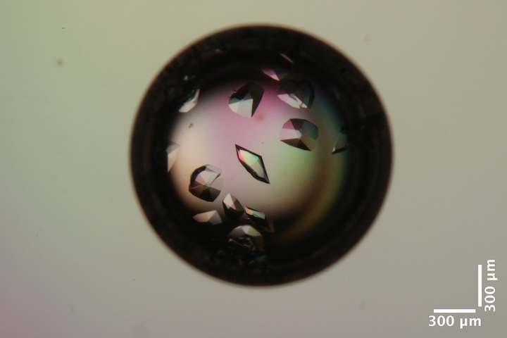<br>
Mac1 crystals in well D2, right drop of Katie L's tray dated 2026-06-15.
Well solution: 34% PEG 3k, 100 mM CHES pH 9.5. 
Drop: 1 µL protein + 1 µL well solution + 0.5 µL seed stock (10^-4^ dilution). 

- 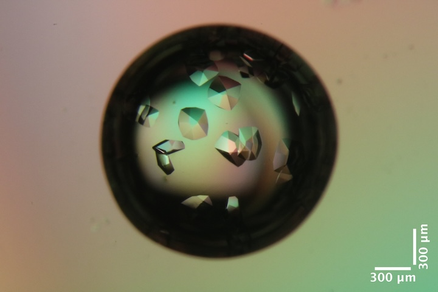<br>
Mac1 crystals in well C2, right drop of Katie L's tray dated 2026-06-15.
Well solution: 32% PEG 3k, 100 mM CHES pH 9.5. 
Drop: 1 µL protein + 1 µL well solution + 0.5 µL seed stock (10^-4^ dilution). 

</div> 

## Beam stability measurement

First, steve opened the slits to 500 x 500 µm. The YAG screen was inserted at the sample position (versapin) and beam profile was visualized with the on-axis camera at ~100 Hz. A 10 second video was recorded

subdirectory: `setup/beam/yag_1/`

| prefix          | images | exposure (ms) | zoom setting |
|-----------------|--------|---------------|--------------|
| yag_1_oac_zoom4 | 1000   | 10            |  4           |

??? note "Image processing analysis of recorded video"

    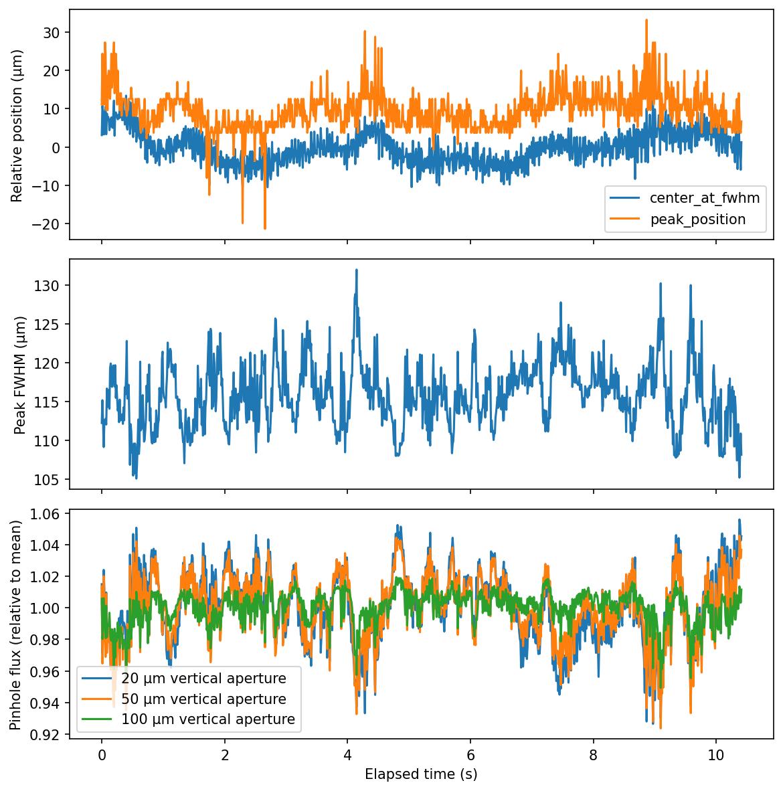

subdirectory: `setup/beam/flux_20x100/`

Then, steve narrowed the slits to 0.02 x 0.1 µm (v x h) and bumped the ICol gain to 500 pA/V. He recorded a trace on the scope (1 V/div, 200 ms/div).

- `T0003CH1.csv`
- `T0004CH1.csv` (repeated for good measure)

The scope records data at a high rate, but for limited duration (2 seconds).

Next, record longer traces using the SPEC counter-timer board.

| prefix          | scan number | command         | notes |
|-----------------|-------------|-----------------|--------------|
| flux_20x100     | 1           | tseries -1 0.03 | recorded 10,000 samples (8 minutes). No fills.      |
| flux_20x100     | 2           | tseries -1 0.03 | started 20s before topoff, ended ~60s into new fill |

At the same time as scan #1, I recorded another scope trace: `T0005CH1.csv`.

??? note "Time series analysis of SPEC recordings"

    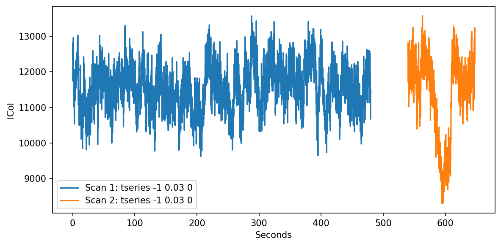

??? note "Time series analysis of oscilloscope data"

    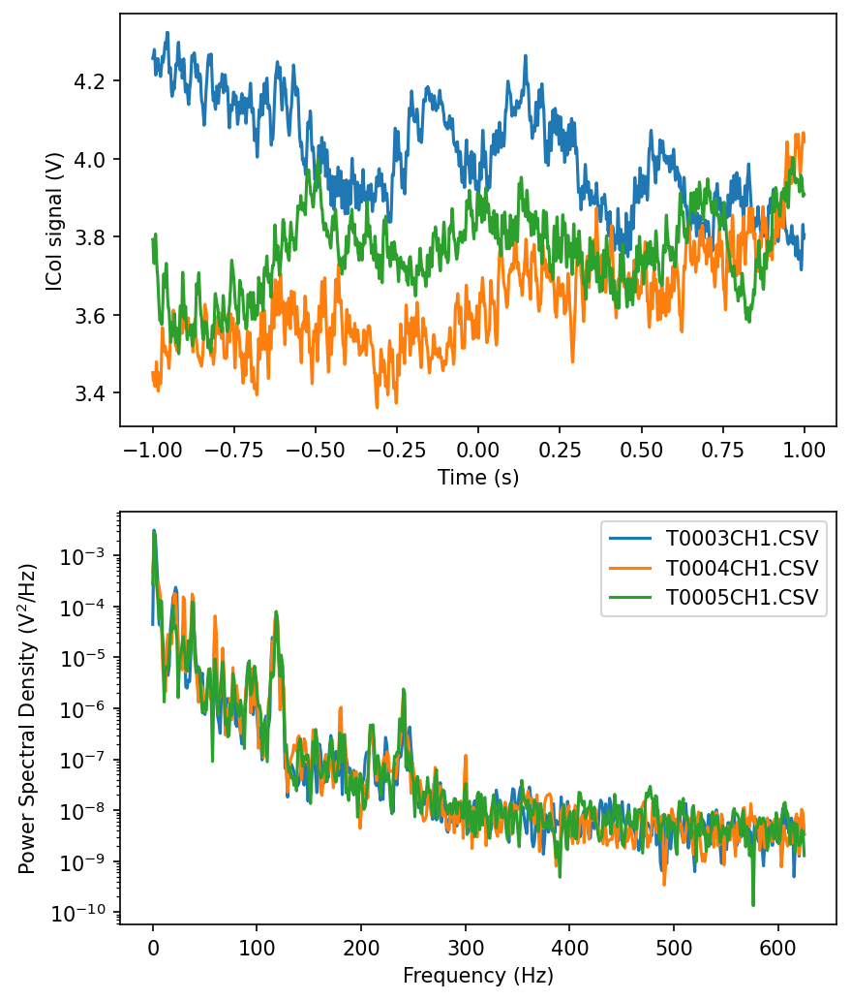


Returned slits to 100 x 100 µm. Reset ICol gain to 2 nA/V.

Check the detector background after adding Pb tape and steel plate to clean up extra scattering.

Subdirectory: `setup/detector`

| prefix   |   φ0 (deg.) |   ∆φ (deg.) |   images |   ∆t (s) |   tf (%) |   d (mm) |   E (keV) |
|----------|-------------|-------------|----------|----------|----------|----------|-----------|
| air_2085 |           0 |           0 |        1 |        1 |      100 |      185 |        14 |

Looks good!

Repeated the flux measurement (reported in table above):

```
SPEC> ct 1
     I2 = 114356
   ICol = 451094
  newI1 = 165882
  newI0 = 235343
```

Calculated flux using I2 (gain: 50 nA/V): 9.7 x 10^10^ ph/s

## Data collection

### 1. Mac1

!!! quote inline end ""

    <video width="308" autoplay muted loop playsinlin controls>
    <source src="mac1_1_oac_zoom4.mp4" type="video/mp4">
    Your browser does not support the video tag.
    </video>


Katie looped a mac1 crystal (well D2, RHS drop, tray dated 2026-06-15) using a 200 µm loop.

Subdirectory: `mac1/mac1_1`

Snapped images every 30˚ using the on-axis camera, prefix: `mac1_1_oac_zoom4`.

<div style="clear: both;"></div>

| prefix         |   φ0 (deg.) |   φ1 (deg.) |   ∆φ (deg.) |   images |   ∆t (s) |   tf (%) |   d (mm) |   E (keV) |
|----------------|-------------|-------------|-------------|----------|----------|----------|----------|-----------|
| mac1_1_2086    |           0 |         360 |         0.1 |     3600 |     0.01 |     75.4 |      185 |        14 |
| mac1_1_bg_2087 |           0 |         360 |         1   |      360 |     0.1  |     75.4 |      185 |        14 |

??? info "xia2 processing"

    |                 | mac1_1_2086                             |
    |-----------------|-----------------------------------------|
    | scan            | 2086                                    |
    | Mosaic spread   | 0.003                                   |
    | Resolution      | 1.06                                    |
    | Unit Cell       | [89.23, 89.23, 40.29, 90.0, 90.0, 90.0] |
    | Image range     | [1, 3600]                               |
    | Completeness    | 91.6                                    |
    | Multiplicity    | 11.1                                    |
    | I/sigma         | 16.8                                    |
    | Rpim            | 0.017                                   |
    | Wilson B factor | 13.51                                   |
    | Space group     | P 43                                    |
    | temperature     | 295                                     |

---

Steve inserted the cold stream and set temperature to 295 K.

### 2. Mac1 (multi-T)

!!! quote inline end ""

    <video width="308" autoplay muted loop playsinlin controls>
    <source src="mac1_2_295K_1_oac_zoom4.mp4" type="video/mp4">
    Your browser does not support the video tag.
    </video>
    `mac1_2_295K_1_oac_zoom4`

Katie looped another mac1 crystal from the same drop. She placed 2 µL of well solution in the sleeve, cut short so that the meniscus is close to the crystal.

Subdirectory: `mac1/mac1_2`

Attenuate 5-fold and collect temperature series.

Saved images every 30˚ at zoom 4, prefix: `mac1_2_295K_1_oac_zoom4`

<div style="clear: both;"></div>

| prefix                |   φ0 (deg.) |   φ1 (deg.) |   ∆φ (deg.) |   images |   ∆t (s) |   tf (%) |   d (mm) |   E (keV) |
|-----------------------|-------------|-------------|-------------|----------|----------|----------|----------|-----------|
| mac1_2_295K_1_2088    |           0 |         360 |         0.1 |     3600 |     0.01 |     17.3 |      185 |        14 |
| mac1_2_295K_1_bg_2089 |           0 |         360 |         1   |      360 |     0.1  |     17.3 |      185 |        14 |

---

Ramped temperature @ 120 K / hour to 280 K.

<div style="clear: both;"></div>

| prefix                |   φ0 (deg.) |   φ1 (deg.) |   ∆φ (deg.) |   images |   ∆t (s) |   tf (%) |   d (mm) |   E (keV) |
|-----------------------|-------------|-------------|-------------|----------|----------|----------|----------|-----------|
| mac1_2_280K_2090      |           0 |         360 |         0.1 |     3600 |     0.01 |     17.3 |      185 |        14 |
| mac1_2_280K_bg_2091   |           0 |         360 |         1   |      360 |     0.1  |     17.3 |      185 |        14 |

---

!!! quote inline end ""

    <video width="308" autoplay muted loop playsinlin controls>
    <source src="mac1_2_295K_2_oac_zoom4.mp4" type="video/mp4">
    Your browser does not support the video tag.
    </video>
    `mac1_2_295K_2_oac_zoom4`

Ramped back to 295 K @ 120 K / hour.

Saved images every 30˚ again for reference (zoom 4), prefix: `mac1_2_295K_2_oac_zoom4`

<div style="clear: both;"></div>

| prefix                |   φ0 (deg.) |   φ1 (deg.) |   ∆φ (deg.) |   images |   ∆t (s) |   tf (%) |   d (mm) |   E (keV) |
|-----------------------|-------------|-------------|-------------|----------|----------|----------|----------|-----------|
| mac1_2_295K_2_2092    |           0 |         360 |         0.1 |     3600 |     0.01 |     17.3 |      185 |        14 |
| mac1_2_295K_2_bg_2093 |           0 |         360 |         1   |      360 |     0.1  |     17.3 |      185 |        14 |

---

!!! quote inline end ""

    <video width="308" autoplay muted loop playsinlin controls>
    <source src="mac1_2_310K_oac_zoom4.mp4" type="video/mp4">
    Your browser does not support the video tag.
    </video>
    `mac1_2_310K_oac_zoom4`

Ramped up to 310 K @ 120 K / hour.

Snapped images every 30˚ again for reference (zoom 4), prefix: `mac1_2_310K_oac_zoom4`

<div style="clear: both;"></div>

| prefix                |   φ0 (deg.) |   φ1 (deg.) |   ∆φ (deg.) |   images |   ∆t (s) |   tf (%) |   d (mm) |   E (keV) |
|-----------------------|-------------|-------------|-------------|----------|----------|----------|----------|-----------|
| mac1_2_310K_2094      |           0 |         360 |         0.1 |     3600 |     0.01 |     17.3 |      185 |        14 |
| mac1_2_310K_bg_2095   |           0 |         360 |         1   |      360 |     0.1  |     17.3 |      185 |        14 |

---

!!! quote inline end ""

    <video width="308" autoplay muted loop playsinlin controls>
    <source src="mac1_2_295K_3_oac_zoom4.mp4" type="video/mp4">
    Your browser does not support the video tag.
    </video>
    `mac1_2_295K_3_oac_zoom4`

Ramped back down to 295 K @ 120 K / hour.

Snapped images every 30˚ again for reference (zoom 4), prefix: `mac1_2_295K_3_oac_zoom4`

<div style="clear: both;"></div>

| prefix                |   φ0 (deg.) |   φ1 (deg.) |   ∆φ (deg.) |   images |   ∆t (s) |   tf (%) |   d (mm) |   E (keV) |
|-----------------------|-------------|-------------|-------------|----------|----------|----------|----------|-----------|
| mac1_2_295K_3_2096    |           0 |         360 |         0.1 |     3600 |     0.01 |     17.3 |      185 |        14 |
| mac1_2_295K_3_bg_2097 |           0 |         360 |         1   |      360 |     0.1  |     17.3 |      185 |        14 |


??? info "xia2 processing"

    |                 | mac1_2_295K_1_2088                      | mac1_2_280K_2090                        | mac1_2_295K_2_2092                      | mac1_2_310K_2094                        | mac1_2_295K_3_2096                      |
    |-----------------|-----------------------------------------|-----------------------------------------|-----------------------------------------|-----------------------------------------|-----------------------------------------|
    | scan            | 2088                                    | 2090                                    | 2092                                    | 2094                                    | 2096                                    |
    | Mosaic spread   | 0.008                                   | 0.066                                   | 0.048                                   | 0.015                                   | 0.007                                   |
    | Resolution      | 1.14                                    | 1.15                                    | 1.18                                    | 1.2                                     | 1.18                                    |
    | Unit Cell       | [89.15, 89.15, 40.16, 90.0, 90.0, 90.0] | [89.07, 89.07, 39.96, 90.0, 90.0, 90.0] | [89.17, 89.17, 40.21, 90.0, 90.0, 90.0] | [89.23, 89.23, 40.28, 90.0, 90.0, 90.0] | [89.18, 89.18, 40.19, 90.0, 90.0, 90.0] |
    | Image range     | [1, 3600]                               | [1, 3600]                               | [1, 3600]                               | [1, 3600]                               | [1, 3600]                               |
    | Completeness    | 98.9                                    | 99.3                                    | 100.0                                   | 100.0                                   | 100.0                                   |
    | Multiplicity    | 12.1                                    | 12.2                                    | 12.6                                    | 12.8                                    | 12.6                                    |
    | I/sigma         | 10.4                                    | 10.2                                    | 11.0                                    | 11.4                                    | 10.8                                    |
    | Rpim            | 0.029                                   | 0.029                                   | 0.027                                   | 0.027                                   | 0.028                                   |
    | Wilson B factor | 13.78                                   | 12.79                                   | 13.77                                   | 14.97                                   | 14.76                                   |
    | Space group     | P 43                                    | P 43                                    | P 43                                    | P 43                                    | P 43                                    |
    | temperature     | 295                                     | 280                                     | 295                                     | 310                                     | 295                                     |

It's interesting that the mosaic spread first increased when going from 295 to 280K, and then it slowly recovered until 295K_3, which has the same mosaic spread as the first dataset 295K_1. Is this telling us the time-dependence of recovery from a thermal shock, or perhaps it is accelerated by thermal annealing?

!!! warning

    We noticed that the last batch of micro-RT tubings we ordered had many that were unsealed at the end. Come on, MiTeGen! Yikes. We tried to select the best ones, but were not 100% confident that they were sealed well. Steve discovered that you can re-seal them by heating a flat tweezer with a soldering iron (grab the soldering iron tip for ~20 seconds, then squeeze the tube for ~2 seconds). He went ahead and re-sealed all of the tubes. From now on, we're using the re-sealed tubes.

### 3. Mac1 (multi-T)

!!! quote inline end ""

    <video width="308" autoplay muted loop playsinlin controls>
    <source src="mac1_3_295K_1_oac_zoom4.mp4" type="video/mp4">
    Your browser does not support the video tag.
    </video>
    `mac1_3_295K_1_oac_zoom4`

Katie looped another mac1 crystal from the same well using a 200 µm loop with 3 µL of reservoir solution in the sleeve, and sealed the sleeve to the base using grease.

Subdirectory: `mac1/mac1_3`

Snapped images every 30˚ using the on-axis camera at 4x zoom, prefix: `mac1_3_295K_1_oac_zoom4`

<div style="clear: both;"></div>

| prefix                |   φ0 (deg.) |   φ1 (deg.) |   ∆φ (deg.) |   images |   ∆t (s) |   tf (%) |   d (mm) |   E (keV) |
|-----------------------|-------------|-------------|-------------|----------|----------|----------|----------|-----------|
| mac1_3_295K_1_2098    |           0 |         360 |         0.1 |     3600 |     0.01 |     17.3 |      185 |        14 |
| mac1_3_295K_1_bg_2099 |           0 |         360 |         1   |      360 |     0.1  |     17.3 |      185 |        14 |

---

!!! quote inline end ""

    <video width="308" autoplay muted loop playsinlin controls>
    <source src="mac1_3_280K_oac_zoom4.mp4" type="video/mp4">
    Your browser does not support the video tag.
    </video>
    `mac1_3_280K_oac_zoom4`

Ramped to 280 K @ 120 K / hour

Snapped images every 30˚ using the on-axis camera at 4x zoom, prefix: `mac1_3_280K_oac_zoom4`

<div style="clear: both;"></div>

| prefix                |   φ0 (deg.) |   φ1 (deg.) |   ∆φ (deg.) |   images |   ∆t (s) |   tf (%) |   d (mm) |   E (keV) |
|-----------------------|-------------|-------------|-------------|----------|----------|----------|----------|-----------|
| mac1_3_280K_2100      |           0 |         360 |         0.1 |     3600 |     0.01 |     17.3 |      185 |        14 |
| mac1_3_280K_bg_2101   |           0 |         360 |         1   |      360 |     0.1  |     17.3 |      185 |        14 |

---

!!! quote inline end ""

    <video width="308" autoplay muted loop playsinlin controls>
    <source src="mac1_3_295K_2_oac_zoom4.mp4" type="video/mp4">
    Your browser does not support the video tag.
    </video>
    `mac1_3_295K_2_oac_zoom4`


Ramped back to 295 K @ 120 K / hour

Snapped images every 30˚ using the on-axis camera at 4x zoom, prefix: `mac1_3_295K_2_oac_zoom4`

<div style="clear: both;"></div>

| prefix                |   φ0 (deg.) |   φ1 (deg.) |   ∆φ (deg.) |   images |   ∆t (s) |   tf (%) |   d (mm) |   E (keV) |
|-----------------------|-------------|-------------|-------------|----------|----------|----------|----------|-----------|
| mac1_3_295K_2_2102    |           0 |         360 |         0.1 |     3600 |     0.01 |     17.3 |      185 |        14 |
| mac1_3_295K_2_bg_2103 |           0 |         360 |         1   |      360 |     0.1  |     17.3 |      185 |        14 |

---

!!! quote inline end ""

    <video width="308" autoplay muted loop playsinlin controls>
    <source src="mac1_3_310K_oac_zoom4.mp4" type="video/mp4">
    Your browser does not support the video tag.
    </video>
    `mac1_3_310K_oac_zoom4`


Ramped to 310 K @ 120 K / hour

Snapped images every 30˚ using the on-axis camera at 4x zoom, prefix: `mac1_3_310K_oac_zoom4`

<div style="clear: both;"></div>


| prefix                |   φ0 (deg.) |   φ1 (deg.) |   ∆φ (deg.) |   images |   ∆t (s) |   tf (%) |   d (mm) |   E (keV) |
|-----------------------|-------------|-------------|-------------|----------|----------|----------|----------|-----------|
| mac1_3_310K_2104      |           0 |         360 |         0.1 |     3600 |     0.01 |     17.3 |      185 |        14 |
| mac1_3_310K_bg_2105   |           0 |         360 |         1   |      360 |     0.1  |     17.3 |      185 |        14 |

---

!!! quote inline end ""

    <video width="308" autoplay muted loop playsinlin controls>
    <source src="mac1_3_295K_3_oac_zoom4.mp4" type="video/mp4">
    Your browser does not support the video tag.
    </video>
    `mac1_3_295K_3_oac_zoom4`


Ramped back to 295 K @ 120 K / hour

Snapped images every 30˚ using the on-axis camera at 4x zoom, prefix: `mac1_3_295K_3_oac_zoom4`

<div style="clear: both;"></div>


| prefix                |   φ0 (deg.) |   φ1 (deg.) |   ∆φ (deg.) |   images |   ∆t (s) |   tf (%) |   d (mm) |   E (keV) |
|-----------------------|-------------|-------------|-------------|----------|----------|----------|----------|-----------|
| mac1_3_295K_3_2106    |           0 |         360 |         0.1 |     3600 |     0.01 |     17.3 |      185 |        14 |
| mac1_3_295K_3_bg_2107 |           0 |         360 |         1   |      360 |     0.1  |     17.3 |      185 |        14 |


---

!!! quote inline end ""

    <video width="308" autoplay muted loop playsinlin controls>
    <source src="mac1_3_325K_oac_zoom4.mp4" type="video/mp4">
    Your browser does not support the video tag.
    </video>
    `mac1_3_325K_oac_zoom4`


I'm curious. What happens if you go to even higher temperature?

Ramped to 325 K @ 120 K / hour

Snapped images every 30˚ using the on-axis camera at 4x zoom, prefix: `mac1_3_325K_oac_zoom4`

<div style="clear: both;"></div>


| prefix                |   φ0 (deg.) |   φ1 (deg.) |   ∆φ (deg.) |   images |   ∆t (s) |   tf (%) |   d (mm) |   E (keV) |
|-----------------------|-------------|-------------|-------------|----------|----------|----------|----------|-----------|
| mac1_3_325K_2108      |           0 |         360 |         0.1 |     3600 |     0.01 |     17.3 |      185 |        14 |
| mac1_3_325K_bg_2109   |           0 |         360 |         1   |      360 |     0.1  |     17.3 |      185 |        14 |

---

!!! quote inline end ""

    <video width="308" autoplay muted loop playsinlin controls>
    <source src="mac1_3_295K_4_oac_zoom4.mp4" type="video/mp4">
    Your browser does not support the video tag.
    </video>
    `mac1_3_295K_4_oac_zoom4`


Ramped back to 295 K @ 120 K / hour

Snapped images every 30˚ using the on-axis camera at 4x zoom, prefix: `mac1_3_295K_4_oac_zoom4`

<div style="clear: both;"></div>


| prefix                |   φ0 (deg.) |   φ1 (deg.) |   ∆φ (deg.) |   images |   ∆t (s) |   tf (%) |   d (mm) |   E (keV) |
|-----------------------|-------------|-------------|-------------|----------|----------|----------|----------|-----------|
| mac1_3_295K_4_2110    |           0 |         360 |         0.1 |     3600 |     0.01 |     17.3 |      185 |        14 |
| mac1_3_295K_4_bg_2111 |           0 |         360 |         1   |      360 |     0.1  |     17.3 |      185 |        14 |


??? info "xia2 processing"

    |                 | mac1_3_295K_1_2098                      | mac1_3_280K_2100                        | mac1_3_295K_2_2102                      | mac1_3_310K_2104                        | mac1_3_295K_3_2106                      | mac1_3_325K_2108                        | mac1_3_295K_4_2110                      |
    |-----------------|-----------------------------------------|-----------------------------------------|-----------------------------------------|-----------------------------------------|-----------------------------------------|-----------------------------------------|-----------------------------------------|
    | scan            | 2098                                    | 2100                                    | 2102                                    | 2104                                    | 2106                                    | 2108                                    | 2110                                    |
    | Mosaic spread   | 0.003                                   | 0.004                                   | 0.007                                   | 0.023                                   | 0.015                                   | 0.238                                   | 0.193                                   |
    | Resolution      | 1.14                                    | 1.12                                    | 1.16                                    | 1.2                                     | 1.19                                    | 1.58                                    | 1.46                                    |
    | Unit Cell       | [89.19, 89.19, 40.24, 90.0, 90.0, 90.0] | [89.13, 89.13, 40.16, 90.0, 90.0, 90.0] | [89.16, 89.16, 40.18, 90.0, 90.0, 90.0] | [89.17, 89.17, 40.16, 90.0, 90.0, 90.0] | [89.27, 89.27, 40.37, 90.0, 90.0, 90.0] | [89.09, 89.09, 40.07, 90.0, 90.0, 90.0] | [89.32, 89.32, 40.45, 90.0, 90.0, 90.0] |
    | Image range     | [1, 3600]                               | [1, 3600]                               | [1, 3600]                               | [1, 3600]                               | [1, 3600]                               | [1, 3600]                               | [1, 3600]                               |
    | Completeness    | 98.4                                    | 96.8                                    | 99.4                                    | 100.0                                   | 100.0                                   | 99.9                                    | 100.0                                   |
    | Multiplicity    | 12.1                                    | 11.9                                    | 12.4                                    | 12.8                                    | 12.7                                    | 13.6                                    | 13.7                                    |
    | I/sigma         | 10.1                                    | 10.2                                    | 11.1                                    | 11.1                                    | 10.7                                    | 6.6                                     | 9.1                                     |
    | Rpim            | 0.031                                   | 0.03                                    | 0.028                                   | 0.027                                   | 0.028                                   | 0.052                                   | 0.046                                   |
    | Wilson B factor | 14.06                                   | 13.38                                   | 14.39                                   | 14.94                                   | 14.61                                   | 20.42                                   | 17.37                                   |
    | Space group     | P 43                                    | P 43                                    | P 43                                    | P 43                                    | P 43                                    | P 43                                    | P 43                                    |
    | temperature     | 295                                     | 280                                     | 295                                     | 310                                     | 295                                     | 325                                     | 295                                     |


### 4. Mac1 (multi-T)

!!! quote inline end ""

    <video width="308" autoplay muted loop playsinlin controls>
    <source src="mac1_4_295K_1_oac_zoom2.mp4" type="video/mp4">
    Your browser does not support the video tag.
    </video>
    `mac1_4_295K_1_oac_zoom2`

Cryostream set to 295 K

Snapped images every 30˚ using the on-axis camera at 2x zoom, prefix: `mac1_4_295K_1_oac_zoom2`

Katie looped another mac1 P43 crystal from the same well using a 300 µm loop. 3 µL of well solution was added to the sleeve and the sleeve was sealed to the base using grease.

Subdirectory: `mac1/mac1_4`

<div style="clear: both;"></div>

| prefix                |   φ0 (deg.) |   φ1 (deg.) |   ∆φ (deg.) |   images |   ∆t (s) |   tf (%) |   d (mm) |   E (keV) |
|-----------------------|-------------|-------------|-------------|----------|----------|----------|----------|-----------|
| mac1_4_295K_1_2112    |           0 |         360 |         0.1 |     3600 |     0.01 |     17.3 |      185 |        14 |
| mac1_4_295K_1_bg_2113 |           0 |         360 |         1   |      360 |     0.1  |     17.3 |      185 |        14 |

---

!!! quote inline end ""

    <video width="308" autoplay muted loop playsinlin controls>
    <source src="mac1_4_280K_oac_zoom2.mp4" type="video/mp4">
    Your browser does not support the video tag.
    </video>
    `mac1_4_280K_oac_zoom2`

Ramp to 280 K @ 120 K / hour. 

Snapped images every 30˚ using the on-axis camera at 2x zoom, prefix: `mac1_4_280K_oac_zoom2`

<div style="clear: both;"></div>


| prefix                |   φ0 (deg.) |   φ1 (deg.) |   ∆φ (deg.) |   images |   ∆t (s) |   tf (%) |   d (mm) |   E (keV) |
|-----------------------|-------------|-------------|-------------|----------|----------|----------|----------|-----------|
| mac1_4_280K_2114      |           0 |         360 |         0.1 |     3600 |     0.01 |     17.3 |      185 |        14 |
| mac1_4_280K_bg_2115   |           0 |         360 |         1   |      360 |     0.1  |     17.3 |      185 |        14 |

---

!!! quote inline end ""

    <video width="308" autoplay muted loop playsinlin controls>
    <source src="mac1_4_295K_2_oac_zoom2.mp4" type="video/mp4">
    Your browser does not support the video tag.
    </video>
    `mac1_4_295K_2_oac_zoom2`

Ramp to 295 K @ 120 K / hour. 

Snapped images every 30˚ using the on-axis camera at 4x zoom, prefix: `mac1_4_295K_2_oac_zoom2`

<div style="clear: both;"></div>

| prefix                |   φ0 (deg.) |   φ1 (deg.) |   ∆φ (deg.) |   images |   ∆t (s) |   tf (%) |   d (mm) |   E (keV) |
|-----------------------|-------------|-------------|-------------|----------|----------|----------|----------|-----------|
| mac1_4_295K_2_2116    |           0 |         360 |         0.1 |     3600 |     0.01 |     17.3 |      185 |        14 |
| mac1_4_295K_2_bg_2117 |           0 |         360 |         1   |      360 |     0.1  |     17.3 |      185 |        14 |

---

!!! quote inline end ""

    <video width="308" autoplay muted loop playsinlin controls>
    <source src="mac1_4_310K_oac_zoom2.mp4" type="video/mp4">
    Your browser does not support the video tag.
    </video>
    `mac1_4_310K_oac_zoom2`

Ramp to 310 K @ 120 K / hour. 

Snapped images every 30˚ using the on-axis camera at 4x zoom, prefix: `mac1_4_310K_oac_zoom2`

<div style="clear: both;"></div>


| prefix                |   φ0 (deg.) |   φ1 (deg.) |   ∆φ (deg.) |   images |   ∆t (s) |   tf (%) |   d (mm) |   E (keV) |
|-----------------------|-------------|-------------|-------------|----------|----------|----------|----------|-----------|
| mac1_4_310K_2118      |           0 |         360 |         0.1 |     3600 |     0.01 |     17.3 |      185 |        14 |
| mac1_4_310K_bg_2119   |           0 |         360 |         1   |      360 |     0.1  |     17.3 |      185 |        14 |

---

!!! quote inline end ""

    <video width="308" autoplay muted loop playsinlin controls>
    <source src="mac1_4_295K_3_real_oac_zoom2.mp4" type="video/mp4">
    Your browser does not support the video tag.
    </video>
    `mac1_4_295K_3_real_oac_zoom2`

Ramp to 295 K @ 120 K / hour. 

Snapped images every 30˚ using the on-axis camera at 4x zoom, prefix: `mac1_4_295K_3_real_oac_zoom2`

!!! warning "file name error"

    The crystal images for 310K were accidentally saved twice. The second time, they had the file name prefix `mac1_4_295K_3`. The correct 295K_3 images are called `mac1_4_295K_3_real`. 

<div style="clear: both;"></div>


| prefix                |   φ0 (deg.) |   φ1 (deg.) |   ∆φ (deg.) |   images |   ∆t (s) |   tf (%) |   d (mm) |   E (keV) |
|-----------------------|-------------|-------------|-------------|----------|----------|----------|----------|-----------|
| mac1_4_295K_3_2120    |           0 |         360 |         0.1 |     3600 |     0.01 |     17.3 |      185 |        14 |
| mac1_4_295K_3_bg_2121 |           0 |         360 |         1   |      360 |     0.1  |     17.3 |      185 |        14 |


At the end when Katie removed the crystal from the goniometer, she saw condensation on the sleeve.

??? info "xia2 processing"

    |                 | mac1_4_295K_1_2112                      | mac1_4_280K_2114                        | mac1_4_295K_2_2116                      | mac1_4_310K_2118                        | mac1_4_295K_3_2120                      |
    |-----------------|-----------------------------------------|-----------------------------------------|-----------------------------------------|-----------------------------------------|-----------------------------------------|
    | scan            | 2112                                    | 2114                                    | 2116                                    | 2118                                    | 2120                                    |
    | Mosaic spread   | 0.003                                   | 0.004                                   | 0.005                                   | 0.033                                   | 0.013                                   |
    | Resolution      | 1.13                                    | 1.11                                    | 1.14                                    | 1.18                                    | 1.16                                    |
    | Unit Cell       | [89.26, 89.26, 40.36, 90.0, 90.0, 90.0] | [89.22, 89.22, 40.32, 90.0, 90.0, 90.0] | [89.27, 89.27, 40.37, 90.0, 90.0, 90.0] | [89.14, 89.14, 40.13, 90.0, 90.0, 90.0] | [89.28, 89.28, 40.38, 90.0, 90.0, 90.0] |
    | Image range     | [1, 3600]                               | [1, 3600]                               | [1, 3600]                               | [1, 3600]                               | [1, 3600]                               |
    | Completeness    | 99.3                                    | 98.6                                    | 99.5                                    | 100.0                                   | 99.9                                    |
    | Multiplicity    | 11.8                                    | 11.5                                    | 12.0                                    | 12.6                                    | 12.3                                    |
    | I/sigma         | 10.3                                    | 9.7                                     | 9.3                                     | 10.1                                    | 11.1                                    |
    | Rpim            | 0.03                                    | 0.031                                   | 0.032                                   | 0.028                                   | 0.026                                   |
    | Wilson B factor | 14.01                                   | 13.38                                   | 14.3                                    | 14.67                                   | 14.68                                   |
    | Space group     | P 43                                    | P 43                                    | P 43                                    | P 43                                    | P 43                                    |
    | temperature     | 295                                     | 280                                     | 295                                     | 310                                     | 295                                     |


### 5. Mac1 (multi-T)

!!! quote inline end ""

    <video width="308" autoplay muted loop playsinlin controls>
    <source src="mac1_5_295K_1_oac_zoom1.mp4" type="video/mp4">
    Your browser does not support the video tag.
    </video>
    `mac1_5_295K_1_oac_zoom1`

Steve scooped up a bunch of crystals from well C2 using a micromesh + sleeve with 3 µL of well solution in the tip. The capillary is not clean, it got grease on the oustide. So this will not be so useful for diffuse scattering. The goal here is to see if the temperature-dependent changes we're seeing (wrt mosaicity, unit cell, etc) are observed for all crystals in the loop, or if changes are crystal-specific.

The goniometer positions for each crystal were saved as A-->H in SPEC, so that the illuminated crystal volumes can be identical at each temperature.

Subdirectory: `mac1/mac1_5`

Snapped images every 30˚ using the on-axis camera at 1x zoom showing the entire loop (prefix: `mac1_5_295K_1_oac_zoom1`), and at each crystal position at 4x zoom.

<div class="grid cards" markdown>

- A 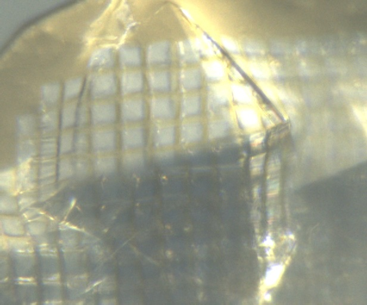{ width="250" }

- B 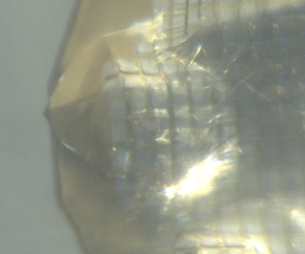{ width="250" }

- C 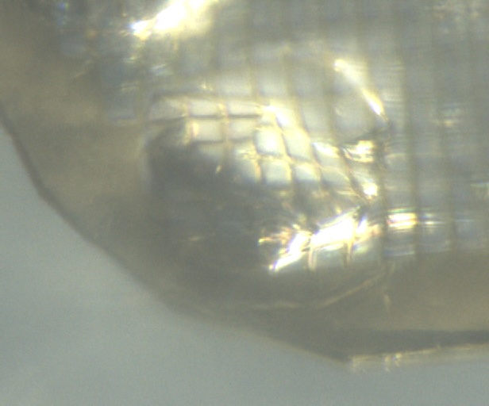{ width="250" }

- D 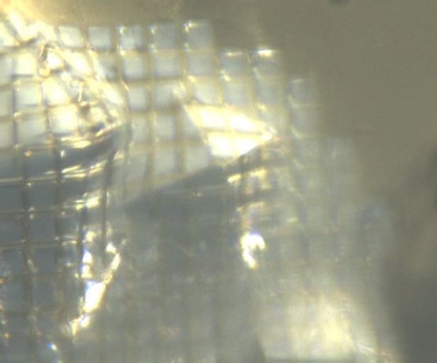{ width="250" }

- E 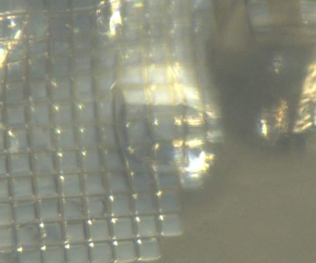{ width="250" }

- F 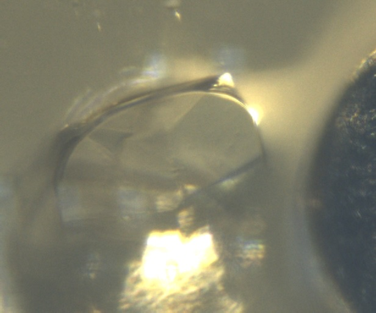{ width="250" }

- G 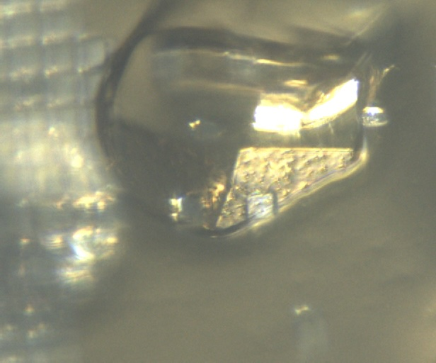{ width="250" }

- H 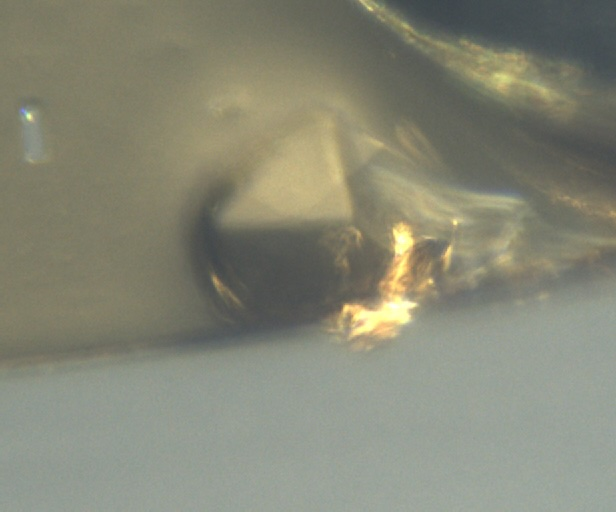{ width="250" }

</div> 

<div style="clear: both;"></div>

| prefix                 |   φ0 (deg.) |   φ1 (deg.) |   ∆φ (deg.) |   images |   ∆t (s) |   tf (%) |   d (mm) |   E (keV) |
|------------------------|-------------|-------------|-------------|----------|----------|----------|----------|-----------|
| mac1_5A_295K_1_2122    |         220 |         290 |         0.1 |      700 |     0.01 |      100 |      185 |        14 |
| mac1_5B_295K_1_2123    |         220 |         290 |         0.1 |      700 |     0.01 |      100 |      185 |        14 |
| mac1_5C_295K_1_2124    |         220 |         290 |         0.1 |      700 |     0.01 |      100 |      185 |        14 |
| mac1_5D_295K_1_2125    |         220 |         290 |         0.1 |      700 |     0.01 |      100 |      185 |        14 |
| mac1_5E_295K_1_2126    |         220 |         290 |         0.1 |      700 |     0.01 |      100 |      185 |        14 |
| mac1_5F_295K_1_2127    |         220 |         290 |         0.1 |      700 |     0.01 |      100 |      185 |        14 |
| mac1_5G_295K_1_2128    |         220 |         290 |         0.1 |      700 |     0.01 |      100 |      185 |        14 |
| mac1_5H_295K_1_2129    |         220 |         290 |         0.1 |      700 |     0.01 |      100 |      185 |        14 |
| mac1_5A_295K_1_bg_2130 |         220 |         290 |         1   |       70 |     0.1  |      100 |      185 |        14 |
| mac1_5B_295K_1_bg_2131 |         220 |         290 |         1   |       70 |     0.1  |      100 |      185 |        14 |
| mac1_5C_295K_1_bg_2132 |         220 |         290 |         1   |       70 |     0.1  |      100 |      185 |        14 |
| mac1_5D_295K_1_bg_2133 |         220 |         290 |         1   |       70 |     0.1  |      100 |      185 |        14 |
| mac1_5E_295K_1_bg_2134 |         220 |         290 |         1   |       70 |     0.1  |      100 |      185 |        14 |
| mac1_5F_295K_1_bg_2135 |         220 |         290 |         1   |       70 |     0.1  |      100 |      185 |        14 |
| mac1_5G_295K_1_bg_2136 |         220 |         290 |         1   |       70 |     0.1  |      100 |      185 |        14 |
| mac1_5H_295K_1_bg_2137 |         220 |         290 |         1   |       70 |     0.1  |      100 |      185 |        14 |

!!! warning "multiple lattices"

    Diffraction collected at position C, F, and G have peaks from multiple lattices. I'll skip these on subsequent data collecitons.

!!! warning "diffraction peaks in background datasets"

    Most of the background datasets have diffraciton peaks, either from the dirty capillary or from nearby crystals on the loop. Use with caution.

Ramped temperature down to 280 K @ 120 K / hour.

Continue collection, but skip C, F, G

| prefix                 |   φ0 (deg.) |   φ1 (deg.) |   ∆φ (deg.) |   images |   ∆t (s) |   tf (%) |   d (mm) |   E (keV) |
|------------------------|-------------|-------------|-------------|----------|----------|----------|----------|-----------|
| mac1_5A_280K_2138      |         220 |         290 |         0.1 |      700 |     0.01 |      100 |      185 |        14 |
| mac1_5B_280K_2139      |         220 |         290 |         0.1 |      700 |     0.01 |      100 |      185 |        14 |
| mac1_5D_280K_2140      |         220 |         290 |         0.1 |      700 |     0.01 |      100 |      185 |        14 |
| mac1_5E_280K_2141      |         220 |         290 |         0.1 |      700 |     0.01 |      100 |      185 |        14 |
| mac1_5H_280K_2142      |         220 |         290 |         0.1 |      700 |     0.01 |      100 |      185 |        14 |
| mac1_5H_280K_bg_2143\*   |         220 |         290 |         1   |       70 |     0.1  |      100 |      185 |        14 |
| mac1_5B_280K_bg_2144   |         220 |         290 |         1   |       70 |     0.1  |      100 |      185 |        14 |
| mac1_5D_280K_bg_2145   |         220 |         290 |         1   |       70 |     0.1  |      100 |      185 |        14 |
| mac1_5E_280K_bg_2146   |         220 |         290 |         1   |       70 |     0.1  |      100 |      185 |        14 |
| mac1_5H_280K_bg_2147   |         220 |         290 |         1   |       70 |     0.1  |      100 |      185 |        14 |

!!! warning "incorrect file name"

    `mac1_5H_280K_bg_2143` should have been labeled 5A instead of 5H.

Ramped back up to 295 K @ 120 K / hour.

| prefix                 |   φ0 (deg.) |   φ1 (deg.) |   ∆φ (deg.) |   images |   ∆t (s) |   tf (%) |   d (mm) |   E (keV) |
|------------------------|-------------|-------------|-------------|----------|----------|----------|----------|-----------|
| mac1_5A_295K_2_2148    |         220 |         290 |         0.1 |      700 |     0.01 |      100 |      185 |        14 |
| mac1_5B_295K_2_2149    |         220 |         290 |         0.1 |      700 |     0.01 |      100 |      185 |        14 |
| mac1_5D_295K_2_2150    |         220 |         290 |         0.1 |      700 |     0.01 |      100 |      185 |        14 |
| mac1_5E_295K_2_2151    |         220 |         290 |         0.1 |      700 |     0.01 |      100 |      185 |        14 |
| mac1_5H_295K_2_2152    |         220 |         290 |         0.1 |      700 |     0.01 |      100 |      185 |        14 |
| mac1_5H_295K_2_bg_2153\* |         220 |         290 |         1   |       70 |     0.1  |      100 |      185 |        14 |
| mac1_5B_295K_2_bg_2154 |         220 |         290 |         1   |       70 |     0.1  |      100 |      185 |        14 |
| mac1_5D_295K_2_bg_2155 |         220 |         290 |         1   |       70 |     0.1  |      100 |      185 |        14 |
| mac1_5E_295K_2_bg_2156 |         220 |         290 |         1   |       70 |     0.1  |      100 |      185 |        14 |
| mac1_5H_295K_2_bg_2157 |         220 |         290 |         1   |       70 |     0.1  |      100 |      185 |        14 |

!!! warning "incorrect file name"

    `mac1_5H_295K_2_bg_2153` should have been labeled 5A instead of 5H.

Ramped back up to 310 K @ 120 K / hour.

| prefix                 |   φ0 (deg.) |   φ1 (deg.) |   ∆φ (deg.) |   images |   ∆t (s) |   tf (%) |   d (mm) |   E (keV) |
|------------------------|-------------|-------------|-------------|----------|----------|----------|----------|-----------|
| mac1_5A_310K_2158      |         220 |         290 |         0.1 |      700 |     0.01 |      100 |      185 |        14 |
| mac1_5B_310K_2159      |         220 |         290 |         0.1 |      700 |     0.01 |      100 |      185 |        14 |
| mac1_5D_310K_2160      |         220 |         290 |         0.1 |      700 |     0.01 |      100 |      185 |        14 |
| mac1_5E_310K_2161      |         220 |         290 |         0.1 |      700 |     0.01 |      100 |      185 |        14 |
| mac1_5H_310K_2162      |         220 |         290 |         0.1 |      700 |     0.01 |      100 |      185 |        14 |
| mac1_5A_310K_bg_2163   |         220 |         290 |         1   |       70 |     0.1  |      100 |      185 |        14 |
| mac1_5B_310K_bg_2164   |         220 |         290 |         1   |       70 |     0.1  |      100 |      185 |        14 |
| mac1_5D_310K_bg_2165   |         220 |         290 |         1   |       70 |     0.1  |      100 |      185 |        14 |
| mac1_5E_310K_bg_2166   |         220 |         290 |         1   |       70 |     0.1  |      100 |      185 |        14 |
| mac1_5H_310K_bg_2167   |         220 |         290 |         1   |       70 |     0.1  |      100 |      185 |        14 |

---

!!! quote inline end ""

    <video width="308" autoplay muted loop playsinlin controls>
    <source src="mac1_5_295K_3_oac_zoom1.mp4" type="video/mp4">
    Your browser does not support the video tag.
    </video>
    `mac1_5_295K_3_oac_zoom1`

Ramped back down to 295 K @ 120 K / hour.

Snapped images every 30˚ at 1x zoom, prefix: `mac1_5_295K_3_oac_zoom1`

| prefix                 |   φ0 (deg.) |   φ1 (deg.) |   ∆φ (deg.) |   images |   ∆t (s) |   tf (%) |   d (mm) |   E (keV) |
|------------------------|-------------|-------------|-------------|----------|----------|----------|----------|-----------|
| mac1_5A_295K_3_2168    |         220 |         290 |         0.1 |      700 |     0.01 |      100 |      185 |        14 |
| mac1_5B_295K_3_2169    |         220 |         290 |         0.1 |      700 |     0.01 |      100 |      185 |        14 |
| mac1_5D_295K_3_2170    |         220 |         290 |         0.1 |      700 |     0.01 |      100 |      185 |        14 |
| mac1_5E_295K_3_2171    |         220 |         290 |         0.1 |      700 |     0.01 |      100 |      185 |        14 |
| mac1_5H_295K_3_2172    |         220 |         290 |         0.1 |      700 |     0.01 |      100 |      185 |        14 |
| mac1_5A_295K_3_bg_2173 |         220 |         290 |         1   |       70 |     0.1  |      100 |      185 |        14 |
| mac1_5B_295K_3_bg_2174 |         220 |         290 |         1   |       70 |     0.1  |      100 |      185 |        14 |
| mac1_5D_295K_3_bg_2175 |         220 |         290 |         1   |       70 |     0.1  |      100 |      185 |        14 |
| mac1_5E_295K_3_bg_2176\* |         220 |         290 |         1   |       70 |     0.1  |      100 |      185 |        14 |
| mac1_5E_295K_3_bg_2177 |         220 |         290 |         1   |       70 |     0.1  |      100 |      185 |        14 |
| mac1_5H_295K_3_bg_2178 |         220 |         290 |         1   |       70 |     0.1  |      100 |      185 |        14 |

!!! warning "incorrectly named dataset"

    `mac1_5E_295K_3_bg_2176` was a mistake. This dataset was taken at position D, not E. `mac1_5E_295K_3_bg_2177` is the true E dataset.

For fun, let's try ramping down to 270 K. Does it freeze?

| prefix                 |   φ0 (deg.) |   φ1 (deg.) |   ∆φ (deg.) |   images |   ∆t (s) |   tf (%) |   d (mm) |   E (keV) |
|------------------------|-------------|-------------|-------------|----------|----------|----------|----------|-----------|
| mac1_5A_270K_2179      |         220 |         290 |         0.1 |      700 |     0.01 |      100 |      185 |        14 |
| mac1_5B_270K_2180      |         220 |         290 |         0.1 |      700 |     0.01 |      100 |      185 |        14 |
| mac1_5D_270K_2181      |         220 |         290 |         0.1 |      700 |     0.01 |      100 |      185 |        14 |
| mac1_5E_270K_2182      |         220 |         290 |         0.1 |      700 |     0.01 |      100 |      185 |        14 |
| mac1_5H_270K_2183      |         220 |         290 |         0.1 |      700 |     0.01 |      100 |      185 |        14 |
| mac1_5A_270K_bg_2184   |         220 |         290 |         1   |       70 |     0.1  |      100 |      185 |        14 |
| mac1_5B_270K_bg_2185   |         220 |         290 |         1   |       70 |     0.1  |      100 |      185 |        14 |
| mac1_5D_270K_bg_2186   |         220 |         290 |         1   |       70 |     0.1  |      100 |      185 |        14 |
| mac1_5E_270K_bg_2187   |         220 |         290 |         1   |       70 |     0.1  |      100 |      185 |        14 |
| mac1_5H_270K_bg_2188   |         220 |         290 |         1   |       70 |     0.1  |      100 |      185 |        14 |

Nope!

Warming back up to 295 K at 120 K / hour.

| prefix                 |   φ0 (deg.) |   φ1 (deg.) |   ∆φ (deg.) |   images |   ∆t (s) |   tf (%) |   d (mm) |   E (keV) |
|------------------------|-------------|-------------|-------------|----------|----------|----------|----------|-----------|
| mac1_5A_295K_4_2189    |         220 |         290 |         0.1 |      700 |     0.01 |      100 |      185 |        14 |
| mac1_5B_295K_4_2190    |         220 |         290 |         0.1 |      700 |     0.01 |      100 |      185 |        14 |
| mac1_5D_295K_4_2191    |         220 |         290 |         0.1 |      700 |     0.01 |      100 |      185 |        14 |
| mac1_5E_295K_4_2192    |         220 |         290 |         0.1 |      700 |     0.01 |      100 |      185 |        14 |
| mac1_5H_295K_4_2193    |         220 |         290 |         0.1 |      700 |     0.01 |      100 |      185 |        14 |
| mac1_5A_295K_4_bg_2194 |         220 |         290 |         1   |       70 |     0.1  |      100 |      185 |        14 |
| mac1_5B_295K_4_bg_2195 |         220 |         290 |         1   |       70 |     0.1  |      100 |      185 |        14 |
| mac1_5D_295K_4_bg_2196 |         220 |         290 |         1   |       70 |     0.1  |      100 |      185 |        14 |
| mac1_5E_295K_4_bg_2197 |         220 |         290 |         1   |       70 |     0.1  |      100 |      185 |        14 |
| mac1_5H_295K_4_bg_2198 |         220 |         290 |         1   |       70 |     0.1  |      100 |      185 |        14 |


??? info "xia2 processing: crystal A"

    |                 | mac1_5A_295K_1_2122                     | mac1_5A_280K_2138                       | mac1_5A_295K_2_2148                    | mac1_5A_310K_2158                       | mac1_5A_295K_3_2168                     | mac1_5A_270K_2179                       | mac1_5A_295K_4_2189                     |
    |-----------------|-----------------------------------------|-----------------------------------------|----------------------------------------|-----------------------------------------|-----------------------------------------|-----------------------------------------|-----------------------------------------|
    | scan            | 2122                                    | 2138                                    | 2148                                   | 2158                                    | 2168                                    | 2179                                    | 2189                                    |
    | Mosaic spread   | 0.004                                   | 0.006                                   | 0.007                                  | 0.004                                   | 0.01                                    | 0.025                                   | 0.03                                    |
    | Resolution      | 1.03                                    | 1.03                                    | 1.04                                   | 1.11                                    | 1.1                                     | 1.07                                    | 1.15                                    |
    | Unit Cell       | [89.25, 89.25, 40.32, 90.0, 90.0, 90.0] | [89.16, 89.16, 40.19, 90.0, 90.0, 90.0] | [89.18, 89.18, 40.2, 90.0, 90.0, 90.0] | [89.28, 89.28, 40.35, 90.0, 90.0, 90.0] | [89.28, 89.28, 40.38, 90.0, 90.0, 90.0] | [89.09, 89.09, 40.08, 90.0, 90.0, 90.0] | [89.17, 89.17, 40.18, 90.0, 90.0, 90.0] |
    | Image range     | [1, 700]                                | [1, 700]                                | [1, 700]                               | [1, 700]                                | [1, 700]                                | [1, 700]                                | [1, 700]                                |
    | Completeness    | 68.5                                    | 68.3                                    | 69.7                                   | 79.0                                    | 78.2                                    | 74.2                                    | 81.7                                    |
    | Multiplicity    | 2.6                                     | 2.7                                     | 2.7                                    | 2.8                                     | 2.8                                     | 2.7                                     | 2.9                                     |
    | I/sigma         | 13.6                                    | 15.4                                    | 13.6                                   | 12.6                                    | 12.7                                    | 13.6                                    | 12.7                                    |
    | Rpim            | 0.033                                   | 0.026                                   | 0.028                                  | 0.029                                   | 0.028                                   | 0.025                                   | 0.026                                   |
    | Wilson B factor | 12.27                                   | 11.82                                   | 12.7                                   | 13.81                                   | 13.54                                   | 12.78                                   | 13.83                                   |
    | Space group     | P 43                                    | P 43                                    | P 43                                   | P 43                                    | P 43                                    | P 43                                    | P 43                                    |
    | temperature     | 295                                     | 280                                     | 295                                    | 310                                     | 295                                     | 270                                     | 295                                     |

??? info "xia2 processing: crystal B"

    |                 | mac1_5B_295K_1_2123                     | mac1_5B_280K_2139                       | mac1_5B_295K_2_2149                     | mac1_5B_310K_2159                       | mac1_5B_295K_3_2169                     | mac1_5B_270K_2180                       | mac1_5B_295K_4_2190                     |
    |-----------------|-----------------------------------------|-----------------------------------------|-----------------------------------------|-----------------------------------------|-----------------------------------------|-----------------------------------------|-----------------------------------------|
    | scan            | 2123                                    | 2139                                    | 2149                                    | 2159                                    | 2169                                    | 2180                                    | 2190                                    |
    | Mosaic spread   | 0.003                                   | 0.005                                   | 0.005                                   | 0.004                                   | 0.008                                   | 0.016                                   | 0.026                                   |
    | Resolution      | 1.06                                    | 1.03                                    | 1.07                                    | 1.15                                    | 1.15                                    | 1.07                                    | 1.18                                    |
    | Unit Cell       | [89.24, 89.24, 40.31, 90.0, 90.0, 90.0] | [89.15, 89.15, 40.19, 90.0, 90.0, 90.0] | [89.19, 89.19, 40.21, 90.0, 90.0, 90.0] | [89.27, 89.27, 40.33, 90.0, 90.0, 90.0] | [89.26, 89.26, 40.37, 90.0, 90.0, 90.0] | [89.09, 89.09, 40.09, 90.0, 90.0, 90.0] | [89.16, 89.16, 40.16, 90.0, 90.0, 90.0] |
    | Image range     | [1, 700]                                | [1, 700]                                | [1, 700]                                | [1, 700]                                | [1, 700]                                | [1, 700]                                | [1, 700]                                |
    | Completeness    | 77.0                                    | 71.8                                    | 78.5                                    | 88.0                                    | 88.0                                    | 78.1                                    | 89.4                                    |
    | Multiplicity    | 2.6                                     | 2.5                                     | 2.6                                     | 2.7                                     | 2.7                                     | 2.6                                     | 2.7                                     |
    | I/sigma         | 11.9                                    | 12.8                                    | 11.0                                    | 9.9                                     | 9.3                                     | 12.3                                    | 12.3                                    |
    | Rpim            | 0.035                                   | 0.032                                   | 0.034                                   | 0.04                                    | 0.04                                    | 0.027                                   | 0.026                                   |
    | Wilson B factor | 12.35                                   | 11.87                                   | 12.81                                   | 13.81                                   | 13.53                                   | 12.56                                   | 13.87                                   |
    | Space group     | P 43                                    | P 43                                    | P 43                                    | P 43                                    | P 43                                    | P 43                                    | P 43                                    |
    | temperature     | 295                                     | 280                                     | 295                                     | 310                                     | 295                                     | 270                                     | 295                                     |

??? info "xia2 processing: crystal D"

    |                 | mac1_5D_295K_1_2125                    | mac1_5D_280K_2140                       | mac1_5D_295K_2_2150                     | mac1_5D_310K_2160                      | mac1_5D_295K_3_2170                     | mac1_5D_270K_2181                       | mac1_5D_295K_4_2191                     |
    |-----------------|----------------------------------------|-----------------------------------------|-----------------------------------------|----------------------------------------|-----------------------------------------|-----------------------------------------|-----------------------------------------|
    | scan            | 2125                                   | 2140                                    | 2150                                    | 2160                                   | 2170                                    | 2181                                    | 2191                                    |
    | Mosaic spread   | 0.004                                  | 0.012                                   | 0.015                                   | 0.011                                  | 0.01                                    | 0.054                                   | 0.035                                   |
    | Resolution      | 1.08                                   | 1.09                                    | 1.12                                    | 1.2                                    | 1.19                                    | 1.2                                     | 1.25                                    |
    | Unit Cell       | [89.24, 89.24, 40.3, 90.0, 90.0, 90.0] | [89.13, 89.13, 40.13, 90.0, 90.0, 90.0] | [89.19, 89.19, 40.22, 90.0, 90.0, 90.0] | [89.31, 89.31, 40.4, 90.0, 90.0, 90.0] | [89.29, 89.29, 40.41, 90.0, 90.0, 90.0] | [89.07, 89.07, 39.98, 90.0, 90.0, 90.0] | [89.19, 89.19, 40.22, 90.0, 90.0, 90.0] |
    | Image range     | [1, 700]                               | [1, 700]                                | [1, 700]                                | [1, 700]                               | [1, 700]                                | [1, 700]                                | [1, 700]                                |
    | Completeness    | 77.1                                   | 78.2                                    | 81.3                                    | 84.5                                   | 84.5                                    | 84.1                                    | 84.0                                    |
    | Multiplicity    | 2.7                                    | 2.7                                     | 2.8                                     | 2.9                                    | 2.9                                     | 3.0                                     | 3.1                                     |
    | I/sigma         | 9.9                                    | 11.7                                    | 10.6                                    | 10.2                                   | 10.7                                    | 11.6                                    | 11.9                                    |
    | Rpim            | 0.043                                  | 0.034                                   | 0.036                                   | 0.039                                  | 0.037                                   | 0.035                                   | 0.034                                   |
    | Wilson B factor | 12.11                                  | 11.81                                   | 12.64                                   | 13.56                                  | 13.38                                   | 12.64                                   | 14.3                                    |
    | Space group     | P 43                                   | P 43                                    | P 43                                    | P 43                                   | P 43                                    | P 43                                    | P 43                                    |
    | temperature     | 295                                    | 280                                     | 295                                     | 310                                    | 295                                     | 270                                     | 295                                     |


??? info "xia2 processing: crystal E"

    |                 | mac1_5E_295K_1_2126                     | mac1_5E_280K_2141                       | mac1_5E_295K_2_2151                     | mac1_5E_310K_2161                       | mac1_5E_295K_3_2171                     | mac1_5E_270K_2182                       | mac1_5E_295K_4_2192                   |
    |-----------------|-----------------------------------------|-----------------------------------------|-----------------------------------------|-----------------------------------------|-----------------------------------------|-----------------------------------------|---------------------------------------|
    | scan            | 2126                                    | 2141                                    | 2151                                    | 2161                                    | 2171                                    | 2182                                    | 2192                                  |
    | Mosaic spread   | 0.016                                   | 0.053                                   | 0.027                                   | 0.025                                   | 0.023                                   | 0.139                                   | 0.044                                 |
    | Resolution      | 1.12                                    | 1.19                                    | 1.19                                    | 1.24                                    | 1.23                                    | 1.51                                    | 1.33                                  |
    | Unit Cell       | [89.22, 89.22, 40.26, 90.0, 90.0, 90.0] | [89.09, 89.09, 40.03, 90.0, 90.0, 90.0] | [89.21, 89.21, 40.24, 90.0, 90.0, 90.0] | [89.31, 89.31, 40.43, 90.0, 90.0, 90.0] | [89.29, 89.29, 40.39, 90.0, 90.0, 90.0] | [89.07, 89.07, 39.69, 90.0, 90.0, 90.0] | [89.2, 89.2, 40.21, 90.0, 90.0, 90.0] |
    | Image range     | [1, 700]                                | [1, 700]                                | [1, 700]                                | [1, 700]                                | [1, 700]                                | [1, 700]                                | [1, 700]                              |
    | Completeness    | 90.5                                    | 95.0                                    | 95.0                                    | 87.3                                    | 87.9                                    | 94.1                                    | 95.2                                  |
    | Multiplicity    | 2.5                                     | 2.6                                     | 2.6                                     | 2.9                                     | 2.9                                     | 2.8                                     | 2.8                                   |
    | I/sigma         | 10.2                                    | 11.0                                    | 10.7                                    | 9.9                                     | 9.6                                     | 11.2                                    | 12.5                                  |
    | Rpim            | 0.042                                   | 0.041                                   | 0.041                                   | 0.038                                   | 0.038                                   | 0.047                                   | 0.039                                 |
    | Wilson B factor | 12.05                                   | 12.04                                   | 12.58                                   | 13.72                                   | 13.2                                    | 17.11                                   | 15.27                                 |
    | Space group     | P 43                                    | P 43                                    | P 43                                    | P 43                                    | P 43                                    | P 43                                    | P 43                                  |
    | temperature     | 295                                     | 280                                     | 295                                     | 310                                     | 295                                     | 270                                     | 295                                   |

??? info "xia2 processing: crystal H"

    |                 | mac1_5H_295K_1_2129                     | mac1_5H_280K_2142                       | mac1_5H_295K_2_2152                     | mac1_5H_310K_2162                       | mac1_5H_295K_3_2172                     | mac1_5H_270K_2183                       | mac1_5H_295K_4_2193                     |
    |-----------------|-----------------------------------------|-----------------------------------------|-----------------------------------------|-----------------------------------------|-----------------------------------------|-----------------------------------------|-----------------------------------------|
    | scan            | 2129                                    | 2142                                    | 2152                                    | 2162                                    | 2172                                    | 2183                                    | 2193                                    |
    | Mosaic spread   | 0.006                                   | 0.148                                   | 0.04                                    | 0.038                                   | 0.015                                   | 0.96                                    | 0.12                                    |
    | Resolution      | 1.1                                     | 1.42                                    | 1.2                                     | 1.25                                    | 1.2                                     | 2.15                                    | 1.44                                    |
    | Unit Cell       | [89.19, 89.19, 40.22, 90.0, 90.0, 90.0] | [89.06, 89.06, 39.89, 90.0, 90.0, 90.0] | [89.24, 89.24, 40.34, 90.0, 90.0, 90.0] | [89.36, 89.36, 40.54, 90.0, 90.0, 90.0] | [89.25, 89.25, 40.33, 90.0, 90.0, 90.0] | [88.18, 88.18, 39.35, 90.0, 90.0, 90.0] | [89.18, 89.18, 40.22, 90.0, 90.0, 90.0] |
    | Image range     | [1, 700]                                | [1, 700]                                | [1, 700]                                | [1, 700]                                | [1, 700]                                | [1, 700]                                | [1, 700]                                |
    | Completeness    | 90.4                                    | 97.5                                    | 97.7                                    | 97.5                                    | 97.7                                    | 96.1                                    | 97.8                                    |
    | Multiplicity    | 2.4                                     | 2.7                                     | 2.5                                     | 2.6                                     | 2.5                                     | 2.7                                     | 2.7                                     |
    | I/sigma         | 11.3                                    | 11.0                                    | 11.8                                    | 12.7                                    | 11.9                                    | 5.4                                     | 13.2                                    |
    | Rpim            | 0.04                                    | 0.048                                   | 0.039                                   | 0.037                                   | 0.038                                   | 0.125                                   | 0.043                                   |
    | Wilson B factor | 12.28                                   | 15.19                                   | 12.9                                    | 14.14                                   | 13.39                                   | 27.87                                   | 16.67                                   |
    | Space group     | P 43                                    | P 43                                    | P 43                                    | P 43                                    | P 43                                    | P 43                                    | P 43                                    |
    | temperature     | 295                                     | 280                                     | 295                                     | 310                                     | 295                                     | 270                                     | 295                                     |

!!! success "Done!"