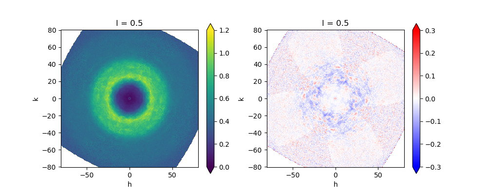
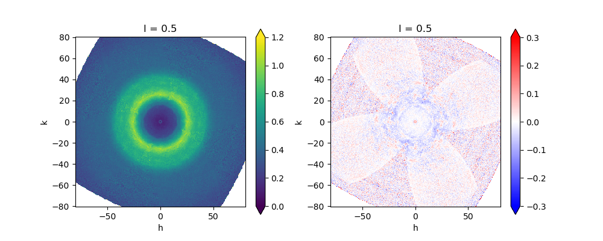

# Macrodomain @ ALS 8.3.1

Preliminary results from macrodomain diffuse scattering measurements at ALS 8.3.1 on June 24, 2025

<!-- more -->

## Summary

We collected diffraction data from several SARS-CoV-2 NSP3 macrodomain crystals at room temperature, and created preliminary diffuse maps for 3 crystals using mdx2. Interestingly, the diffuse maps appear quite different. The reason for this is not apparent yet.

I think more measurements should definitely be done if possible, and with greater care. However, the existing data are valuable as examples of how diffuse scattering might be influenced by beam properties, crystal handling, data processing algorithms, etc.

## Data collection at 8.3.1

- James, Mehagan, and I collected data from 4 macrodomain crystals harvested from a single tray "Plate 1" provided by JF's lab.
- There was some messing around before we got the dose right. So each dataset had different beam properties (divergence & flux).
- The crystals were of moderate size (~ 100 x 200 x 200 µm^3)
- I used the usual Ando lab method: MiTeGen plastic sleeves, background measurements.
- I did NOT use a humidity controlled environment for harvesting (not enough time to set it up).

Usable datasets:

file prefix | tray, well | dose rate* | notes
--- | --- | --- | ---
`H6_5` | tray 1, well H6 | high | 360 degrees, 0.1 deg/frame, spots decayed rapidly (damage)
`H8_8` | tray 1, well H8 | medium | 360 degrees, 0.1 deg/frame, some damage toward the end?
`G8_1` | tray 1, well G8 | low | 360 degrees, 0.1 deg/frame

*by adjusting attenuators and mirror defocus, need to ask James H how to retrieve this info from metadata file

## Bragg data results

- processed using xia2 (DIALS pipeline) 
- cut the number of frames according to merging statistics (consistent Rmerge, B-factor increase < 2 Å^2, etc).
    - `H6_5` (high dose rate): kept 900 frames (90 degrees)
    - `H8_8` (medium dose rate): kept 3600 frames (360 degrees), but noted rise in R-merge beyond frame ~3000
    - `G8_1` (low dose rate): kept 3600 frames (360 degrees)
- All 3 datasets processed to 1.08 Å (CC1/2 > 0.33), and have good statistics.
- The unit cell dimensions are different by up to ~0.2 Å, perhaps from exposure to dry air during harvesting?

## Diffuse maps

Processed using mdx2, integrating on a 2x2x4 (coarse) grid. Rendered slices in a non-halo plane (l=1/2), intensity scale is arbitrary (normalized to 1).

| `H6_5` (high dose rate) |
| --- |
|  |

| `H8_8` (medium dose rate) |
| --- |
|  |

| `G8_1` (low dose rate) |
| --- |
|  |

## Observations

- The isotropic component is quite different between `H6_5` (high dose rate) and `H8_8` (medium dose rate).
- The diffuse fluctuations are strongest for `H8_8` (medium dose rate)
- The signal-to-noise appears to be best for `H6_5` (high dose rate), however the features are perhaps more washed out?
- The maps are very noisy for `G8_1` (low dose rate), but pattern of fluctuations appears distinct from the others

## Questions

1. How different are the structures / B-factors for these crystals? (try structure refinement?)
2. What was the absorbed dose for each dataset? (talk to James H)
3. Do we expect the crystals to be isomorphous? were the well solutions the same? (talk to James F)

## Next steps

1. Characterize (experimentally)
    1. Repeatability (use humid environment for harvesting)
    2. Radiation damage effects
    3. Artifacts from low signal-to-noise (use larger crystals? multi-crystal merging?)
2. Investigate (via data processing, analysis)
    1. What do the halos look like?
    2. Is the isotropic component time-dependent?
    3. Do the Bragg and diffuse scale factors agree?
    4. In general, do scaling & merging algorithms in mdx2 behave optimally when signal-to-noise is low?
